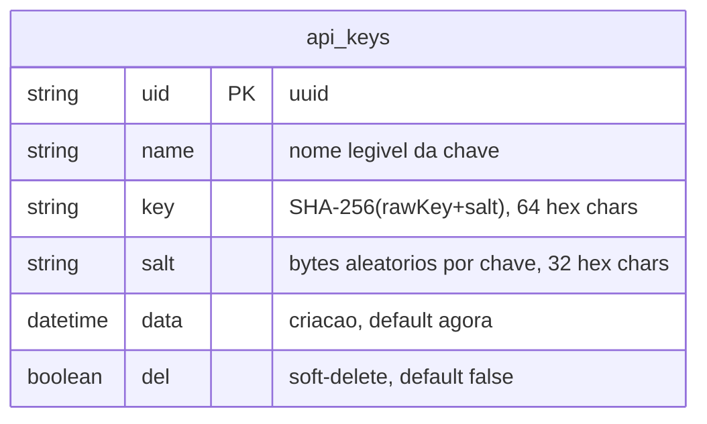

# ERD — Domínio api-keys

Schema específico do módulo api-keys. Fonte: `prisma/schema.prisma`.

**Observações:**
- `uid` é PK e gerado via `randomUUID()` na camada de serviço (não `@default(uuid())` no Prisma).
- `key` armazena exclusivamente o hash; o valor em claro (`rawKey`) nunca é persistido.
- `del = true` equivale a revogação; registros revogados não aparecem no cache Redis e retornam `404` em qualquer lookup.
- Não há FK para outras tabelas — `api_keys` é independente do domínio de inboxes/ambientes.

**Historico de schema:**
- `2026-06-05`: hotfix `hotfix-date-to-data-rename` — coluna `date` renomeada para `data` via `ALTER TABLE api_keys RENAME COLUMN "date" TO "data"` (migration `20260605000001_rename_date_to_data`).
