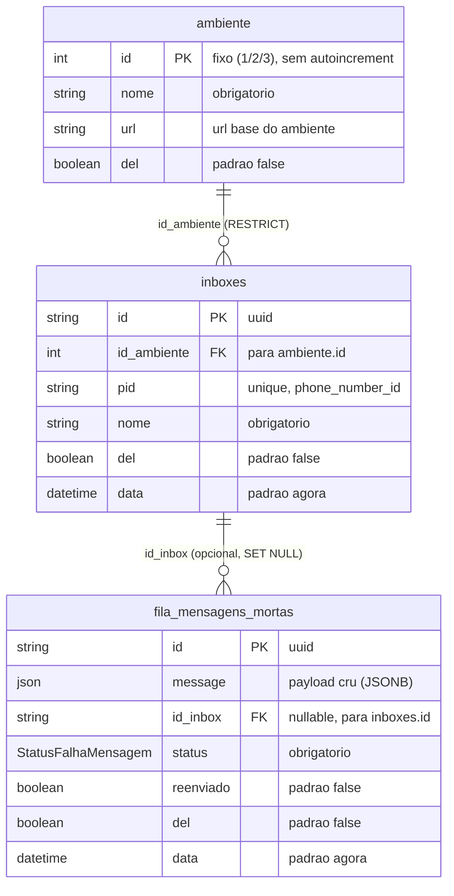

# ERD — Domínio foundation (compartilhado)

Schema compartilhado por todas as features. Fonte: `prisma/schema.prisma`.

**Enum `StatusFalhaMensagem`:** `INBOX_NAO_REGISTRADA`, `FALHA_ENFILEIRAMENTO`, `NACK_RECEBIDO`, `FALHA_ENVIO`, `AMBIENTE_INDISPONIVEL`.

**Constraints (migration `create_tables`):**
- `inboxes_pid_key` UNIQUE em `inboxes.pid`.
- FK `inboxes.id_ambiente` → `ambiente.id` (`ON DELETE RESTRICT ON UPDATE CASCADE`).
- FK `fila_mensagens_mortas.id_inbox` → `inboxes.id` (`ON DELETE SET NULL ON UPDATE CASCADE`).

**Seed (migration `seed_ambientes`):** `(1, development, https://dev.2.whiz.net.br)`, `(2, staging, https://staging.2.whiz.net.br)`, `(3, production, https://server.whiz.net.br)`.
