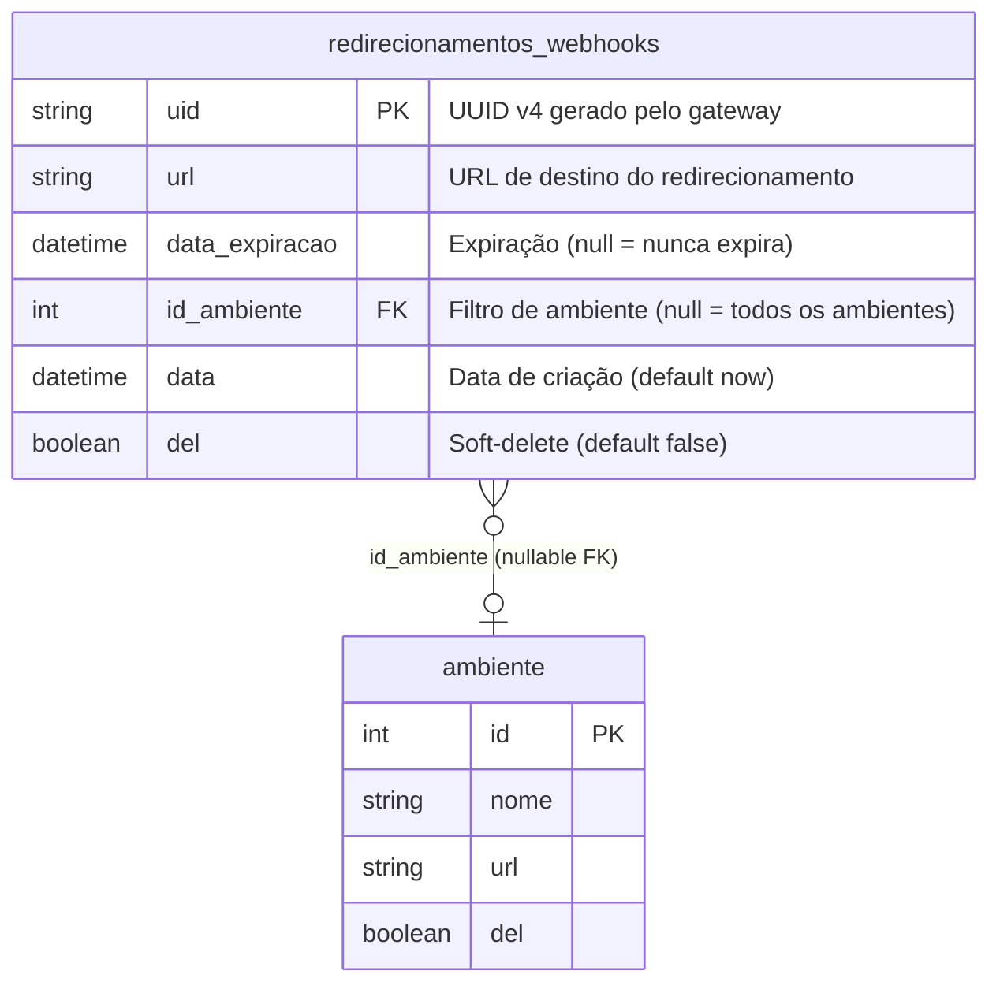

# ERD — redirecionamentos-webhooks



## Notas

- `id_ambiente` é nullable: `null` significa que o redirecionamento é elegível para qualquer ambiente.
- Não há índice explícito além do PK `uid`. A query `findActiveByAmbiente` usa varredura completa (tabela tende a ser pequena por TTL curto).
- A FK para `ambiente` não possui `onDelete CASCADE` — deleção de ambiente não remove redirecionamentos associados; eles simplesmente param de ser elegíveis (a lógica de elegibilidade filtra por `id_ambiente` do registro, não por `ambiente.del`).

## Migration

Migration criada em `prisma/migrations/` para adicionar a tabela `redirecionamentos_webhooks`:

```sql
CREATE TABLE "redirecionamentos_webhooks" (
    "uid"            TEXT NOT NULL,
    "url"            TEXT NOT NULL,
    "data_expiracao" TIMESTAMP(3),
    "id_ambiente"    INTEGER,
    "data"           TIMESTAMP(3) NOT NULL DEFAULT CURRENT_TIMESTAMP,
    "del"            BOOLEAN NOT NULL DEFAULT false,
    CONSTRAINT "redirecionamentos_webhooks_pkey" PRIMARY KEY ("uid"),
    CONSTRAINT "redirecionamentos_webhooks_id_ambiente_fkey"
        FOREIGN KEY ("id_ambiente") REFERENCES "ambiente"("id")
        ON DELETE SET NULL ON UPDATE CASCADE
);
```
