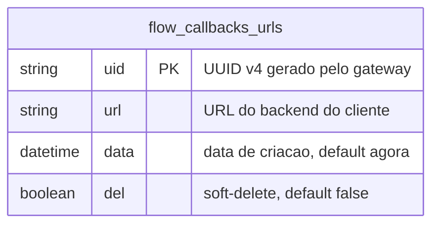

# ERD — Domínio wpp-flow-callbacks

Schema específico do módulo wpp-flow-callbacks. Fonte: `prisma/schema.prisma`.

**Observacoes:**
- Nome do modelo Prisma coincide com o nome da tabela PostgreSQL (`flow_callbacks_urls`) — sem `@@map`.
- `uid` é gerado via `randomUUID()` na camada de serviço.
- Não há FK para outras tabelas — `flow_callbacks_urls` é independente do domínio de inboxes/ambientes.
- Soft-delete via campo `del`; hard-delete não está previsto nesta feature.

**Historico de schema:**
- `2026-06-05`: tabela criada como `flow_callbacks_urls` (migration `add_flow_callbacks_urls`). Modelo Prisma declarado incorretamente como `FlowCallbackUrl` com `@@map`.
- `2026-06-05`: hotfix `hotfix-flow-callback-url-model` — modelo renomeado para `flow_callbacks_urls`, `@@map` removido. Sem DDL (tabela ja existia com o nome correto).
- `2026-06-05`: hotfix `hotfix-date-to-data-rename` — coluna `date` renomeada para `data` via `ALTER TABLE flow_callbacks_urls RENAME COLUMN "date" TO "data"` (migration `20260605000001_rename_date_to_data`).
