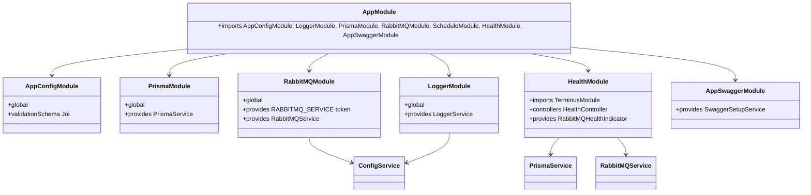
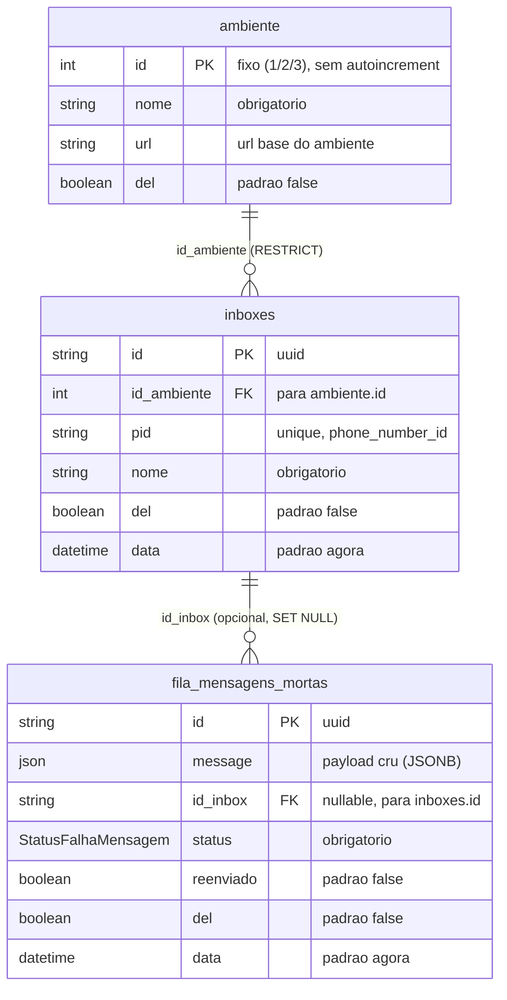
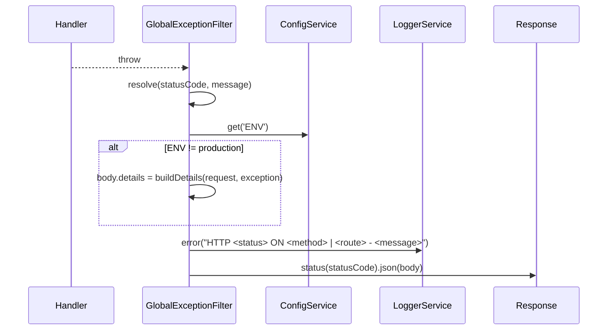

# Implementação — Gateway Foundation

> Feature 1 de 7 do **whiz-gateway**. Fundação de infraestrutura. Spec: [`docs/specs/gateway-foundation.md`](../specs/gateway-foundation.md).
> Este documento deriva o comportamento real do código em disco (fase 4).

## 1. Visão geral

A fundação entrega a infraestrutura base sobre a qual as demais 6 features (`cadastro-ambientes`, `cadastro-inboxes`, `fila-mensagens-mortas`, `webhook-ingestao`, `despacho-mensagens`, `reenvio-mensagens`) são construídas:

| Bloco | Implementação |
|---|---|
| Configuração tipada | `AppConfigModule` (global) + validação Joi de envs no bootstrap |
| Banco | `PrismaModule` (global) + `PrismaService` (wrapper de conexão) + 3 models |
| Mensageria | `RabbitMQModule` (`@Global`) sobre `amqp-connection-manager`, DLQ estática declarada no bootstrap |
| Logging | `LoggerModule` (global) + `LoggerService` (Winston, console only) |
| Erros | `GlobalExceptionFilter` global + `ErrorResponseDto` |
| Validação | `ValidationPipe` global `{ whitelist, forbidNonWhitelisted, transform }` |
| Healthcheck | `HealthController` (`GET /`) readiness via `@nestjs/terminus` (DB + broker) |
| Documentação | `AppSwaggerModule` → Swagger UI em `/docs`, OpenAPI em `/docs-json` (PT-BR) |
| Agendamento | `ScheduleModule.forRoot()` registrado no `AppModule` (consumido depois) |

## 2. API pública (HTTP)

| Método | Rota | Auth | Request | Respostas | Controller |
|---|---|---|---|---|---|
| `GET` | `/` | nenhuma | — | `200 HealthResponseDto` (DB + broker saudáveis) · `503` quando um indicador falha | `HealthController.getHealth` |
| `GET` | `/docs` | nenhuma | — | `200 text/html` — Swagger UI | `SwaggerSetupService` (HTTP adapter) |
| `GET` | `/docs-json` | nenhuma | — | `200 application/json` — documento OpenAPI (PT-BR) | `SwaggerSetupService` (HTTP adapter) |

`GET /` é **readiness**: executa `HealthCheckService.check` com `PrismaHealthIndicator.pingCheck('database', …)` e `RabbitMQHealthIndicator.isHealthy('broker')`. O `status` retornado reflete o resultado agregado do terminus.

### Exemplos curl

```bash
# Readiness — 200 quando DB e broker estão saudáveis
curl -i http://localhost:3000/
# => 200
# { "status": "ok", "timestamp": "2026-06-01T12:00:00.000Z",
#   "checks": { "database": { "status": "up" }, "broker": { "status": "up" } } }

# Swagger UI (HTML)
curl -i http://localhost:3000/docs

# Documento OpenAPI
curl -s http://localhost:3000/docs-json | head
```

## 3. Arquitetura (módulos)



**Regras de DI aplicadas no código:**
- `RabbitMQModule` expõe `RABBITMQ_SERVICE` (token Symbol) via `useExisting: RabbitMQService` — consumidores injetam pelo token de interface.
- `PrismaService` e `RabbitMQService` são exportados globalmente (módulos `@Global`).
- `GlobalExceptionFilter` é instanciado manualmente em `main.ts` com `ConfigService` + `LoggerService`.

## 4. Arquivos da feature

| Arquivo | Papel |
|---|---|
| `prisma/schema.prisma` | datasource PostgreSQL + 3 models + enum `StatusFalhaMensagem` |
| `prisma/migrations/20260601000000_create_tables/migration.sql` | cria enum + 3 tabelas + índice unique + FKs |
| `prisma/migrations/20260601000100_seed_ambientes/migration.sql` | INSERT dos 3 ambientes fixos |
| `src/config/config.validation.ts` | schema Joi das envs |
| `src/config/config.module.ts` | `AppConfigModule` global |
| `src/logger/logger.service.ts` | `LoggerService` (Winston console-only) |
| `src/logger/logger.module.ts` | `LoggerModule` global |
| `src/prisma/prisma.service.ts` | `PrismaService` (connect/disconnect) |
| `src/prisma/prisma.module.ts` | `PrismaModule` global |
| `src/rabbitmq/interfaces/rabbitmq-service.interface.ts` | `IRabbitMQService`, `MessageHandler` |
| `src/rabbitmq/constants/rabbitmq-tokens.constants.ts` | `RABBITMQ_SERVICE` (token Symbol) |
| `src/rabbitmq/constants/rabbitmq-queue.constants.ts` | `DLQ_NAME`, `DEFAULT_DLQ_ARGS` |
| `src/rabbitmq/queue-name.factory.ts` | `QueueNameFactory.inbox(id)` |
| `src/rabbitmq/rabbitmq.service.ts` | `RabbitMQService` (amqp-connection-manager) |
| `src/rabbitmq/rabbitmq.module.ts` | `RabbitMQModule` `@Global` |
| `src/rabbitmq/rabbitmq-exports.char.spec.ts` | char spec — regressão dos exports do módulo RabbitMQ |
| `src/common/dto/error-response.dto.ts` | `ErrorResponseDto` |
| `src/common/filters/global-exception.filter.ts` | `GlobalExceptionFilter` |
| `src/health/dto/health-response.dto.ts` | `HealthResponseDto` |
| `src/health/rabbitmq.health.ts` | `RabbitMQHealthIndicator` |
| `src/health/health.controller.ts` | `HealthController` |
| `src/health/health.module.ts` | `HealthModule` |
| `src/swagger/constants/swagger-paths.constants.ts` | `SWAGGER_PATH`, `SWAGGER_JSON_PATH` |
| `src/swagger/swagger.document.ts` | `buildSwaggerConfig()` |
| `src/swagger/swagger.setup.service.ts` | `SwaggerSetupService` (registra `/docs`) |
| `src/swagger/swagger.setup.service.spec.ts` | spec de integração do `SwaggerSetupService` |
| `src/swagger/swagger-exports.char.spec.ts` | char spec — regressão dos exports do módulo Swagger |
| `src/swagger/swagger.module.ts` | `AppSwaggerModule` |
| `src/app.module.ts` | `AppModule` raiz |
| `src/main.ts` | bootstrap |

## 5. Modelo de dados



**Enum `StatusFalhaMensagem`** (real, migration `create_tables`): `INBOX_NAO_REGISTRADA`, `FALHA_ENFILEIRAMENTO`, `NACK_RECEBIDO`, `FALHA_ENVIO`, `AMBIENTE_INDISPONIVEL`.

**Detalhes derivados do SQL real:**
- `inboxes.pid` → índice `inboxes_pid_key` UNIQUE.
- FK `inboxes_id_ambiente_fkey` → `ON DELETE RESTRICT ON UPDATE CASCADE`.
- FK `fila_mensagens_mortas_id_inbox_fkey` → `ON DELETE SET NULL ON UPDATE CASCADE`.
- `message` é `JSONB`; colunas `data` são `TIMESTAMP(3) DEFAULT CURRENT_TIMESTAMP`.

**Seed (`seed_ambientes`):**

| id | nome | url |
|---|---|---|
| 1 | development | https://dev.2.whiz.net.br |
| 2 | staging | https://staging.2.whiz.net.br |
| 3 | production | https://server.whiz.net.br |

## 6. DTOs

### `HealthResponseDto` (`src/health/dto/health-response.dto.ts`)

| Campo | Tipo | Decorador | Descrição | Exemplo |
|---|---|---|---|---|
| `status` | `string` | `@ApiProperty` | Estado geral da aplicação | `ok` |
| `timestamp` | `string` | `@ApiProperty` | Momento da checagem (ISO8601) | `2026-06-01T12:00:00.000Z` |
| `checks` | `HealthCheckResult['details']` | `@ApiProperty` | Resultado por indicador (banco + broker) | `{ database: { status: 'up' }, broker: { status: 'up' } }` |

### `ErrorResponseDto` (`src/common/dto/error-response.dto.ts`)

| Campo | Tipo | Decorador | Descrição | Exemplo |
|---|---|---|---|---|
| `statusCode` | `number` | `@ApiProperty` | Código de status HTTP da falha | `500` |
| `timestamp` | `string` | `@ApiProperty` | Momento da falha (ISO8601) | `2026-06-01T12:00:00.000Z` |
| `message` | `string` | `@ApiProperty` | Mensagem descritiva do erro | `Internal Server Error` |
| `details` | `unknown` (opcional) | `@ApiPropertyOptional` | Detalhes adicionais; **apenas fora de produção** | `{ method: 'GET', route: '/exemplo' }` |

## 7. Configuração (variáveis de ambiente)

Validação via Joi em `config.validation.ts`; acesso somente via `ConfigService`.

| Env | Tipo | Obrigatória | Default | Acesso (real) |
|---|---|---|---|---|
| `DATABASE_URL` | string | sim | — | Prisma via `env("DATABASE_URL")` em `schema.prisma` |
| `RABBITMQ_URL` | string | sim | — | `configService.getOrThrow('RABBITMQ_URL')` em `RabbitMQService.onModuleInit` |
| `ENV` | enum `development`/`staging`/`production` | não | `development` | `configService.get('ENV')` em `LoggerService` e `GlobalExceptionFilter` |
| `PORT` | number | não | `3000` | `configService.get('PORT')` em `main.ts` |
| `META_VERIFY_TOKEN` | string | sim | — | (consumido por feature posterior) |
| `META_APP_SECRET` | string | sim | — | (consumido por feature posterior) |
| `DISPATCH_MAX_RETRIES` | number | não | `5` | (consumido por feature posterior) |
| `DISPATCH_BACKOFF_BASE_MS` | number | não | `1000` | (consumido por feature posterior) |

`validationOptions`: `{ allowUnknown: true, abortEarly: false }`. Ausência de env obrigatória falha o bootstrap (NFR-7).

## 8. Topologia RabbitMQ

| Item | Valor (real) |
|---|---|
| DLQ estática | `DLQ_NAME = 'inbox.dead-letter'` |
| Args padrão de dynamic queue | `DEFAULT_DLQ_ARGS = { 'x-dead-letter-exchange': '', 'x-dead-letter-routing-key': 'inbox.dead-letter' }` |
| Nome de fila de inbox | `QueueNameFactory.inbox(id)` → `inbox.<id>` |
| Conexão | `connect([RABBITMQ_URL])` (`amqp-connection-manager`), reconexão automática (NFR-4) |
| Bootstrap | `channelWrapper` declara `assertQueue('inbox.dead-letter', { durable: true })` no setup; espera conexão inicial com timeout de 5000ms, prosseguindo se o broker estiver indisponível |

A fundação **apenas** declara a DLQ e expõe a API. O uso por inbox (`assertQueue`/`startConsuming`/`stopConsuming`/`deleteQueue`) é de outras features.

## 9. Pontos de extensão

| Símbolo | Como usar |
|---|---|
| `IRabbitMQService` + token `RABBITMQ_SERVICE` | Injetar com `@Inject(RABBITMQ_SERVICE)`; nunca a classe concreta |
| `MessageHandler` | `(payload: Buffer) => Promise<void> \| void` — handler de consumo |
| `QueueNameFactory.inbox(id)` | Único ponto para compor nome de fila de inbox |
| `DEFAULT_DLQ_ARGS` | Reusar ao declarar dynamic queues (também via getter `RabbitMQService.defaultDlqArgs`) |
| `RabbitMQService.isConnected()` | Usado pelo `RabbitMQHealthIndicator` (readiness) |
| `PrismaService` | Estender/injetar nos repositórios das features |
| `ErrorResponseDto` | Tipo de resposta de erro padronizado para `@ApiResponse` |

**Métodos do `RabbitMQService` (contrato `IRabbitMQService`):**

| Método | Comportamento real |
|---|---|
| `assertQueue(name, dlqArgs?)` | `assertQueue(name, { durable: true, arguments: dlqArgs })` |
| `deleteQueue(name)` | `channelWrapper.deleteQueue(name)` |
| `startConsuming(name, handler)` | `addSetup` + `channel.consume`; `ack` em sucesso, `nack(msg, false, false)` em erro; guarda `consumerTag` por fila |
| `stopConsuming(name)` | `channel.cancel(consumerTag)` se houver tag |
| `sendToQueue(name, payload)` | serializa `JSON.stringify` em `Buffer` e envia |

## 10. Tratamento de erros

`GlobalExceptionFilter` (`@Catch()`, global via `main.ts`). Resolução de `statusCode`/`message`:

| Caso | statusCode | message |
|---|---|---|
| `HttpException` | `exception.getStatus()` | extraído de `getResponse()`; se `message` é array → `join(', ')` (class-validator → 400) |
| `Error` genérico | `500` | `exception.message` |
| Não-`Error` (ex.: string lançada) | `500` | `Internal Server Error` |

**Body:** sempre `{ statusCode, timestamp, message }`. `details` adicionado **somente** quando `ENV !== 'production'`, contendo `headers`, `params`, `query`, `body` (truncado em `MAX_PAYLOAD_BODY_BYTES = 10240` com sufixo `…`) e `stack`.

**Log:** toda exceção gera `loggerService.error('HTTP <status> ON <method> | <route> - <message>')`. Sem escrita em Cassandra (AC-12).



## 11. Documentação (Swagger)

| Item | Valor |
|---|---|
| UI | `SWAGGER_PATH = '/docs'` (HTML servido via `HttpAdapter.get`) |
| JSON | `SWAGGER_JSON_PATH = '/docs-json'` |
| Título | `Whiz Gateway` |
| Versão | `1.0` |
| Tags | `Saúde` |
| Auth | esquema `bearer` (`addBearerAuth`, `bearerFormat: 'JWT'`) |

O documento é construído por `buildSwaggerConfig()` e registrado em `SwaggerSetupService.onModuleInit`. A UI usa assets de `swagger-ui-dist` inlinados (CSS + bundle + preset).

> **Dependência obrigatória em runtime:** `swagger-ui-dist` deve estar em `dependencies` (não `devDependencies`) no `package.json`. O `SwaggerSetupService` importa caminhos de arquivo deste pacote em tempo de execução (`getAbsoluteFSPath()`), portanto sua ausência causa falha de bootstrap mesmo em ambiente de teste. Versão fixada: `5.32.6`.

## 12. Divergências da spec (drift)

| ID | Decisão registrada na implementação |
|---|---|
| **OQ-3** | `LoggerService` usa **apenas transport de console** (`new transports.Console()`) — colorido fora de produção, JSON em produção. A spec original (FR-11/NFR-3) previa console+file; persistência de arquivo foi delegada ao orquestrador de container. Spec já atualizada para refletir isto. |
| **OQ-6** | `GET /` é **readiness** (checa DB via `PrismaHealthIndicator.pingCheck` + broker via `RabbitMQHealthIndicator.isHealthy`), **não** liveness puro. O alvo de performance NFR-5 (P95 ≤ 50ms) foi **revogado** — a spec (§14/FR-14/NFR-5) já está alinhada a esta implementação. |
| **Nota de implementação** | `prisma`/`@prisma/client` fixados em `^6` — a v7 é incompatível com o padrão `url = env("DATABASE_URL")` + `extends PrismaClient` com `$connect`/`$disconnect` usado em `PrismaService`. |

Fora estes itens: **nenhum** outro desvio detectado entre código e spec.

## 13. Changelog

| Data | Mudança |
|---|---|
| 2026-06-01 | Feature 1/7 gateway-foundation implementada — fundação (Prisma, RabbitMQ @Global, ConfigModule, Winston console, GlobalExceptionFilter, readiness `/`, Swagger `/docs`). |
| 2026-06-01 | **simple-fix gateway-foundation-lint-test** — `swagger-ui-dist@5.32.6` movido para `dependencies` (estava ausente). Sem ele o ESLint type-checked e o bootstrap do `AppModule` nos testes falhavam com "Cannot find module 'swagger-ui-dist'". Adicionado `src/swagger/swagger.setup.service.spec.ts` (REG-1: módulo compila e inicializa sem deps reais; REG-2: `SWAGGER_PATH`/`SWAGGER_JSON_PATH` são registrados via `HttpAdapter`). |
| 2026-06-01 | **refactor gateway-foundation-split-interfaces-constants** — split estrutural de 3 arquivos planos em subpastas com 1 arquivo por grupo coeso. `rabbitmq.interface.ts` → `interfaces/rabbitmq-service.interface.ts` (IRabbitMQService + MessageHandler); `rabbitmq.constants.ts` → `constants/rabbitmq-tokens.constants.ts` (RABBITMQ_SERVICE) + `constants/rabbitmq-queue.constants.ts` (DLQ_NAME + DEFAULT_DLQ_ARGS); `swagger.constants.ts` → `constants/swagger-paths.constants.ts`. Sem alteração de lógica. Adicionados char specs `rabbitmq-exports.char.spec.ts` e `swagger-exports.char.spec.ts`. 7 importadores atualizados. |
| 2026-06-02 | **hotfix ts-strict-property-init** — adicionado `"strictPropertyInitialization": false` em `compilerOptions` no `tsconfig.json` para suprimir erros TS2564 em propriedades de classes DTO/service decoradas pelo NestJS que são inicializadas via injeção de dependência ou reflexão de metadados, não por construtores TypeScript padrão. |
