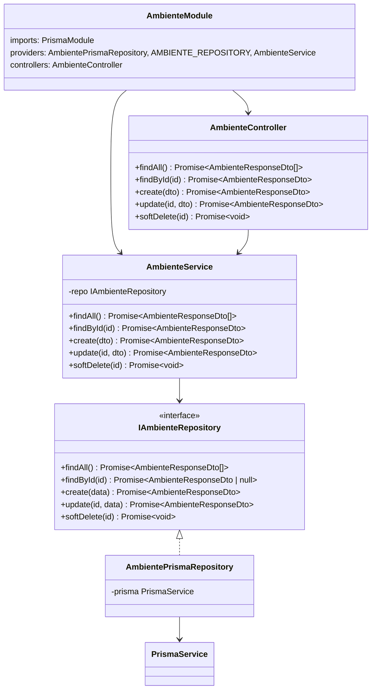
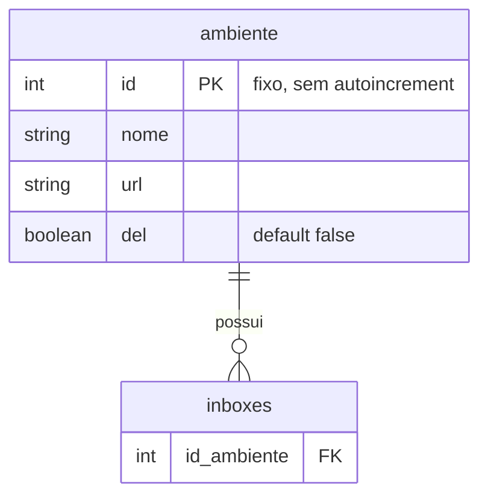
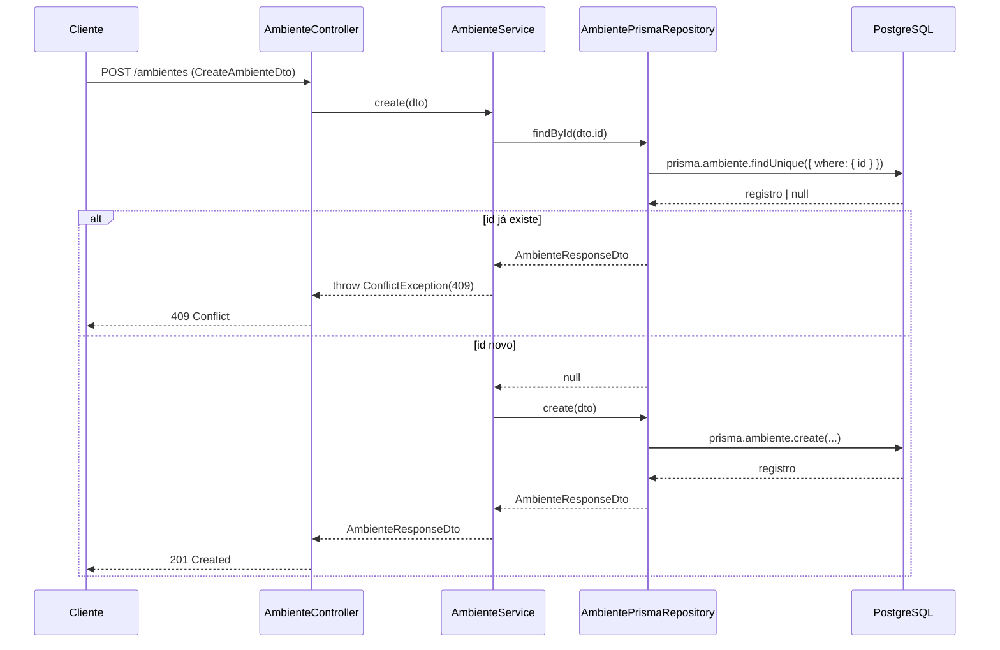
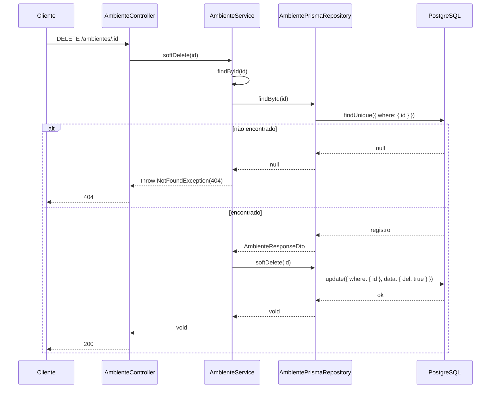
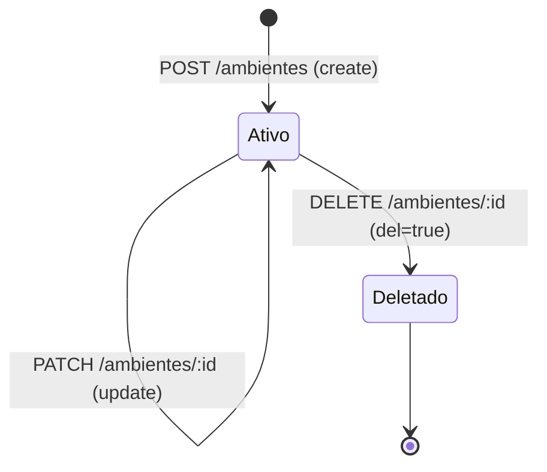
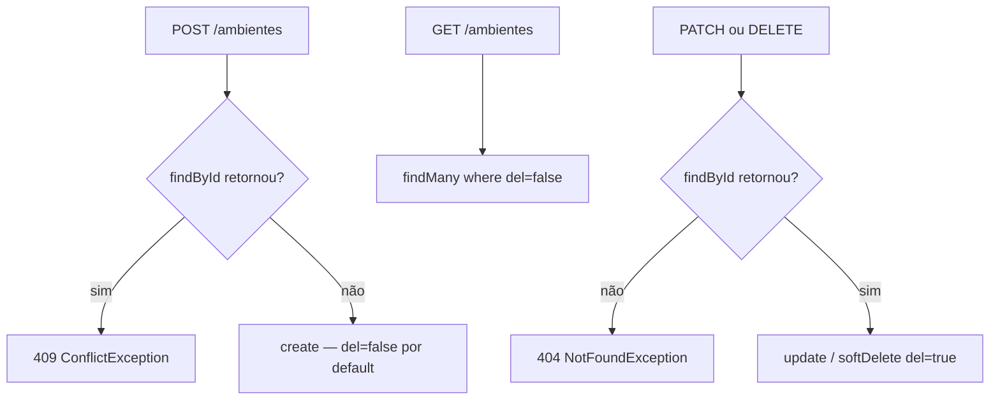

# Implementação — Cadastro de Ambientes

> Spec: [`docs/specs/cadastro-ambientes.md`](../specs/cadastro-ambientes.md)
> Feature 2/7 do **whiz-gateway**.

---

## 1. Visão Geral

O módulo `AmbienteModule` entrega CRUD completo sobre a tabela `ambiente` (modelo Prisma definido em `gateway-foundation`). Expõe cinco endpoints REST sob `/ambientes` e aplica soft-delete (`del=true`) em vez de exclusão física. Nenhuma nova variável de ambiente foi introduzida.

---

## 2. Arquitetura do Módulo

### Nota sobre PrismaModule

`AmbienteModule` importa `PrismaModule` explicitamente (`imports: [PrismaModule]`), mesmo sendo `PrismaModule` global. Isso é válido e não causa conflito — módulos globais podem ser re-importados sem efeito colateral.

### Injeção por token

O repositório concreto é registrado com `useExisting` apontando para `AmbientePrismaRepository`, e o token `AMBIENTE_REPOSITORY` (Symbol) é injetado no service via `@Inject(AMBIENTE_REPOSITORY)`. O service nunca referencia a classe concreta.

---

## 3. API Real

### `GET /ambientes`

Retorna todos os ambientes com `del = false`.

| Campo | Valor |
|---|---|
| Auth | Nenhuma (OQ-1 pendente — guard de auth ainda não implementado) |
| Resposta 200 | `AmbienteResponseDto[]` |

### `GET /ambientes/:id`

Busca um ambiente pelo `id`. Filtra `del = true` indiretamente: `findById` no repositório usa `findUnique` sem filtro de `del`; a verificação de existência é feita via retorno `null`.

| Campo | Valor |
|---|---|
| Param | `id: number` (ParseIntPipe) |
| Resposta 200 | `AmbienteResponseDto` |
| Resposta 404 | `NotFoundException` — "Ambiente com id {id} não encontrado." |

> **Desvio de spec (§12):** O repositório usa `findUnique` sem `where: { del: false }` para `findById`. Isso significa que um ambiente soft-deletado pode ser encontrado pelo repositório, mas o service o recebe e o trata como existente — implicações em `update` e `softDelete` abaixo.

### `POST /ambientes`

Cria um novo ambiente. Verifica duplicidade de `id` antes do insert.

| Campo | Valor |
|---|---|
| Body | `CreateAmbienteDto` |
| Resposta 201 | `AmbienteResponseDto` |
| Resposta 400 | Validação de DTO (`ValidationPipe` global) |
| Resposta 409 | `ConflictException` — "Ambiente com id {id} já existe." |

### `PATCH /ambientes/:id`

Atualização parcial de `nome` e/ou `url`.

| Campo | Valor |
|---|---|
| Param | `id: number` (ParseIntPipe) |
| Body | `UpdateAmbienteDto` |
| Resposta 200 | `AmbienteResponseDto` |
| Resposta 404 | via `findById` interno |

### `DELETE /ambientes/:id`

Soft-delete: seta `del = true`. Retorna `200` (HttpCode explícito).

| Campo | Valor |
|---|---|
| Param | `id: number` (ParseIntPipe) |
| Resposta 200 | body vazio |
| Resposta 404 | via `findById` interno |

---

## 4. DTOs

### `CreateAmbienteDto`

| Campo | Validadores | Swagger |
|---|---|---|
| `id` | `@IsInt()`, `@Min(1)` | `@ApiProperty` — exemplo `1` |
| `nome` | `@IsString()`, `@IsNotEmpty()` | `@ApiProperty` — exemplo `'development'` |
| `url` | `@IsUrl()` | `@ApiProperty` — exemplo `'https://dev.2.whiz.net.br'` |

### `UpdateAmbienteDto`

| Campo | Validadores | Swagger |
|---|---|---|
| `nome?` | `@IsOptional()`, `@IsString()`, `@IsNotEmpty()` | `@ApiPropertyOptional` |
| `url?` | `@IsOptional()`, `@IsUrl()` | `@ApiPropertyOptional` |

O campo `id` não é atualizável — ausente do DTO de update.

### `AmbienteResponseDto`

| Campo | Decorator de serialização | Swagger |
|---|---|---|
| `id` | `@Expose()` | `@ApiProperty` |
| `nome` | `@Expose()` | `@ApiProperty` |
| `url` | `@Expose()` | `@ApiProperty` |
| `del` | `@Expose()` | `@ApiProperty` |

A conversão usa `plainToInstance(AmbienteResponseDto, record, { excludeExtraneousValues: true })` tanto no repositório quanto no service, garantindo que nenhum campo interno da entidade Prisma seja vazado.

---

## 5. Modelo de Dados

Sem novas migrations — modelo pré-existente de `gateway-foundation`.

---

## 6. Fluxos

### Criação (POST /ambientes)

### Soft-delete (DELETE /ambientes/:id)

---

## 7. Máquina de Estados do Ambiente

Não há reativação implementada. Um `id` de ambiente soft-deletado resulta em `409` se usado em novo `POST`.

---

## 8. Regras de Negócio

---

## 9. Tratamento de Erros

| Situação | Exceção NestJS | HTTP |
|---|---|---|
| id não encontrado (findById) | `NotFoundException` | 404 |
| id duplicado no POST | `ConflictException` | 409 |
| DTO inválido (validação) | `BadRequestException` (ValidationPipe) | 400 |
| Param `id` não numérico | `BadRequestException` (ParseIntPipe) | 400 |

Todas as exceções são capturadas pelo `GlobalExceptionFilter` de `gateway-foundation` e retornadas como `ErrorResponseDto`.

---

## 10. Swagger

- `@ApiTags('Ambientes')` na controller.
- `@ApiOperation` com `summary` em PT-BR em todos os métodos.
- `@ApiResponse` por status code em todos os métodos.
- `@ApiProperty` / `@ApiPropertyOptional` com `description` e `example` em todos os campos dos DTOs.
- Sem `@ApiBearerAuth` (OQ-1: guard de auth pendente).

---

## 11. Testes

Os testes de aceitação (e2e e backend) cobrem os AC-1 a AC-9 definidos na spec. Os cenários principais incluem:

- `GET /ambientes` retorna apenas registros com `del=false`.
- `GET /ambientes/99` retorna `404` para id inexistente.
- `POST /ambientes` com id novo retorna `201`.
- `POST /ambientes` com id duplicado retorna `409`.
- `POST /ambientes` com `url` inválida retorna `400`.
- `PATCH /ambientes/:id` atualiza `nome` e retorna `200`.
- `DELETE /ambientes/:id` aplica soft-delete e ausência em listagem.
- Service nunca retorna entidade Prisma crua — sempre `AmbienteResponseDto`.

---

## 12. Desvios de Spec

- **OQ-1 (auth):** Spec define `Auth: Bearer JWT` em todos os endpoints. A implementação não possui guard de autenticação — `AmbienteController` não tem `@ApiBearerAuth` nem `@UseGuards`. Pendente feature de autenticação.
- **findById sem filtro `del`:** O repositório usa `prisma.ambiente.findUnique({ where: { id } })` sem `del: false`. Isso faz com que ambientes soft-deletados sejam encontrados por `findById`. Como consequência: (a) `PATCH` em ambiente deletado executa o update no banco (não retorna 404); (b) `DELETE` em ambiente já deletado executa novo `softDelete` sem erro. A spec (FR-5 e FR-6) define `404` para `inexistente` mas é ambígua sobre `del=true`. Comportamento atual: registro `del=true` é tratado como existente para update/delete.
- **OQ-2 (id soft-deletado no POST):** Resolvido como `409` — alinhado com a spec (FR-4 e §14).

---

## 13. Changelog

## 2026-06-02 — v1.0.0
- Implementação inicial: CRUD completo (GET, POST, PATCH, DELETE) com soft-delete.
- AmbienteModule registrado em AppModule.
