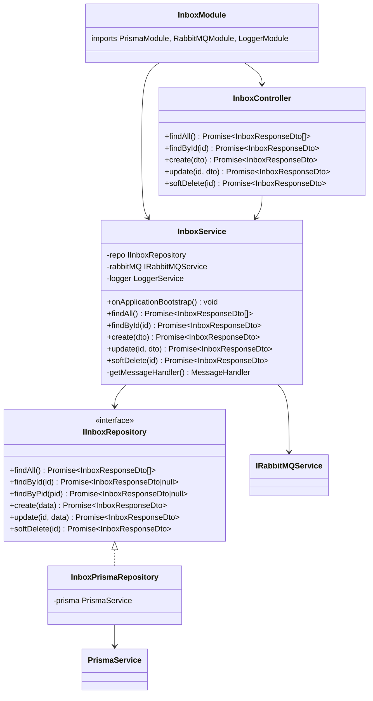
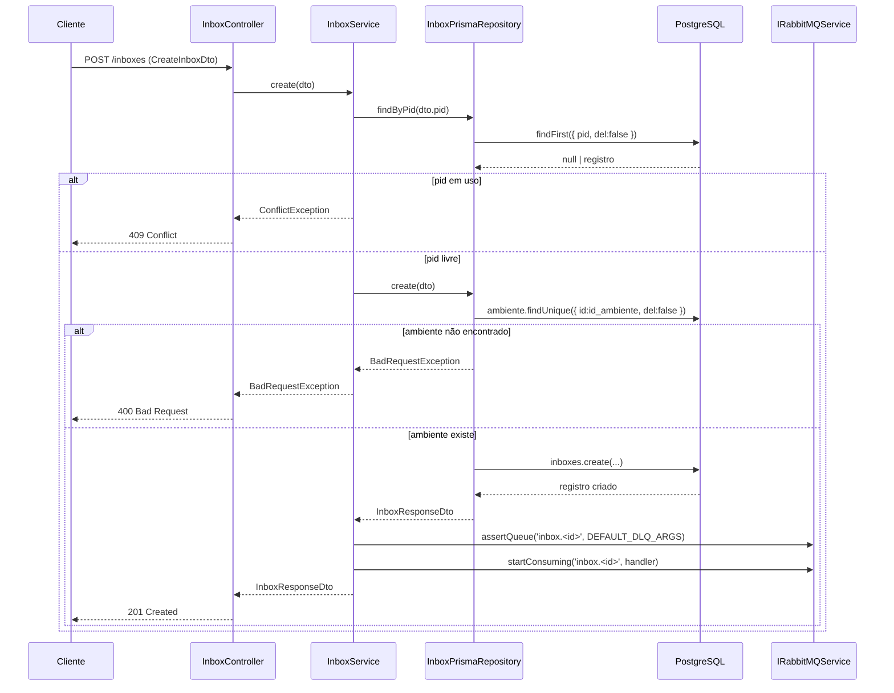
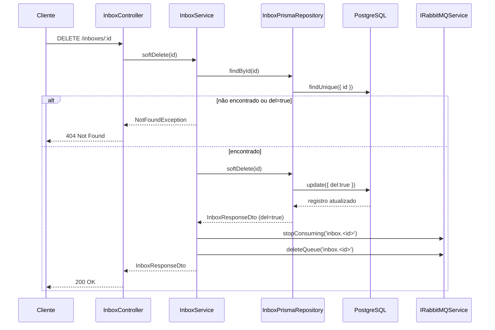
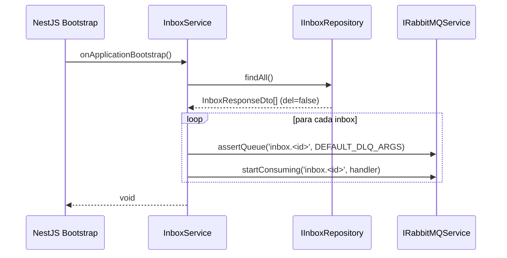
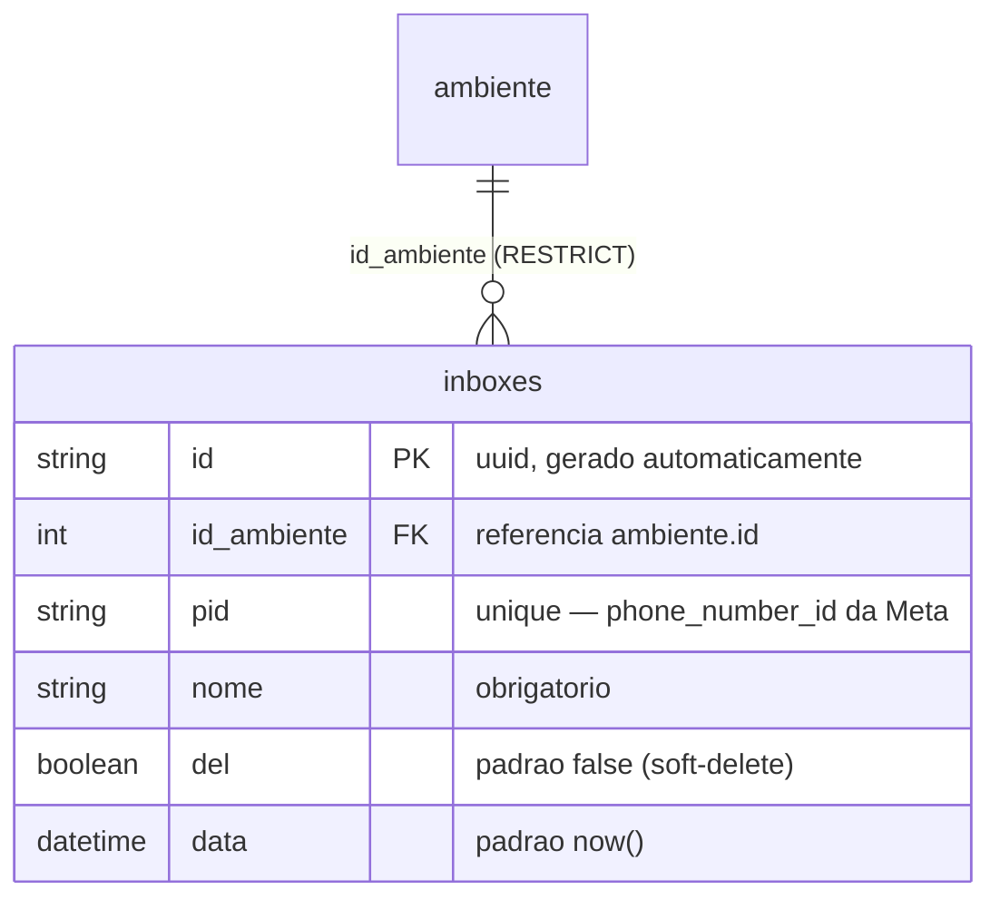

# Cadastro de Inboxes

> **Status:** Implementada (2026-06-02)
> **Spec:** [`docs/specs/cadastro-inboxes.md`](../specs/cadastro-inboxes.md)
> **Caminho backend:** `src/inbox/`

## 1. Visão Geral

O módulo `InboxModule` implementa o CRUD completo da entidade `inboxes` **e** gerencia o ciclo de vida da fila RabbitMQ dinâmica associada a cada inbox. Toda inbox tem uma fila `inbox.<id>` que é criada junto com ela e destruída quando ela é removida (soft-delete). No bootstrap da aplicação, o serviço reidrata todas as filas dos inboxes ativos, garantindo que nenhuma fila seja perdida após um restart.

A camada de acesso a dados é abstraída pela interface `IInboxRepository`, injetada via token `INBOX_REPOSITORY`. A implementação concreta `InboxPrismaRepository` usa `PrismaService` e valida, na operação de criação, se o `id_ambiente` referencia um ambiente existente e ativo (`del=false`). Caso contrário, lança `BadRequestException`.

## 2. API HTTP Pública

### Tabela de endpoints

| Método | Rota | Body | Resposta ok | Erros |
|---|---|---|---|---|
| `GET` | `/inboxes` | — | `200 InboxResponseDto[]` | — |
| `GET` | `/inboxes/:id` | — | `200 InboxResponseDto` | `404` |
| `POST` | `/inboxes` | `CreateInboxDto` | `201 InboxResponseDto` | `400`, `409` |
| `PATCH` | `/inboxes/:id` | `UpdateInboxDto` | `200 InboxResponseDto` | `400`, `404` |
| `DELETE` | `/inboxes/:id` | — | `200 InboxResponseDto` | `404` |

Todos os endpoints exigem Bearer JWT (`@ApiBearerAuth('bearer')`). A tag Swagger é `Inboxes`.

### Detalhes por endpoint

**GET /inboxes**
Retorna todas as inboxes com `del=false`. O repositório aplica o filtro no `findMany`.

**GET /inboxes/:id**
Busca por UUID. Se não encontrar ou `del=true`, lança `NotFoundException` (404).

**POST /inboxes**
1. Verifica unicidade do `pid` via `repo.findByPid` — duplicado lança `ConflictException` (409).
2. Persiste via `repo.create` — valida `id_ambiente` no repositório; inexistente lança `BadRequestException` (400).
3. Após persistência: `rabbitMQ.assertQueue('inbox.<id>', DEFAULT_DLQ_ARGS)` + `rabbitMQ.startConsuming('inbox.<id>', handler)`.
4. Retorna `201 InboxResponseDto`.

**PATCH /inboxes/:id**
Atualiza `nome` e/ou `id_ambiente`. O campo `pid` não está em `UpdateInboxDto`; enviar `pid` resulta em `400` (ValidationPipe `forbidNonWhitelisted`). Nenhuma operação de fila é executada no update.

**DELETE /inboxes/:id**
1. Verifica existência (404 se não encontrado).
2. Soft-delete via `repo.softDelete` (`del=true`).
3. `rabbitMQ.stopConsuming('inbox.<id>')`.
4. `rabbitMQ.deleteQueue('inbox.<id>')`.
5. Retorna `200 InboxResponseDto` (com `del=true`).

### Exemplos curl

```bash
# Listar inboxes
curl -H "Authorization: Bearer $TOKEN" http://localhost:3000/inboxes

# Criar inbox
curl -X POST http://localhost:3000/inboxes \
  -H "Authorization: Bearer $TOKEN" \
  -H "Content-Type: application/json" \
  -d '{"id_ambiente": 1, "pid": "whatsapp-123", "nome": "WhatsApp Dev"}'

# Atualizar nome
curl -X PATCH http://localhost:3000/inboxes/<id> \
  -H "Authorization: Bearer $TOKEN" \
  -H "Content-Type: application/json" \
  -d '{"nome": "WhatsApp Produção"}'

# Remover (soft-delete)
curl -X DELETE http://localhost:3000/inboxes/<id> \
  -H "Authorization: Bearer $TOKEN"
```

## 3. Superfície do Módulo

```
InboxModule
  imports:  PrismaModule, RabbitMQModule, LoggerModule
  providers:
    - InboxPrismaRepository
    - { provide: INBOX_REPOSITORY, useExisting: InboxPrismaRepository }
    - InboxService
  controllers: [InboxController]
  exports: (nenhum)
```

`RabbitMQModule` e `LoggerModule` são `@Global()`, mas listados explicitamente para clareza. `PrismaModule` também é global.

## 4. Arquitetura

### Diagrama de classes



### Sequência — criação de inbox



### Sequência — remoção de inbox



### Sequência — bootstrap (reidratação)



## 5. Modelo de Dados

Tabela `inboxes` — definida em `gateway-foundation` (`prisma/schema.prisma`).



Constraint: `inboxes_pid_key` UNIQUE em `pid`. FK com `ON DELETE RESTRICT ON UPDATE CASCADE`.

## 6. DTOs

### CreateInboxDto

| Campo | Tipo | Validators | Descrição |
|---|---|---|---|
| `id_ambiente` | `number` | `@IsInt`, `@IsPositive` | ID do ambiente de destino |
| `pid` | `string` | `@IsString`, `@IsNotEmpty` | Identificador externo único (ex.: número WhatsApp) |
| `nome` | `string` | `@IsString`, `@IsNotEmpty` | Nome da inbox |

### UpdateInboxDto

| Campo | Tipo | Validators | Descrição |
|---|---|---|---|
| `nome` | `string?` | `@IsOptional`, `@IsString` | Novo nome |
| `id_ambiente` | `number?` | `@IsOptional`, `@IsInt`, `@IsPositive` | Novo ambiente |

`pid` é intencionalmente ausente. Enviar `pid` resulta em `400` pelo ValidationPipe global (`forbidNonWhitelisted: true`).

### InboxResponseDto

| Campo | Tipo | Descrição |
|---|---|---|
| `id` | `string` | UUID da inbox |
| `id_ambiente` | `number` | ID do ambiente |
| `pid` | `string` | Identificador externo único |
| `nome` | `string` | Nome da inbox |
| `del` | `boolean` | Flag de soft-delete |
| `data` | `string` | Data de criação (ISO 8601) |

Todos os campos têm `@Expose()`. Mapeado com `plainToInstance(..., { excludeExtraneousValues: true })`. O campo `data` é serializado como `record.data.toISOString()` no repositório antes do mapeamento.

## 7. Configuração

Nenhuma variável de ambiente exclusiva desta feature. Usa `RABBITMQ_URL` e `DATABASE_URL` herdadas da fundação e injetadas via `ConfigService`.

## 8. Dependências

### Internas

| Módulo | Uso |
|---|---|
| `PrismaModule` | `PrismaService` para acesso ao banco |
| `RabbitMQModule` | `IRabbitMQService` (token `RABBITMQ_SERVICE`) para operações de fila |
| `LoggerModule` | `LoggerService` para logging no `getMessageHandler()` |
| `QueueNameFactory` | Geração do nome `inbox.<id>` (importado diretamente, não via módulo) |
| `DEFAULT_DLQ_ARGS` | Args da DLQ usados em `assertQueue` |

### Externas (libs)

| Lib | Uso |
|---|---|
| `class-transformer` | `plainToInstance` + `@Expose()` nos DTOs |
| `class-validator` | Validators nos DTOs de entrada |
| `@nestjs/swagger` | Decorators Swagger nos controllers e DTOs |

## 9. Pontos de Extensão

| Ponto | Tipo | Descrição |
|---|---|---|
| `IInboxRepository` | Interface | Contrato do repositório. Trocar implementação requer apenas novo provider com token `INBOX_REPOSITORY`. |
| `INBOX_REPOSITORY` | Token (Symbol) | Token de injeção de `IInboxRepository`. Definido em `inbox-tokens.constants.ts`. |
| `getMessageHandler()` | Método privado | Retorna o `MessageHandler` usado em `startConsuming`. Atualmente é um placeholder que loga. O handler real virá de `despacho-mensagens` (ver §12). |
| `OnApplicationBootstrap` | Hook NestJS | Executado após todos os módulos serem inicializados. Reidrata filas de inboxes ativos. |

## 10. Erros

| Exceção | Status HTTP | Gatilho |
|---|---|---|
| `ConflictException` | `409` | `pid` já existe em inbox com `del=false` |
| `BadRequestException` | `400` | `id_ambiente` não encontrado ou `del=true` no ambiente |
| `NotFoundException` | `404` | Inbox não encontrada em `findById`, `update` ou `softDelete` |
| `400` (ValidationPipe) | `400` | DTO inválido; campo não permitido (ex.: `pid` no PATCH) |

## 11. Notas Operacionais

**Bootstrap / Reidratação**
O método `onApplicationBootstrap` itera sobre todos os inboxes ativos (`del=false`) e chama `assertQueue` + `startConsuming` para cada um. As operações de fila são idempotentes: declarar uma fila já existente ou iniciar consumo em fila já consumida não causa erro. Isso garante que um restart da aplicação não deixe filas sem consumidor.

**Handler de mensagens pendente**
`getMessageHandler()` retorna um handler placeholder que apenas loga `"Message received — handler pending despacho-mensagens"`. O handler real, que enviará a mensagem ao ambiente via HTTP, será implementado em `despacho-mensagens` (OQ-3 da spec). Até lá, mensagens consumidas são processadas mas não encaminhadas.

**Consistência de fila após falha**
Se `assertQueue` ou `startConsuming` falhar após a persistência do inbox, o inbox existe no banco mas sem fila ativa. A reidratação no próximo bootstrap recupera esse estado automaticamente.

**Soft-delete e fila**
O soft-delete ocorre antes das operações de fila. Se `stopConsuming` ou `deleteQueue` falhar após `del=true`, a fila pode permanecer ativa. Não há rollback automático; o estado pode ser corrigido manualmente ou via reimplantação.

## 12. Drift de Spec

- **FR-7 (spec):** retorno do DELETE indicado como `200`/`204`. Na implementação, o controller usa `@HttpCode(HttpStatus.OK)` explicitamente — sempre `200`. Sem drift funcional, apenas clarificação do status.
- **OQ-1 (aberta):** spec pergunta se `id_ambiente` inexistente deve ser `400` ou `404`. A implementação usa `BadRequestException` (400) com mensagem `"Ambiente ${id_ambiente} não encontrado ou inativo."`, alinhado com a proposta da spec.
- **OQ-3 (aberta):** handler de consumo é placeholder. Spec prevê integração futura com `despacho-mensagens` via token de interface — **não implementado nesta feature**.
- **OQ-4 (resolvida implicitamente):** `pid` não está em `UpdateInboxDto`, confirmando que não é atualizável via PATCH.

## 13. Changelog

| Data | Descrição |
|---|---|
| 2026-06-02 | Documentação inicial criada (Phase 4). Feature completa: CRUD + ciclo de vida RabbitMQ + reidratação no bootstrap. |
