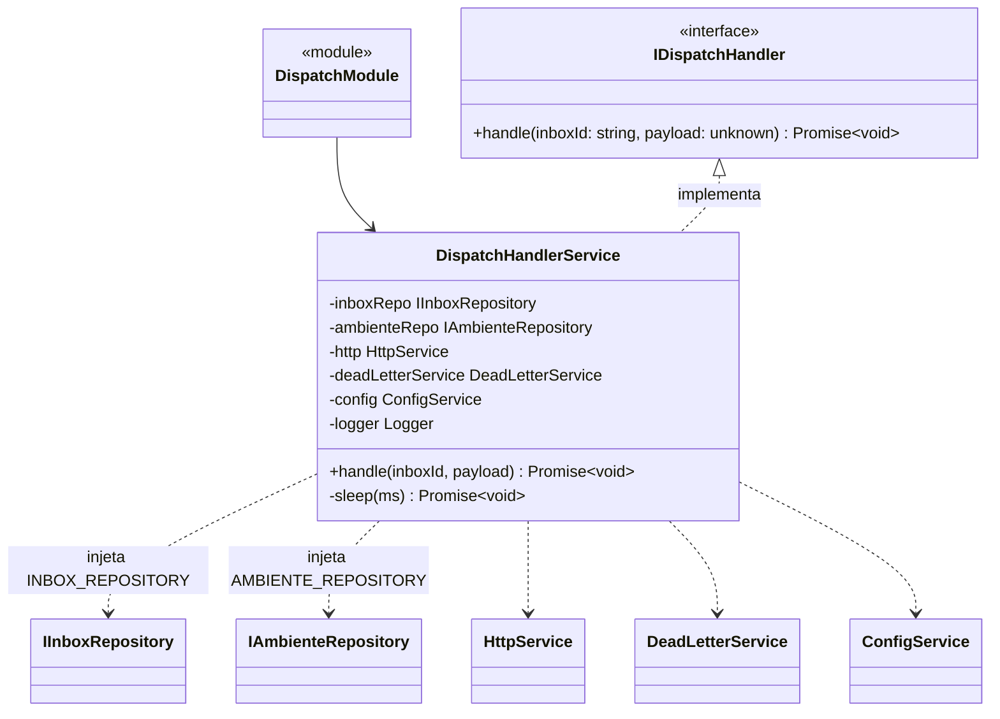
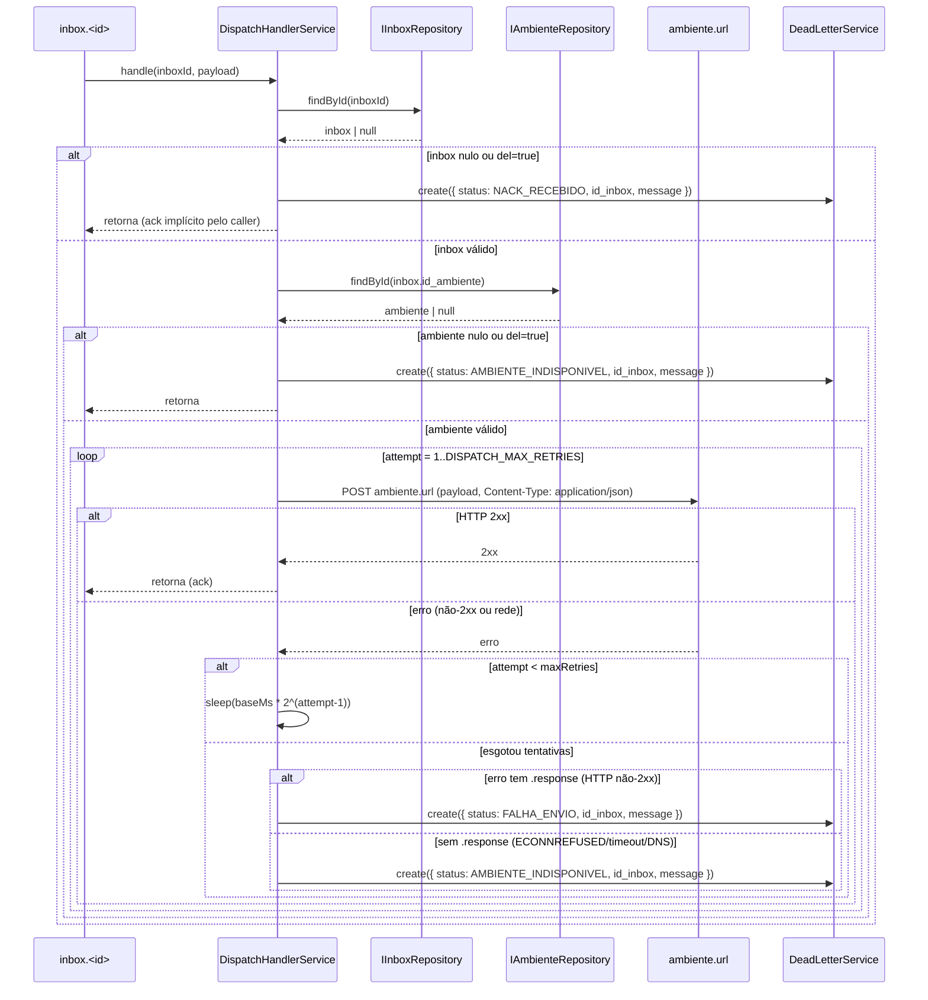

# Despacho de Mensagens

> **Status:** stable
> **Spec:** docs/specs/despacho-mensagens.md
> **Backend:** src/dispatch/

## 1. Visão geral

O módulo `DispatchModule` fornece o handler de consumo de filas de inbox. Após a feature `webhook-ingestao` enfileirar o payload cru em `inbox.<id>`, o `DispatchHandlerService` consome essa mensagem e a re-envia via HTTP POST para a URL do ambiente associado ao inbox (`inbox.id_ambiente → ambiente.url`).

O fluxo é **passthrough**: o payload não é transformado. Falhas são tratadas com **retry exponencial** (até `DISPATCH_MAX_RETRIES` tentativas) e, ao esgotar as tentativas, a mensagem é registrada em `fila_mensagens_mortas` via `DeadLetterService` com o `status` adequado. Este módulo não possui endpoints HTTP próprios — é exclusivamente um handler de consumo registrado por `cadastro-inboxes`.

## 2. API pública (HTTP)

N/A — sem endpoints HTTP próprios. Topologia de consumo:

| Direção | Fila | Payload | Sucesso | Falha |
|---|---|---|---|---|
| consume | `inbox.<inboxId>` | payload cru do webhook (passthrough) | HTTP 2xx no `ambiente.url` → ack | retry backoff exponencial → dead-letter |

O handler (`IDispatchHandler.handle`) é registrado por `InboxService.getMessageHandler()` no `startConsuming` da fila do inbox. A fronteira está em `cadastro-inboxes`.

## 3. Superfície do módulo

### `DispatchModule`

```
imports:  HttpModule, DeadLetterModule, AmbienteModule, PrismaModule
providers:
  - InboxPrismaRepository
  - { provide: INBOX_REPOSITORY, useExisting: InboxPrismaRepository }
  - DispatchHandlerService
  - { provide: DISPATCH_HANDLER, useExisting: DispatchHandlerService }
exports: [DISPATCH_HANDLER]
```

`InboxPrismaRepository` é declarado localmente (sem importar `InboxModule`) para evitar dependência circular: `InboxModule` importa `DispatchModule` para obter o handler, e `DispatchModule` precisa do repositório de inbox.

### `DispatchHandlerService`

Implementa `IDispatchHandler`. Injeções:

| Token / Tipo | Papel |
|---|---|
| `INBOX_REPOSITORY` (`IInboxRepository`) | Busca o inbox por `inboxId` |
| `AMBIENTE_REPOSITORY` (`IAmbienteRepository`) | Resolve `ambiente.url` via `inbox.id_ambiente` |
| `HttpService` (`@nestjs/axios`) | Executa o POST HTTP |
| `DeadLetterService` | Registra falhas em `fila_mensagens_mortas` |
| `ConfigService` | Lê `DISPATCH_MAX_RETRIES` e `DISPATCH_BACKOFF_BASE_MS` |

### `IDispatchHandler`

```typescript
export interface IDispatchHandler {
  handle(inboxId: string, payload: unknown): Promise<void>;
}
```

### `DISPATCH_HANDLER`

```typescript
export const DISPATCH_HANDLER = Symbol('DISPATCH_HANDLER');
```

Token de injeção de `IDispatchHandler`. Consumido por `InboxModule` para injetar o handler no `InboxService`.

## 4. Arquitetura

### Diagrama de classes



### Diagrama de sequência — consumo com retry



## 5. Modelo de dados

N/A — sem tabelas próprias. Lê `inboxes` e `ambiente` (via repositórios). Escreve em `fila_mensagens_mortas` exclusivamente através de `DeadLetterService.create`. Ver `docs/implementation/gateway-foundation.md`.

## 6. DTOs

N/A — sem DTOs de entrada/saída HTTP próprios. O payload é tratado como `unknown` (passthrough).

## 7. Configuração

| Env | Obrigatória | Default | Validação (Joi) | Descrição |
|---|---|---|---|---|
| `DISPATCH_MAX_RETRIES` | não | `5` | `Joi.number().default(5)` | Número máximo de tentativas de re-envio HTTP |
| `DISPATCH_BACKOFF_BASE_MS` | não | `1000` | `Joi.number().default(1000)` | Base do backoff exponencial em milissegundos |

Leitura via `ConfigService` com fallback manual via `parseInt(...  ?? 'N')` no service. Os valores são lidos a cada invocação do handler (não cacheados no constructor).

Fórmula do backoff: tentativa `n` (1-based) espera `DISPATCH_BACKOFF_BASE_MS * 2^(n-1)` ms. Exemplo com base 1000ms e 5 tentativas: 1s → 2s → 4s → 8s → 16s.

## 8. Dependências

| Módulo importado | Motivo |
|---|---|
| `HttpModule` (`@nestjs/axios`) | Cliente HTTP para POST no `ambiente.url` |
| `DeadLetterModule` | Acessa `DeadLetterService` para registrar falhas |
| `AmbienteModule` | Exporta `AMBIENTE_REPOSITORY` (`IAmbienteRepository`) |
| `PrismaModule` | Necessário para `InboxPrismaRepository` instanciar `PrismaService` |

| Provedor local | Motivo |
|---|---|
| `InboxPrismaRepository` + `INBOX_REPOSITORY` | Evita importar `InboxModule` (que importa `DispatchModule`) — quebra circular dep |

`DispatchModule` é importado por `InboxModule` (para injetar `DISPATCH_HANDLER` no `InboxService`) e registrado em `AppModule`.

## 9. Pontos de extensão

| Ponto | Como estender |
|---|---|
| Implementação do handler | Substituir o provider `DISPATCH_HANDLER` por outra classe que implemente `IDispatchHandler` |
| Timeout por requisição HTTP | Passar `{ timeout: N }` no terceiro argumento de `this.http.post(...)` — atualmente sem timeout explícito (OQ-3 da spec) |
| Prefetch do consumidor | Configurado no `startConsuming` do lado do `RabbitMQService`, não neste módulo (OQ-4 da spec) |
| Estratégia de retry | `sleep` in-handler atual; alternativa: re-publicar com delay via plugin `rabbitmq_delayed_message_exchange` |

## 10. Erros

| Situação | Discriminação | `status` em `fila_mensagens_mortas` |
|---|---|---|
| Inbox não encontrado ou `del=true` | Verificação prévia ao HTTP | `NACK_RECEBIDO` |
| Ambiente não encontrado ou `del=true` | Verificação prévia ao HTTP | `AMBIENTE_INDISPONIVEL` |
| Todas as tentativas com resposta HTTP não-2xx | `err.response` presente (Axios) | `FALHA_ENVIO` |
| Todas as tentativas sem resposta (ECONNREFUSED/timeout/DNS) | `err.response` ausente | `AMBIENTE_INDISPONIVEL` |
| HTTP 2xx | — | nenhum registro criado |

A discriminação entre `FALHA_ENVIO` e `AMBIENTE_INDISPONIVEL` é feita inspecionando se o erro possui a propriedade `.response` (presença indica que o servidor respondeu com status não-2xx; ausência indica falha de conectividade).

## 11. Notas operacionais

- **Ack/nack:** O handler retorna após registrar o dead-letter. Quem dá ack/nack é o consumidor no `RabbitMQService` (lado do `InboxService.getMessageHandler()`). A estratégia documentada na spec (OQ-1) é **insert direto + ack** — o `NACK_RECEBIDO` via DLQ nativa (`x-dead-letter-routing-key`) ocorre apenas em falhas irrecuperáveis externas ao handler.
- **Payload passthrough:** Nenhuma transformação é aplicada. O payload recebido é enviado tal qual para o `ambiente.url`.
- **Segredos:** Nenhum campo do payload é logado. Os logs de tentativa incluem apenas `inboxId` e o `String(err)` da exceção.
- **Idempotência:** Re-entrega pelo broker (após crash) resulta em reprocessamento. Idempotência do destino está fora de escopo deste módulo.
- **Timeout HTTP:** Nenhum timeout explícito por tentativa no código atual. Dependência do timeout padrão do Node.js/`axios`. Ver OQ-3 na spec.

## 12. Desvios da spec

| Item | Spec | Implementação | Impacto |
|---|---|---|---|
| Assinatura de `IDispatchHandler.handle` | `handle(inboxId, payload, channelMsg)` — spec §8 menciona `channelMsg` | Implementado como `handle(inboxId: string, payload: unknown)` sem o terceiro parâmetro | Baixo — `channelMsg` era opcional na discussão; o ack é gerenciado pelo caller |
| Timeout HTTP por tentativa (OQ-3) | Proposto `10s` | Não implementado — sem `timeout` no `http.post` | Médio — uma tentativa pode travar indefinidamente em conexão lenta |
| Prefetch do consumidor (OQ-4) | Proposto `10` | Configurado no `RabbitMQService`, fora deste módulo | Baixo — não é responsabilidade do `DispatchModule` |

## 13. Changelog

| Data | Descrição |
|---|---|
| 2026-06-02 | Feature implementada (despacho-mensagens, Feature 6/7) |
