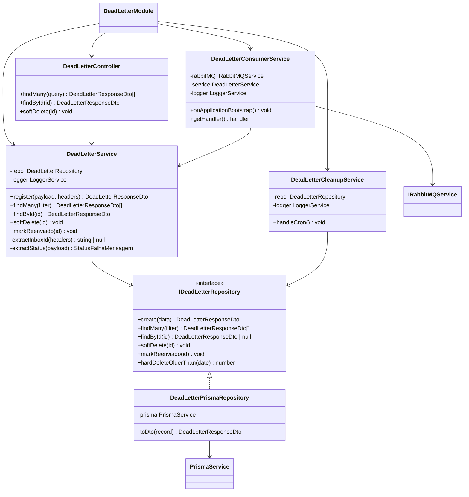
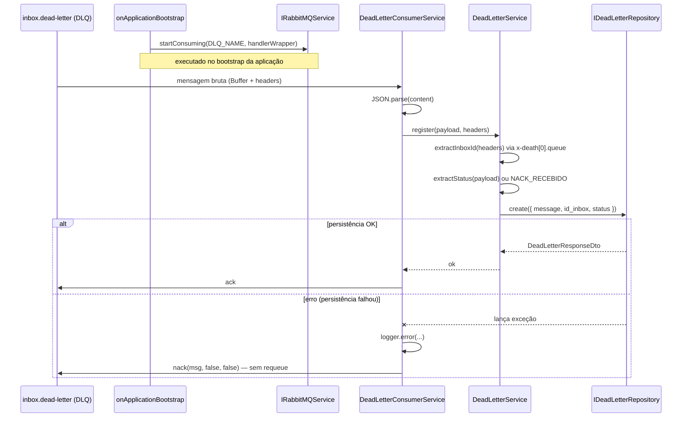
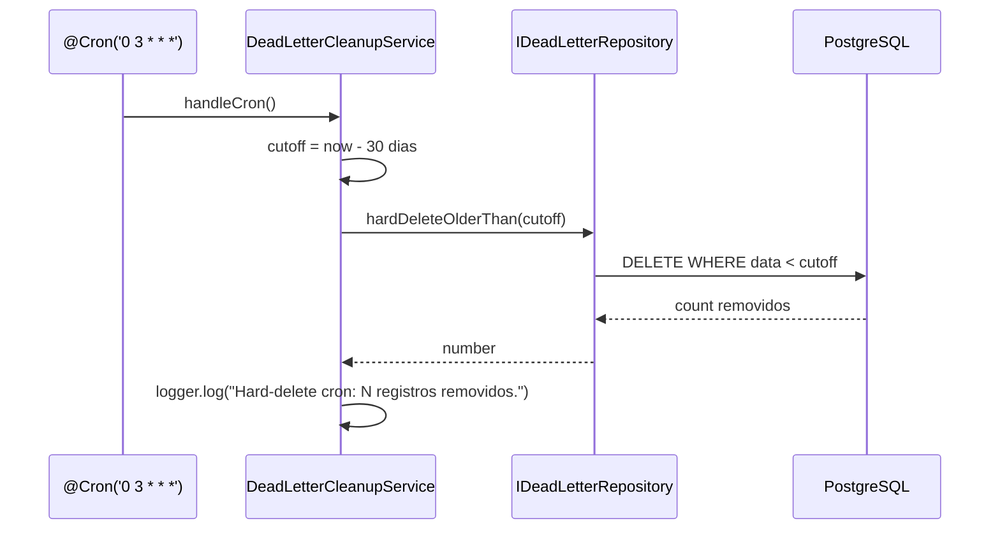
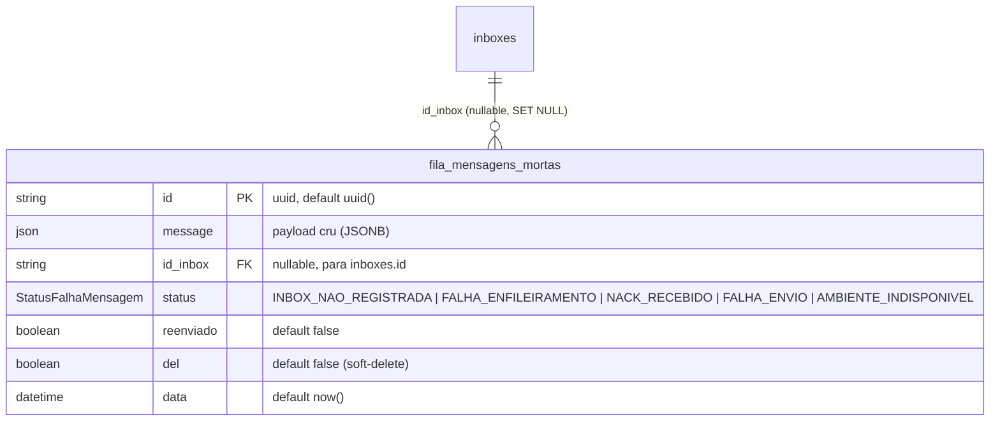

# Fila de Mensagens Mortas

> **Status:** stable
> **Spec:** docs/specs/fila-mensagens-mortas.md
> **Backend:** src/dead-letter/

## 1. Visão Geral

O módulo `DeadLetterModule` é responsável por três responsabilidades ortogonais:

1. **Consumo da DLQ** (`inbox.dead-letter`): O `DeadLetterConsumerService` inicia no bootstrap da aplicação e registra um handler que persiste cada mensagem morta como um registro em `fila_mensagens_mortas`. Após persistência bem-sucedida, a mensagem é `ack`ada; em caso de falha, é `nack`ada sem requeue (evita loop infinito).

2. **API HTTP** de leitura e soft-delete: O `DeadLetterController` expõe três endpoints para que operadores inspecionem e descartem registros de falha.

3. **Cron de expurgo** (`DeadLetterCleanupService`): Job diário às 03:00 que executa hard-delete físico de registros com mais de 30 dias, independente de `del` ou `reenviado`.

O módulo exporta `DeadLetterService`, permitindo que outras features (ex.: `reenvio-mensagens`, `webhook-ingestao`, `despacho-mensagens`) injetem o serviço para criar registros diretos via `register()` ou marcar reenvio via `markReenviado()`.

## 2. API HTTP Pública

| Método | Rota | Status de sucesso | Descrição |
|--------|------|-------------------|-----------|
| `GET` | `/dead-letter` | `200` | Lista mensagens mortas ativas (del=false) com filtros e paginação |
| `GET` | `/dead-letter/:id` | `200` | Retorna uma mensagem morta pelo UUID |
| `DELETE` | `/dead-letter/:id` | `204` | Soft-delete (del=true) do registro |

Nenhum endpoint exige autenticação Bearer no código atual (sem `@ApiBearerAuth` ou guard no controller) — ver §12.

### GET /dead-letter

```
GET /dead-letter?status=FALHA_ENVIO&limit=20&offset=0
```

Query: `ListDeadLetterQueryDto` (todos opcionais). Retorna `DeadLetterResponseDto[]` ordenado por `data desc`.

```bash
curl -s "http://localhost:3000/dead-letter?status=FALHA_ENVIO&limit=10"
```

### GET /dead-letter/:id

```
GET /dead-letter/a1b2c3d4-e5f6-7890-abcd-ef1234567890
```

Retorna `DeadLetterResponseDto` ou `404 NotFoundException`.

```bash
curl -s "http://localhost:3000/dead-letter/a1b2c3d4-e5f6-7890-abcd-ef1234567890"
```

### DELETE /dead-letter/:id

```
DELETE /dead-letter/a1b2c3d4-e5f6-7890-abcd-ef1234567890
```

Responde `204 No Content`. Lança `NotFoundException` (404) se o registro não existir — verificação feita no repositório antes do update.

```bash
curl -s -X DELETE "http://localhost:3000/dead-letter/a1b2c3d4-e5f6-7890-abcd-ef1234567890" -o /dev/null -w "%{http_code}"
```

## 3. Superfície do Módulo

```
DeadLetterModule
  imports:    PrismaModule, RabbitMQModule, LoggerModule
  providers:  DeadLetterPrismaRepository
              { provide: DEAD_LETTER_REPOSITORY, useExisting: DeadLetterPrismaRepository }
              DeadLetterService
              DeadLetterConsumerService
              DeadLetterCleanupService
  controllers: DeadLetterController
  exports:    DeadLetterService
```

O token `DEAD_LETTER_REPOSITORY` é provido via `useExisting` (não `useClass`), o que evita instanciar duas vezes o repositório e mantém o contrato de interface sem duplicar providers.

## 4. Arquitetura

### Diagrama de Classes



### Sequência — Consumo da DLQ



### Sequência — Cron de Expurgo



## 5. Modelo de Dados



**Enum `StatusFalhaMensagem`:** `INBOX_NAO_REGISTRADA`, `FALHA_ENFILEIRAMENTO`, `NACK_RECEBIDO`, `FALHA_ENVIO`, `AMBIENTE_INDISPONIVEL`.

Schema declarado em `prisma/schema.prisma`; migrations gerenciadas pela feature `gateway-foundation`.

## 6. DTOs

### DeadLetterResponseDto

| Campo | Tipo TypeScript | Decoradores | Descrição |
|-------|----------------|-------------|-----------|
| `id` | `string` | `@Expose()`, `@ApiProperty` | UUID do registro |
| `message` | `unknown` | `@Expose()`, `@ApiProperty` | Payload original da mensagem que falhou |
| `id_inbox` | `string \| null` | `@Expose()`, `@ApiProperty(nullable)` | UUID da inbox associada, ou null se desconhecida |
| `status` | `StatusFalhaMensagem` | `@Expose()`, `@ApiProperty(enum)` | Status de falha |
| `reenviado` | `boolean` | `@Expose()`, `@ApiProperty` | Indica se já foi reenviada |
| `del` | `boolean` | `@Expose()`, `@ApiProperty` | Indica soft-delete |
| `data` | `string` | `@Expose()`, `@ApiProperty` | Data de criação (ISO 8601) |

Serializado via `plainToInstance` com `excludeExtraneousValues: true`. O campo `data` é convertido de `Date` para `string` ISO 8601 antes da transformação.

### ListDeadLetterQueryDto

| Campo | Tipo TypeScript | Validadores | Default | Descrição |
|-------|----------------|-------------|---------|-----------|
| `pid` | `string?` | `@IsOptional`, `@IsString` | — | Filtro por PID (declarado no DTO, mas **não aplicado** no repositório — ver §12) |
| `id_inbox` | `string?` | `@IsOptional`, `@IsString` | — | Filtro por UUID da inbox |
| `status` | `StatusFalhaMensagem?` | `@IsOptional`, `@IsEnum` | — | Filtro por status de falha |
| `reenviado` | `boolean?` | `@IsOptional`, `@IsBoolean`, `@Transform` | — | Filtro por flag de reenvio; strings `'true'`/`'false'` são transformadas |
| `dataInicio` | `string?` | `@IsOptional`, `@IsISO8601` | — | Data início do filtro de período |
| `dataFim` | `string?` | `@IsOptional`, `@IsISO8601` | — | Data fim do filtro de período |
| `limit` | `number?` | `@IsOptional`, `@IsInt`, `@Min(1)`, `@Max(200)`, `@Type(Number)` | `50` | Tamanho da página |
| `offset` | `number?` | `@IsOptional`, `@IsInt`, `@Min(0)`, `@Type(Number)` | `0` | Deslocamento para paginação |

## 7. Configuração

Este módulo não declara variáveis de ambiente próprias. As envs `RABBITMQ_URL` e `DATABASE_URL` são consumidas pelos módulos `RabbitMQModule` e `PrismaModule`, já importados. O horário da cron (`0 3 * * *`) está hardcoded no `DeadLetterCleanupService`.

## 8. Dependências

### Internas

| Módulo/Símbolo | Origem | Uso |
|---|---|---|
| `PrismaService` | `PrismaModule` (global) | Acesso ao banco via `fila_mensagens_mortas` |
| `IRabbitMQService` / `RABBITMQ_SERVICE` | `RabbitMQModule` (global) | `startConsuming(DLQ_NAME, handler)` |
| `DLQ_NAME` | `src/rabbitmq/constants/rabbitmq-queue.constants.ts` | Nome da fila `inbox.dead-letter` |
| `LoggerService` | `LoggerModule` (global) | Logs estruturados |

### Externas / Libs

| Lib | Uso |
|---|---|
| `@prisma/client` | `StatusFalhaMensagem` enum; acesso ao modelo `fila_mensagens_mortas` |
| `@nestjs/schedule` | Decorator `@Cron` no `DeadLetterCleanupService` |
| `class-transformer` | `plainToInstance` + `@Expose` para serialização dos DTOs |
| `class-validator` | Validações em `ListDeadLetterQueryDto` |
| `@nestjs/swagger` | `@ApiTags`, `@ApiOperation`, `@ApiResponse`, `@ApiProperty` |

## 9. Pontos de Extensão

### Interface `IDeadLetterRepository`

```typescript
export interface IDeadLetterRepository {
  create(data: CreateDeadLetterData): Promise<DeadLetterResponseDto>;
  findMany(filter: ListDeadLetterQueryDto): Promise<DeadLetterResponseDto[]>;
  findById(id: string): Promise<DeadLetterResponseDto | null>;
  softDelete(id: string): Promise<void>;
  markReenviado(id: string): Promise<void>;
  hardDeleteOlderThan(date: Date): Promise<number>;
}
```

Substituível via `DEAD_LETTER_REPOSITORY` (Symbol). Qualquer nova implementação (ex.: in-memory para testes) deve satisfazer este contrato.

### Token `DEAD_LETTER_REPOSITORY`

`Symbol('DEAD_LETTER_REPOSITORY')` — injete este token para consumir o repositório sem acoplar à implementação Prisma.

### `DeadLetterService` (exportado)

Exportado pelo `DeadLetterModule` para consumo por features adjacentes:
- `register(payload, headers)` — para features que detectam falhas em código e não passam pela DLQ.
- `markReenviado(id)` — para `reenvio-mensagens` após re-disparo bem-sucedido.

### `CreateDeadLetterData`

```typescript
export interface CreateDeadLetterData {
  message: unknown;
  id_inbox: string | null;
  status: StatusFalhaMensagem;
}
```

Contrato de entrada do `create`. Campos `reenviado` e `del` são definidos com defaults no schema Prisma.

## 10. Erros

| Exceção | Status HTTP | Gatilho |
|---|---|---|
| `NotFoundException` (service) | `404` | `findById(id)` quando repositório retorna `null` |
| `NotFoundException` (repositório) | `404` | `softDelete(id)` quando `findUnique` retorna `null` antes do `update` |
| `nack` (sem HTTP) | — | Erro não capturado em `getHandler()` durante persistência da DLQ |

O `GlobalExceptionFilter` (de `gateway-foundation`) intercepta `HttpException` e formata a resposta como `ErrorResponseDto { statusCode, timestamp, message, details? }`.

Nota: erros no consumo da DLQ não produzem resposta HTTP — são tratados via `logger.error` + `nack(msg, false, false)` (sem requeue).

## 11. Notas Operacionais

- **Bootstrap**: O `DeadLetterConsumerService` implementa `OnApplicationBootstrap`. O consumo da DLQ inicia **após** todos os módulos serem inicializados, garantindo que o repositório e o logger estejam prontos.

- **nack sem requeue**: Ao falhar a persistência, a mensagem recebe `nack(msg, false, false)`. Dependendo da configuração do broker, isso pode enviar a mensagem para outra DLQ ou descartá-la. Não há retentativa automática neste serviço.

- **Hard-delete**: A cron usa `THIRTY_DAYS_MS = 30 * 24 * 60 * 60 * 1000` (constante local). O critério é `data < cutoff` — independente de `del` ou `reenviado`. Registros recentes (mesmo `del=true`) são preservados.

- **Extração de `id_inbox`**: Feita via regex `/^inbox\.(.+)$/` sobre `x-death[0].queue`. Se o header estiver ausente, malformado ou a fila não seguir o padrão `inbox.<id>`, retorna `null`.

- **Extração de `status`**: Se o payload JSON contiver campo `status` com valor válido do enum `StatusFalhaMensagem`, usa esse valor. Caso contrário, default `NACK_RECEBIDO`.

- **Paginação**: `limit` máximo é `200` (validado por `@Max(200)`). Default `50`. Ordenação fixa: `data desc`.

- **`ScheduleModule`**: Já importado globalmente em `AppModule`. O `DeadLetterModule` não precisa importar `ScheduleModule` localmente.

## 12. Drift de Spec

1. **Autenticação ausente nos endpoints**: A spec (§7) indica `Auth: Bearer JWT` nos três endpoints. O controller implementado não possui `@ApiBearerAuth`, `@UseGuards` ou qualquer guard de autenticação. Os endpoints são públicos na implementação atual.

2. **Filtro `pid` não aplicado na query**: O DTO `ListDeadLetterQueryDto` declara o campo `pid` (conforme spec §4 FR-3), mas o repositório `DeadLetterPrismaRepository.findMany()` não usa esse filtro na cláusula `where`. Requests com `?pid=xxx` são aceitas mas ignoradas na consulta ao banco.

3. **nack sem requeue vs. spec OQ-2**: A spec propõe requeue com limite de tentativas. A implementação usa `nack(msg, false, false)` — sem requeue, sem contador de tentativas. Mensagens que falham a persistência são descartadas pelo broker (ou enviadas a outra DLQ dependendo da topologia).

## 13. Changelog

| Data | Descrição |
|---|---|
| 2026-06-02 | Implementação inicial (fase 3 concluída) |
