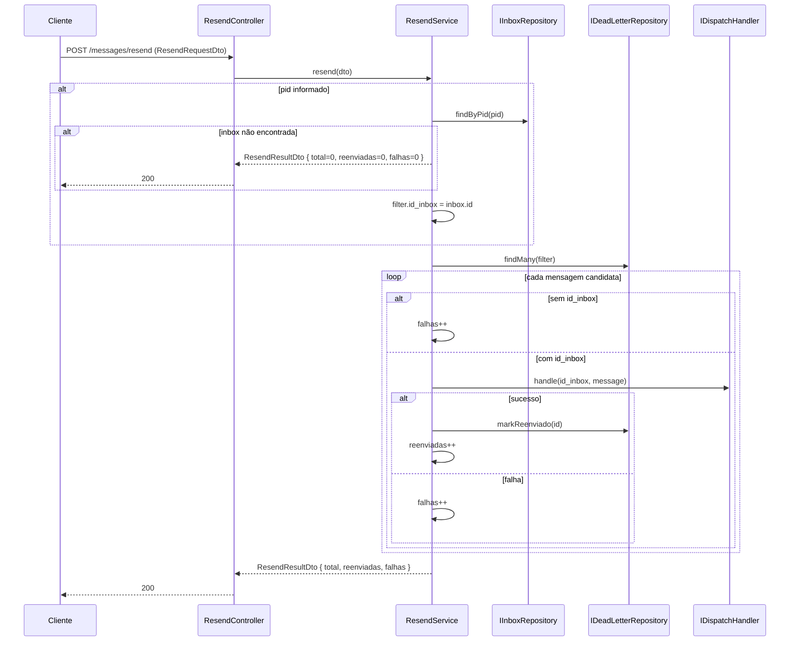

# Reenvio de Mensagens

> Status: stable
> Spec: docs/specs/reenvio-mensagens.md
> Backend: src/resend/

## 1. Overview

Permite que operadores re-disparem mensagens mortas armazenadas em `fila_mensagens_mortas` sem reiniciar o fluxo de ingestão. O endpoint `POST /messages/resend` seleciona registros elegíveis por **PID** e/ou **intervalo de data**, re-despacha cada payload via `IDispatchHandler.handle` (o mesmo caminho do `despacho-mensagens`), marca `reenviado=true` em sucesso e retorna um resumo com `total`, `reenviadas` e `falhas`. Uma falha individual não aborta o lote.

## 2. Public API (HTTP)

### POST /messages/resend

- **Auth**: Bearer JWT
- **HTTP Code de sucesso**: `200`
- **Request body**: `ResendRequestDto`
- **Response body**: `ResendResultDto`
- **Erros**: `400` — nenhum critério válido ou `dataInicio > dataFim`

**Exemplo curl:**

```bash
curl -X POST http://localhost:3000/messages/resend \
  -H "Authorization: Bearer <token>" \
  -H "Content-Type: application/json" \
  -d '{"pid": "whatsapp-pid-001", "dataInicio": "2026-06-01T00:00:00.000Z", "dataFim": "2026-06-30T23:59:59.999Z"}'
```

**Resposta de sucesso:**

```json
{ "total": 5, "reenviadas": 4, "falhas": 1 }
```

**Resposta de seleção vazia (`pid` não encontrado ou nenhuma mensagem elegível):**

```json
{ "total": 0, "reenviadas": 0, "falhas": 0 }
```

## 3. Module surface

| Camada | Classe/Token | Papel |
|---|---|---|
| Module | `ResendModule` | Importa `DeadLetterModule`, `InboxModule`, `DispatchModule`; provê `ResendService`; declara `ResendController` |
| Controller | `ResendController` | `@Controller('messages')` — mapeia `POST /messages/resend` |
| Service | `ResendService` | Orquestra resolução de inbox, seleção de mensagens mortas, despacho e contagem |
| DTO (request) | `ResendRequestDto` | Valida critérios de filtro via `@HasValidCriteria` customizado |
| DTO (response) | `ResendResultDto` | Resumo com `total`, `reenviadas`, `falhas` |
| Interface local | `ResendInput` | Forma interna passada de `ResendController` para `ResendService.resend()` |

Tokens injetados no `ResendService`:

| Token | Origem |
|---|---|
| `DEAD_LETTER_REPOSITORY` | `src/dead-letter/constants/dead-letter-tokens.constants.ts` |
| `DISPATCH_HANDLER` | `src/dispatch/constants/dispatch-tokens.constants.ts` |
| `INBOX_REPOSITORY` | `src/inbox/constants/inbox-tokens.constants.ts` |

`LoggerService` é injetado diretamente (módulo global).

## 4. System architecture (Mermaid)



## 5. Data model

Sem tabelas próprias. Lê e atualiza registros existentes:

| Tabela | Operação | Via |
|---|---|---|
| `fila_mensagens_mortas` | `SELECT` (filtro elegível) + `UPDATE reenviado=true` | `IDeadLetterRepository.findMany` / `markReenviado` |
| `inboxes` | `SELECT` por `pid` | `IInboxRepository.findByPid` |

Nenhuma migration foi criada por esta feature.

## 6. DTOs

### ResendRequestDto

| Campo | Tipo | Validadores | Default | Descrição |
|---|---|---|---|---|
| `pid` | `string?` | `@IsOptional @IsString` | — | PID da inbox para filtrar mensagens |
| `dataInicio` | `string?` | `@IsOptional @IsISO8601` | — | Início do intervalo (ISO 8601) |
| `dataFim` | `string?` | `@IsOptional @IsISO8601` | — | Fim do intervalo (ISO 8601) |
| `forcarReenviadas` | `boolean` | `@IsBoolean @HasValidCriteria @Transform(...)` | `false` | Se `true`, inclui mensagens já marcadas como `reenviado=true` |

O validador `@HasValidCriteria` (declarado em `resend-request.dto.ts`) é aplicado no campo `forcarReenviadas` e rejeita com `400` quando:
- Nenhum critério fornecido (nem `pid`, nem `dataInicio`, nem `dataFim`).
- `dataInicio` sem `dataFim` (ou vice-versa) sem `pid`.
- `dataInicio > dataFim`.

O `@Transform` em `forcarReenviadas` normaliza strings `'true'`/`'false'` e `null`/`undefined` para booleano.

### ResendResultDto

| Campo | Tipo | Decoradores | Descrição |
|---|---|---|---|
| `total` | `number` | `@Expose() @ApiProperty` | Total de candidatos processados |
| `reenviadas` | `number` | `@Expose() @ApiProperty` | Re-despachos bem-sucedidos |
| `falhas` | `number` | `@Expose() @ApiProperty` | Falhas individuais (sem `id_inbox` ou erro no dispatch) |

Retornado via `plainToInstance(ResendResultDto, ..., { excludeExtraneousValues: true })`.

## 7. Configuration (env vars)

Nenhuma variável de ambiente nova para esta feature. As variáveis usadas pelo `IDispatchHandler` (`DISPATCH_MAX_RETRIES`, `DISPATCH_BACKOFF_BASE_MS`) já estão documentadas em `despacho-mensagens`.

## 8. Dependencies

| Módulo importado | Por que |
|---|---|
| `DeadLetterModule` | Exporta `DEAD_LETTER_REPOSITORY` (atualizado nesta feature para também exportar o token, além de `DeadLetterService`) |
| `InboxModule` | Exporta `INBOX_REPOSITORY` para resolver inbox por `pid` |
| `DispatchModule` | Exporta `DISPATCH_HANDLER` para re-despacho via `IDispatchHandler.handle` |

**Efeito colateral em `DeadLetterModule`:** o arquivo `src/dead-letter/dead-letter.module.ts` foi atualizado para exportar `DEAD_LETTER_REPOSITORY` (token) além de `DeadLetterService`, tornando o repositório disponível para `ResendModule`.

## 9. Extension points

- **Paginação de lotes grandes**: atualmente `findMany` retorna todos os registros elegíveis em memória. Para volumes altos, o filtro pode receber `limit`/`offset` (já suportados por `ListDeadLetterQueryDto`) chamando `findMany` em páginas dentro de `ResendService`.
- **`ids` na resposta**: `ResendResultDto` pode ser estendido com `ids?: string[]` dos registros re-disparados (OQ-5 da spec, não implementado no MVP).
- **Re-enfileiramento vs. despacho direto**: a implementação optou por `IDispatchHandler.handle` diretamente (OQ-1 resolvido — ver §12).

## 10. Errors

| Código | Condição | Origem |
|---|---|---|
| `400` | Nenhum critério / datas inválidas / `dataInicio > dataFim` | `@HasValidCriteria` via `ValidationPipe` global |
| `200 falhas++` | `id_inbox` ausente na mensagem morta | Lógica interna do `ResendService` (conta como falha, não lança exceção) |
| `200 falhas++` | `IDispatchHandler.handle` lança exceção | `try/catch` em cada iteração — lote continua |
| `200 total=0` | `pid` não encontrado no banco | `IInboxRepository.findByPid` retorna `null` → retorno imediato com zeros |

## 11. Operational notes

- Re-despacho usa exatamente o mesmo caminho do `despacho-mensagens` (`IDispatchHandler.handle`), incluindo retry exponencial e eventual dead-letter se o destino continuar fora.
- Por padrão apenas mensagens `reenviado=false` são candidatas; `forcarReenviadas=true` inclui as já marcadas.
- Cada falha individual é logada via `LoggerService.error` com o `id` da mensagem; mensagens sem `id_inbox` são logadas via `LoggerService.warn`.
- Não há paginação automática no MVP — operadores devem usar `dataInicio`/`dataFim` para limitar o volume.

## 12. Spec drift

| Open Question | Decisão na implementação |
|---|---|
| **OQ-1** Re-enfileirar vs. chamar `IDispatchHandler.handle` direto | Implementado com `IDispatchHandler.handle` direto (despacho síncrono, reutiliza retry do handler). A spec propunha re-enfileiramento; a implementação optou pelo handler direto por simplicidade. |
| **OQ-3** `pid` sem inbox → `404` ou `200 total=0` | Implementado como `200 total=0` com log `warn` (idempotente/operacional, conforme proposta da spec). |
| **OQ-4** Mensagem sem `id_inbox` e filtro só por data | Implementado como `falhas++` com log `warn`, lote continua (conforme proposta da spec). |
| **OQ-5** `ids` na resposta | Não implementado no MVP. `ResendResultDto` retorna apenas contagens. |
| **OQ-6** Paginação/stream | Não implementado no MVP. `findMany` retorna todos os registros elegíveis em memória. |

## 13. Changelog

| Data | Versão | Descrição |
|---|---|---|
| 2026-06-02 | 1.0.0 | Implementação inicial (Feature 7/7). `ResendModule`, `ResendController`, `ResendService`, `ResendRequestDto` com `@HasValidCriteria`, `ResendResultDto`. `DeadLetterModule` atualizado para exportar `DEAD_LETTER_REPOSITORY`. |
