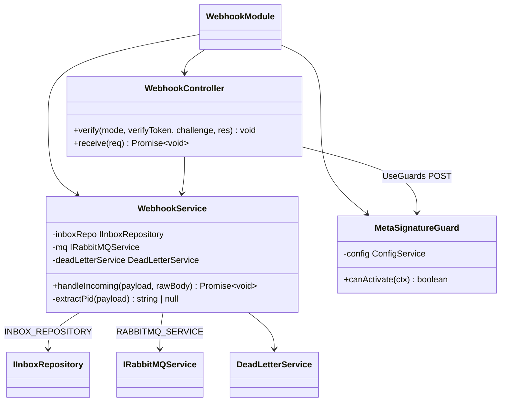
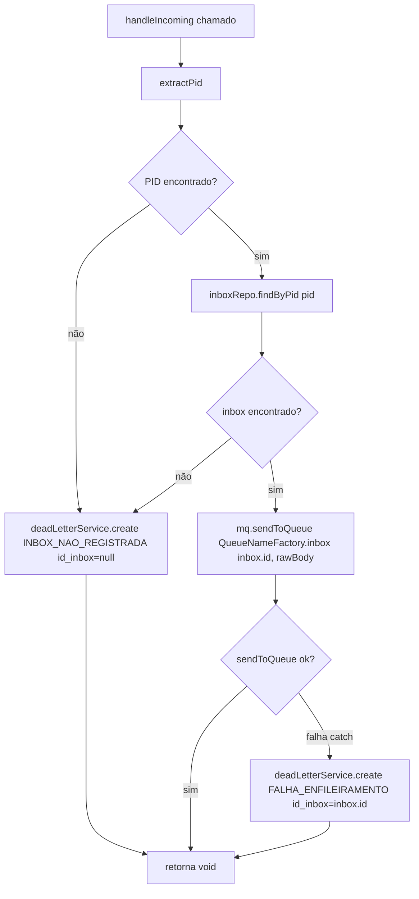
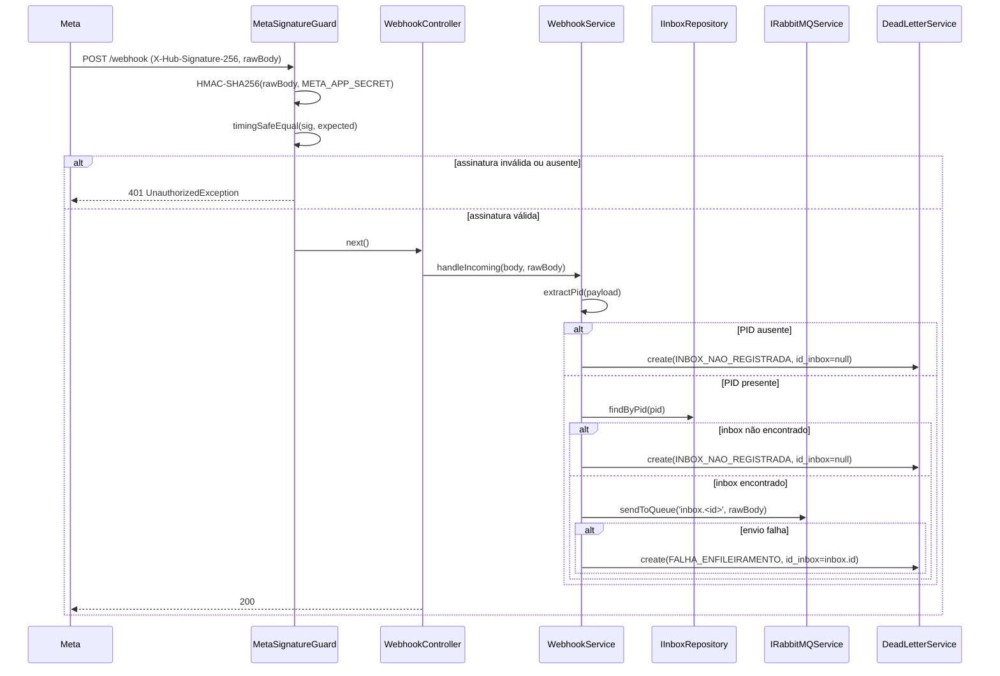
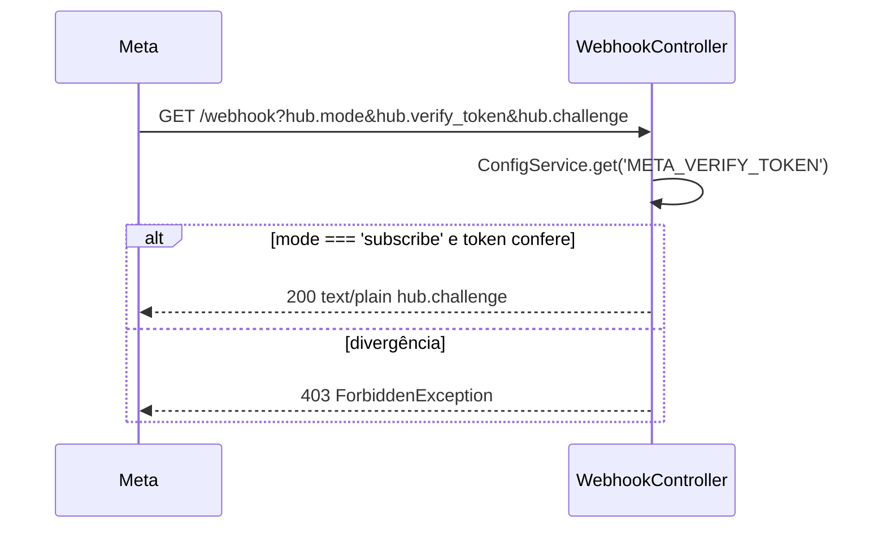

# Implementação — webhook-ingestao

> Feature 5/7 do **whiz-gateway**. Recebe webhooks da Meta (WhatsApp Cloud), valida a assinatura HMAC-SHA256, extrai o PID (`phone_number_id`) e enfileira o payload cru na fila do inbox. Spec: [`docs/specs/webhook-ingestao.md`](../specs/webhook-ingestao.md)

## 1. Visão geral

O fluxo tem duas partes independentes:

1. **Verificação (handshake):** a Meta faz `GET /webhook` com query params. O controller compara o `hub.verify_token` com `META_VERIFY_TOKEN` via `ConfigService`. Sucesso → responde o `hub.challenge` em `text/plain`. Falha → `403`.

2. **Ingestão de eventos:** a Meta faz `POST /webhook` assinado com `X-Hub-Signature-256`. O `MetaSignatureGuard` valida a assinatura HMAC-SHA256 sobre o raw body antes de a requisição chegar ao controller. Após validação, `WebhookService.handleIncoming` extrai o PID do payload, resolve o inbox via repositório e enfileira o payload cru. Falhas vão para `fila_mensagens_mortas` via `DeadLetterService.create`.

O gateway é **passthrough**: não interpreta o conteúdo do payload.

## 2. Arquitetura de módulos



### Dependências de módulos

| Módulo importado | Fornece |
|---|---|
| `InboxModule` | `INBOX_REPOSITORY` (exportado em fase 3) |
| `DeadLetterModule` | `DeadLetterService` (exportado) |

`RabbitMQModule` e `AppConfigModule` são globais — injetados sem import explícito.

## 3. API real

### GET /webhook — Verificação do handshake Meta

- **Auth:** nenhuma
- **Query params:** `hub.mode: string`, `hub.verify_token: string`, `hub.challenge: string`
- **Lógica:** se `mode !== 'subscribe'` ou `verifyToken !== META_VERIFY_TOKEN` → lança `ForbiddenException`
- **Sucesso:** `res.setHeader('Content-Type', 'text/plain').status(200).send(challenge)`
- **Respostas:** `200 text/plain` (corpo = valor de `hub.challenge`) | `403`

### POST /webhook — Ingestão de evento

- **Auth:** `MetaSignatureGuard` (header `X-Hub-Signature-256`)
- **Body:** passthrough (sem validação de forma — `WebhookEventDto` é classe vazia)
- **Lê:** `req.rawBody` (Buffer) e `req.body` (objeto parseado)
- **Fallback de rawBody:** `req.rawBody ?? Buffer.alloc(0)`
- **Delegação:** `webhookService.handleIncoming(req.body, rawBody)`
- **Respostas:** `200` (sempre, após roteamento ou dead-letter) | `401` (guard rejeitou)

### Variáveis de ambiente consumidas

| Var | Usado em | Propósito |
|---|---|---|
| `META_VERIFY_TOKEN` | `WebhookController.verify` | Comparação do token de handshake |
| `META_APP_SECRET` | `MetaSignatureGuard` | Chave HMAC-SHA256 para validar `X-Hub-Signature-256` |

## 4. Guard — MetaSignatureGuard

```
src/webhook/guards/meta-signature.guard.ts
```

Algoritmo implementado:

1. Lê `req.headers['x-hub-signature-256']`
2. Lê `req.rawBody` (Buffer)
3. Qualquer ausente → `UnauthorizedException('Assinatura ausente ou inválida')`
4. Lê `META_APP_SECRET` via `ConfigService`
5. Calcula `crypto.createHmac('sha256', secret).update(rawBody).digest('hex')`
6. Monta `expectedSig = 'sha256=' + expectedHex`
7. Converte `signature` e `expectedSig` para `Buffer`
8. Se comprimentos divergirem → `UnauthorizedException('Assinatura inválida')` (timingSafeEqual requer buffers de mesmo tamanho)
9. `crypto.timingSafeEqual(a, b)` — comparação timing-safe (AC-9)

## 5. Service — WebhookService

```
src/webhook/webhook.service.ts
```

### handleIncoming

```typescript
async handleIncoming(payload: Record<string, unknown>, rawBody: Buffer): Promise<void>
```

Nunca lança — sempre retorna (garante que o controller responda `200`).

**extractPid (privado):**
Navega `payload.entry[0].changes[0].value.metadata.phone_number_id`. Qualquer nó ausente ou não-string → retorna `null`. Processa apenas o primeiro `entry[0].changes[0]` (passthrough por payload inteiro).

### Fluxo de roteamento



## 6. Sequência completa — POST /webhook



## 7. Sequência — GET /webhook (handshake)



## 8. Bootstrap — rawBody

`main.ts` foi alterado para:

```typescript
NestFactory.create(AppModule, { bufferLogs: true, rawBody: true })
```

A opção `rawBody: true` instrui o NestJS/Express a preservar o corpo cru em `req.rawBody` (Buffer) em paralelo ao parse JSON. Sem ela, `MetaSignatureGuard` não consegue calcular a assinatura corretamente.

## 9. DTOs

| DTO | Arquivo | Notas |
|---|---|---|
| `WebhookVerifyQueryDto` | `src/webhook/dto/webhook-verify-query.dto.ts` | Campos `hub.mode`, `hub.verify_token`, `hub.challenge` — tipagem sem class-validator (não usado no controller, query params lidos diretamente via `@Query`) |
| `WebhookEventDto` | `src/webhook/dto/webhook-event.dto.ts` | Classe vazia; passthrough intencional — `forbidNonWhitelisted` não se aplica (FR-9) |

## 10. Modificações em features existentes

### InboxModule (`src/inbox/inbox.module.ts`)
Adicionado `exports: [INBOX_REPOSITORY]` para que `WebhookModule` possa injetar `IInboxRepository` via token `INBOX_REPOSITORY`.

### DeadLetterService (`src/dead-letter/dead-letter.service.ts`)
Adicionado método público:

```typescript
async create(data: CreateDeadLetterData): Promise<DeadLetterResponseDto>
```

Delega diretamente para `this.repo.create(data)`. Usado pelo `WebhookService` para inserção direta (sem passar pela DLQ) nos cenários de falha de roteamento.

### AppModule (`src/app.module.ts`)
`WebhookModule` adicionado ao array de `imports`.

## 11. Casos de borda

| Cenário | Comportamento implementado |
|---|---|
| `X-Hub-Signature-256` ausente | Guard lança `401` antes de chegar ao controller |
| Comprimentos de buffer divergentes | Guard rejeita sem chamar `timingSafeEqual` (protege contra panic) |
| Payload sem `phone_number_id` | `extractPid` retorna `null` → dead-letter `INBOX_NAO_REGISTRADA` |
| PID de inbox com `del=true` | `findByPid` retorna `null` → dead-letter `INBOX_NAO_REGISTRADA` |
| Broker indisponível | `sendToQueue` lança → capturado no `catch` → dead-letter `FALHA_ENFILEIRAMENTO` |
| `rawBody` ausente no req | Fallback `Buffer.alloc(0)` no controller; guard já teria rejeitado antes |
| Reentrega Meta (duplicata) | Enfileirado novamente — dedup fora de escopo (NFR-5) |

## 12. Drift em relação à spec

| Item | Spec | Implementação |
|---|---|---|
| OQ-5 (código de resposta POST) | `200` ou `202` proposto | Implementado como `200` (`@HttpCode(200)`) |
| OQ-6 (destino das falhas) | Insert direto via serviço proposto | Confirmado: `DeadLetterService.create` direto, sem publicar na DLQ |
| OQ-3 (raw body) | `NestFactory.create({ rawBody: true })` proposto | Confirmado: aplicado em `main.ts` |
| FR-4 (múltiplas entry/changes) | "processa cada uma" | Implementado como passthrough por payload inteiro; extrai apenas `entry[0].changes[0]` (OQ-1 resolvido como 1 por payload) |
| `DeadLetterService.create` | Spec referenciava o método como existente | Método foi adicionado ao serviço na fase 3 desta feature (não existia nas fases 1-2) |
| `WebhookVerifyQueryDto` | Usado no `@Query()` do controller | Não anotado com `@Query()` diretamente; controller lê params via `@Query('hub.mode')` individualmente — DTO existe apenas para tipagem de documentação |

## Changelog

| Data | Autor | Descrição |
|---|---|---|
| 2026-06-02 | pedro-php | Implementação inicial (fase 3 GREEN) + documentação (fase 4) |
