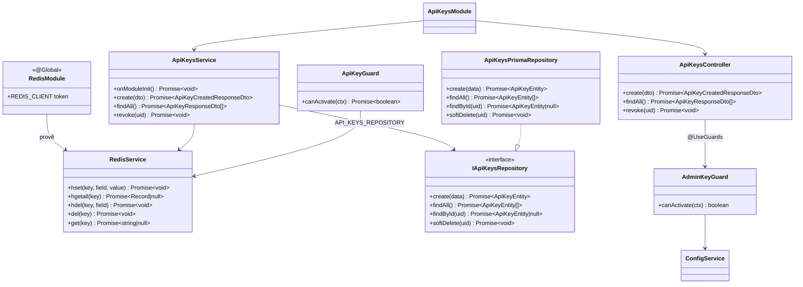
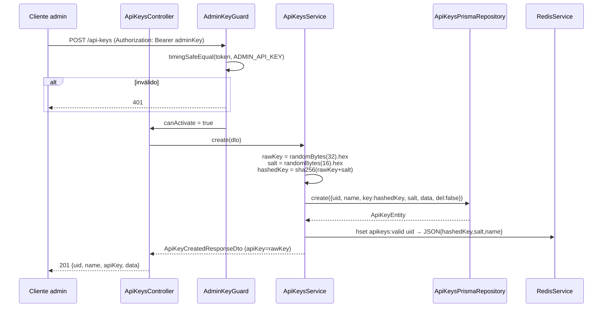
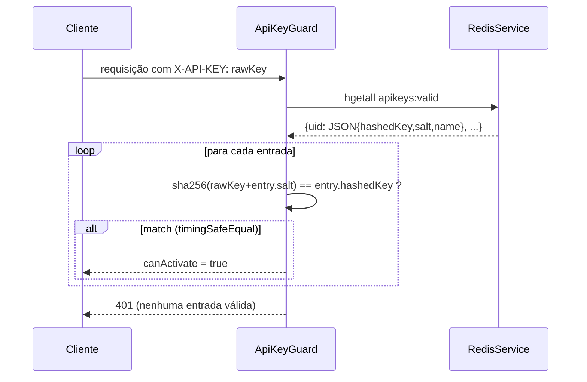
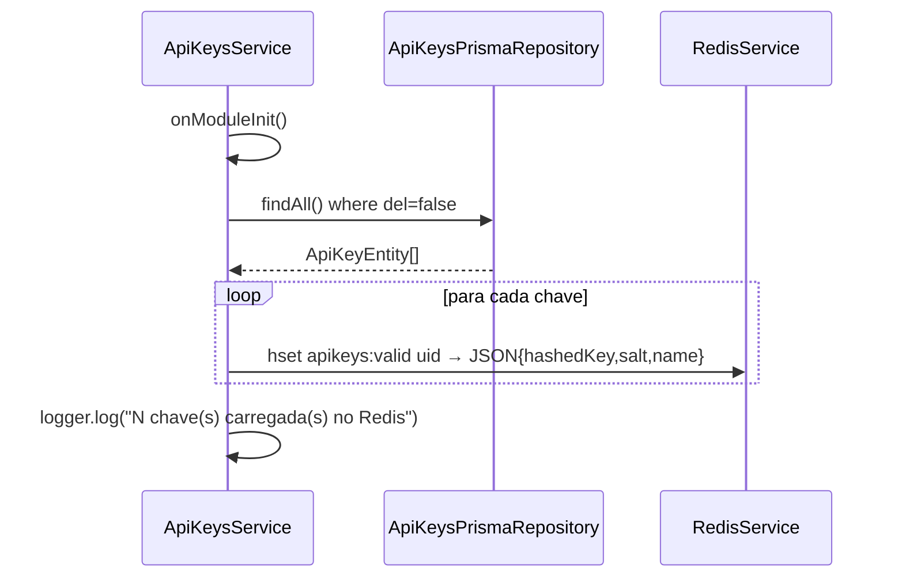
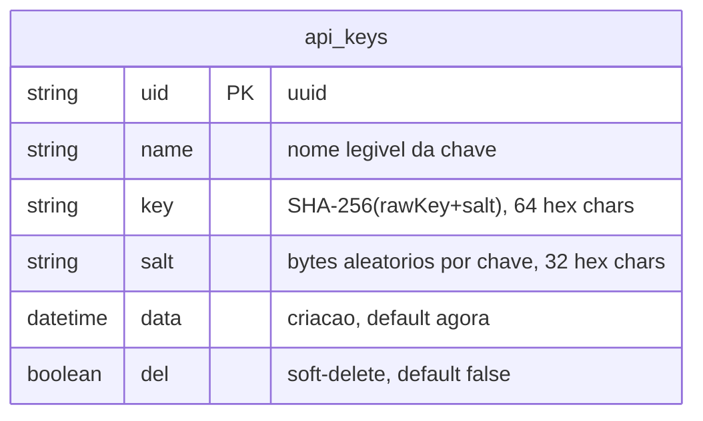

# API Keys Foundation

> Status: stable
> Spec: [docs/specs/api-keys-foundation.md](../specs/api-keys-foundation.md)
> Backend: `src/api-keys/` + `src/redis/`

## 1. Overview

Entrega a fundação de autenticação do whiz-gateway para o batch WhatsApp Meta Adapter. Provisiona:

- Geração, listagem e revogação de API keys via endpoints administrativos (`/api-keys`), protegidos por `AdminKeyGuard`.
- Cache Redis das chaves válidas (`apikeys:valid`) populado no boot e mantido sincronizado em cada criação/revogação — elimina acesso ao banco no caminho quente de validação.
- Dois guards reutilizáveis exportados pelo módulo: `AdminKeyGuard` (endpoints de gestão) e `ApiKeyGuard` (rotas `/wpp/*`, consumido em features futuras).
- Infraestrutura Redis global (`RedisModule` + `RedisService`) baseada em `ioredis`.

O `rawKey` (valor em claro da chave) é exposto **uma única vez** na resposta do `POST` e nunca persistido. O banco armazena apenas `key = SHA-256(rawKey + salt)` e o `salt`.

## 2. Public API (HTTP)

Todas as rotas requerem `Authorization: Bearer {ADMIN_API_KEY}`.

| Método | Rota | Guard | Status OK | Body request | Body response |
|---|---|---|---|---|---|
| `POST` | `/api-keys` | `AdminKeyGuard` | `201` | `CreateApiKeyDto` | `ApiKeyCreatedResponseDto` |
| `GET` | `/api-keys` | `AdminKeyGuard` | `200` | — | `ApiKeyResponseDto[]` |
| `DELETE` | `/api-keys/:uid` | `AdminKeyGuard` | `204` | — | — |

### POST /api-keys

Cria uma nova chave de API. O `apiKey` retornado é o `rawKey` e não será acessível novamente.

```bash
curl -X POST http://localhost:3000/api-keys \
  -H "Authorization: Bearer $ADMIN_API_KEY" \
  -H "Content-Type: application/json" \
  -d '{"name": "integração-x"}'
# 201
# {
#   "uid": "550e8400-e29b-41d4-a716-446655440000",
#   "name": "integração-x",
#   "apiKey": "a1b2c3d4...64hexchars...",
#   "data": "2026-06-03T00:00:00.000Z"
# }
```

Erros: `400` (name ausente/inválido) · `401` (admin key incorreta).

### GET /api-keys

Lista todas as chaves ativas (`del = false`). Nunca retorna `key`, `salt` ou `apiKey`.

```bash
curl http://localhost:3000/api-keys \
  -H "Authorization: Bearer $ADMIN_API_KEY"
# 200
# [{"uid": "...", "name": "integração-x", "data": "2026-06-03T00:00:00.000Z"}]
```

Erros: `401`.

### DELETE /api-keys/:uid

Revoga (soft-delete) a chave pelo UID. Remove do Redis imediatamente; chamadas subsequentes com aquela chave retornam `401` no `ApiKeyGuard`.

```bash
curl -X DELETE http://localhost:3000/api-keys/550e8400-e29b-41d4-a716-446655440000 \
  -H "Authorization: Bearer $ADMIN_API_KEY"
# 204 (sem body)
```

Erros: `401` · `404` (uid não encontrado ou já revogado).

## 3. Module surface

### RedisModule (`src/redis/redis.module.ts`)

```
@Global()
imports:  —
providers: REDIS_CLIENT (factory ioredis via ConfigService.getOrThrow('REDIS_URL')), RedisService
exports:  REDIS_CLIENT, RedisService
```

### ApiKeysModule (`src/api-keys/api-keys.module.ts`)

```
imports:  PrismaModule, RedisModule
controllers: ApiKeysController
providers: ApiKeysService, Logger,
           API_KEYS_REPOSITORY → ApiKeysPrismaRepository (useClass),
           AdminKeyGuard, ApiKeyGuard
exports:  AdminKeyGuard, ApiKeyGuard
```

Os dois guards são exportados para consumo direto por outros módulos (ex.: `wpp-adapter-core`) sem re-declaração.

## 4. System architecture

### Diagrama de classes



### Sequência — criação de chave



### Sequência — validação ApiKeyGuard



### Sequência — boot (onModuleInit)



## 5. Data model



**Estrutura Redis:** hash `apikeys:valid`

| Campo | Tipo | Notas |
|---|---|---|
| key do hash | `string` (uid) | field = uid da chave |
| value do hash | JSON string | `{ "hashedKey": string, "salt": string, "name": string }` |

Registros com `del = true` não aparecem no cache Redis e retornam `404` no `findById`.

## 6. DTOs

### CreateApiKeyDto

| Campo | Tipo | Validadores | Exemplo |
|---|---|---|---|
| `name` | `string` | `@IsString @IsNotEmpty @MinLength(1) @MaxLength(120)` | `"integração-x"` |

### ApiKeyCreatedResponseDto (resposta POST)

| Campo | Tipo | Notas |
|---|---|---|
| `uid` | `string` | UUID da chave |
| `name` | `string` | nome informado |
| `apiKey` | `string` | rawKey — 64 hex chars, exibido apenas uma vez |
| `data` | `Date \| string` | data de criação |

### ApiKeyResponseDto (resposta GET)

| Campo | Tipo | Notas |
|---|---|---|
| `uid` | `string` | UUID da chave |
| `name` | `string` | nome informado |
| `data` | `Date \| string` | data de criação |

`key` e `salt` nunca aparecem em nenhum response DTO.

## 7. Configuração

| Env | Obrigatória | Default | Descrição |
|---|---|---|---|
| `REDIS_URL` | sim | — | URL de conexão ioredis (ex.: `redis://localhost:6379`) |
| `ADMIN_API_KEY` | sim | — | Segredo único de administração das chaves; valida `AdminKeyGuard` |

Ambas validadas por Joi em `src/config/config.validation.ts`. Ausência falha o bootstrap.

## 8. Dependências

### Internas

| Módulo | Motivo |
|---|---|
| `PrismaModule` | acesso à tabela `api_keys` |
| `RedisModule` | cache `apikeys:valid` via `RedisService` |
| `ConfigService` | leitura de `ADMIN_API_KEY` no `AdminKeyGuard` e `REDIS_URL` no `RedisModule` |

### Externas / libs

| Lib | Uso |
|---|---|
| `ioredis` | client Redis — instanciado via factory em `RedisModule` |
| `crypto` (Node.js built-in) | `randomBytes` (CSPRNG), `randomUUID`, `createHash`, `timingSafeEqual` |
| `@nestjs/swagger` | decorators de documentação nos DTOs e controller |
| `class-validator` | validação de `CreateApiKeyDto` |

## 9. Extension points

| Token / Interface | Arquivo | Propósito |
|---|---|---|
| `API_KEYS_REPOSITORY` (Symbol) | `src/api-keys/constants/api-keys-tokens.constants.ts` | Substituir `ApiKeysPrismaRepository` por outro impl sem alterar o service |
| `IApiKeysRepository` | `src/api-keys/interfaces/api-keys-repository.interface.ts` | Contrato do repositório |
| `REDIS_CLIENT` (Symbol) | `src/redis/constants/redis-tokens.constants.ts` | Injeção direta do client ioredis (disponível por ser `@Global`) |
| `AdminKeyGuard` | exportado por `ApiKeysModule` | Aplicável em qualquer controller que exija autenticação de admin |
| `ApiKeyGuard` | exportado por `ApiKeysModule` | Aplicável em qualquer controller que exija API key de integração |

## 10. Erros

| Exceção | Status HTTP | Gatilho |
|---|---|---|
| `UnauthorizedException` | 401 | `AdminKeyGuard`: header `Authorization` ausente, sem `Bearer ` ou token diferente de `ADMIN_API_KEY` |
| `UnauthorizedException` | 401 | `ApiKeyGuard`: header `X-API-KEY` ausente ou rawKey não corresponde a nenhuma entrada em `apikeys:valid` |
| `BadRequestException` (ValidationPipe) | 400 | `CreateApiKeyDto`: `name` ausente, vazio, menor que 1 char ou maior que 120 chars |
| `NotFoundException` | 404 | `ApiKeysService.revoke`: uid não encontrado (inexistente ou `del = true`) |

## 11. Notas operacionais

- **rawKey nunca logado:** o `Logger.log` de criação registra apenas `uid` e `name`. Nenhuma linha do service expõe `rawKey`, `hashedKey` ou `salt` em logs.
- **Comparações timing-safe:** `AdminKeyGuard` usa `timingSafeEqual` para comparar o token admin; `ApiKeyGuard` usa `timingSafeEqual` para comparar o hash computado.
- **Fail-fast no boot:** se o Redis estiver indisponível, `onModuleInit` falha e o processo não sobe. Garante que o cache nunca esteja em estado inconsistente.
- **Idempotência do boot:** `onModuleInit` escreve todas as chaves ativas no Redis a cada reinício — não limpa o hash antes (HSET sobrescreve fields existentes). Chaves já revogadas não são re-inseridas (filtro `del = false` no `findAll`).
- **Custo do ApiKeyGuard:** `HGETALL apikeys:valid` retorna todas as entradas em uma única chamada Redis; iteração local O(k) onde k = número de chaves ativas. Adequado para dezenas de chaves.
- **Dois lengths distintos no AdminKeyGuard:** a verificação de `tokenBuf.length !== adminBuf.length` antes do `timingSafeEqual` é necessária pois `timingSafeEqual` lança exceção se os buffers têm tamanhos diferentes.

## 12. Spec drift

Nenhum. A implementação está alinhada com o spec `docs/specs/api-keys-foundation.md`. O detalhe de `useExisting` mencionado no spec (§8: `API_KEYS_REPOSITORY via useExisting`) está como `useClass` no módulo real — diferença interna sem impacto funcional, registrada aqui.

## 13. Changelog

| Data | Descrição |
|---|---|
| 2026-06-03 | Implementação inicial: `RedisModule`, `ApiKeysModule`, guards, cache Redis, endpoints CRUD. Doc criada. |
| 2026-06-05 | **hotfix `hotfix-date-to-data-rename`:** campo `date` renomeado para `data` em `ApiKeyEntity`, `ApiKeyResponseDto` e `ApiKeyCreatedResponseDto`. Schema Prisma `api_keys` atualizado. Migration `20260605000001_rename_date_to_data` aplica `ALTER TABLE api_keys RENAME COLUMN "date" TO "data"`. Doc atualizada (ERD, sequência, DTOs, exemplos cURL). |
