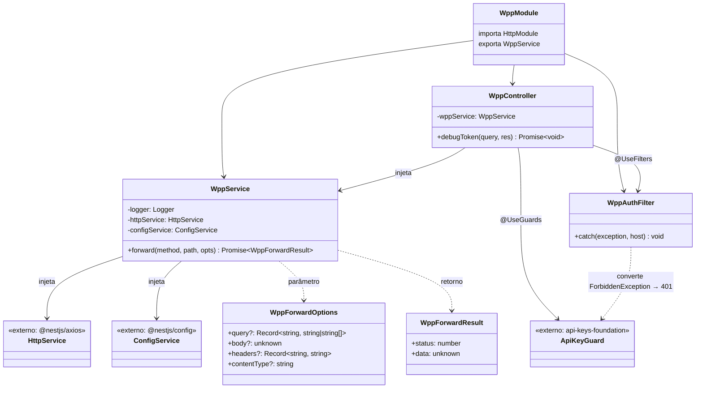
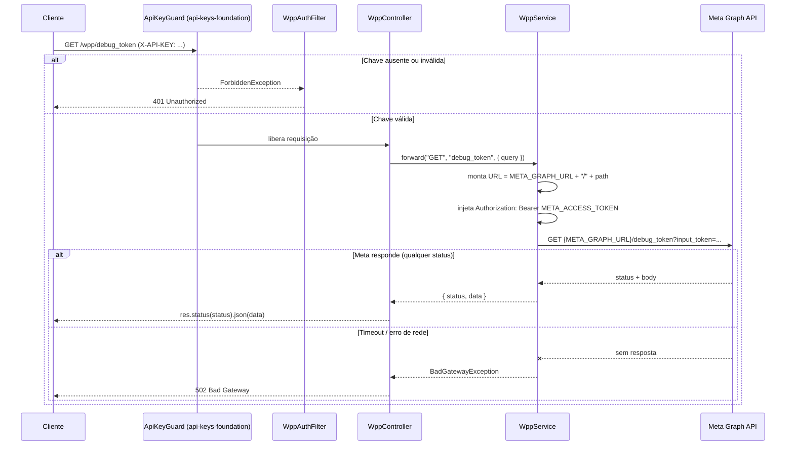

# wpp-adapter-core — Implementação

> Feature 2/8 do batch WhatsApp Meta Adapter. Proxy stateless que interpõe o gateway entre clientes internos e a WhatsApp Cloud API (Meta Graph API), injetando autenticação Bearer e normalizando erros de transporte.

## 1. Visão Geral

O `WppModule` expõe o `WppService.forward()` como primitiva de proxy reutilizável por todos os módulos de domínio `/wpp/*`. Cada chamada de saída recebe `Authorization: Bearer {META_ACCESS_TOKEN}` automaticamente; o caller nunca conhece o token Meta. Respostas da Meta — sejam 2xx, 4xx ou 5xx — são devolvidas intactas ao caller (transparência). Apenas falhas de transporte (ausência total de resposta: timeout, erro de rede) resultam em `502 Bad Gateway`.

A autenticação de entrada é delegada ao `ApiKeyGuard` (de `api-keys-foundation`), que valida o header `X-API-KEY`. O `WppAuthFilter` captura `ForbiddenException` (lançada pelo guard quando a chave não é encontrada) e a converte em `401 Unauthorized`.

## 2. API HTTP Pública

### Tabela de Endpoints

| Método | Rota | Auth | Descrição |
|---|---|---|---|
| `GET` | `/wpp/debug_token` | `X-API-KEY` | Prova de contrato: encaminha `GET /debug_token` à Meta Graph API |

### GET /wpp/debug_token

Repassa a chamada à Meta para verificação de um token de acesso. Serve como endpoint mínimo de validação do contrato do adapter.

**Query params:**

| Parâmetro | Obrigatório | Descrição |
|---|---|---|
| `input_token` | sim | Token a verificar na Meta |

**Respostas:**

| Status | Condição |
|---|---|
| `200` | Meta respondeu com sucesso; body repassado integralmente |
| `401` | Header `X-API-KEY` ausente ou inválido |
| `502` | Erro de transporte (sem resposta da Meta) |

**Exemplo curl:**

```bash
curl -X GET "http://localhost:3000/wpp/debug_token?input_token=<SEU_TOKEN>" \
  -H "X-API-KEY: <SUA_API_KEY>"
```

> Nota: qualquer status retornado pela Meta (4xx, 5xx) é repassado diretamente ao caller com o mesmo body.

## 3. Superfície do Módulo

```
WppModule
  imports:  HttpModule (@nestjs/axios)
  controllers: WppController
  providers:   WppService, WppAuthFilter
  exports:     WppService
```

`WppModule` não é global. Módulos de domínio (`WppMessagesModule`, `WppTemplatesModule`, etc.) importam `WppModule` para obter acesso ao `WppService`. `ApiKeysModule` é importado indiretamente — `ApiKeyGuard` é usado via `@UseGuards` no controller sem necessidade de importar o módulo explicitamente (guard disponível no escopo global via exports de `ApiKeysModule` em `AppModule`).

## 4. Arquitetura — Diagrama de Classes



## 5. Fluxo de Execução — Diagrama de Sequência



## 6. Data Model

N/A — adapter stateless, sem persistência própria. Nenhuma entidade Prisma adicionada.

## 7. Interfaces Internas

Definidas em `src/wpp/wpp.service.ts` (não são DTOs de validação — são interfaces TypeScript internas).

### WppForwardOptions

| Campo | Tipo | Obrigatório | Descrição |
|---|---|---|---|
| `query` | `Record<string, string \| string[]>` | não | Query params repassados à Meta |
| `body` | `unknown` | não | Body da requisição de saída |
| `headers` | `Record<string, string>` | não | Headers adicionais de saída |
| `contentType` | `string` | não | `Content-Type` de saída; default `application/json` |

### WppForwardResult

| Campo | Tipo | Descrição |
|---|---|---|
| `status` | `number` | Status HTTP da resposta Meta (ou `502` em transporte) |
| `data` | `unknown` | Body da resposta Meta intacto |

## 8. Configuração — Variáveis de Ambiente

Validadas por Joi em `src/config/config.validation.ts`. Ausência de qualquer uma impede o boot.

| Env | Tipo | Obrigatória | Descrição | Exemplo |
|---|---|---|---|---|
| `META_GRAPH_URL` | uri | sim | Base URL com versão embutida; sem barra final | `https://graph.facebook.com/v20.0` |
| `META_ACCESS_TOKEN` | string | sim | Bearer token do app Meta; injetado automaticamente; nunca logado | `EAAB...` |

## 9. Dependências

| Dependência | Pacote / Módulo | Finalidade |
|---|---|---|
| `HttpService` | `@nestjs/axios` (via `HttpModule`) | Executa chamadas HTTP de saída à Meta |
| `ConfigService` | `@nestjs/config` | Lê `META_GRAPH_URL` e `META_ACCESS_TOKEN` |
| `ApiKeyGuard` | `api-keys-foundation` | Valida `X-API-KEY` de entrada |
| `WppAuthFilter` | `src/wpp/filters/wpp-auth.filter.ts` | Converte `ForbiddenException` → `401` |

## 10. Pontos de Extensão

`WppService` é exportado por `WppModule` para consumo pelos módulos de domínio:

```typescript
// Em qualquer WppXxxModule:
imports: [WppModule]
// Injeta WppService e chama:
this.wppService.forward('POST', `${phoneNumberId}/messages`, { body, query })
```

O `WppController` com `GET /wpp/debug_token` serve apenas como prova de contrato. Os controllers de domínio (messages, templates, media, flows, etc.) residirão em seus próprios módulos e seguirão o mesmo padrão de chamar `forward()`.

## 11. Mapeamento de Erros

| Condição | Exceção / Resultado | Status ao Caller |
|---|---|---|
| `X-API-KEY` ausente ou inválida | `ForbiddenException` (ApiKeyGuard) → capturada por `WppAuthFilter` → `UnauthorizedException` | `401` |
| Meta responde com 4xx/5xx | `WppForwardResult` com `status` e `data` da Meta (passthrough) | mesmo status da Meta |
| Timeout / erro de rede | `BadGatewayException('Erro de transporte ao contatar a Meta API')` | `502` |
| `META_GRAPH_URL` / `META_ACCESS_TOKEN` ausentes | falha no boot da aplicação (validação Joi) | N/A (app não sobe) |

## 12. Notas Operacionais

- `META_ACCESS_TOKEN` é lido apenas via `ConfigService` e nunca aparece nos logs. O `WppService` loga somente `method`, `path` e status da resposta.
- O path é normalizado para remover barra inicial duplicada (`path.startsWith('/') ? path.slice(1) : path`), evitando URLs com `//`.
- `Content-Type` default é `application/json`; pode ser sobrescrito via `opts.contentType` para suporte a `multipart/form-data` (domínio `wpp-media`).
- O adapter é stateless e não implementa retry — essa responsabilidade pertence a cada módulo de domínio, se necessário.
- `WppAuthFilter` é registrado como provider do módulo (não global) e aplicado apenas em `WppController` via `@UseFilters`.

## §12. Desvios em Relação ao Spec

- **Spec §8 (Module boundaries)**: o spec previa que `WppModule` importasse `ApiKeysModule` explicitamente. Na implementação, `WppModule` não importa `ApiKeysModule` — o `ApiKeyGuard` é utilizado via `@UseGuards` no controller sem import explícito do módulo, aproveitando o fato de que `ApiKeysModule` exporta o guard e está registrado em `AppModule`. Comportamento funcional idêntico.
- **Spec §14 (Open questions — timeout)**: nenhum timeout configurável foi implementado no `HttpModule`. O timeout padrão do Axios (sem configuração = sem timeout) é utilizado. Impacto: em casos de Meta travada sem fechar a conexão, a requisição pode nunca retornar. Não é bloqueador para a feature core.

## Changelog

### 2026-06-03 — Implementação inicial: WppModule, WppService.forward(), WppController (GET /wpp/debug_token), WppAuthFilter
