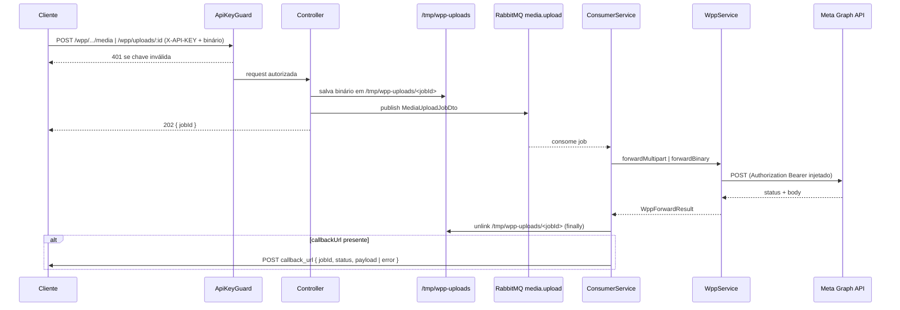
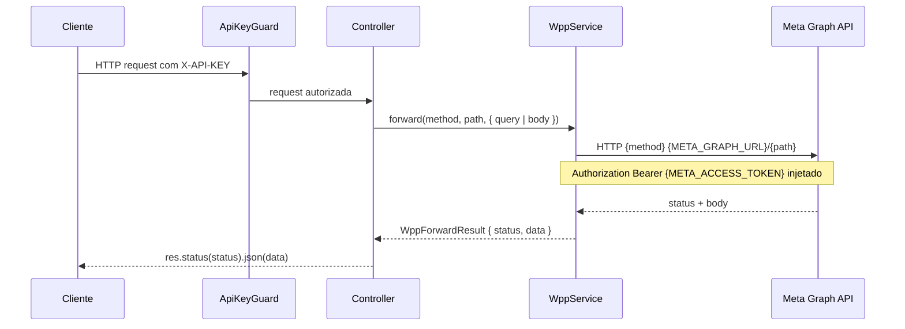
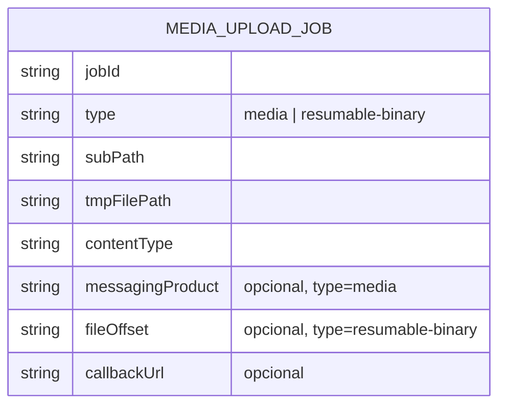

# WhatsApp Meta Adapter — Media & Business Profiles

> **Status:** stable
> **Spec:** docs/specs/2026-06-03-wpp-media-business-profiles.md
> **Backend:** src/wpp-media-business-profiles/

## 1. Visão geral

Feature 6/8 do batch WhatsApp Meta Adapter. Cobre dois domínios sob o prefixo `/wpp/*`:

- **Media** — upload de mídia (imagens, áudio, documentos, stickers), recuperação de URL/metadados e deleção.
- **Business Profiles** — leitura e atualização do perfil público do negócio, incluindo o fluxo completo de **resumable upload** para foto de perfil.

A diferença central em relação aos demais módulos `/wpp/*` (que são proxy puro síncrono) é o **padrão assíncrono para todo corpo binário**: o gateway nunca faz forward do arquivo de forma síncrona durante a requisição HTTP. O arquivo é salvo em disco temporário (`/tmp/wpp-uploads`), um job é publicado na fila estática RabbitMQ `media.upload`, e a resposta ao cliente é `202 { jobId }`. Um consumer (`WppMediaUploadConsumerService`) processa os jobs sequencialmente, faz forward à Meta e, se o cliente forneceu `callback_url`, dispara um webhook `POST` com o resultado.

Rotas de leitura (`GET`) e deleção (`DELETE`), além da criação de sessão de upload resumível (`POST /wpp/app/uploads`) e das rotas de business profile, permanecem **síncronas** (proxy transparente via `WppService.forward`).

O módulo reutiliza integralmente o contrato comum de `wpp-adapter-core` (`WppService`, injeção de `Authorization: Bearer META_ACCESS_TOKEN`, passthrough de status/body Meta, `502` em falha de transporte) e depende de `api-keys-foundation` (`ApiKeyGuard`, header `X-API-KEY`) e de `gateway-foundation` (RabbitMQ via `IRabbitMQService`).

## 2. API pública (HTTP)

| Método | Rota | Modo | Guard | DTO / Body | Forward path Meta | Status |
|---|---|---|---|---|---|---|
| POST | /wpp/:phoneNumberId/media | assíncrono | ApiKeyGuard | `multipart/form-data` | `${phoneNumberId}/media` (via consumer) | 202/400/401 |
| GET | /wpp/:mediaId | síncrono | ApiKeyGuard | — (query `phone_number_id`) | `${mediaId}` | 200/401/502 |
| DELETE | /wpp/:mediaId | síncrono | ApiKeyGuard | — (query `phone_number_id`) | `${mediaId}` | 200/401/502 |
| POST | /wpp/app/uploads | síncrono | ApiKeyGuard | — (query `file_length`, `file_type`, `file_name?`) | `app/uploads` | 200/401/502 |
| POST | /wpp/uploads/:uploadId | assíncrono | ApiKeyGuard | binário bruto (query `callback_url?`) | `${uploadId}` (via consumer) | 202/400/401 |
| GET | /wpp/uploads/:uploadId | síncrono | ApiKeyGuard | — | `${uploadId}` | 200/401/502 |
| GET | /wpp/:phoneNumberId/whatsapp_business_profile | síncrono | ApiKeyGuard | — (query `fields?`) | `${phoneNumberId}/whatsapp_business_profile` | 200/401/502 |
| POST | /wpp/:phoneNumberId/whatsapp_business_profile | síncrono | ApiKeyGuard | `UpdateBusinessProfileDto` | `${phoneNumberId}/whatsapp_business_profile` | 200/401/502 |

> O sub-path forwarded à Meta no upload binário é `:uploadId` (sem o prefixo `uploads/`). O prefixo `/uploads/` existe apenas no gateway para evitar colisão de rota com `POST /wpp/:phoneNumberId`.

### Exemplos curl

```bash
# Upload de mídia (assíncrono) — retorna { jobId }
curl -X POST -H "X-API-KEY: $KEY" \
  -F "messaging_product=whatsapp" \
  -F "callback_url=https://meu-servidor.com/webhook/media" \
  -F "file=@imagem.jpg" \
  "http://localhost:3000/wpp/{phoneNumberId}/media"

# Recuperar URL/metadados de mídia (síncrono)
curl -H "X-API-KEY: $KEY" \
  "http://localhost:3000/wpp/{mediaId}?phone_number_id={phoneNumberId}"

# Criar sessão de upload resumível (síncrono)
curl -X POST -H "X-API-KEY: $KEY" \
  "http://localhost:3000/wpp/app/uploads?file_length=1024&file_type=image/jpeg"

# Enviar binário da sessão (assíncrono)
curl -X POST -H "X-API-KEY: $KEY" \
  -H "Content-Type: image/jpeg" -H "file_offset: 0" \
  --data-binary "@perfil.jpg" \
  "http://localhost:3000/wpp/uploads/{uploadId}?callback_url=https://meu-servidor.com/webhook/upload"

# Atualizar perfil de negócio com handle da foto (síncrono)
curl -X POST -H "X-API-KEY: $KEY" -H "Content-Type: application/json" \
  -d '{"messaging_product":"whatsapp","profile_picture_handle":"h_abc123"}' \
  "http://localhost:3000/wpp/{phoneNumberId}/whatsapp_business_profile"
```

## 3. Superfície do módulo

`WppMediaBusinessProfilesModule` importa `WppModule` (obtém `WppService`), `ApiKeysModule` (obtém `ApiKeyGuard`) e `ScheduleModule.forRoot()` (cron de limpeza). Declara três controllers e dois providers. Não exporta nada. Registrado em `AppModule`. `IRabbitMQService` é injetado via token `RABBITMQ_SERVICE` (módulo `@Global` de `gateway-foundation`).

| Componente | ApiTags / Tipo | Responsabilidade |
|---|---|---|
| `WppMediaController` | `Mídia WhatsApp` | `uploadMedia` (202), `getMedia` (200), `deleteMedia` (200) |
| `WppResumableUploadController` | `Upload Resumível WhatsApp` | `createUploadSession` (200), `uploadBinary` (202), `getUploadStatus` (200) |
| `WppBusinessProfileController` | `Perfil de Negócio WhatsApp` | `getBusinessProfile` (200), `updateBusinessProfile` (200) |
| `WppMediaUploadConsumerService` | provider (`OnApplicationBootstrap`) | consome `media.upload`, forward à Meta, dispara webhook |
| `WppMediaCleanupService` | provider (`@Cron`) | remove arquivos órfãos em `/tmp/wpp-uploads` |

Todos os controllers aplicam `@UseGuards(ApiKeyGuard)`, `@UseFilters(WppAuthFilter)` (converte `ForbiddenException` → 401), `@ApiBearerAuth('bearer')` e `@UsePipes(new ValidationPipe({ whitelist: false, transform: true }))`.

## 4. Arquitetura

### Fluxo assíncrono (upload de mídia / binário)



### Fluxo síncrono (GET/DELETE media, sessões, business profile)



### Recebimento do upload no controller

- **`WppMediaController.uploadMedia`** usa `busboy` (parser multipart em modo streaming, importado via `require` por falta de tipos). O campo `file` é encaminhado por `stream.pipe(fs.createWriteStream(tmpFilePath))` — escrita direta em disco, sem buffer em RAM (NFR-1); o `mimeType` é capturado; campos de texto (`messaging_product`, `callback_url`) são guardados em `textFields`. A `Promise` só resolve quando o `writeStream` emite `finish` e o `busboy` emite `finish`. O arquivo em disco contém **apenas** o binário — sem campos de texto embutidos.
- **`WppResumableUploadController.uploadBinary`** encaminha o corpo binário bruto via `pipeline(req, fs.createWriteStream(tmpFilePath))` (`stream/promises`) — stream direto para disco, sem buffer em RAM (NFR-1). `Content-Type` vem do header da requisição; `file_offset` é lido do header `file_offset` e propagado no job.

Em ambos os casos o `jobId` é um `randomUUID()` e o caminho temporário é `/tmp/wpp-uploads/<jobId>`.

## 5. Extensões do WppService

Dois métodos foram adicionados em `src/wpp/wpp.service.ts` (módulo `wpp-adapter-core`), reutilizando o mesmo padrão de injeção de `Authorization`, passthrough de erro Meta (4xx/5xx repassado) e `BadGatewayException` (502) em erro de transporte:

| Método | Assinatura | Comportamento |
|---|---|---|
| `forwardMultipart` | `(subPath, tmpFilePath, contentType, messagingProduct) → Promise<WppForwardResult>` | Lê o arquivo do disco (`fs.promises.readFile`), monta um `form-data` com `messaging_product` + `file` (filename = basename do tmp, `contentType` aplicado) e faz `POST` à Meta com os headers do `FormData`. |
| `forwardBinary` | `(subPath, tmpFilePath, contentType, fileOffset) → Promise<WppForwardResult>` | Lê o arquivo do disco e faz `POST` binário à Meta com headers `Content-Type` e `file_offset`. |

Ambos resolvem `META_GRAPH_URL`/`META_ACCESS_TOKEN` via `ConfigService`, normalizam a barra inicial do `subPath` e retornam `WppForwardResult { status, data }` (mesma forma de `forward`).

## 6. Consumer (WppMediaUploadConsumerService)

Implementa `OnApplicationBootstrap`. O token `RABBITMQ_SERVICE` é injetado com `@Optional()` — em ambiente sem broker (alguns testes) o consumer não inicia o consumo.

- **Bootstrap**: declara a fila com `assertQueue(MEDIA_UPLOAD_QUEUE, DEFAULT_DLQ_ARGS)` e então `startConsuming(MEDIA_UPLOAD_QUEUE, handler)`. O `assertQueue` é obrigatório — sem ele o `startConsuming` falha com `404 NOT-FOUND no queue 'media.upload'` no boot. O handler aceita `Buffer` (produção — faz `JSON.parse`) ou o objeto `MediaUploadJobDto` direto (mocks de teste).
- **`handleJob(job)`**:
  - Se `type === 'media'` → `wppService.forwardMultipart(subPath, tmpFilePath, contentType, messagingProduct!)`.
  - Caso contrário (`type === 'resumable-binary'`) → `wppService.forwardBinary(subPath, tmpFilePath, contentType, fileOffset!)`.
  - O `unlink` do arquivo temporário ocorre em bloco `finally` — **com ou sem sucesso** do forward.
  - Sem `callbackUrl` → retorna sem webhook (fire-and-forget).
  - Com `callbackUrl`: sucesso (status 2xx) → `{ jobId, status: 'done', payload: result.data }`; falha → `{ jobId, status: 'failed', error: result.data }`.
- **`fireWebhookWithRetry(url, payload, jobId)`**: dispara `fetch` `POST` com `Content-Type: application/json`. Em resposta não-`ok` ou erro de rede, retenta com exponential backoff: delays `[1000, 2000, 4000, 8000, 16000]` ms (1 s → 16 s), totalizando até **5 retentativas** após a primeira. Cada falha intermediária loga `Logger.warn` com `attempt + 1` e `jobId`. Esgotadas as tentativas, loga `Logger.error` e descarta — sem relançar exceção (não afeta o fluxo do job nem o ack da mensagem).

> Erro de transporte na chamada à Meta dentro do consumer (`BadGatewayException` lançado por `forwardMultipart`/`forwardBinary`) propaga pelo handler; o arquivo já foi deletado no `finally`. A mensagem é tratada pelo `RabbitMQService` conforme a topologia de DLQ (`inbox.dead-letter`).

## 7. Cron de limpeza (WppMediaCleanupService)

`@Cron('0 * * * *')` — executa de hora em hora. Lê `/tmp/wpp-uploads` (`fs.promises.readdir`, com `.catch(() => [])` para diretório ausente). Para cada arquivo regular cujo `mtime` seja anterior a `MAX_AGE_MS = 1 hora`, faz `unlink` e loga o nome via `Logger.log`. Remove órfãos deixados por crash do consumer entre o forward e o `unlink`. `ScheduleModule.forRoot()` é importado pelo módulo para habilitar o cron.

## 8. Modelo de dados

N/A — módulo stateless. Sem persistência local; nenhuma tabela criada ou modificada. Status de job não é armazenado (entregue apenas via webhook). O payload da fila é descrito por `MediaUploadJobDto` (não é uma tabela Postgres):



## 9. DTOs

| DTO | Arquivo | Campos / Notas |
|---|---|---|
| `MediaUploadJobDto` | `dto/media-upload-job.dto.ts` | `jobId`, `type: 'media' \| 'resumable-binary'`, `subPath`, `tmpFilePath`, `contentType`, `messagingProduct?`, `fileOffset?`, `callbackUrl?` — payload da fila (sem decorators) |
| `UpdateBusinessProfileDto` | `dto/update-business-profile.dto.ts` | `messaging_product` (obrigatório); opcionais: `about`, `address`, `description`, `email`, `websites: string[]`, `vertical`, `profile_picture_handle` — todos com `@ApiProperty(Optional)` e class-validator |
| `UploadMediaDto` | `dto/upload-media.dto.ts` | `messaging_product` (obrigatório), `callback_url?` — usado para documentação Swagger do form-data |
| `WebhookCallbackDto` | `dto/webhook-callback.dto.ts` | `jobId`, `status: 'done' \| 'failed'`, `payload?`, `error?` — shape do POST de webhook |

## 10. Fila RabbitMQ — media.upload

- Constante `MEDIA_UPLOAD_QUEUE = 'media.upload'` em `src/rabbitmq/constants/rabbitmq-queue.constants.ts`.
- Fila estática consumida por `WppMediaUploadConsumerService` (um job por vez).
- Em falha de processamento → roteia para a DLQ existente `inbox.dead-letter` (`DLQ_NAME`, via `DEFAULT_DLQ_ARGS`).
- O contrato `IRabbitMQService` ganhou o método `publish(name, payload)` (em `rabbitmq.service.ts` delega a `sendToQueue`, serializando o payload como JSON). Os controllers publicam via `rabbitMQService.publish(MEDIA_UPLOAD_QUEUE, job)`.

## 11. Configuração

Nenhuma variável de ambiente própria. Herda de `wpp-adapter-core`: `META_GRAPH_URL`, `META_ACCESS_TOKEN`. Usa `RABBITMQ_URL` (via `RabbitMQService` global de `gateway-foundation`). Diretório fixo de uploads: `/tmp/wpp-uploads`.

## 12. Erros

| Código | Origem | Causa |
|---|---|---|
| 401 | `ApiKeyGuard` (+ `WppAuthFilter`) | Header `X-API-KEY` ausente/inválido — sem escrita em disco nem publish na fila |
| 400 | controller | Falha ao salvar o arquivo em disco |
| 502 | `WppService` | Erro de transporte ao contatar a Meta (rotas síncronas); no consumer, propaga após `unlink` |
| 4xx/5xx | Meta passthrough | Status retornado pela Meta repassado íntegro (rotas síncronas) ou entregue via webhook `status: failed` (rotas assíncronas) |

## 13. Notas operacionais

- **Colisão de path `GET /wpp/:mediaId` vs `GET /wpp/:id`** (de `wpp-phone-numbers`): ambos registram um parâmetro dinâmico no mesmo prefixo. A resolução é por ordem de import no `AppModule`; o proxy é opaco e a Meta resolve pelo tipo de ID. O upload resumível usa o prefixo literal fixo `/uploads/` e `app/uploads` para evitar colisão com `POST /wpp/:phoneNumberId`.
- O arquivo temporário sempre é deletado pelo consumer (`finally`); órfãos de crash são removidos pelo cron horário (atraso máximo de 1 hora).
- Mensagem na fila apontando para um arquivo `/tmp` inexistente (crash entre publish e save) → o consumer falha ao ler o arquivo; a mensagem segue para a DLQ `inbox.dead-letter`.
- `META_ACCESS_TOKEN` nunca é logado; o consumer loga `jobId`, `type`, `subPath`, `status` e `callbackUrl` (sem dados do arquivo).

## 14. Mapeamento AC → testes

24 testes unit/integração + 2 e2e — todos GREEN.

| AC | Suite | Arquivo |
|---|---|---|
| AC-1, AC-5, AC-6, AC-7, AC-8, AC-10, AC-11, AC-12, AC-13 | controllers (14 `it`) | `src/wpp-media-business-profiles/wpp-media-business-profiles.controller.spec.ts` |
| AC-2, AC-3, AC-4, AC-9, AC-14, AC-17 | consumer (7 `it`) | `src/wpp-media-business-profiles/wpp-media-upload-consumer.service.spec.ts` |
| AC-16 | cleanup cron (3 `it`) | `src/wpp-media-business-profiles/wpp-media-cleanup.service.spec.ts` |
| AC-15 | e2e (2 `it`) | `test/wpp-media-business-profiles.e2e-spec.ts` |

## 15. Drift da spec

- **Nomes de handlers**: a spec (§8 classDiagram) nomeia `getMediaUrl`, `uploadFileData`; a implementação usa `getMedia` (em `WppMediaController`) e `uploadBinary` (em `WppResumableUploadController`). Comportamento idêntico ao especificado — apenas naming.
- Todos os ACs (FR-1 a FR-15) e o NFR-1 (stream direto para disco, sem buffer em RAM) implementados conforme a spec. Sem drift de comportamento pendente.

## 16. Changelog

### 2026-06-03 · Implementação inicial
- `WppMediaBusinessProfilesModule` com 3 controllers (Media, Resumable Upload, Business Profile) — 8 rotas `/wpp/*`.
- Padrão assíncrono via fila estática `media.upload`: controller salva binário em `/tmp/wpp-uploads`, publica job, retorna `202 { jobId }`.
- `WppMediaUploadConsumerService` — forward à Meta + webhook com exponential backoff (5 retries, 1 s → 16 s).
- `WppMediaCleanupService` — cron horário de remoção de órfãos.
- Extensões `WppService.forwardMultipart` / `forwardBinary` em `wpp-adapter-core`.
- `IRabbitMQService.publish` e constante `MEDIA_UPLOAD_QUEUE` adicionadas.
- Registrado em `AppModule`.

### 2026-06-03 · Correções pós-boot
- **Fila não declarada**: `WppMediaUploadConsumerService.onApplicationBootstrap` agora chama `assertQueue(MEDIA_UPLOAD_QUEUE, DEFAULT_DLQ_ARGS)` antes de `startConsuming` — corrige `404 NOT-FOUND no queue 'media.upload'` no boot via docker.
- **NFR-1 (RAM)**: ambos os uploads passaram a transmitir o arquivo direto para disco via `stream.pipe`/`pipeline` para `fs.createWriteStream`, eliminando o `Buffer.concat` em memória.
- **Porta de teste do PG**: `src/test-setup.ts` default `DATABASE_URL` corrigido de `5433` → `5432` (alinhado a `.env`/docker).
</content>
</invoke>
