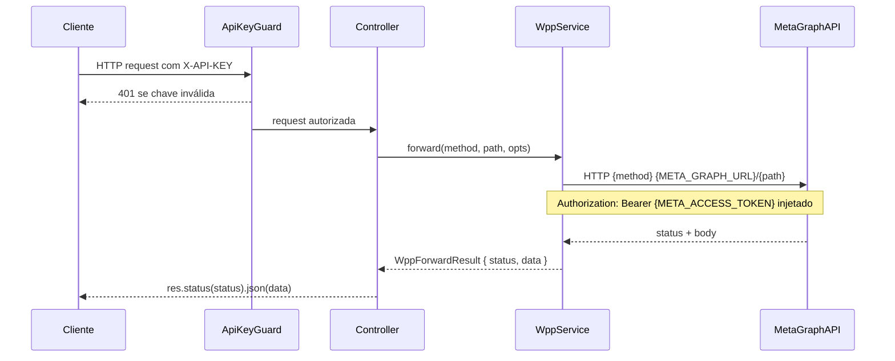

# WhatsApp Meta Adapter — Phone Numbers, Registration, WABA, Subscriptions, Get Started e Business Portfolio

> **Status:** stable
> **Spec:** docs/specs/2026-06-03-wpp-phone-numbers.md
> **Backend:** src/wpp-phone-numbers/

## 1. Visão geral

Módulo de proxy puro que expõe 13 rotas da WhatsApp Cloud API sob o prefixo `/wpp/*`. Não possui persistência própria nem service próprio — todos os handlers delegam a `WppService.forward()` (definido em `wpp-adapter-core`). A autenticação é feita via `ApiKeyGuard` (header `X-API-KEY`). O módulo agrupa cinco controllers segmentados por domínio funcional: números de telefone, registro, WABA, inscrições de app e debug de token.

## 2. API pública (HTTP)

| Método | Rota | Guard | DTO | Forward path | Status |
|---|---|---|---|---|---|
| GET | /wpp/:wabaId/phone_numbers | ApiKeyGuard | — | `${wabaId}/phone_numbers` | 200/401/502 |
| GET | /wpp/:id | ApiKeyGuard | — | `${id}` | 200/401/502 |
| POST | /wpp/:phoneNumberId/request_code | ApiKeyGuard | RequestCodeDto | `${phoneNumberId}/request_code` | 200/401/502 |
| POST | /wpp/:phoneNumberId/verify_code | ApiKeyGuard | VerifyCodeDto | `${phoneNumberId}/verify_code` | 200/401/502 |
| POST | /wpp/:phoneNumberId | ApiKeyGuard | SetTwoStepPinDto | `${phoneNumberId}` | 200/401/502 |
| POST | /wpp/:phoneNumberId/register | ApiKeyGuard | RegisterPhoneDto | `${phoneNumberId}/register` | 200/401/502 |
| POST | /wpp/:phoneNumberId/deregister | ApiKeyGuard | — | `${phoneNumberId}/deregister` | 200/401/502 |
| GET | /wpp/:businessId/owned_whatsapp_business_accounts | ApiKeyGuard | — | `${businessId}/owned_whatsapp_business_accounts` | 200/401/502 |
| GET | /wpp/:businessId/client_whatsapp_business_accounts | ApiKeyGuard | — | `${businessId}/client_whatsapp_business_accounts` | 200/401/502 |
| POST | /wpp/:wabaId/subscribed_apps | ApiKeyGuard | OverrideCallbackDto? | `${wabaId}/subscribed_apps` | 200/401/502 |
| GET | /wpp/:wabaId/subscribed_apps | ApiKeyGuard | — | `${wabaId}/subscribed_apps` | 200/401/502 |
| DELETE | /wpp/:wabaId/subscribed_apps | ApiKeyGuard | — | `${wabaId}/subscribed_apps` | 200/401/502 |
| GET | /wpp/debug_token | ApiKeyGuard | — | `debug_token` | 200/401/502 |

### Exemplos curl

```bash
# Listar números de telefone de uma WABA
curl -H "X-API-KEY: $KEY" \
  "http://localhost:3000/wpp/{wabaId}/phone_numbers"

# Solicitar código de verificação
curl -X POST -H "X-API-KEY: $KEY" -H "Content-Type: application/json" \
  -d '{"code_method":"SMS","locale":"pt_BR"}' \
  "http://localhost:3000/wpp/{phoneNumberId}/request_code"

# Confirmar código de verificação
curl -X POST -H "X-API-KEY: $KEY" -H "Content-Type: application/json" \
  -d '{"code":"123456"}' \
  "http://localhost:3000/wpp/{phoneNumberId}/verify_code"

# Registrar número na Cloud API
curl -X POST -H "X-API-KEY: $KEY" -H "Content-Type: application/json" \
  -d '{"messaging_product":"whatsapp","pin":"123456"}' \
  "http://localhost:3000/wpp/{phoneNumberId}/register"

# Inspecionar access token
curl -H "X-API-KEY: $KEY" \
  "http://localhost:3000/wpp/debug_token"
```

## 3. Superfície do módulo

`WppPhoneNumbersModule` importa `WppModule` (obtém `WppService`) e declara cinco controllers. Não exporta nada. Registrado em `AppModule`.

| Controller | ApiTags | Rotas |
|---|---|---|
| `WppPhoneNumbersController` | WhatsApp — Números de Telefone | GET phone_numbers, GET :id, POST request_code, POST verify_code, POST :phoneNumberId |
| `WppRegistrationController` | WhatsApp — Registro de Número | POST register, POST deregister |
| `WppWabaController` | WhatsApp — WABA | GET owned_whatsapp_business_accounts, GET client_whatsapp_business_accounts |
| `WppSubscriptionsController` | WhatsApp — Inscrições de App | POST/GET/DELETE subscribed_apps |
| `WppGetStartedController` | WhatsApp — Debug Token | GET debug_token |

## 4. Arquitetura



## 5. Modelo de dados

N/A — módulo stateless. Nenhuma tabela criada ou modificada.

## 6. DTOs

| DTO | Campos | Controller |
|---|---|---|
| `RequestCodeDto` | `code_method: string`, `locale: string` | WppPhoneNumbersController |
| `VerifyCodeDto` | `code: string` | WppPhoneNumbersController |
| `SetTwoStepPinDto` | `pin: string` | WppPhoneNumbersController |
| `RegisterPhoneDto` | `messaging_product: string`, `pin: string` | WppRegistrationController |
| `OverrideCallbackDto` | `override_callback_uri?: string`, `verify_token?: string` | WppSubscriptionsController |

Todos os DTOs são validados via `ValidationPipe` global (`whitelist`, `forbidNonWhitelisted`, `transform`). O body do `POST /wpp/:phoneNumberId/deregister` não possui DTO — nenhum body esperado.

## 7. Configuração

Nenhuma variável de ambiente própria. O módulo herda integralmente as envs do `wpp-adapter-core`:

| Env | Descrição |
|---|---|
| `META_GRAPH_URL` | Base URL da Meta Graph API com versão (ex.: `https://graph.facebook.com/v20.0`) |
| `META_ACCESS_TOKEN` | Bearer token injetado automaticamente em cada forward |

## 8. Dependências

| Dependência | Origem | Uso |
|---|---|---|
| `WppModule` | `src/wpp/wpp.module.ts` | Provê `WppService` para todos os controllers |
| `ApiKeyGuard` | `src/api-keys/guards/api-key.guard.ts` | Autenticação via `X-API-KEY` (exportado por `ApiKeysModule`, global via `AppModule`) |
| `WppAuthFilter` | `src/wpp/filters/wpp-auth.filter.ts` | Converte `ForbiddenException` → 401 |

## 9. Pontos de extensão

- Novos endpoints da WhatsApp Cloud API podem ser adicionados criando um novo controller que importa `WppModule` e injeta `WppService` — sem alteração no core.
- `OverrideCallbackDto` aceita campos opcionais; a Meta define o contrato de quais campos são obrigatórios por chamada.

## 10. Erros

| Código | Origem | Causa |
|---|---|---|
| 401 | `ApiKeyGuard` | Header `X-API-KEY` ausente ou chave inválida/revogada |
| 400 | `ValidationPipe` | DTO inválido (campo obrigatório ausente, tipo errado) |
| 502 | `WppService` | Erro de transporte ao chamar a Meta Graph API (timeout, rede) |
| 4xx/5xx | Meta passthrough | Status HTTP retornado pela Meta é repassado íntegro ao cliente |

## 11. Notas operacionais

- Todas as rotas compartilham o prefixo `/wpp/` — conflito de path com `wpp-adapter-core` (`GET /wpp/debug_token`) resolvido pelo fato de `WppGetStartedController` registrar a rota estática `debug_token` (sem parâmetro), que tem prioridade sobre `:id` no NestJS.
- O módulo não consome filas RabbitMQ, não acessa banco de dados e não usa cache Redis.
- Erros da Meta (ex.: token inválido, número não encontrado) são retornados ao cliente com status e body íntegros — sem mapeamento adicional.

## 12. Drift da spec

Nenhum drift identificado. O módulo implementa exatamente o contrato de proxy descrito na spec.

## 13. Changelog

### 2026-06-03 · Implementação inicial
- 5 controllers, 5 DTOs, `WppPhoneNumbersModule`
- 13 endpoints proxy para WhatsApp Cloud API
- Registrado em `AppModule`
