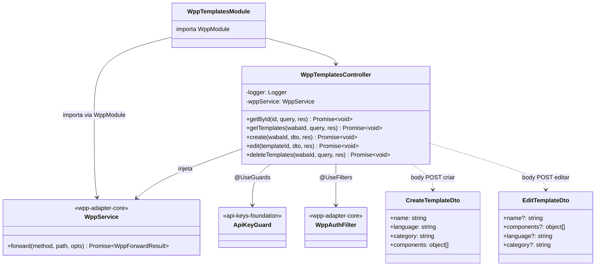
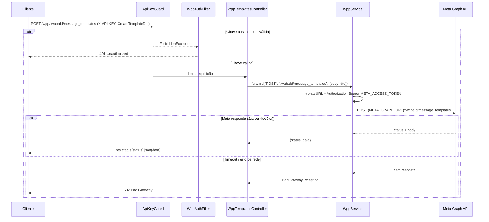
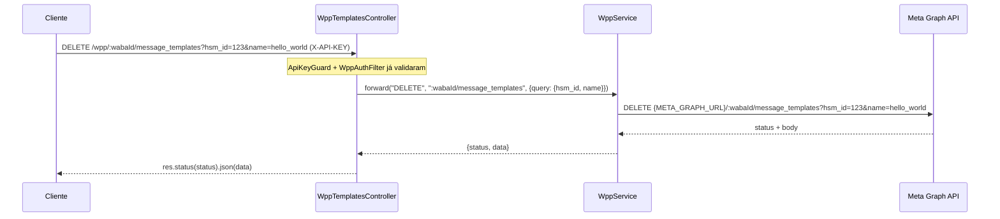

# wpp-templates — Implementação

> **Status:** stable
> **Spec:** docs/specs/wpp-templates.md
> **Backend:** src/wpp-templates/

Feature 4/8 do batch WhatsApp Meta Adapter. Proxy stateless para as operações de **message templates** da WhatsApp Cloud API: leitura (por ID, por nome, listagem, namespace), criação, edição e remoção. Reutiliza integralmente `WppService.forward()` de `wpp-adapter-core` e o `ApiKeyGuard` de `api-keys-foundation`. Não persiste dados — toda a fonte de verdade é a Meta.

## 1. Visão Geral

O `WppTemplatesModule` expõe um controller (`@Controller('wpp')`) com cinco handlers que cobrem as oito operações de templates da Meta Graph API. Cada handler traduz path/query/body em uma chamada `WppService.forward()` e devolve o resultado intacto ao caller (transparência de status + body).

Destaques arquiteturais:

- **Handler unificado por padrão de rota**: `GET :id` resolve dois casos (`fields=message_template_namespace` → namespace da WABA; sem `fields` → template por ID) via ramificação interna na query. Evita colisão de rota.
- **Handler unificado para list/search**: `GET :wabaId/message_templates` repassa o objeto `query` completo, cobrindo `?name=` e sem parâmetro.
- **Handler unificado para delete**: `DELETE :wabaId/message_templates` repassa o objeto `query` completo, cobrindo `?name=` e `?hsm_id=&name=`.
- **ValidationPipe frouxo**: `whitelist: false` — campos extras do body não são removidos (necessário para proxy).
- **Nenhuma variável de ambiente nova**: usa `META_GRAPH_URL` e `META_ACCESS_TOKEN` já providos pelo `WppService`.

## 2. API HTTP Pública

### Tabela de Endpoints

| Método | Rota | Auth | Handler | Descrição |
|---|---|---|---|---|
| `GET` | `/wpp/:id` | `X-API-KEY` | `getById` | Template por ID ou namespace da WABA (ramifica por `?fields`) |
| `GET` | `/wpp/:wabaId/message_templates` | `X-API-KEY` | `getTemplates` | Lista todos ou busca por nome (`?name=`) |
| `POST` | `/wpp/:wabaId/message_templates` | `X-API-KEY` | `create` | Cria template na WABA |
| `POST` | `/wpp/:templateId` | `X-API-KEY` | `edit` | Edita template existente |
| `DELETE` | `/wpp/:wabaId/message_templates` | `X-API-KEY` | `deleteTemplates` | Remove por nome (`?name=`) ou por ID (`?hsm_id=&name=`) |

---

### GET /wpp/:id

Resolve dois casos conforme presença de `?fields`:

- Sem `fields`: forward `GET {META_GRAPH_URL}/:id` — busca template por ID.
- Com `fields=message_template_namespace`: forward `GET {META_GRAPH_URL}/:id?fields=message_template_namespace` — retorna o namespace da WABA.

**Path params:**

| Parâmetro | Descrição |
|---|---|
| `id` | ID do template (`<TEMPLATE_ID>`) ou ID da WABA (`{{WABA-ID}}`) |

**Query params:**

| Parâmetro | Obrigatório | Descrição |
|---|---|---|
| `fields` | não | `message_template_namespace` para consulta de namespace; omitir para busca por ID |

**Respostas:**

| Status | Condição |
|---|---|
| `200` | Meta respondeu (objeto do template ou `{ message_template_namespace, id }`) |
| `401` | `X-API-KEY` ausente ou inválida |
| `404` | Template ou WABA inexistente (repassado da Meta) |
| `502` | Erro de transporte ao contatar a Meta |

**Exemplo curl — template por ID:**
```bash
curl -X GET "http://localhost:3000/wpp/tpl123" \
  -H "X-API-KEY: <SUA_API_KEY>"
```

**Exemplo curl — namespace da WABA:**
```bash
curl -X GET "http://localhost:3000/wpp/waba456?fields=message_template_namespace" \
  -H "X-API-KEY: <SUA_API_KEY>"
```

---

### GET /wpp/:wabaId/message_templates

Lista todos os templates ou filtra por nome. O objeto `query` inteiro é repassado à Meta.

**Path params:**

| Parâmetro | Descrição |
|---|---|
| `wabaId` | ID da WABA (`{{WABA-ID}}`) |

**Query params:**

| Parâmetro | Obrigatório | Descrição |
|---|---|---|
| `name` | não | Nome do template para filtrar |

**Respostas:**

| Status | Condição |
|---|---|
| `200` | `{ data: [...], paging: {...} }` (lista) ou `{ data: [...] }` (busca por nome) |
| `401` | `X-API-KEY` ausente ou inválida |
| `502` | Erro de transporte |

**Exemplo curl:**
```bash
curl -X GET "http://localhost:3000/wpp/waba456/message_templates?name=hello_world" \
  -H "X-API-KEY: <SUA_API_KEY>"
```

---

### POST /wpp/:wabaId/message_templates

Cria um template na WABA. Body repassado íntegro.

**Path params:**

| Parâmetro | Descrição |
|---|---|
| `wabaId` | ID da WABA |

**Body:** `CreateTemplateDto` (ver §6)

**Respostas:**

| Status | Condição |
|---|---|
| `200` / `201` | `{ id, status, category }` (da Meta) |
| `400` | Erro de validação repassado da Meta |
| `401` | `X-API-KEY` ausente ou inválida |
| `502` | Erro de transporte |

**Exemplo curl:**
```bash
curl -X POST "http://localhost:3000/wpp/waba456/message_templates" \
  -H "X-API-KEY: <SUA_API_KEY>" \
  -H "Content-Type: application/json" \
  -d '{"name":"hello_world","language":"pt_BR","category":"UTILITY","components":[{"type":"BODY","text":"Olá {{1}}"}]}'
```

---

### POST /wpp/:templateId

Edita um template existente. Body repassado íntegro.

**Path params:**

| Parâmetro | Descrição |
|---|---|
| `templateId` | ID do template (`<TEMPLATE_ID>`) |

**Body:** `EditTemplateDto` (ver §6)

**Respostas:**

| Status | Condição |
|---|---|
| `200` | `{ success: true }` (da Meta) |
| `400` | Erro de validação repassado da Meta |
| `401` | `X-API-KEY` ausente ou inválida |
| `404` | Template inexistente (repassado da Meta) |
| `502` | Erro de transporte |

**Exemplo curl:**
```bash
curl -X POST "http://localhost:3000/wpp/tpl123" \
  -H "X-API-KEY: <SUA_API_KEY>" \
  -H "Content-Type: application/json" \
  -d '{"components":[{"type":"BODY","text":"Texto atualizado {{1}}"}]}'
```

---

### DELETE /wpp/:wabaId/message_templates

Remove template(s). O objeto `query` inteiro é repassado.

- Com `?name=<NOME>`: remove todos os templates com aquele nome (todas as línguas).
- Com `?hsm_id=<ID>&name=<NOME>`: remove o template específico por ID.

**Path params:**

| Parâmetro | Descrição |
|---|---|
| `wabaId` | ID da WABA |

**Query params:**

| Parâmetro | Obrigatório | Descrição |
|---|---|---|
| `name` | recomendado | Nome do template |
| `hsm_id` | não | ID do template (HSM) para remoção por ID |

**Respostas:**

| Status | Condição |
|---|---|
| `200` | `{ success: true }` (da Meta) |
| `401` | `X-API-KEY` ausente ou inválida |
| `502` | Erro de transporte |

**Exemplo curl — remoção por nome:**
```bash
curl -X DELETE "http://localhost:3000/wpp/waba456/message_templates?name=hello_world" \
  -H "X-API-KEY: <SUA_API_KEY>"
```

**Exemplo curl — remoção por ID:**
```bash
curl -X DELETE "http://localhost:3000/wpp/waba456/message_templates?hsm_id=123&name=hello_world" \
  -H "X-API-KEY: <SUA_API_KEY>"
```

## 3. Superfície do Módulo

```
WppTemplatesModule
  imports:     WppModule (provê WppService)
  controllers: WppTemplatesController
  providers:   (nenhum próprio)
  exports:     (nenhum)
```

`ApiKeyGuard` é referenciado via `@UseGuards(ApiKeyGuard)` importado diretamente de `src/api-keys/guards/api-key.guard`. `WppAuthFilter` é aplicado via `@UseFilters(WppAuthFilter)`. O `ValidationPipe` é instanciado localmente no controller com `{ whitelist: false, transform: true }`.

## 4. Arquitetura

### Diagrama de Classes



### Diagrama de Sequência — Criação de Template



### Diagrama de Sequência — Remoção por ID



## 5. Data Model

N/A — módulo stateless, sem persistência local. Nenhuma tabela Prisma adicionada. Toda a fonte de verdade de templates reside na Meta (WhatsApp Cloud API).

## 6. DTOs

### CreateTemplateDto

Arquivo: `src/wpp-templates/dto/create-template.dto.ts`

| Campo | Tipo | Obrigatório | Validadores | Descrição |
|---|---|---|---|---|
| `name` | `string` | sim | `@IsString` | Nome do template (identificador único dentro da WABA) |
| `language` | `string` | sim | `@IsString` | Código de idioma no formato Meta (ex.: `pt_BR`, `en_US`) |
| `category` | `string` | sim | `@IsString` | Categoria: `AUTHENTICATION`, `MARKETING` ou `UTILITY`. Outros valores não são barrados localmente (passthrough). |
| `components` | `object[]` | sim | `@IsArray` | Array de componentes (HEADER, BODY, FOOTER, BUTTONS). Shape interno não validado — passthrough para a Meta. |

### EditTemplateDto

Arquivo: `src/wpp-templates/dto/edit-template.dto.ts`

| Campo | Tipo | Obrigatório | Validadores | Descrição |
|---|---|---|---|---|
| `name` | `string` | não | `@IsOptional @IsString` | Novo nome do template (a Meta pode restringir em alguns casos — passthrough). |
| `components` | `object[]` | não | `@IsOptional @IsArray` | Array de componentes atualizado. Shape interno não validado — passthrough. |
| `language` | `string` | não | `@IsOptional @IsString` | Código de idioma atualizado. |
| `category` | `string` | não | `@IsOptional @IsString` | Categoria atualizada. Passthrough. |

## 7. Configuração

Sem variáveis de ambiente próprias. Usa as já declaradas por `wpp-adapter-core`:

| Env | Obrigatória | Descrição |
|---|---|---|
| `META_GRAPH_URL` | sim | Base URL com versão embutida (ex.: `https://graph.facebook.com/v20.0`) |
| `META_ACCESS_TOKEN` | sim | Bearer token do app Meta; injetado por `WppService`; nunca exposto ao caller |

## 8. Dependências

| Dependência | Módulo / Arquivo | Finalidade |
|---|---|---|
| `WppModule` | `src/wpp/wpp.module.ts` | Provê `WppService` (forward, injeção de Bearer, mapeamento de erros) |
| `WppService` | `src/wpp/wpp.service.ts` | Executa chamadas de proxy à Meta Graph API |
| `ApiKeyGuard` | `src/api-keys/guards/api-key.guard.ts` | Valida `X-API-KEY` de entrada |
| `WppAuthFilter` | `src/wpp/filters/wpp-auth.filter.ts` | Converte `ForbiddenException` → `401` |

## 9. Pontos de Extensão

Este módulo é um consumidor final de `WppService.forward()`. Não expõe interfaces nem tokens próprios. Novas operações de template devem ser adicionadas como novos handlers em `WppTemplatesController`, seguindo o padrão:

```typescript
const result = await this.wppService.forward('METHOD', 'path/sub-path', { body?, query? });
res.status(result.status).json(result.data);
```

## 10. Mapeamento de Erros

| Condição | Exceção / Resultado | Status ao Caller |
|---|---|---|
| `X-API-KEY` ausente ou inválida | `ForbiddenException` (ApiKeyGuard) → `WppAuthFilter` → `UnauthorizedException` | `401` |
| Meta responde 4xx / 5xx | `WppForwardResult` com status e body da Meta (passthrough) | mesmo status da Meta |
| `category` fora do enum Meta | `400` repassado da Meta (não barrado localmente) | `400` |
| `components[]` inválido para a Meta | `400` repassado da Meta | `400` |
| Template / WABA inexistente | `404` repassado da Meta | `404` |
| Timeout / erro de rede | `BadGatewayException` (via `WppService`) | `502` |

## 11. Notas Operacionais

- Todos os logs usam `Logger` do NestJS. São logados: método, path, e status de retorno. Body de templates e `Authorization` nunca são logados.
- `ValidationPipe({ whitelist: false })` é instanciado localmente no controller (classe), sobrescrevendo a pipe global para permitir campos extras no body (necessário para proxy stateless).
- A resolução da colisão entre `GET /wpp/:id` (template por ID) e `GET /wpp/:id?fields=` (namespace da WABA) é feita dentro do handler `getById` pela leitura de `query.fields`. Não há duas rotas separadas — um único handler ramifica.
- `DELETE /wpp/:wabaId/message_templates` cobre remoção por nome e por ID através do mesmo handler. O conteúdo de `query` determina o comportamento na Meta.
- O módulo é stateless: sem cache, sem fila própria, sem tabela.

## §12. Desvios em Relação ao Spec

- **Spec §7 (API contract — colisão de rota)**: o spec descrevia as rotas `GET /wpp/:templateId` e `GET /wpp/:wabaId?fields=...` separadamente, com nota de colisão e pergunta em aberto (§14). A implementação resolve com um único handler `getById(@Param('id'))` que ramifica internamente pela presença de `query.fields`. O comportamento funcional é idêntico ao especificado; a diferença é apenas estrutural (um handler vs. dois).
- **Spec §8 (Module boundaries — importação do ApiKeysModule)**: o spec previa que `WppTemplatesModule` importasse `WppModule` para `WppService` e usasse `ApiKeyGuard` via `WppModule` ou import direto. A implementação não importa `ApiKeysModule` explicitamente em `WppTemplatesModule` — o guard é importado diretamente do arquivo `src/api-keys/guards/api-key.guard.ts` e está disponível no escopo da aplicação. Comportamento funcional idêntico.
- **Spec §5 (NFR-3 — ValidationPipe)**: o spec indicava `whitelist`/`forbidNonWhitelisted` não devem barrar campos extras. A implementação aplica `ValidationPipe({ whitelist: false, transform: true })` via `@UsePipes` na classe do controller, consistente com o requisito.

## Changelog

### 2026-06-03 — Feature implementada (wpp-templates, Feature 4/8 do batch WhatsApp Meta Adapter).
