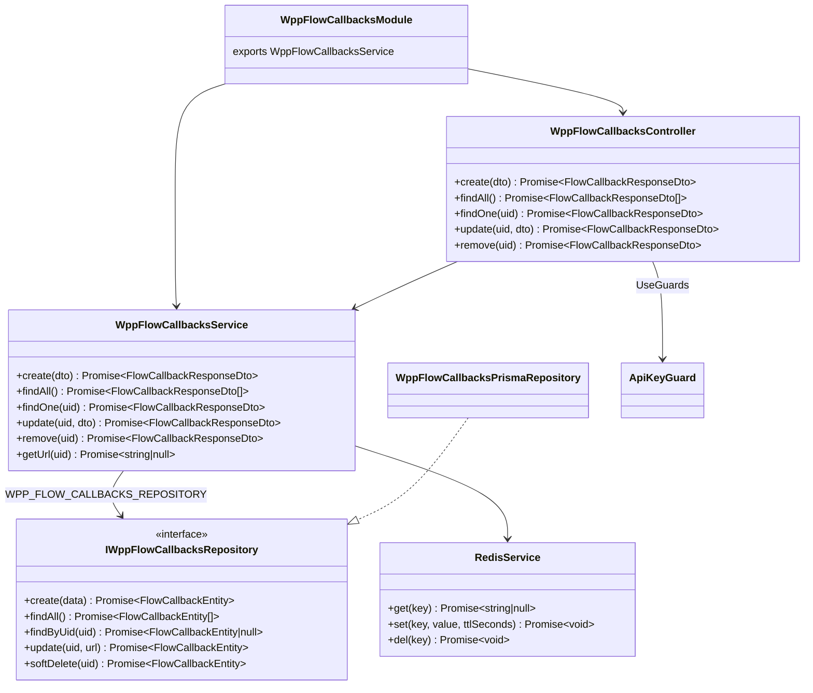
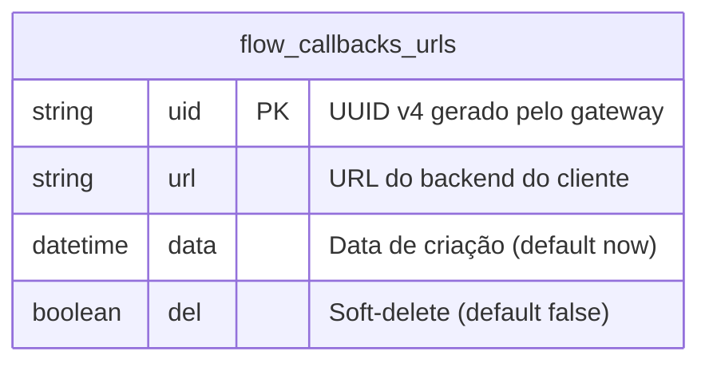
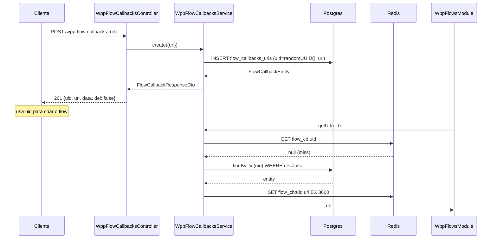
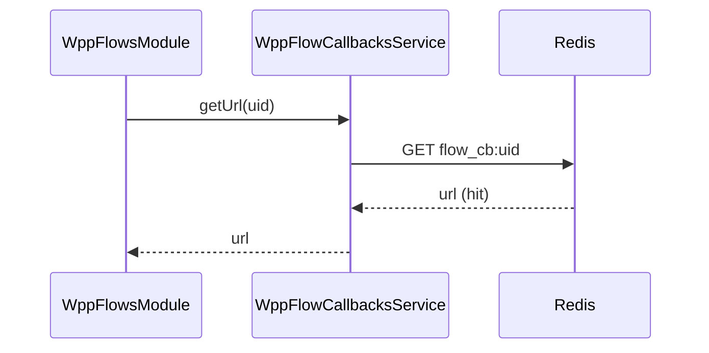
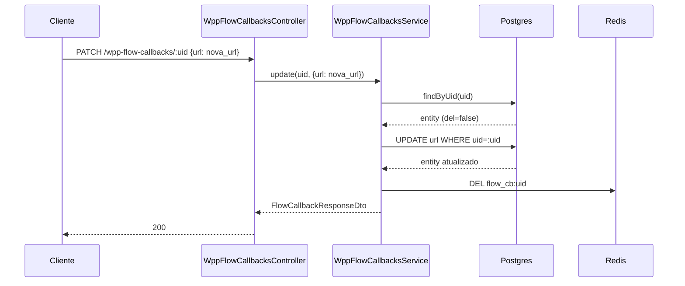
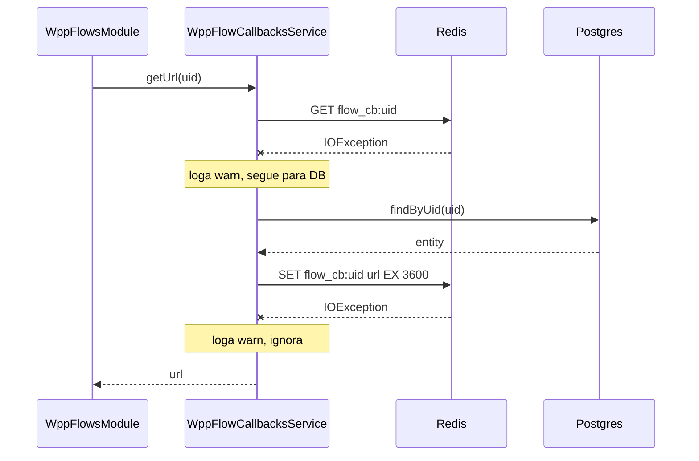

# WhatsApp Meta Adapter — Flow Callbacks

> Status: stable
> Spec: [docs/specs/2026-06-05-wpp-flow-callbacks.md](../specs/2026-06-05-wpp-flow-callbacks.md)
> Backend: `src/wpp-flow-callbacks/`

## 1. Overview

Provisiona o gerenciamento da tabela `flow_callbacks_urls`: CRUD de registros `uid → url`, cache Redis com TTL de 1 hora e serviço de lookup `getUrl(uid)` exportado para consumo por `wpp-flows`.

Comportamentos-chave:

- O `uid` (UUID v4) é gerado pelo gateway no momento do `POST`; o cliente nunca informa um UID próprio.
- O registro é independente de WABA ou flow — não há FK para entidades Meta.
- O mesmo UID pode ser referenciado em múltiplos flows.
- Soft-delete: `DELETE` apenas seta `del = true`; hard-delete não está previsto nesta feature.
- `getUrl(uid)` é o contrato público consumido por `WppFlowsModule`: consulta Redis primeiro; em miss, cai no DB e grava o resultado no cache (TTL 3600 s). Se o Redis estiver indisponível, o fallback vai direto ao DB sem propagar erro ao chamador.
- `PATCH` e `DELETE` invalidam o cache imediatamente via `DEL flow_cb:<uid>`, garantindo consistência sem lag.

## 2. API pública (HTTP)

Todas as rotas exigem `X-API-KEY` válida validada pelo `ApiKeyGuard`.

| Método | Rota | Status OK | Body request | Body response |
|---|---|---|---|---|
| `POST` | `/wpp-flow-callbacks` | `201` | `CreateFlowCallbackDto` | `FlowCallbackResponseDto` |
| `GET` | `/wpp-flow-callbacks` | `200` | — | `FlowCallbackResponseDto[]` |
| `GET` | `/wpp-flow-callbacks/:uid` | `200` | — | `FlowCallbackResponseDto` |
| `PATCH` | `/wpp-flow-callbacks/:uid` | `200` | `UpdateFlowCallbackDto` | `FlowCallbackResponseDto` |
| `DELETE` | `/wpp-flow-callbacks/:uid` | `200` | — | `FlowCallbackResponseDto` |

### POST /wpp-flow-callbacks

Cria um novo registro `uid → url`. O `uid` é gerado internamente (`randomUUID()`).

```bash
curl -X POST http://localhost:3000/wpp-flow-callbacks \
  -H "X-API-KEY: $API_KEY" \
  -H "Content-Type: application/json" \
  -d '{"url": "https://exemplo.com/webhook/flow"}'
# 201
# {
#   "uid": "550e8400-e29b-41d4-a716-446655440000",
#   "url": "https://exemplo.com/webhook/flow",
#   "data": "2026-06-05T12:00:00.000Z",
#   "del": false
# }
```

Erros: `400` (URL inválida ou sem protocolo http/https) · `401` (key ausente/inválida).

### GET /wpp-flow-callbacks

Retorna todos os registros com `del = false`, ordenados por `data` DESC.

```bash
curl http://localhost:3000/wpp-flow-callbacks \
  -H "X-API-KEY: $API_KEY"
# 200
# [
#   {
#     "uid": "550e8400-e29b-41d4-a716-446655440000",
#     "url": "https://exemplo.com/webhook/flow",
#     "data": "2026-06-05T12:00:00.000Z",
#     "del": false
#   }
# ]
```

Erros: `401`.

### GET /wpp-flow-callbacks/:uid

Busca um registro pelo UID. Retorna `404` se não existir ou se `del = true`.

```bash
curl http://localhost:3000/wpp-flow-callbacks/550e8400-e29b-41d4-a716-446655440000 \
  -H "X-API-KEY: $API_KEY"
# 200
# { "uid": "...", "url": "https://exemplo.com/webhook/flow", "data": "...", "del": false }
```

Erros: `401` · `404`.

### PATCH /wpp-flow-callbacks/:uid

Atualiza a URL de destino e invalida o cache Redis `flow_cb:<uid>`.

```bash
curl -X PATCH http://localhost:3000/wpp-flow-callbacks/550e8400-e29b-41d4-a716-446655440000 \
  -H "X-API-KEY: $API_KEY" \
  -H "Content-Type: application/json" \
  -d '{"url": "https://novo.exemplo.com/webhook/flow"}'
# 200
# { "uid": "...", "url": "https://novo.exemplo.com/webhook/flow", "data": "...", "del": false }
```

Erros: `400` · `401` · `404`.

### DELETE /wpp-flow-callbacks/:uid

Aplica soft-delete (`del = true`) e invalida o cache Redis `flow_cb:<uid>`.

```bash
curl -X DELETE http://localhost:3000/wpp-flow-callbacks/550e8400-e29b-41d4-a716-446655440000 \
  -H "X-API-KEY: $API_KEY"
# 200
# { "uid": "...", "url": "https://exemplo.com/webhook/flow", "data": "...", "del": true }
```

Erros: `401` · `404`.

### FlowCallbackResponseDto

| Campo | Tipo | Notas |
|---|---|---|
| `uid` | `string` | UUID v4 gerado no `POST` |
| `url` | `string` | URL do backend do cliente |
| `data` | `string` | ISO 8601 — Prisma retorna `Date`; `toDto()` chama `.toISOString()` |
| `del` | `boolean` | `true` após soft-delete |

## 3. Contrato do serviço

### WppFlowCallbacksService

| Método | Assinatura | Comportamento |
|---|---|---|
| `create` | `create(dto: CreateFlowCallbackDto): Promise<FlowCallbackResponseDto>` | Gera UUID, persiste e retorna DTO. Não grava no cache (cache é populado sob demanda em `getUrl`). |
| `findAll` | `findAll(): Promise<FlowCallbackResponseDto[]>` | Delega ao repositório (filtra `del = false`, ordena por `date DESC`). |
| `findOne` | `findOne(uid: string): Promise<FlowCallbackResponseDto>` | Lança `NotFoundException` se `!entity || entity.del`. |
| `update` | `update(uid: string, dto: UpdateFlowCallbackDto): Promise<FlowCallbackResponseDto>` | Valida existência → atualiza DB → `DEL flow_cb:<uid>` no Redis. |
| `remove` | `remove(uid: string): Promise<FlowCallbackResponseDto>` | Valida existência → `softDelete` no DB → `DEL flow_cb:<uid>` no Redis. |
| `getUrl` | `getUrl(uid: string): Promise<string \| null>` | **Exportado para `wpp-flows`.** Ver §4. |

#### getUrl(uid)

Este método é o ponto de integração com `WppFlowsModule`. A sequência exata conforme o código:

1. Tenta `redis.get('flow_cb:<uid>')`. Em caso de exceção de I/O, loga `warn` e segue para o passo 2 (fallback silencioso).
2. Se `cached !== null`, retorna a URL (cache hit).
3. Consulta `repo.findByUid(uid)`. Se `!entity || entity.del`, retorna `null`.
4. Tenta `redis.set('flow_cb:<uid>', entity.url, 3600)`. Em caso de exceção, loga `warn` e segue.
5. Retorna `entity.url`.

Retorno `null` significa que o UID não existe ou foi deletado — o chamador em `wpp-flows` deve tratar com `404`.

## 4. Cache Redis

| Atributo | Valor |
|---|---|
| Chave | `flow_cb:<uid>` (string simples) |
| Valor | URL do backend (string) |
| TTL | 3600 segundos (1 hora) |
| Operação de escrita | `RedisService.set(key, value, ttlSeconds)` — executa `SET key value EX ttlSeconds` via ioredis |
| Operação de leitura | `RedisService.get(key)` |
| Invalidação | `RedisService.del(key)` — executado em `update` e `remove` |
| Fallback | Redis indisponível em `getUrl` → DB direto; não propaga erro |

`RedisService.set(key, value, ttlSeconds)` foi adicionado nesta feature. Internamente executa `client.set(key, value, 'EX', ttlSeconds)` via ioredis.

O cache **não** é populado no `create` — é preenchido lazily na primeira chamada a `getUrl`. Registros soft-deletados nunca ficam stale no cache: `remove` invalida imediatamente.

## 5. Fronteiras do módulo

### WppFlowCallbacksModule

```
imports:   PrismaModule · RedisModule · ApiKeysModule
controllers: WppFlowCallbacksController
providers: WppFlowCallbacksService · WppAuthFilter · Logger
           WPP_FLOW_CALLBACKS_REPOSITORY → WppFlowCallbacksPrismaRepository (useClass)
exports:  WppFlowCallbacksService
```

`WppFlowCallbacksService` é exportado para que `WppFlowsModule` possa injetá-lo diretamente e chamar `getUrl(uid)` sem necessidade de HTTP interno.

### Diagrama de classes



### Token de injeção

| Constante | Valor | Arquivo |
|---|---|---|
| `WPP_FLOW_CALLBACKS_REPOSITORY` | `'WPP_FLOW_CALLBACKS_REPOSITORY'` | `src/wpp-flow-callbacks/constants/wpp-flow-callbacks-tokens.constants.ts` |

## 6. Modelo de dados



Modelo Prisma (nome do modelo coincide com nome da tabela; sem `@@map`):

```prisma
model flow_callbacks_urls {
  uid  String   @id @default(uuid())
  url  String
  data DateTime @default(now())
  del  Boolean  @default(false)
}
```

**Observacao:** a migration `add_flow_callbacks_urls` precisa ser aplicada com `npx prisma migrate dev --name add_flow_callbacks_urls` em ambiente com banco ativo antes de usar o módulo.

## 7. Sequências de execução

### Criar callback e obter URL (cache miss)



### Lookup com cache hit



### Atualizar URL e invalidar cache



### Redis indisponível em getUrl (fallback)



## 8. Variáveis de ambiente

Nenhuma variável nova. O módulo reutiliza:

| Env | Usada por |
|---|---|
| `DATABASE_URL` | `PrismaModule` (já obrigatória) |
| `REDIS_URL` | `RedisModule` (já obrigatória) |

## 9. Erros

| Exceção | Status HTTP | Gatilho |
|---|---|---|
| `UnauthorizedException` | 401 | `ApiKeyGuard`: `X-API-KEY` ausente ou inválida |
| `BadRequestException` (ValidationPipe) | 400 | `url` inválida ou sem protocolo http/https em `CreateFlowCallbackDto` ou `UpdateFlowCallbackDto` |
| `NotFoundException` | 404 | `findOne`, `update`, `remove`: UID não encontrado ou `del = true` |

## 10. Notas operacionais

- **URLs não logadas em nível INFO:** o `logger.log` dos métodos registra apenas o `uid`. A URL nunca aparece em logs de nível INFO.
- **getUrl é thread-safe por design:** não há estado compartilhado entre chamadas; Redis e DB são consultados a cada invocação independente.
- **Sem hard-delete:** registros deletados (`del = true`) permanecem na tabela indefinidamente. Hard-delete automático (cron) está fora do escopo desta feature.
- **UID nunca reutilizado:** sempre `INSERT` com novo UUID v4 gerado por `randomUUID()`. Sem upsert.

## 11. Spec drift

Nenhum. A implementação está alinhada com todas as 10 ACs definidas em `docs/specs/2026-06-05-wpp-flow-callbacks.md`. O `RedisService.set(key, value, ttlSeconds)` estava indicado como adição necessária na spec e foi de fato implementado conforme descrito.

## 12. Changelog

| Data | Descrição |
|---|---|
| 2026-06-05 | Implementação inicial: `WppFlowCallbacksModule`, CRUD, cache Redis, `getUrl(uid)`, `RedisService.set`. Doc criada. |
| 2026-06-05 | **hotfix `hotfix-flow-callback-url-model`:** modelo Prisma renomeado de `FlowCallbackUrl` (PascalCase + `@@map`) para `flow_callbacks_urls` (snake_case, sem `@@map`), alinhando a convenção do codebase (nome do modelo = nome da tabela). Accessor no repositório atualizado de `prisma.flowCallbackUrl` para `prisma.flow_callbacks_urls`. Migration no-op criada (`20260605000000_rename_flow_callback_url_to_pt`). Sem DDL — tabela já se chamava `flow_callbacks_urls`. Doc atualizada para refletir o nome correto do modelo. |
| 2026-06-05 | **hotfix `hotfix-date-to-data-rename`:** campo `date` renomeado para `data` em `FlowCallbackEntity`, `FlowCallbackResponseDto` e no schema Prisma `flow_callbacks_urls`. Migration `20260605000001_rename_date_to_data` aplica `ALTER TABLE flow_callbacks_urls RENAME COLUMN "date" TO "data"`. Doc atualizada (ERD, Prisma block, exemplos cURL, tabela DTO). |
