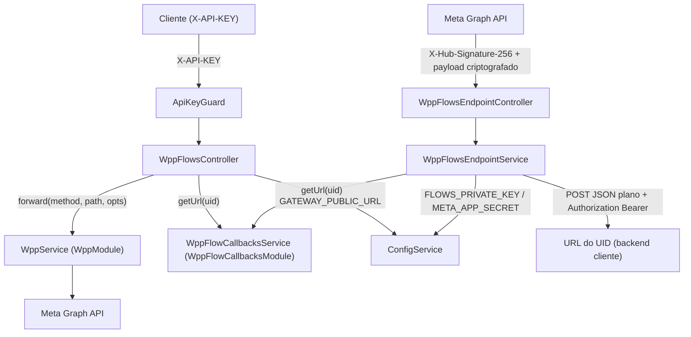
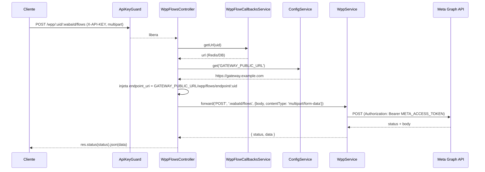
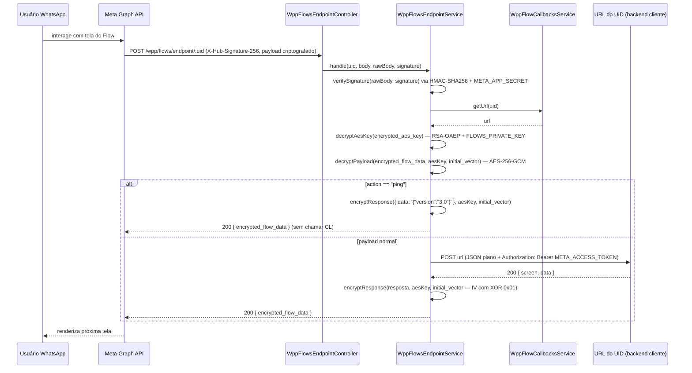
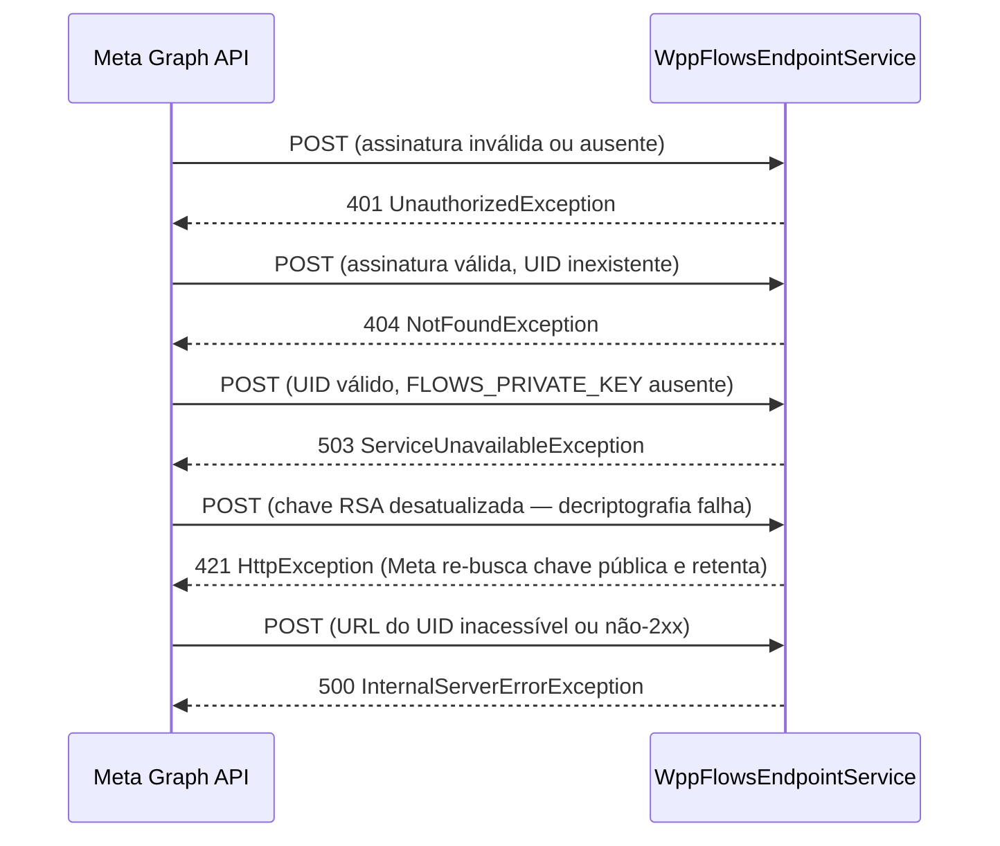

# WhatsApp Meta Adapter — Flows

> Status: stable | Spec: [docs/specs/2026-06-03-wpp-flows.md](../specs/2026-06-03-wpp-flows.md) | Backend: `src/wpp-flows/`

## 1. Visão Geral

Módulo `WppFlowsModule` que expõe dois conjuntos de rotas:

1. **Rotas de gerenciamento** (14 handlers em `WppFlowsController`) — proxy autenticado por `ApiKeyGuard` para a WhatsApp Flows API. Inclui variantes com `:uid` que injetam `endpoint_uri` automaticamente no body antes do forward.
2. **Endpoint criptografado** (`WppFlowsEndpointController` + `WppFlowsEndpointService`) — recebe payloads cifrados pela Meta via `POST /wpp/flows/endpoint/:uid`, verifica assinatura HMAC-SHA256, descriptografa com RSA-OAEP + AES-256-GCM, encaminha JSON plano ao URL registrado no UID e re-criptografa a resposta com IV invertido.

O módulo não possui persistência local: flows vivem na Meta e o lookup UID → URL é delegado a `WppFlowCallbacksService` (Redis/DB).

## 2. API Pública (HTTP)

### Tabela de endpoints

| Método | Rota | Guard | Content-Type | Descrição |
|---|---|---|---|---|
| POST | `/wpp/:wabaId/flows` | ApiKeyGuard | multipart/form-data | Criar flow |
| POST | `/wpp/:uid/:wabaId/flows` | ApiKeyGuard | multipart/form-data | Criar flow dinâmico (injeta `endpoint_uri`) |
| POST | `/wpp/:wabaId/migrate_flows` | ApiKeyGuard | multipart/form-data | Migrar flows |
| POST | `/wpp/:uid/:wabaId/migrate_flows` | ApiKeyGuard | multipart/form-data | Migrar flows dinâmico (injeta `endpoint_uri`) |
| GET | `/wpp/:wabaId/flows` | ApiKeyGuard | — | Listar flows do WABA |
| POST | `/wpp/:flowId/assets` | ApiKeyGuard | multipart/form-data | Enviar asset do flow |
| POST | `/wpp/:flowId/publish` | ApiKeyGuard | — | Publicar flow |
| POST | `/wpp/:flowId/deprecate` | ApiKeyGuard | — | Deprecar flow |
| POST | `/wpp/:flowId` | ApiKeyGuard | multipart/form-data | Atualizar metadados do flow (proxy puro) |
| POST | `/wpp/:uid/:flowId` | ApiKeyGuard | multipart/form-data | Atualizar metadados do flow (injeta `endpoint_uri`) |
| GET | `/wpp/:flowId/assets` | ApiKeyGuard | — | Listar assets do flow |
| GET | `/wpp/:phoneNumberId/whatsapp_business_encryption` | ApiKeyGuard | — | Obter criptografia de negócios |
| POST | `/wpp/:phoneNumberId/whatsapp_business_encryption` | ApiKeyGuard | multipart/form-data | Configurar criptografia de negócios |
| POST | `/wpp/:phoneNumberId/messages` | ApiKeyGuard | JSON | Enviar mensagem (incluindo Flow interativo) |
| POST | `/wpp/:wabaId/message_templates` | ApiKeyGuard | JSON | Criar template de mensagem |
| GET | `/wpp/:flowId` | ApiKeyGuard | — | Obter flow (também serve métricas via `?fields=`) |
| DELETE | `/wpp/:flowId` | ApiKeyGuard | — | Deletar flow |
| POST | `/wpp/flows/endpoint/:uid` | X-Hub-Signature-256 | JSON | Endpoint criptografado (chamado pela Meta) |

### Detalhamento por endpoint

#### POST /wpp/:wabaId/flows
- **Auth**: `X-API-KEY` (ApiKeyGuard)
- **Body**: `multipart/form-data` — `name`, `categories`, `clone_flow_id?`, `endpoint_uri?`
- **Forward**: `POST ${META_GRAPH_URL}/:wabaId/flows` (multipart)
- **Responses**: `200` / `401` / `502`

```bash
curl -X POST https://gateway.example.com/wpp/waba-001/flows \
  -H "X-API-KEY: sua-chave" \
  -F "name=Meu Flow" \
  -F "categories=OTHER"
```

#### POST /wpp/:uid/:wabaId/flows
- **Auth**: `X-API-KEY` (ApiKeyGuard)
- **Body**: `multipart/form-data` (sem `endpoint_uri` — gateway injeta)
- **Comportamento**: resolve UID via `WppFlowCallbacksService.getUrl(uid)`; se não encontrado → `404`; injeta `endpoint_uri = GATEWAY_PUBLIC_URL/wpp/flows/endpoint/:uid`; forward multipart
- **Responses**: `200` / `401` / `404` / `502`

```bash
curl -X POST https://gateway.example.com/wpp/uid-123/waba-001/flows \
  -H "X-API-KEY: sua-chave" \
  -F "name=Meu Flow Dinâmico" \
  -F "categories=OTHER"
```

#### POST /wpp/flows/endpoint/:uid
- **Auth**: `X-Hub-Signature-256: sha256=<hmac-sha256>` (sem ApiKeyGuard)
- **Body**: `FlowEndpointRequestDto` — `encrypted_flow_data`, `encrypted_aes_key`, `initial_vector` (todos base64)
- **Comportamento**: verifica HMAC → busca URL do UID → descriptografa AES key (RSA-OAEP + `FLOWS_PRIVATE_KEY`) → descriptografa payload (AES-256-GCM) → ping shortcut ou forward JSON ao URL do UID → re-criptografa resposta (IV com XOR 0x01 no primeiro byte) → `200 { encrypted_flow_data }`
- **Responses**: `200` / `401` / `404` / `421` / `503` / `500`

```bash
# Normalmente chamado diretamente pela Meta — não chamado manualmente
curl -X POST https://gateway.example.com/wpp/flows/endpoint/uid-123 \
  -H "x-hub-signature-256: sha256=<hmac>" \
  -H "Content-Type: application/json" \
  -d '{"encrypted_flow_data":"...","encrypted_aes_key":"...","initial_vector":"..."}'
```

#### GET /wpp/:flowId
- **Auth**: `X-API-KEY`
- **Query**: `fields` (opcional) — repassado intacto; suporta sintaxe Meta com parênteses para métricas: `fields=metric.name(ENDPOINT_REQUEST_COUNT)`
- **Forward**: `GET ${META_GRAPH_URL}/:flowId?fields=...`
- **Responses**: `200` / `401` / `502`

```bash
# Obter flow
curl https://gateway.example.com/wpp/flow-001 -H "X-API-KEY: sua-chave"

# Métricas
curl "https://gateway.example.com/wpp/flow-001?fields=metric.name(ENDPOINT_REQUEST_COUNT)" \
  -H "X-API-KEY: sua-chave"
```

## 3. Superfície do Módulo

```
src/wpp-flows/
├── wpp-flows.module.ts                    # WppFlowsModule
├── wpp-flows.controller.ts                # WppFlowsController (14 handlers + rotas com :uid)
├── wpp-flows-endpoint.controller.ts       # WppFlowsEndpointController (POST /wpp/flows/endpoint/:uid)
├── wpp-flows-endpoint.service.ts          # WppFlowsEndpointService (decrypt/forward/re-encrypt)
└── dto/
    ├── flow-endpoint-request.dto.ts       # FlowEndpointRequestDto
    └── flow-endpoint-response.dto.ts      # FlowEndpointResponseDto
```

**Imports do módulo**: `WppModule`, `ApiKeysModule`, `WppFlowCallbacksModule`

**Providers**: `WppFlowsEndpointService`

**Controllers**: `WppFlowsController`, `WppFlowsEndpointController`

**Sem exports próprios** — nenhum símbolo consumido por outros módulos.

## 4. Arquitetura do Sistema

### Visão geral dos componentes



### Sequência: Criar Flow Dinâmico (com UID)



### Sequência: Endpoint Criptografado (interação com Flow)



### Sequência: Falhas no Endpoint Criptografado



## 5. Modelo de Dados

N/A — nenhuma persistência local neste módulo. Flows vivem na Meta; `flow_callbacks_urls` (UID → URL) é gerenciado por `wpp-flow-callbacks`.

## 6. DTOs

### FlowEndpointRequestDto
Corpo recebido da Meta no endpoint criptografado. Todos os campos são strings base64.

| Campo | Tipo | Descrição |
|---|---|---|
| `encrypted_flow_data` | `string` | Dados do fluxo criptografados com AES-256-GCM (base64) |
| `encrypted_aes_key` | `string` | Chave AES criptografada com RSA-OAEP (base64) |
| `initial_vector` | `string` | Vetor de inicialização AES-GCM (base64) |

Validação: `@IsString()` em todos os campos.

### FlowEndpointResponseDto
Resposta retornada à Meta após re-criptografia.

| Campo | Tipo | Descrição |
|---|---|---|
| `encrypted_flow_data` | `string` | Dados de resposta re-criptografados com AES-256-GCM (base64) |

**Nota sobre DTOs de gerenciamento**: os handlers de `WppFlowsController` recebem `Record<string, string>` ou `Record<string, unknown>` — proxy puro sem validação de shape. DTOs específicos de criação/atualização de flow não foram implementados como classes separadas; o Swagger documenta os campos via `@ApiOperation`.

## 7. Configuração

| Env | Obrigatória em prod | Default | Descrição |
|---|---|---|---|
| `FLOWS_PRIVATE_KEY` | não (opcional) | — | Chave privada RSA-2048 PEM (com `\n` escapados). Ausente → `503` no endpoint criptografado |
| `GATEWAY_PUBLIC_URL` | não (opcional) | — | URL pública do gateway (ex.: `https://gateway.example.com`). Usado para montar `endpoint_uri` nas rotas com `:uid` |
| `META_APP_SECRET` | sim (prod) | — | Segredo do app Meta. Usado para verificar `X-Hub-Signature-256` no endpoint criptografado |
| `META_ACCESS_TOKEN` | sim (prod) | — | Bearer token injetado pelo `WppService` em todos os forwards e pelo `WppFlowsEndpointService` no forward ao URL do UID |

`FLOWS_PRIVATE_KEY` e `GATEWAY_PUBLIC_URL` são `Joi.string().optional()` em `src/config/config.validation.ts` — ausência não impede o bootstrap, mas desabilita os flows dinâmicos e o endpoint criptografado respectivamente.

## 8. Dependências

| Módulo | Símbolo consumido | Finalidade |
|---|---|---|
| `WppModule` | `WppService` | `forward(method, path, opts)` — todos os proxies para a Meta |
| `ApiKeysModule` | `ApiKeyGuard` | Guard nas 17 rotas de gerenciamento |
| `WppFlowCallbacksModule` | `WppFlowCallbacksService` | `getUrl(uid)` — resolve UID → URL para rotas dinâmicas e endpoint criptografado |
| `@nestjs/config` | `ConfigService` | Leitura de `GATEWAY_PUBLIC_URL`, `FLOWS_PRIVATE_KEY`, `META_APP_SECRET`, `META_ACCESS_TOKEN` |
| `@nestjs/platform-express` | `AnyFilesInterceptor` | Aceita multipart/form-data nos handlers de gerenciamento |
| `node:crypto` | — | HMAC-SHA256 (verificação de assinatura), RSA-OAEP (decriptografia AES key), AES-256-GCM (decriptografia payload e re-criptografia resposta) |
| `src/wpp/filters/wpp-auth.filter.ts` | `WppAuthFilter` | Converte `ForbiddenException` → `401` |

## 9. Pontos de Extensão

- **Novas rotas de gerenciamento**: adicionar handlers em `WppFlowsController` seguindo o padrão `wppService.forward(method, path, opts)` + `sendResult(result, res)`.
- **Suporte a `:uid` em outras rotas**: replicar o padrão de resolução `flowCallbacksService.getUrl(uid)` → injeta campo no body → forward.
- **Algoritmos de criptografia alternativos**: `WppFlowsEndpointService` isola toda a lógica cripto em métodos privados (`decryptAesKey`, `decryptPayload`, `encryptResponse`); substituição localizada.
- **Logging de auditoria**: o serviço usa `Logger` do NestJS; pode ser estendido para publicar eventos em fila sem alterar a interface pública.

## 10. Erros

| Código | Origem | Condição |
|---|---|---|
| `401` | `ApiKeyGuard` | `X-API-KEY` ausente ou inválida (rotas de gerenciamento) |
| `401` | `WppFlowsEndpointService.verifySignature` | `X-Hub-Signature-256` ausente, inválido ou não corresponde ao HMAC-SHA256 com `META_APP_SECRET` |
| `404` | `WppFlowsController` | UID não encontrado em `WppFlowCallbacksService.getUrl(uid)` (rotas com `:uid`) |
| `404` | `WppFlowsEndpointService` | UID não encontrado no endpoint criptografado |
| `421` | `WppFlowsEndpointService` | Falha ao descriptografar AES key (chave RSA desatualizada) ou ao descriptografar payload AES-GCM |
| `503` | `WppFlowsEndpointService` | `FLOWS_PRIVATE_KEY` não configurado |
| `500` | `WppFlowsEndpointService` | URL do UID retornou resposta não-2xx ou erro de rede |
| `502` | `WppService` | Erro de transporte com a Meta Graph API |
| 4xx/5xx | `WppService` | Repassados transparentemente da Meta |

**Comportamento do `421`**: a Meta re-busca a chave pública via `GET /:phoneNumberId/whatsapp_business_encryption` e retenta automaticamente. Indica que `FLOWS_PRIVATE_KEY` foi rotacionada sem atualizar a chave pública na Meta.

## 11. Notas Operacionais

- **IV flipado**: na re-criptografia da resposta, o primeiro byte do `initial_vector` sofre XOR com `0x01` — convenção da Meta para evitar reutilização de nonce no AES-GCM.
- **rawBody**: o `WppFlowsEndpointController` lê `req.rawBody` (Buffer injetado pelo middleware de raw body do NestJS) para verificação de assinatura. Fallback: `Buffer.from(JSON.stringify(body))`.
- **Ping sem chamada ao cliente**: payload com `{ action: "ping" }` é respondido diretamente com `{ data: '{"version":"3.0"}' }` re-criptografado — o URL do UID nunca é chamado.
- **`FLOWS_PRIVATE_KEY` em formato PEM**: valor direto na env com `\n` literais ou escapados. Nunca é logado.
- **Rota `/wpp/flows/endpoint/:uid` vs `/wpp/:uid/:flowId`**: o prefixo `/flows/` é literal fixo — NestJS resolve rotas estáticas antes de dinâmicas, sem colisão.
- **`AnyFilesInterceptor`**: necessário para aceitar `multipart/form-data` sem rejeitar campos desconhecidos. O `ValidationPipe` global com `whitelist` se aplica apenas a DTOs com decorators; como os handlers de gerenciamento usam `Record<string, string>`, todos os campos do form são passados adiante.
- **Forward ao URL do UID**: o `WppFlowsEndpointService.forwardToClient` usa `fetch` nativo (Node 18+) com `Content-Type: application/json` e `Authorization: Bearer META_ACCESS_TOKEN`.

## 12. Desvios da Spec

1. **DTOs de gerenciamento não implementados como classes**: a spec §2 menciona `CreateFlowDto`, `MigrateFlowsDto`, `UpdateFlowMetadataDto`, `UpdateFlowAssetDto`, `SetEncryptionKeyDto`, `SendFlowMessageDto`, `CreateFlowTemplateDto`. O código implementa os handlers com `Record<string, string>` / `Record<string, unknown>` — proxy puro sem classes de DTO para esses campos. Apenas `FlowEndpointRequestDto` e `FlowEndpointResponseDto` foram criados como classes. Impacto: Swagger não documenta os campos de request body das rotas de gerenciamento com exemplos tipados; validação de shape é feita pela Meta.

2. **`GATEWAY_PUBLIC_URL` declarado como `optional` no Joi**, não `required` como especificado em NFR-3. O valor `Joi.string().uri().optional()` não impede o bootstrap — ausência causa falha silenciosa na composição do `endpoint_uri` (retorna `undefined/wpp/flows/endpoint/:uid`). Risco operacional se variável não for configurada em produção.

3. **`WppFlowsController` não foi dividido em sub-controllers por grupo** (open question §14 da spec): um único controller agrupa gerenciamento, criptografia, envio e rotas dinâmicas. Decisão pragmática aceita na fase de código.

## 13. Changelog

| Data | Autor | Descrição |
|---|---|---|
| 2026-06-05 | pedro-php | Implementação inicial — `WppFlowsModule`, `WppFlowsController` (14 handlers + 3 variantes `:uid`), `WppFlowsEndpointController`, `WppFlowsEndpointService` (RSA-OAEP + AES-256-GCM), `FlowEndpointRequestDto`, `FlowEndpointResponseDto` |
| 2026-06-05 | doc-writer | Documentação de implementação criada |
