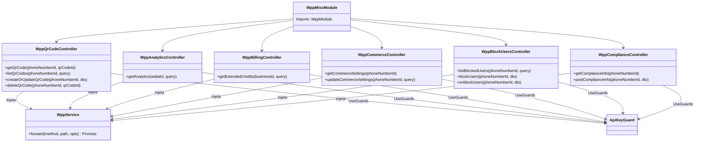
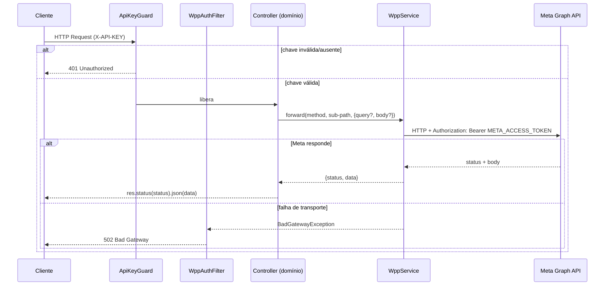

# WhatsApp Meta Adapter — Misc (QR Codes, Analytics, Billing, Commerce, Block Users, Compliance)

> Status: stable | Spec: [docs/specs/2026-06-03-wpp-misc.md](../specs/2026-06-03-wpp-misc.md) | Backend: `src/wpp-misc/`

## 1. Visão Geral

`WppMiscModule` agrupa seis controllers de domínio que expõem os recursos auxiliares da WhatsApp Cloud API não cobertos por módulos com spec próprio: QR codes de mensagem, analytics de WABA, linhas de crédito estendido (billing), configurações de comércio, bloqueio/desbloqueio de usuários e conformidade regulatória (Índia).

O módulo é um **proxy stateless puro**: todos os controllers injetam `WppService` diretamente (sem service de domínio intermediário), mapeiam path vars / query / body e delegam a `WppService.forward`. Nenhum dado é persistido localmente. As entidades vivem exclusivamente na Meta.

## 2. Arquitetura do Módulo



`WppMiscModule` importa apenas `WppModule` (que exporta `WppService`). Não importa `ApiKeysModule` diretamente — `ApiKeyGuard` é resolvido no nível da aplicação, consistente com todos os demais módulos wpp-*.

## 3. Decisões de Implementação

### 3.1 Rota `register` não registrada aqui (AC-12)

A spec originalmente indicava `POST /:phoneNumberId/register` neste módulo (variante com `backup`). Na implementação, esta rota **não foi adicionada** ao `WppMiscModule`.

Motivo: o NestJS lançaria conflito de rota duplicada com `WppRegistrationController` de `wpp-phone-numbers`, que já registra `POST :phoneNumberId/register` com passthrough de body íntegro. Como `wpp-phone-numbers` repassa o body sem interpretação, a variante com `backup` (migração OnPrem) trafega corretamente por aquele handler. O AC-12 é satisfeito por `wpp-registration.controller.ts`.

### 3.2 Analytics: rota única para duas variantes (AC-6/AC-7)

`WppAnalyticsController` expõe um único handler `GET /:wabaId` que serve tanto `analytics` quanto `conversation_analytics`. A desambiguação ocorre exclusivamente pelo **conteúdo de `fields`** enviado pelo cliente — o adapter repassa o parâmetro íntegro sem inspecionar ou reprocessar a field expansion.

Consequência: não há dois endpoints separados para as duas variantes; a distinção é semântica (na Meta), não estrutural (no gateway).

### 3.3 `DELETE /block_users` com body

HTTP `DELETE` não proíbe body — a Meta aceita `block_users` no corpo do DELETE para a operação de desbloqueio. O controller usa `@Body() dto: BlockUsersDto` e chama `forward('DELETE', path, { body: dto })`, garantindo que a lista de usuários seja repassada íntegra.

### 3.4 `ValidationPipe` com `whitelist: false`

Todos os controllers aplicam `@UsePipes(new ValidationPipe({ whitelist: false, transform: true }))`. A opção `whitelist: false` é deliberada: como o módulo é proxy puro, campos não declarados no DTO devem **passar** à Meta, não ser descartados. Isso permite que a Meta receba dados extras enviados pelo cliente sem validação restritiva no gateway.

### 3.5 Importação de `WppModule` (não `ApiKeysModule`)

O módulo importa `WppModule` e não `ApiKeysModule`, seguindo o padrão de todos os módulos wpp-* do projeto. `ApiKeyGuard` é aplicado via `@UseGuards` em cada controller; sua resolução de dependências ocorre no nível do módulo da aplicação.

## 4. API Pública (HTTP)

Todos os endpoints: **Auth** = `ApiKeyGuard` (`X-API-KEY`); **Filter** = `WppAuthFilter`; **Forward** injeta `Authorization: Bearer META_ACCESS_TOKEN`; **Resposta** = status+body da Meta transparente | `401` sem chave válida | `502` falha de transporte.

### Tabela de rotas

| Método | Rota Gateway | Controller | Sub-path Meta | Payload |
|---|---|---|---|---|
| GET | `/wpp/:phoneNumberId/message_qrdls/:qrCodeId` | `WppQrCodeController` | `{phoneNumberId}/message_qrdls/{qrCodeId}` | — |
| GET | `/wpp/:phoneNumberId/message_qrdls` | `WppQrCodeController` | `{phoneNumberId}/message_qrdls` | query passthrough |
| POST | `/wpp/:phoneNumberId/message_qrdls` | `WppQrCodeController` | `{phoneNumberId}/message_qrdls` | body: `CreateOrUpdateQrCodeDto` |
| DELETE | `/wpp/:phoneNumberId/message_qrdls/:qrCodeId` | `WppQrCodeController` | `{phoneNumberId}/message_qrdls/{qrCodeId}` | — |
| GET | `/wpp/:wabaId` | `WppAnalyticsController` | `{wabaId}` | query: `fields` (field expansion) |
| GET | `/wpp/:businessId/extendedcredits` | `WppBillingController` | `{businessId}/extendedcredits` | query passthrough |
| GET | `/wpp/:phoneNumberId/whatsapp_commerce_settings` | `WppCommerceController` | `{phoneNumberId}/whatsapp_commerce_settings` | — |
| POST | `/wpp/:phoneNumberId/whatsapp_commerce_settings` | `WppCommerceController` | `{phoneNumberId}/whatsapp_commerce_settings` | query: `is_cart_enabled`, `is_catalog_visible` |
| GET | `/wpp/:phoneNumberId/block_users` | `WppBlockUsersController` | `{phoneNumberId}/block_users` | query passthrough |
| POST | `/wpp/:phoneNumberId/block_users` | `WppBlockUsersController` | `{phoneNumberId}/block_users` | body: `BlockUsersDto` |
| DELETE | `/wpp/:phoneNumberId/block_users` | `WppBlockUsersController` | `{phoneNumberId}/block_users` | body: `BlockUsersDto` |
| GET | `/wpp/:phoneNumberId/business_compliance_info` | `WppComplianceController` | `{phoneNumberId}/business_compliance_info` | — |
| POST | `/wpp/:phoneNumberId/business_compliance_info` | `WppComplianceController` | `{phoneNumberId}/business_compliance_info` | body: `BusinessComplianceDto` |

## 5. Shapes dos DTOs

### `CreateOrUpdateQrCodeDto`

```
prefilled_message: string          // obrigatório — texto pré-preenchido ao escanear
generate_qr_image?: string         // opcional — 'SVG' ou 'PNG' (presente na criação)
code?: string                      // opcional — ID do QR; presença indica atualização (Meta decide)
```

### `BlockUsersDto` / `BlockUserItemDto`

```
messaging_product: string          // sempre 'whatsapp'
block_users: BlockUserItemDto[]    // lista de usuários

BlockUserItemDto:
  user: string                     // número de telefone com DDI (ex.: '+5511999990000')
```

### `BusinessComplianceDto` / `GrievanceOfficerDetailsDto`

```
messaging_product: string          // sempre 'whatsapp'
entity_name: string                // nome da entidade empresarial
entity_type: string                // ex.: 'INDIVIDUAL', 'BUSINESS'
is_registered: boolean             // entidade registrada?
grievance_officer_details: GrievanceOfficerDetailsDto

GrievanceOfficerDetailsDto:
  name: string                     // nome do responsável
  email: string                    // e-mail do responsável
  landline_number?: string         // telefone fixo com DDI
  mobile_number?: string           // celular com DDI
```

## 6. Fluxo de Requisição



## 7. Cobertura de Testes

Arquivo: `src/wpp-misc/wpp-misc.controller.spec.ts` — testes de integração com módulo NestJS isolado, `WppService` mockado, `ApiKeyGuard` sobrescrito por `overrideGuard`.

| AC | Cenário | Verificação |
|---|---|---|
| AC-1 | GET QR code por ID | `forward('GET', 'pn001/message_qrdls/qr001', ...)` chamado; body Meta repassado |
| AC-2 | POST criar QR code (`prefilled_message` + `generate_qr_image`) | body íntegro no `forward` |
| AC-3 | POST atualizar QR code (`prefilled_message` + `code`) | body com `code` repassado íntegro |
| AC-4 | DELETE QR code por ID | `forward('DELETE', ...)` chamado; status+body repassados |
| AC-5 | GET lista QR codes com `fields` + `code` na query | query com ambos os campos repassada íntegra |
| AC-6 | GET analytics (`fields=analytics.start(...)`) | `forward('GET', 'waba123', { query: { fields: '...' } })` |
| AC-7 | GET conversation analytics (mesma rota, `fields` diferente) | mesma rota, `fields` com `conversation_analytics` repassado |
| AC-8 | GET extendedcredits | `forward('GET', 'biz001/extendedcredits', ...)` |
| AC-9 (GET) | GET commerce settings | `forward('GET', 'pn001/whatsapp_commerce_settings', ...)` |
| AC-9 (POST) | POST commerce settings com query | query `is_cart_enabled`/`is_catalog_visible` repassada |
| AC-10 (GET) | GET block_users | lista repassada |
| AC-10 (POST) | POST block_users com body | body `{ messaging_product, block_users }` íntegro |
| AC-10 (DELETE) | DELETE block_users com body | body repassado no `forward('DELETE', ...)` |
| AC-11 (GET) | GET compliance info | informações repassadas |
| AC-11 (POST) | POST compliance info com body completo | body com `grievance_officer_details` íntegro |
| AC-13 | Meta 400 → caller recebe 400 (não 502) | status Meta propagado; não vira 502 |
| AC-13 | Falha de transporte → 502 | `BadGatewayException` → `WppAuthFilter` → 502 |
| AC-14 | Sem X-API-KEY → 401, forward não chamado | 8 cenários (uma rota por domínio) |

Total: **27 casos de teste** — todos GREEN.

**Nota sobre AC-12**: satisfeito por `wpp-phone-numbers/wpp-registration.controller.ts` (ver §3.1). Não há teste em `wpp-misc.controller.spec.ts` para `POST /register` pois a rota não foi registrada neste módulo.

## 8. Como Verificar

```bash
# Rodar apenas os testes do módulo wpp-misc
npx jest --testPathPattern=wpp-misc --verbose

# Rodar todos os testes
npm run test
```

## 9. Dependências

| Módulo | Papel |
|---|---|
| `WppModule` (`wpp-adapter-core`) | Provê `WppService.forward` — injeção de `Authorization`, transparência de status+body, `502` em falha de transporte |
| `ApiKeyGuard` (`api-keys-foundation`) | Autenticação por `X-API-KEY`; resolvido no nível da aplicação |

Sem dependências de RabbitMQ, Redis, Prisma ou qualquer outro módulo de infraestrutura — módulo stateless puro.

## 10. Variáveis de Ambiente

Nenhuma variável nova introduzida. Herda `META_GRAPH_URL` e `META_ACCESS_TOKEN` de `wpp-adapter-core` via `WppService`.

## 11. Drift em Relação à Spec

- **AC-12 / FR-16 / `POST /:phoneNumberId/register`**: a spec previa `AccountMigrationController` neste módulo. Na implementação, esta rota não foi registrada aqui para evitar conflito com `wpp-phone-numbers`. O AC-12 é satisfeito pelo handler existente em `WppRegistrationController` que repassa body íntegro à Meta. O comportamento funcional é idêntico ao especificado; apenas o módulo dono da rota difere.
- **`WppMiscModule` não importa `ApiKeysModule`**: a spec (§8) indica `WppMiscModule` importando `ApiKeysModule`. Na implementação, apenas `WppModule` é importado — padrão adotado por todos os módulos wpp-* do projeto. `ApiKeyGuard` funciona corretamente por resolução no nível da aplicação.
