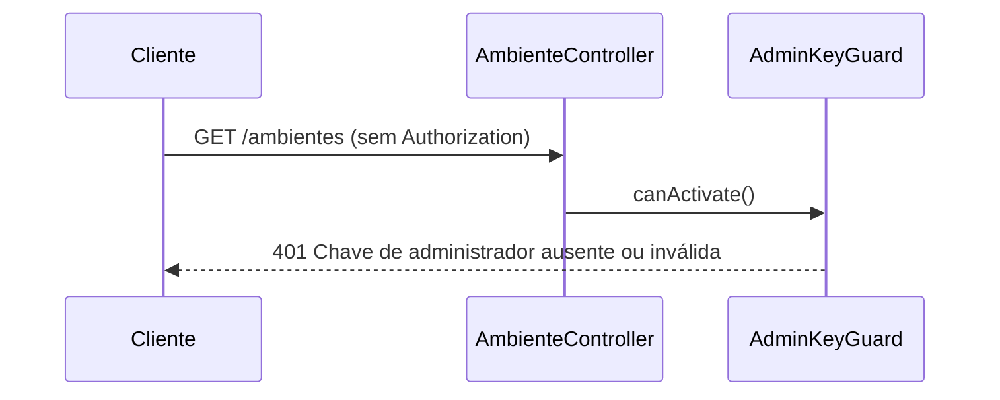
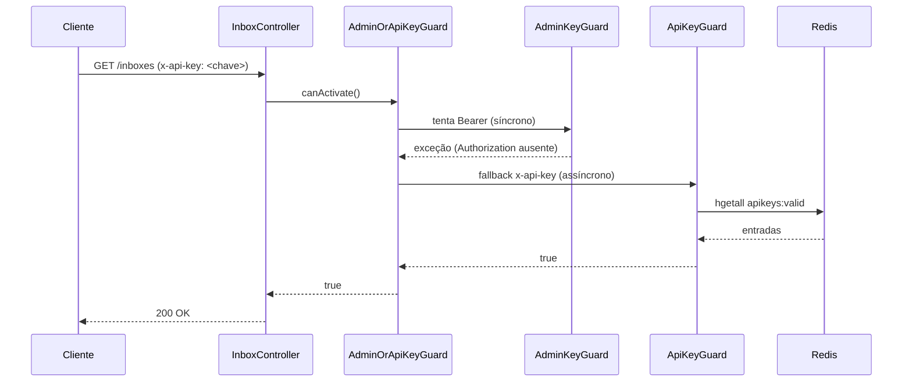
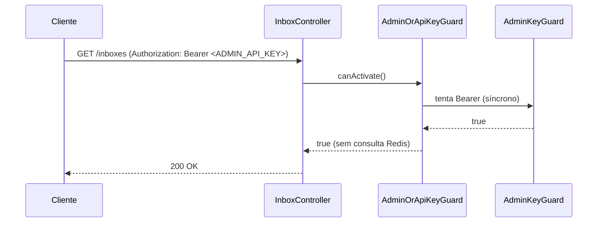

# Implementação — api-key-guard-admin-routes

**Data:** 2026-06-08
**Spec:** [docs/specs/2026-06-08-api-key-guard-admin-routes.md](../specs/2026-06-08-api-key-guard-admin-routes.md)
**Status:** Implementada · testes GREEN · lint 0 · build 0

---

## 1. Visão geral

Feature 11. Proteção das quatro rotas administrativas que estavam expostas sem autenticação (`/ambientes`, `/inboxes`, `/dead-letter`, `/messages/resend`) e correção de inconsistência no Swagger — todos os controllers que usam `ApiKeyGuard` (validação via `x-api-key`) estavam decorados com `@ApiBearerAuth('bearer')`, esquema incorreto para o header em questão.

Mudanças por camada:
- **Novo guard:** `AdminOrApiKeyGuard` — tenta `AdminKeyGuard` primeiro (sem I/O), depois `ApiKeyGuard` (Redis).
- **Runtime:** quatro controllers recebem guards; `ApiKeysModule` exporta o novo guard.
- **Swagger:** `buildSwaggerConfig()` registra o esquema `api-key`; 15+ controllers wpp-* trocam decorador Swagger.

---

## 2. Arquitetura

### 2.1 Guard composto — `AdminOrApiKeyGuard`

```
src/api-keys/guards/admin-or-api-key.guard.ts
```

Implementa `CanActivate`. No construtor recebe `ConfigService` (token `ADMIN_OR_API_KEY_CONFIG`) e `RedisService` (token `ADMIN_OR_API_KEY_REDIS`), instancia `AdminKeyGuard` e `ApiKeyGuard` manualmente — evita `forwardRef` e resolve o problema de DI cruzada entre módulos.

Fluxo de `canActivate`:
1. Chama `this.adminKeyGuard.canActivate(context)` de forma síncrona.
2. Se o resultado for `true` → retorna `true` imediatamente.
3. Se lançar qualquer exceção → silencia (`catch {}`) e prossegue.
4. Delega `this.apiKeyGuard.canActivate(context)` (assíncrono, consulta Redis).
5. `ApiKeyGuard` lança `UnauthorizedException` se a chave não existir — propagada ao caller.

Tokens de DI declarados como constantes no mesmo arquivo:
- `ADMIN_OR_API_KEY_CONFIG = 'ConfigService'`
- `ADMIN_OR_API_KEY_REDIS = 'RedisService'`

### 2.2 Registro em `ApiKeysModule`

```
src/api-keys/api-keys.module.ts
```

Dois novos providers de alias:

```typescript
{ provide: ADMIN_OR_API_KEY_CONFIG, useExisting: ConfigService },
{ provide: ADMIN_OR_API_KEY_REDIS, useExisting: RedisService },
```

`AdminOrApiKeyGuard` adicionado em `providers` e `exports`. O módulo passa a exportar três guards: `AdminKeyGuard`, `ApiKeyGuard`, `AdminOrApiKeyGuard`.

### 2.3 Matriz de guards por controller

| Controller | Rota | Guard | Decorator Swagger |
|---|---|---|---|
| `AmbienteController` | `/ambientes` | `AdminKeyGuard` | `@ApiBearerAuth('bearer')` |
| `InboxController` | `/inboxes` | `AdminOrApiKeyGuard` | `@ApiBearerAuth('bearer')` + `@ApiSecurity('api-key')` |
| `DeadLetterController` | `/dead-letter` | `ApiKeyGuard` | `@ApiSecurity('api-key')` |
| `ResendController` | `/messages/resend` | `ApiKeyGuard` | `@ApiSecurity('api-key')` |
| todos os wpp-* controllers | `/wpp/*` | `ApiKeyGuard` (inalterado) | `@ApiSecurity('api-key')` (substituído) |

### 2.4 Módulos que passaram a importar `ApiKeysModule`

| Módulo | Motivo |
|---|---|
| `AmbienteModule` | `AdminKeyGuard` exportado por `ApiKeysModule` |
| `InboxModule` | `AdminOrApiKeyGuard` exportado por `ApiKeysModule` |
| `DeadLetterModule` | `ApiKeyGuard` exportado por `ApiKeysModule` |
| `ResendModule` | `ApiKeyGuard` exportado por `ApiKeysModule` |

### 2.5 Swagger — `buildSwaggerConfig()`

```
src/swagger/swagger.document.ts
```

Adicionado à cadeia do `DocumentBuilder`:

```typescript
.addApiKey({ type: 'apiKey', in: 'header', name: 'x-api-key' }, 'api-key')
```

O esquema `bearer` preexistente (`type: http, scheme: bearer`) permanece para rotas admin. O documento OpenAPI gerado passa a ter `components.securitySchemes.api-key` com `type: apiKey, in: header, name: x-api-key`.

---

## 3. Diagrama de sequência

### Requisição ao `/ambientes` sem credencial



### Requisição ao `/inboxes` com `x-api-key`



### Requisição ao `/inboxes` com `Authorization: Bearer <ADMIN_API_KEY>`



---

## 4. API contract

### `/ambientes` — `AdminKeyGuard`

- **Auth:** `Authorization: Bearer <ADMIN_API_KEY>`
- **401:** Chave de administrador ausente ou inválida

### `/inboxes` — `AdminOrApiKeyGuard`

- **Auth:** `Authorization: Bearer <ADMIN_API_KEY>` **OU** `x-api-key: <chave-redis>`
- **401:** Nenhuma credencial válida fornecida

### `/dead-letter` — `ApiKeyGuard`

- **Auth:** `x-api-key: <chave-redis>`
- **401:** Chave de API ausente ou inválida

### `POST /messages/resend` — `ApiKeyGuard`

- **Auth:** `x-api-key: <chave-redis>`
- **401:** Chave de API ausente ou inválida

---

## 5. Decisões de implementação

**D1 — Instanciação manual dos guards internos.**
`AdminOrApiKeyGuard` cria `AdminKeyGuard` e `ApiKeyGuard` via `new` no construtor, usando os tokens de alias para receber `ConfigService` e `RedisService`. Alternativa via `ModuleRef.get()` foi descartada para evitar dependência do ciclo de vida do módulo e manter o guard testável em isolamento.

**D2 — Tokens de DI com strings literais.**
`ADMIN_OR_API_KEY_CONFIG = 'ConfigService'` e `ADMIN_OR_API_KEY_REDIS = 'RedisService'` são resolvidos com `useExisting` no módulo. Evita colisão com tokens de outros módulos pois o escopo é local ao `ApiKeysModule`.

**D3 — AdminKey primeiro, ApiKey como fallback.**
`AdminKeyGuard.canActivate` é síncrono e não realiza I/O. Tentar primeiro economiza uma consulta Redis para chamadas administrativas.

**D4 — Correção Swagger sem breaking change de runtime.**
Trocar `@ApiBearerAuth('bearer')` por `@ApiSecurity('api-key')` nos controllers wpp-* é puramente documental — o guard `ApiKeyGuard` já validava `x-api-key` antes desta feature. Nenhuma requisição existente é afetada.

---

## 12. Desvios em relação à spec

Nenhum. Todos os 11 ACs foram implementados conforme especificado:
- AC-1..AC-8: guards aplicados nos quatro controllers; 401 sem credencial, 200 com credencial válida.
- AC-9: `buildSwaggerConfig()` registra `api-key` com `type: apiKey, in: header, name: x-api-key`.
- AC-10: nenhum controller exclusivamente `ApiKeyGuard` referencia `bearer` no documento gerado.
- AC-11: `GET /inboxes` com `Authorization: Bearer <ADMIN_API_KEY>` retorna 200 via `AdminOrApiKeyGuard` caminho rápido.
