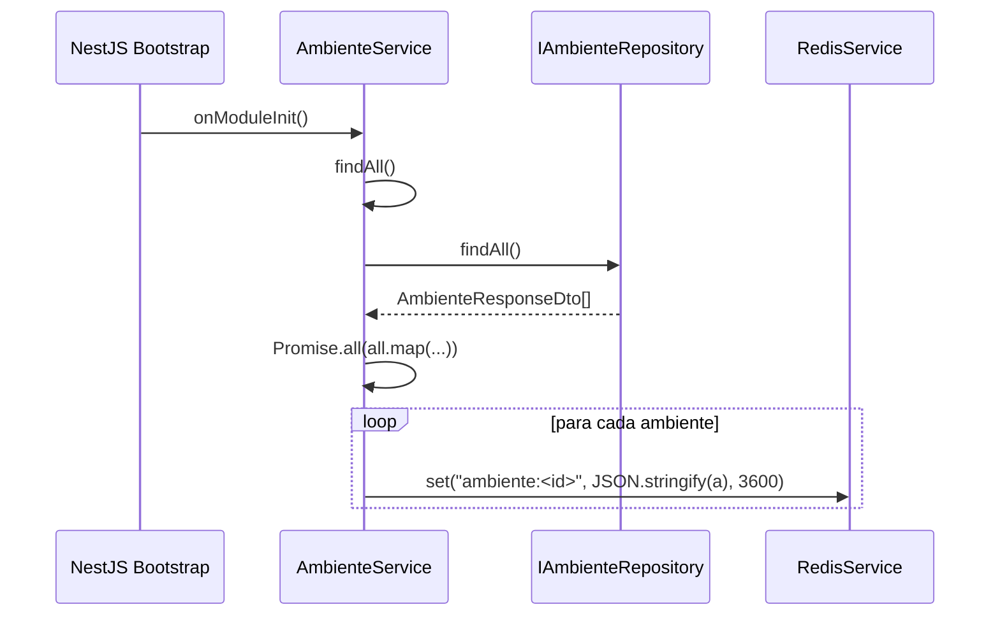
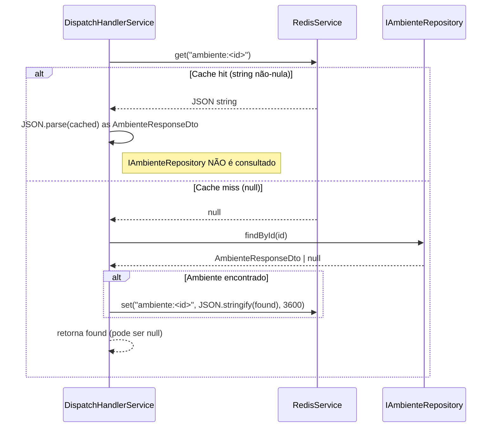

# Implementação: cache-ambientes-redis

> Hotfix 2026-06-08. Cache Redis de `Ambiente` no pipeline de despacho de mensagens para eliminar round-trips desnecessários ao PostgreSQL.

---

## 1. Módulos tocados e mudanças de DI

### `AmbienteModule` / `AmbienteService`

`AmbienteService` passou a implementar `OnModuleInit` e agora injeta `RedisService` diretamente — sem necessidade de importar `RedisModule` explicitamente, pois este é `@Global()`.

```
AmbienteService
  constructor(
    @Inject(AMBIENTE_REPOSITORY) repo: IAmbienteRepository,
    redis: RedisService,          // <-- nova injeção
  )
  implements OnModuleInit
```

### `DispatchModule` / `DispatchHandlerService`

`DispatchHandlerService` passou a injetar `RedisService` para o lookup cache-first em `getAmbiente`.

```
DispatchHandlerService
  constructor(
    @Inject(INBOX_REPOSITORY)      inboxRepo: IInboxRepository,
    @Inject(AMBIENTE_REPOSITORY)   ambienteRepo: IAmbienteRepository,
    http: HttpService,
    @Inject(RABBITMQ_SERVICE)      mq: IRabbitMQService,
    config: ConfigService,
    redis: RedisService,           // <-- nova injeção
  )
```

Nenhum novo `import` de módulo foi necessário em nenhum dos dois — `RedisModule` global já expõe `RedisService`.

---

## 2. Formato de chave e TTL

| Aspecto | Valor |
|---|---|
| Chave | `ambiente:<id>` (ex.: `ambiente:1`) |
| Tipo Redis | `string` (valor serializado como JSON) |
| TTL | `3600` segundos (1 hora) |
| Constante | `CACHE_TTL = 3600` (`ambiente.service.ts`) |
| Helper | `cacheKey = (id: number) => \`ambiente:${id}\`` (`ambiente.service.ts`) |

O valor armazenado é o resultado de `JSON.stringify(AmbienteResponseDto)`.

---

## 3. Fluxo de warm-up (`OnModuleInit`)

`AmbienteService.onModuleInit` é chamado automaticamente pelo NestJS após a injeção de dependências do módulo. O fluxo real:



Detalhes de implementação:
- Chama o próprio `this.findAll()`, que aplica `plainToInstance` com `excludeExtraneousValues: true` antes de serializar.
- Usa `Promise.all` — todas as escritas Redis são disparadas concorrentemente.
- Falhas no Redis durante o warm-up propagam exceção normalmente; o startup pode falhar se Redis estiver indisponível (divergência em relação ao NFR-1 — ver §12 Drift).

---

## 4. Fluxo cache-first no despacho (`getAmbiente`)

`DispatchHandlerService.getAmbiente(id: number)` é privado e chamado dentro de `handle`.



Nota: no cache miss, `getAmbiente` chama `this.ambienteRepo.findById` diretamente (não `AmbienteService.findById`), portanto `NotFoundException` não é lançada — retorna `null` se não encontrado, e o `handle` envia para DLQ com `AMBIENTE_INDISPONIVEL`.

---

## 5. Sincronização em mutações

### `create`

```
repo.create(dto)
  → plainToInstance(AmbienteResponseDto, result)
  → redis.set(cacheKey(response.id), JSON.stringify(response), 3600)
  → retorna response
```

### `update`

```
repo.update(id, dto)
  → plainToInstance(AmbienteResponseDto, result)
  → redis.set(cacheKey(response.id), JSON.stringify(response), 3600)
  → retorna response
```

### `softDelete`

```
repo.softDelete(id)
  → redis.del(cacheKey(id))
  → retorna void
```

Em `softDelete`, a chave é deletada — não atualizada com `del: true` — garantindo que o próximo acesso seja um cache miss e consulte o banco (que retornará `null` ou o registro com `del: true`).

---

## 6. Formato do log de sucesso

Emitido por `DispatchHandlerService` após HTTP POST bem-sucedido (qualquer status 2xx que não lance exceção via `firstValueFrom`):

```
Dispatched inbox <inboxId> → <ambiente.url>: <response.status>
```

Exemplo:
```
Dispatched inbox abc-123 → https://api.whiz.net.br/webhook: 200
```

Nível: `Logger.log` (INFO). Contexto: `DispatchHandlerService`.

---

## 7. Cobertura de testes (AC-1 a AC-7)

| AC | Descrição | Verificação |
|---|---|---|
| **AC-1** | `onModuleInit` com 3 ambientes no banco → `RedisService.set` chamado 3× com chaves `ambiente:1..3` e TTL 3600 | Spy em `redis.set`; verifica `toHaveBeenCalledTimes(3)` + `toHaveBeenCalledWith('ambiente:N', expect.any(String), 3600)` |
| **AC-2** | `create` válido → `redis.set("ambiente:<id>", …, 3600)` chamado 1× | Spy em `redis.set`; verifica chamada após mock de `repo.create` |
| **AC-3** | `update` existente → `redis.set("ambiente:<id>", …, 3600)` chamado 1× com valor atualizado | Spy em `redis.set`; verifica valor serializado contém campos atualizados |
| **AC-4** | `softDelete` existente → `redis.del("ambiente:<id>")` chamado 1× | Spy em `redis.del`; verifica `toHaveBeenCalledWith('ambiente:<id>')` |
| **AC-5** | `redis.get` retorna JSON → `getAmbiente` retorna objeto desserializado sem chamar `ambienteRepo.findById` | Mock `redis.get` retorna string JSON; spy em `ambienteRepo.findById` verifica `not.toHaveBeenCalled()` |
| **AC-6** | `redis.get` retorna `null` → `ambienteRepo.findById` é chamado; resultado gravado no Redis com TTL 3600 | Mock `redis.get` retorna `null`; spy em `ambienteRepo.findById` + `redis.set`; verifica ambos chamados |
| **AC-7** | Despacho bem-sucedido → logger emite INFO com `"Dispatched inbox … → url: status"` | Spy em `logger.log`; verifica string com `inboxId`, `url` e código HTTP |

---

## §12 Drift em relação à spec

**NFR-1 (divergência):** A spec define que o warm-up em `onModuleInit` deve ser não-bloqueante — "falha no Redis não deve impedir a inicialização". Na implementação, `onModuleInit` é `async` e `await`-a o `Promise.all` de escritas Redis sem `try/catch`. Uma falha no Redis propagará exceção, podendo impedir o módulo de inicializar. O comportamento real é bloqueante em caso de erro. O risco é aceito dado que Redis é infraestrutura obrigatória (validada no bootstrap via `REDIS_URL`).

---

## §17 Changelog

| Data | Tipo | Descrição |
|---|---|---|
| 2026-06-08 | hotfix | Documentação inicial da implementação: warm-up, sincronização de mutações, cache-first no dispatch, log de sucesso. |
