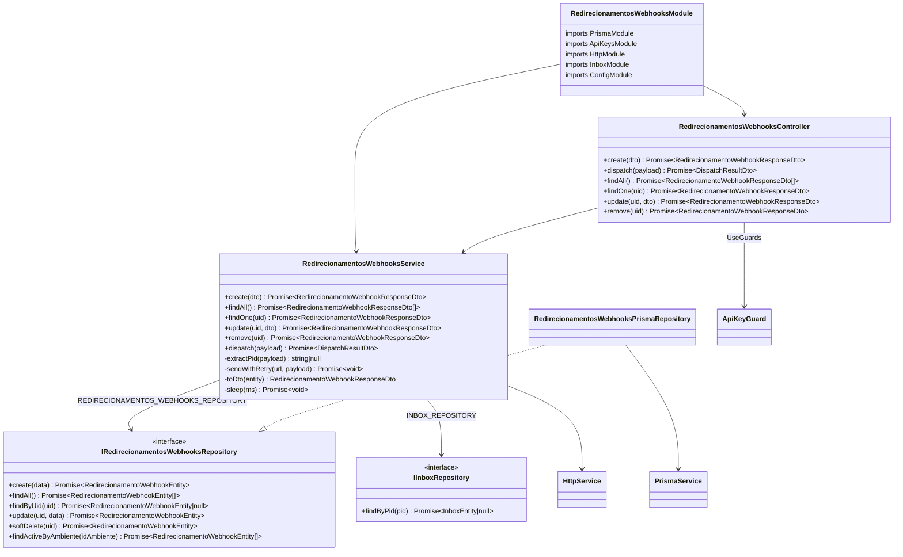
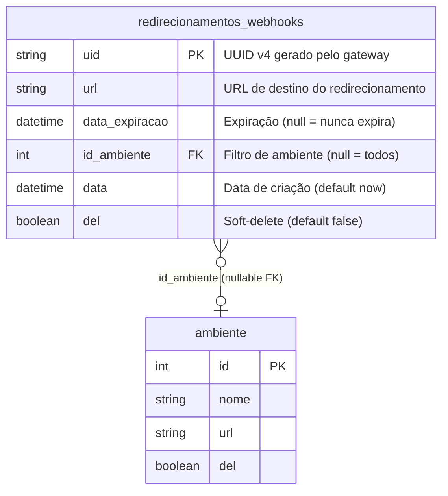

# Redirecionamentos de Webhooks

> Status: stable
> Spec: [docs/specs/2026-06-08-redirecionamentos-webhooks.md](../specs/2026-06-08-redirecionamentos-webhooks.md)
> Backend: `src/redirecionamentos-webhooks/`

## 1. Overview

Provisiona a tabela `redirecionamentos_webhooks`: CRUD de registros com TTL configurável e rota de dispatch que repassa o payload bruto de webhooks para todas as URLs ativas elegíveis em fire-and-forget com retry exponencial.

Comportamentos-chave:

- O `uid` (UUID v4) é gerado pelo gateway no momento do `POST` via `randomUUID()`; o cliente nunca informa um UID próprio.
- `data_expiracao` segue três regras: campo ausente → `now() + 15 min`; campo `null` explícito → `null` no DB (nunca expira); valor DateTime → usado diretamente.
- Um redirecionamento é **ativo** quando `del = false` AND (`data_expiracao IS NULL` OR `data_expiracao > now()`).
- Um redirecionamento é **elegível** para um dispatch quando é ativo E (`id_ambiente = inbox.id_ambiente` OR `id_ambiente IS NULL`).
- O dispatch resolve o ambiente via PID extraído de `payload.entry[0].changes[0].value.metadata.phone_number_id` → `IInboxRepository.findByPid` — mesmo mecanismo do `WebhookService`.
- Fire-and-forget: `dispatch()` lança `Promise.all(redirects.map(r => sendWithRetry(r.url, payload)))` sem `await` para fins de retorno; o método retorna `{ dispatched: N }` com o número de URLs para as quais o dispatch foi **iniciado** (não concluído).
- Retry: até 5 tentativas por URL com backoff `baseMs * 2^(attempt-1)`. `baseMs` lido de `REDIRECIONAMENTOS_BACKOFF_BASE_MS` (não `DISPATCH_BACKOFF_BASE_MS`). Falha definitiva → `Logger.warn`; erro não propagado ao chamador.
- Soft-delete: `DELETE` apenas seta `del = true`; sem hard-delete automático.
- Sem cache Redis — registros de curta duração, leitura apenas no dispatch.

## 2. API pública (HTTP)

Todas as rotas exigem `X-API-KEY` válida validada pelo `ApiKeyGuard`. Tag Swagger: `Redirecionamentos Webhooks`.

| Método | Rota | Status OK | Body request | Body response |
|---|---|---|---|---|
| `POST` | `/redirecionamentos-webhooks` | `201` | `CreateRedirecionamentoWebhookDto` | `RedirecionamentoWebhookResponseDto` |
| `POST` | `/redirecionamentos-webhooks/dispatch` | `202` | `Record<string, unknown>` | `DispatchResultDto` |
| `GET` | `/redirecionamentos-webhooks` | `200` | — | `RedirecionamentoWebhookResponseDto[]` |
| `GET` | `/redirecionamentos-webhooks/:uid` | `200` | — | `RedirecionamentoWebhookResponseDto` |
| `PATCH` | `/redirecionamentos-webhooks/:uid` | `200` | `UpdateRedirecionamentoWebhookDto` | `RedirecionamentoWebhookResponseDto` |
| `DELETE` | `/redirecionamentos-webhooks/:uid` | `200` | — | `RedirecionamentoWebhookResponseDto` |

> Nota de ordenação: no controller, `POST /dispatch` é declarado antes de `GET /` e `GET /:uid` para evitar ambiguidade de rota no Express.

### POST /redirecionamentos-webhooks

Cria um novo registro de redirecionamento.

```bash
curl -X POST http://localhost:3000/redirecionamentos-webhooks \
  -H "X-API-KEY: $API_KEY" \
  -H "Content-Type: application/json" \
  -d '{"url": "https://exemplo.com/hook"}'
# 201
# {
#   "uid": "550e8400-e29b-41d4-a716-446655440000",
#   "url": "https://exemplo.com/hook",
#   "data_expiracao": "2026-06-08T10:15:00.000Z",
#   "id_ambiente": null,
#   "data": "2026-06-08T10:00:00.000Z",
#   "del": false
# }
```

```bash
# Com data_expiracao = null (nunca expira)
curl -X POST http://localhost:3000/redirecionamentos-webhooks \
  -H "X-API-KEY: $API_KEY" \
  -H "Content-Type: application/json" \
  -d '{"url": "https://exemplo.com/hook", "data_expiracao": null}'
# 201 — data_expiracao: null no DB
```

Erros: `400` (URL inválida) · `401`.

### POST /redirecionamentos-webhooks/dispatch

Recebe payload bruto do webhook, resolve ambiente via PID → inbox e despacha para todos os redirecionamentos ativos elegíveis em fire-and-forget.

```bash
curl -X POST http://localhost:3000/redirecionamentos-webhooks/dispatch \
  -H "X-API-KEY: $API_KEY" \
  -H "Content-Type: application/json" \
  -d '{"entry":[{"changes":[{"value":{"metadata":{"phone_number_id":"PID123"}}}]}]}'
# 202
# { "dispatched": 2 }
```

```bash
# Payload sem PID → dispatched: 0
curl -X POST http://localhost:3000/redirecionamentos-webhooks/dispatch \
  -H "X-API-KEY: $API_KEY" \
  -H "Content-Type: application/json" \
  -d '{}'
# 202
# { "dispatched": 0 }
```

Erros: `401`. Nunca retorna 4xx por PID ausente ou inbox não encontrado.

### GET /redirecionamentos-webhooks

Retorna todos os registros com `del = false`, ordenados por `data` DESC.

```bash
curl http://localhost:3000/redirecionamentos-webhooks \
  -H "X-API-KEY: $API_KEY"
# 200 — array de RedirecionamentoWebhookResponseDto
```

Erros: `401`.

### GET /redirecionamentos-webhooks/:uid

Busca registro pelo UID. Retorna `404` se não existir ou `del = true`.

```bash
curl http://localhost:3000/redirecionamentos-webhooks/550e8400-e29b-41d4-a716-446655440000 \
  -H "X-API-KEY: $API_KEY"
# 200 — RedirecionamentoWebhookResponseDto
```

Erros: `401` · `404`.

### PATCH /redirecionamentos-webhooks/:uid

Atualiza `url`, `id_ambiente` e/ou `data_expiracao`. Apenas campos presentes no body são modificados.

```bash
curl -X PATCH http://localhost:3000/redirecionamentos-webhooks/550e8400-e29b-41d4-a716-446655440000 \
  -H "X-API-KEY: $API_KEY" \
  -H "Content-Type: application/json" \
  -d '{"url": "https://novo.exemplo.com/hook"}'
# 200 — RedirecionamentoWebhookResponseDto atualizado
```

Erros: `400` · `401` · `404`.

### DELETE /redirecionamentos-webhooks/:uid

Aplica soft-delete (`del = true`).

```bash
curl -X DELETE http://localhost:3000/redirecionamentos-webhooks/550e8400-e29b-41d4-a716-446655440000 \
  -H "X-API-KEY: $API_KEY"
# 200 — RedirecionamentoWebhookResponseDto com del: true
```

Erros: `401` · `404`.

### RedirecionamentoWebhookResponseDto

| Campo | Tipo | Validators / Notas |
|---|---|---|
| `uid` | `string` | `@Expose()` — UUID v4 gerado no `POST` |
| `url` | `string` | `@Expose()` — URL de destino |
| `data_expiracao` | `string \| null` | `@Expose()` — ISO 8601 ou `null`; `toDto()` chama `.toISOString()` em `Date` |
| `id_ambiente` | `number \| null` | `@Expose()` — ID do ambiente filtrado ou `null` |
| `data` | `string` | `@Expose()` — ISO 8601, data de criação |
| `del` | `boolean` | `@Expose()` — `true` após soft-delete |

### DispatchResultDto

| Campo | Tipo | Notas |
|---|---|---|
| `dispatched` | `number` | `@Expose()` — número de URLs para as quais o dispatch foi iniciado |

## 3. Contrato do serviço

### RedirecionamentosWebhooksService

| Método | Assinatura | Comportamento |
|---|---|---|
| `create` | `create(dto: CreateRedirecionamentoWebhookDto): Promise<RedirecionamentoWebhookResponseDto>` | Calcula `data_expiracao`, gera UUID, persiste e retorna DTO |
| `findAll` | `findAll(): Promise<RedirecionamentoWebhookResponseDto[]>` | Delega ao repositório (`del=false`, `data` DESC) |
| `findOne` | `findOne(uid: string): Promise<RedirecionamentoWebhookResponseDto>` | Lança `NotFoundException` se `!entity \|\| entity.del` |
| `update` | `update(uid: string, dto: UpdateRedirecionamentoWebhookDto): Promise<RedirecionamentoWebhookResponseDto>` | Valida existência → constrói `updateData` com apenas campos presentes → persiste |
| `remove` | `remove(uid: string): Promise<RedirecionamentoWebhookResponseDto>` | Valida existência → `softDelete` → retorna DTO com `del: true` |
| `dispatch` | `dispatch(payload: Record<string, unknown>): Promise<DispatchResultDto>` | Extrai PID → resolve inbox → busca elegíveis → `Promise.all(sendWithRetry)` → `{ dispatched: N }` |

Métodos privados:

| Método | Comportamento |
|---|---|
| `extractPid(payload)` | Navega `entry[0].changes[0].value.metadata.phone_number_id`; retorna `string \| null` |
| `sendWithRetry(url, payload)` | Loop `attempt 1..5`: `firstValueFrom(http.post(url, payload))` → sucesso = retorna; falha + `attempt < 5` = `sleep(baseMs * 2^(attempt-1))`; falha + `attempt = 5` = `Logger.warn` |
| `toDto(entity)` | `plainToInstance(RedirecionamentoWebhookResponseDto, { ...campos com .toISOString() }, { excludeExtraneousValues: true })` |
| `sleep(ms)` | `new Promise(resolve => setTimeout(resolve, ms))` |

## 4. Arquitetura do módulo

### RedirecionamentosWebhooksModule

```
imports:   PrismaModule · ApiKeysModule · HttpModule · InboxModule · ConfigModule
controllers: RedirecionamentosWebhooksController
providers: RedirecionamentosWebhooksService · Logger
           REDIRECIONAMENTOS_WEBHOOKS_REPOSITORY → RedirecionamentosWebhooksPrismaRepository (useClass)
exports:   (nenhum)
```

### Diagrama de classes



### Token de injeção

| Constante | Valor | Arquivo |
|---|---|---|
| `REDIRECIONAMENTOS_WEBHOOKS_REPOSITORY` | `'REDIRECIONAMENTOS_WEBHOOKS_REPOSITORY'` | `src/redirecionamentos-webhooks/constants/redirecionamentos-webhooks-tokens.constants.ts` |

## 5. Modelo de dados



Modelo Prisma:

```prisma
model redirecionamentos_webhooks {
  uid            String    @id @default(uuid())
  url            String
  data_expiracao DateTime?
  id_ambiente    Int?
  data           DateTime  @default(now())
  del            Boolean   @default(false)

  ambiente ambiente? @relation(fields: [id_ambiente], references: [id])
}
```

**Observacao:** a migration precisa ser aplicada com `npx prisma migrate dev --name add_redirecionamentos_webhooks` em ambiente com banco ativo antes de usar o módulo.

## 6. DTOs

### CreateRedirecionamentoWebhookDto

| Campo | Tipo | Validators |
|---|---|---|
| `url` | `string` | `@IsUrl()` (obrigatório) |
| `id_ambiente` | `number \| null` | `@IsOptional() @IsInt()` |
| `data_expiracao` | `Date \| null` | `@IsOptional() @ValidateIf(o => o.data_expiracao !== null) @IsDateString() @Allow()` |

### UpdateRedirecionamentoWebhookDto

Extends `PartialType(CreateRedirecionamentoWebhookDto)` — todos os campos opcionais com as mesmas validações.

### RedirecionamentoWebhookResponseDto

Ver §2.

### DispatchResultDto

Ver §2.

## 7. Configuração

Nenhuma variável nova. O módulo reutiliza:

| Env | Usada por | Obrigatória |
|---|---|---|
| `DATABASE_URL` | `PrismaModule` | sim |
| `REDIRECIONAMENTOS_BACKOFF_BASE_MS` | `RedirecionamentosWebhooksService` (baseMs do retry) | não — default `1000` via fallback `?? '1000'` |

> Atenção: o service lê `REDIRECIONAMENTOS_BACKOFF_BASE_MS`, não `DISPATCH_BACKOFF_BASE_MS`. Isso difere do mencionado na spec (NFR-2). Ver §12.

## 8. Dependências

### Internas

| Módulo | Motivo |
|---|---|
| `PrismaModule` | `PrismaService` para o repositório |
| `ApiKeysModule` | exporta `ApiKeyGuard` usado pelo controller |
| `InboxModule` | exporta `INBOX_REPOSITORY` (`IInboxRepository.findByPid`) para resolver PID → inbox |
| `ConfigModule` | `ConfigService` para leitura de `REDIRECIONAMENTOS_BACKOFF_BASE_MS` |

### Externas (libs)

| Lib | Uso |
|---|---|
| `@nestjs/axios` (`HttpModule`) | `HttpService.post(url, payload)` no `sendWithRetry` |
| `class-transformer` | `plainToInstance` com `excludeExtraneousValues` no `toDto` |
| `rxjs` | `firstValueFrom` para converter Observable em Promise |
| `crypto` (Node built-in) | `randomUUID()` para geração de UUID v4 |

## 9. Pontos de extensão

| Símbolo | Tipo | Arquivo |
|---|---|---|
| `IRedirecionamentosWebhooksRepository` | interface | `src/redirecionamentos-webhooks/interfaces/redirecionamentos-webhooks-repository.interface.ts` |
| `RedirecionamentoWebhookEntity` | interface | mesmo arquivo acima |
| `REDIRECIONAMENTOS_WEBHOOKS_REPOSITORY` | token de injeção | `src/redirecionamentos-webhooks/constants/redirecionamentos-webhooks-tokens.constants.ts` |

Para substituir o repositório: fornecer uma classe que implemente `IRedirecionamentosWebhooksRepository` e alterar o binding do token no módulo.

## 10. Erros

| Exceção | Status HTTP | Gatilho |
|---|---|---|
| `UnauthorizedException` | 401 | `ApiKeyGuard`: `X-API-KEY` ausente ou inválida |
| `BadRequestException` (ValidationPipe) | 400 | `url` inválida em `CreateRedirecionamentoWebhookDto` ou `UpdateRedirecionamentoWebhookDto` |
| `NotFoundException` | 404 | `findOne`, `update`, `remove`: UID não encontrado ou `del = true` |

**Comportamentos que NÃO lançam exceção:**

- PID ausente no payload do dispatch → `{ dispatched: 0 }` (202)
- Inbox não encontrado para PID → `{ dispatched: 0 }` (202)
- Nenhum redirecionamento elegível → `{ dispatched: 0 }` (202)
- Falha HTTP em uma URL do dispatch → `Logger.warn`; outras URLs não afetadas; retorno 202 já emitido

## 11. Notas operacionais

- **URLs não logadas em nível INFO:** os logs `logger.log` registram apenas o `uid` (create, update, remove). A URL de destino nunca aparece em logs INFO; apenas em `Logger.warn` ao identificar a URL em falha de envio.
- **dispatch retorna antes da conclusão dos envios:** `Promise.all` é iniciado mas não aguardado antes do retorno; o valor de `dispatched` reflete quantas URLs receberam o dispatch, independente do resultado HTTP.
- **Sem hard-delete automático:** registros com `data_expiracao` no passado permanecem na tabela com `del = false`; são apenas excluídos da query `findActiveByAmbiente`.
- **id_ambiente do ambiente deletado:** a query de elegibilidade (`findActiveByAmbiente`) não verifica `ambiente.del`; filtra apenas pelo `id_ambiente` do registro de redirecionamento.
- **ConfigService é @Optional():** o service aceita `ConfigService` como opcional; se não injetado (testes unitários sem módulo de config), `baseMs` fica `0` (sem delay entre retentativas).
- **WppAuthFilter aplicado:** o controller usa `@UseFilters(WppAuthFilter)` para converter `ForbiddenException` → `UnauthorizedException` (401). Consistência com os demais controllers que usam `ApiKeyGuard`.

## 12. Spec drift

**NFR-2 (env var do backoff):** a spec indica `DISPATCH_BACKOFF_BASE_MS` como variável de configuração do backoff de dispatch. A implementação usa `REDIRECIONAMENTOS_BACKOFF_BASE_MS`. O comportamento é idêntico (baseMs para `baseMs * 2^(attempt-1)`), mas o nome da variável de ambiente difere. A env `REDIRECIONAMENTOS_BACKOFF_BASE_MS` não está cadastrada no `config.validation.ts` (Joi schema) nem na tabela de env vars do README.

Todos os demais ACs (AC-1 a AC-13) estão alinhados com a implementação.

## 13. Changelog

| Data | Descrição |
|---|---|
| 2026-06-08 | Implementação inicial: `RedirecionamentosWebhooksModule`, CRUD completo, dispatch fire-and-forget com retry exponencial. Doc criada. |
