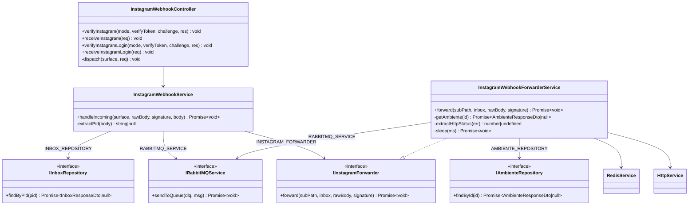
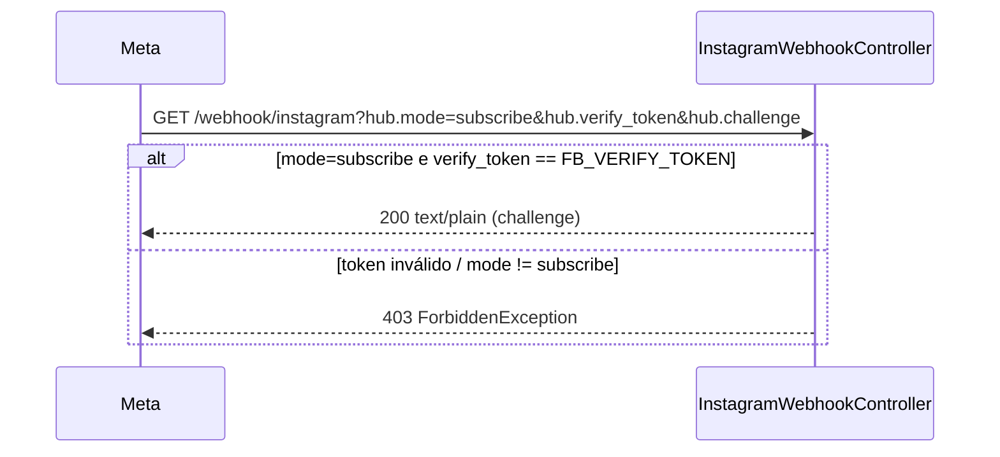
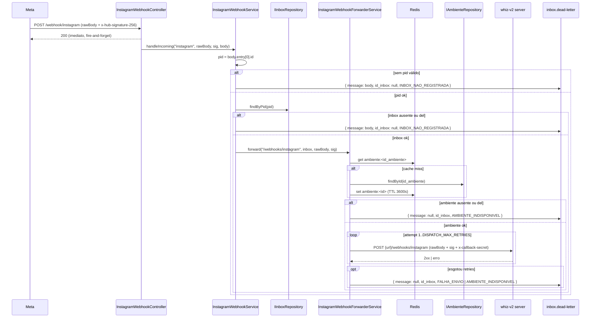
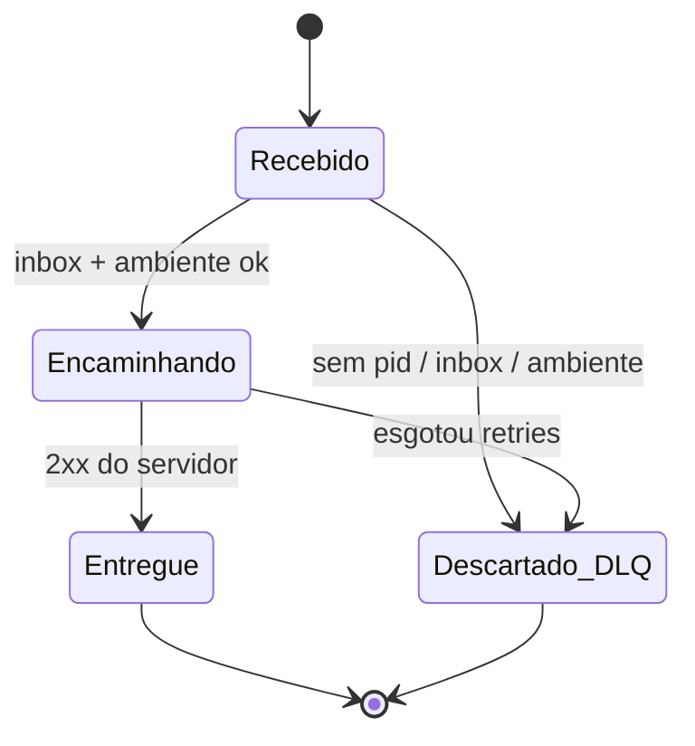
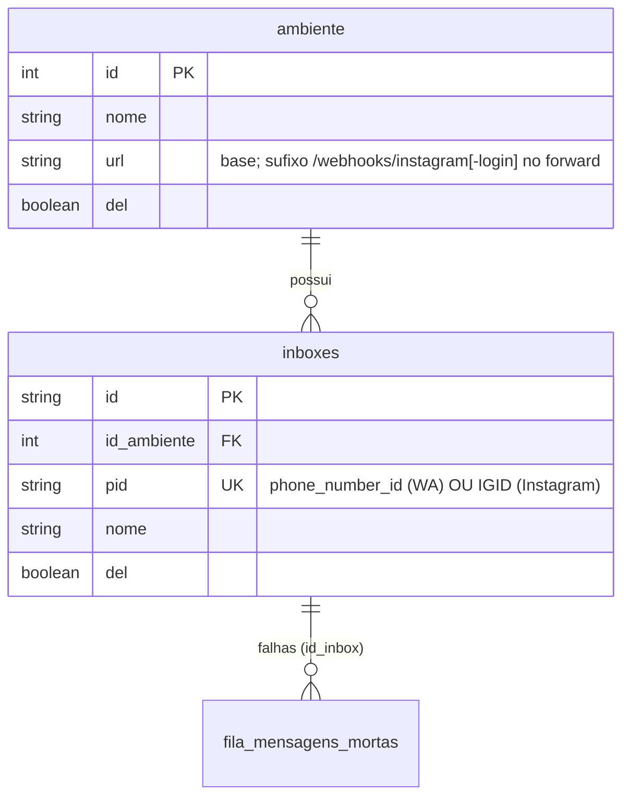

# Instagram Webhook Redirect

> Status: stable
> Spec: [docs/specs/2026-07-01-instagram-webhook-redirect.md](../specs/2026-07-01-instagram-webhook-redirect.md)
> ADR: [docs/adr/0001-instagram-webhook-passthrough.md](../adr/0001-instagram-webhook-passthrough.md)
> Backend: `src/instagram-webhook/`

## 1. Overview

Habilita o gateway a receber webhooks de Instagram da Meta em rotas dedicadas e
redirecioná-los, **byte-idênticos**, para o servidor whiz-v2 do ambiente
correto. Cobre os dois tipos de inbox de Instagram: `INSTAGRAM` (Facebook Login)
e `INSTAGRAM_LOGIN` (Instagram Login / OAuth direto).

Comportamentos-chave (extraídos do código):

- Duas superfícies (`InstagramSurface = 'instagram' | 'instagram-login'`), cada
  uma com par `GET` (handshake Meta) + `POST` (ingestão).
- O `GET` valida `hub.mode === 'subscribe'` e `hub.verify_token` contra o token
  da superfície (`FB_VERIFY_TOKEN` para `instagram`, `IG_VERIFY_TOKEN` para
  `instagram-login`); ecoa `hub.challenge` em `text/plain`; caso contrário `403`.
- O `POST` é **fire-and-forget**: o controller responde `200` imediatamente
  (`@HttpCode(200)`) e delega ao serviço com `void Promise.resolve(...).catch()`,
  de modo que erros do serviço nunca propagam para a resposta HTTP.
- O serviço extrai o `pid` de `body.entry[0].id` (IGID), resolve a inbox por
  `findByPid(pid)` e delega o forward do **corpo cru** (`req.rawBody`, `Buffer`)
  ao forwarder — sem reserializar o JSON, preservando `x-hub-signature-256`.
- O forwarder resolve o `ambiente` por `inbox.id_ambiente` (cache-first Redis,
  chave `ambiente:<id>`, TTL 3600 s), faz `POST {ambiente.url}{subPath}` com
  retry exponencial e, em falha definitiva, publica na DLQ `inbox.dead-letter`.
- Passthrough-only: o gateway **não** verifica HMAC nem armazena
  `FB_APP_SECRET`/`IG_APP_SECRET`. O servidor whiz-v2 é o único verificador
  (ver ADR-0001).
- Nenhuma alteração de schema Prisma. Reusa `inboxes`, `ambiente` e
  `fila_mensagens_mortas`.

O "porquê" das decisões está na [spec](../specs/2026-07-01-instagram-webhook-redirect.md)
e na [ADR-0001](../adr/0001-instagram-webhook-passthrough.md).

## 2. Public API (HTTP)

Controller `InstagramWebhookController` — `@Controller('webhook')`, tag Swagger
`Webhook Instagram`. **Nenhum guard** em qualquer rota (handshake e passthrough
Meta). O `POST` sempre responde `200` (fire-and-forget).

| Método | Rota | Guards | Request | Retorno | Status |
|---|---|---|---|---|---|
| `GET` | `/webhook/instagram` | nenhum | query `hub.mode`, `hub.verify_token`, `hub.challenge` | `hub.challenge` em `text/plain` | `200` \| `403` |
| `POST` | `/webhook/instagram` | nenhum | corpo cru Meta + header `x-hub-signature-256` | vazio | `200` |
| `GET` | `/webhook/instagram-login` | nenhum | query `hub.mode`, `hub.verify_token`, `hub.challenge` | `hub.challenge` em `text/plain` | `200` \| `403` |
| `POST` | `/webhook/instagram-login` | nenhum | corpo cru Meta + header `x-hub-signature-256` | vazio | `200` |

> `POST` é **passthrough fire-and-forget**: `@HttpCode(200)` responde antes de o
> forward concluir; qualquer falha de ingestão/forward vai para a DLQ, nunca
> para a resposta HTTP (`dispatch()` faz `void Promise.resolve(...).catch()`).

### GET /webhook/instagram

Handshake Meta. Valida `hub.mode=subscribe` e `hub.verify_token === FB_VERIFY_TOKEN`.

```bash
curl "http://localhost:3000/webhook/instagram?hub.mode=subscribe&hub.verify_token=$FB_VERIFY_TOKEN&hub.challenge=1234567890"
# 200 — Content-Type: text/plain
# 1234567890
```

```bash
# Token inválido ou mode != subscribe
curl "http://localhost:3000/webhook/instagram?hub.mode=subscribe&hub.verify_token=errado&hub.challenge=1234567890"
# 403 — { "message": "Token de verificação inválido", ... }
```

### POST /webhook/instagram

Ingestão passthrough. Encaminha o corpo cru + `x-hub-signature-256` para
`{ambiente.url}/webhooks/instagram`. Responde `200` imediatamente.

```bash
curl -X POST http://localhost:3000/webhook/instagram \
  -H "Content-Type: application/json" \
  -H "x-hub-signature-256: sha256=<assinatura da Meta>" \
  -d '{"object":"instagram","entry":[{"id":"178414..IGID..0","time":1700000000}]}'
# 200 — corpo de resposta vazio (aceito para forward)
```

### GET /webhook/instagram-login

Idem `GET /webhook/instagram`, validando contra `IG_VERIFY_TOKEN`.

```bash
curl "http://localhost:3000/webhook/instagram-login?hub.mode=subscribe&hub.verify_token=$IG_VERIFY_TOKEN&hub.challenge=1234567890"
# 200 — text/plain — 1234567890
```

### POST /webhook/instagram-login

Idem `POST /webhook/instagram`; forward para `{ambiente.url}/webhooks/instagram-login`.

```bash
curl -X POST http://localhost:3000/webhook/instagram-login \
  -H "Content-Type: application/json" \
  -H "x-hub-signature-256: sha256=<assinatura da Meta>" \
  -d '{"object":"instagram","entry":[{"id":"178414..IGID..0","time":1700000000}]}'
# 200 — corpo de resposta vazio
```

## 3. Module surface

`InstagramWebhookModule` (`src/instagram-webhook/instagram-webhook.module.ts`),
módulo não-global registrado em `AppModule`.

```
imports:     HttpModule · InboxModule · AmbienteModule
controllers: InstagramWebhookController
providers:   InstagramWebhookService
             InstagramWebhookForwarderService
             INSTAGRAM_FORWARDER → useExisting: InstagramWebhookForwarderService
exports:     (nenhum)
```

Dependências resolvidas por token/interface (nunca por classe concreta):

| Símbolo injetado | Token | Origem |
|---|---|---|
| `IInboxRepository` | `INBOX_REPOSITORY` | `InboxModule` |
| `IAmbienteRepository` | `AMBIENTE_REPOSITORY` | `AmbienteModule` |
| `IRabbitMQService` | `RABBITMQ_SERVICE` | `RabbitMQModule` (`@Global`) |
| `IInstagramForwarder` | `INSTAGRAM_FORWARDER` | binding local (`useExisting`) |
| `RedisService` | — (classe) | `RedisModule` (`@Global`) |
| `ConfigService` | — (classe) | `AppConfigModule` (`@Global`) |
| `HttpService` | — (classe) | `HttpModule` |

## 4. System architecture

### Diagrama de classes



### Sequência — handshake (GET)



### Sequência — ingestão + forward (POST)



### Máquina de estados

Sem novo campo de status persistido. Reusa `StatusFalhaMensagem` na DLQ.



## 5. Data model

**Nenhuma alteração de schema.** Reusa `inboxes`, `ambiente` e
`fila_mensagens_mortas` existentes. O IGID grava em `inboxes.pid` (o mesmo campo
que guarda `phone_number_id` no WhatsApp — `pid` é agnóstico de provedor).



Campos relevantes (sem mudança):

| Modelo | Campo | Uso nesta feature |
|---|---|---|
| inboxes | pid | = `body.entry[0].id` (IGID) usado em `findByPid` |
| inboxes | id_ambiente | resolve o ambiente de destino do forward |
| inboxes | del | inbox com `del=true` → tratada como ausente (DLQ) |
| ambiente | url | base do forward; sufixo `/webhooks/instagram[-login]` |
| ambiente | del | ambiente com `del=true` → DLQ `AMBIENTE_INDISPONIVEL` |
| fila_mensagens_mortas | message, id_inbox, status | payload da DLQ em falha |

## 6. DTOs

Nenhum DTO próprio nesta feature. O corpo do `POST` é passthrough cru
(`Buffer`, nunca reserializado). Tipos internos:

| Tipo | Arquivo | Notas |
|---|---|---|
| `InstagramSurface` | `src/instagram-webhook/instagram-webhook.service.ts` | `'instagram' \| 'instagram-login'` — sub-caminho fixado pela rota |
| `RawBodyRequest` | `src/instagram-webhook/instagram-webhook.controller.ts` | `{ rawBody?: Buffer; body: Record<string,unknown>; headers: ... }` — `rawBody` habilitado no bootstrap (`main.ts`) |
| `InboxResponseDto` (reuso) | `src/inbox/dto/inbox-response.dto.ts` | fornece `id`, `id_ambiente` ao forwarder |
| `AmbienteResponseDto` (reuso) | `src/ambiente/dto/ambiente-response.dto.ts` | fornece `url`, `del` ao forwarder |

## 7. Configuration

Variáveis lidas via `ConfigService` (nunca `process.env`). Validação Joi em
`src/config/config.validation.ts`.

| Env | Novo? | Usada por | Obrigatória | Default / Notas |
|---|---|---|---|---|
| `FB_VERIFY_TOKEN` | novo | `InstagramWebhookController.verifyInstagram` | sim em `production` (`Joi.when ENV`); opcional fora | — · handshake da superfície `instagram` |
| `IG_VERIFY_TOKEN` | novo | `InstagramWebhookController.verifyInstagramLogin` | sim em `production`; opcional fora | — · handshake da superfície `instagram-login` |
| `DISPATCH_MAX_RETRIES` | reuso | `InstagramWebhookForwarderService.forward` | não | Joi default `10`; fallback no código `?? '10'` |
| `DISPATCH_BACKOFF_BASE_MS` | reuso | `InstagramWebhookForwarderService.forward` | não | Joi default `1000`; fallback no código `?? '1000'`; backoff = `baseMs * 2^(attempt-1)` |
| `CALLBACK_SECRET` | reuso | `InstagramWebhookForwarderService.forward` | sim em `production`; opcional fora | enviado no header `x-callback-secret` do forward; fallback `?? ''` |

> Nota de default: o schema Joi define `DISPATCH_MAX_RETRIES` default `10`.
> O README lista default `5` para essa env (herdado da feature de despacho
> WhatsApp). O valor efetivo é o do schema Joi (`10`) quando a env não é setada.

## 8. Dependencies

### Internas

| Módulo | Motivo |
|---|---|
| `InboxModule` | exporta `INBOX_REPOSITORY` (`IInboxRepository.findByPid`) para resolver PID → inbox |
| `AmbienteModule` | exporta `AMBIENTE_REPOSITORY` (`IAmbienteRepository.findById`) para resolver o ambiente de destino |
| `RabbitMQModule` (`@Global`) | `RABBITMQ_SERVICE` (`sendToQueue`) para publicar na DLQ `inbox.dead-letter` |
| `RedisModule` (`@Global`) | `RedisService` para cache-first do ambiente (`ambiente:<id>`, TTL 3600 s) |
| `AppConfigModule` (`@Global`) | `ConfigService` para os verify tokens, retries, backoff e callback secret |

### Externas (libs)

| Lib | Uso |
|---|---|
| `@nestjs/axios` (`HttpModule`) | `HttpService.post(target, rawBody, ...)` no forward |
| `rxjs` | `firstValueFrom` para converter o Observable do `HttpService` em Promise |
| `@prisma/client` | enum `StatusFalhaMensagem` nos payloads da DLQ |

### Infra compartilhada relacionada

- `src/rabbitmq/queue-name.factory.ts` (`QueueNameFactory`) — fábrica de nomes
  de fila RabbitMQ (`inbox.<id>` + DLQ estática). Centraliza a convenção de
  nomenclatura; introduzida junto desta feature como infra compartilhada. O
  forwarder publica na DLQ via `DLQ_NAME` diretamente; a fábrica está disponível
  para os pontos que criam/nomeiam filas dinâmicas.

## 9. Extension points

| Símbolo | Tipo | Arquivo |
|---|---|---|
| `IInstagramForwarder` | interface | `src/instagram-webhook/interfaces/instagram-forwarder.interface.ts` |
| `INSTAGRAM_FORWARDER` | token (Symbol) | `src/instagram-webhook/constants/instagram-webhook-tokens.constants.ts` |

`InstagramWebhookService` injeta o forwarder via `INSTAGRAM_FORWARDER`. Para
substituir a implementação de forward: fornecer uma classe que implemente
`IInstagramForwarder` e alterar o binding do token no `InstagramWebhookModule`
(hoje `{ provide: INSTAGRAM_FORWARDER, useExisting: InstagramWebhookForwarderService }`).

## 10. Errors

| Exceção / Sinal | Status / Destino | Gatilho |
|---|---|---|
| `ForbiddenException` | HTTP `403` | `GET`: `hub.mode !== 'subscribe'` OU `hub.verify_token` != token da superfície (`FB_VERIFY_TOKEN`/`IG_VERIFY_TOKEN`) |
| DLQ `INBOX_NAO_REGISTRADA` | `inbox.dead-letter` (`message: body`, `id_inbox: null`) | `entry[0].id` ausente/não-string; OU inbox ausente / `del=true` em `findByPid` |
| DLQ `AMBIENTE_INDISPONIVEL` | `inbox.dead-letter` (`message: null`, `id_inbox`) | ambiente ausente/`del`; OU falha definitiva de forward por erro de transporte (sem `response.status`) |
| DLQ `FALHA_ENVIO` | `inbox.dead-letter` (`message: null`, `id_inbox`) | falha definitiva de forward com resposta HTTP do servidor (há `response.status`), após esgotar `DISPATCH_MAX_RETRIES` |

**Não lançam para a resposta HTTP** (`POST` sempre `200`):

- Qualquer erro em `handleIncoming` é capturado (`try/catch` → `logger.error`);
  o `dispatch()` do controller ainda encapsula em `void Promise.resolve(...).catch()`.
- `x-hub-signature-256` ausente: o gateway não valida (passthrough); encaminha
  com header vazio (`signature ?? ''`); o servidor whiz-v2 rejeitará (não é
  falha do gateway).

## 11. Operational notes

- **Fire-and-forget**: a resposta `200` do `POST` não indica entrega ao servidor
  — indica apenas que o payload foi aceito para forward. O resultado real está
  nos logs e, em falha, na DLQ. Isso evita disparar a fila de retry da Meta por
  falhas internas do gateway (NFR-6).
- **Integridade do corpo (HMAC)**: o forward usa `req.rawBody` (`Buffer`)
  diretamente — nunca reserializa o JSON. Reserialização quebraria o HMAC que o
  servidor whiz-v2 re-verifica. `Content-Type: application/json` e
  `x-hub-signature-256` original são repassados.
- **Normalização de URL**: `ambiente.url` tem barras finais removidas
  (`.replace(/\/+$/, '')`) antes de concatenar o sub-caminho.
- **Cache de ambiente**: cache-first em Redis (`ambiente:<id>`, TTL 3600 s);
  mesmo mecanismo do `DispatchHandlerService`. Um ambiente recém-`del` pode
  permanecer em cache até o TTL expirar ou até uma mutação sincronizar a chave.
- **Roteamento em lote**: quando `entry[]` tem múltiplos itens, roteia pelo
  `entry[0].id` e encaminha o corpo cru inteiro a um único ambiente (integridade
  HMAC). Entries de outros ambientes são ignorados pelo servidor destino
  (aceito — ver ADR-0001).
- **Observabilidade**: logs em nível `warn` para PID ausente, inbox ausente,
  ambiente indisponível e cada tentativa de forward falha; `log` em sucesso do
  forward (`inbox <id> → <target>: <status>`). O corpo cru não é logado.
- **Rota WhatsApp inalterada**: `GET/POST /webhook` (feature `webhook-ingestao`)
  não é tocada por esta feature.

## 12. Spec drift

Não há drift funcional: o código implementa a spec (AC-1..AC-11) como escrito.
Decisões arquiteturais registradas — todas conforme
[ADR-0001](../adr/0001-instagram-webhook-passthrough.md), não são drift:

- **Passthrough-only (sem HMAC no gateway)**: o gateway não armazena
  `FB_APP_SECRET`/`IG_APP_SECRET` nem verifica assinatura; encaminha o corpo cru
  + `x-hub-signature-256` para o servidor whiz-v2, único verificador (ADR-0001).
- **Roteamento em lote pelo primeiro entry**: sob passthrough o gateway não pode
  re-assinar corpos parciais; então roteia todo o corpo cru pelo `entry[0].id` a
  um único ambiente. Entries de outros ambientes num mesmo lote são ignorados
  pelo servidor destino (ADR-0001).
- **Reenvio de webhooks de Instagram mortos fora de escopo**: a DLQ persiste
  apenas o JSON parseado (`message`), insuficiente para re-HMAC. Sem gravar
  `rawBody` + assinatura, o reenvio (`reenvio-mensagens`) não é suportado para
  Instagram na v1 (ADR-0001; OQ-1 da spec).

## 13. Changelog

| Data | Descrição |
|---|---|
| 2026-07-01 | Feature implementada: `InstagramWebhookModule` (controller + service + forwarder), rotas `GET/POST /webhook/instagram` e `/webhook/instagram-login`, passthrough cru com retry/DLQ. Novas envs `FB_VERIFY_TOKEN`/`IG_VERIFY_TOKEN`. Infra compartilhada `QueueNameFactory` adicionada. Doc criada. |
