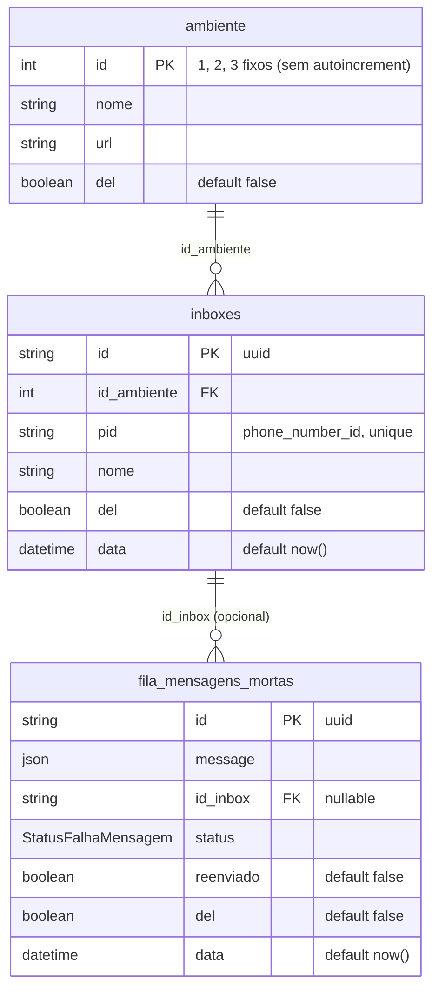
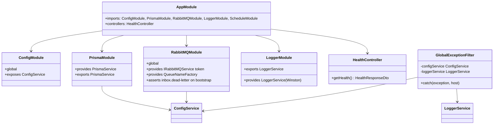
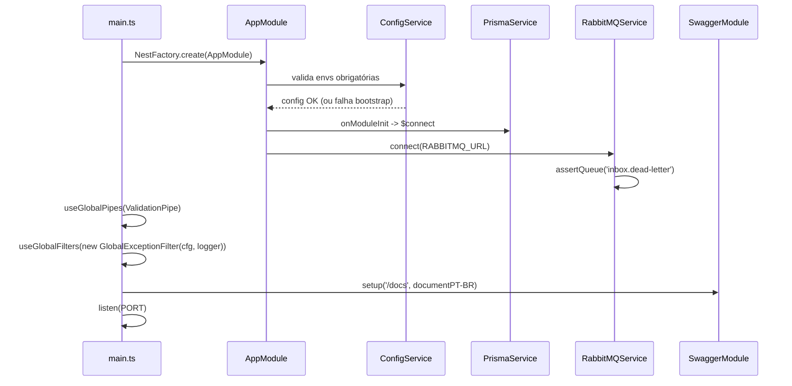
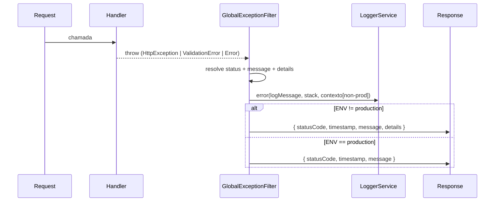
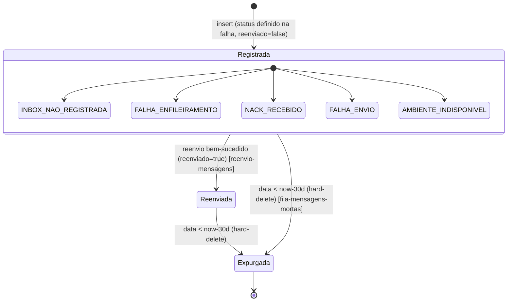
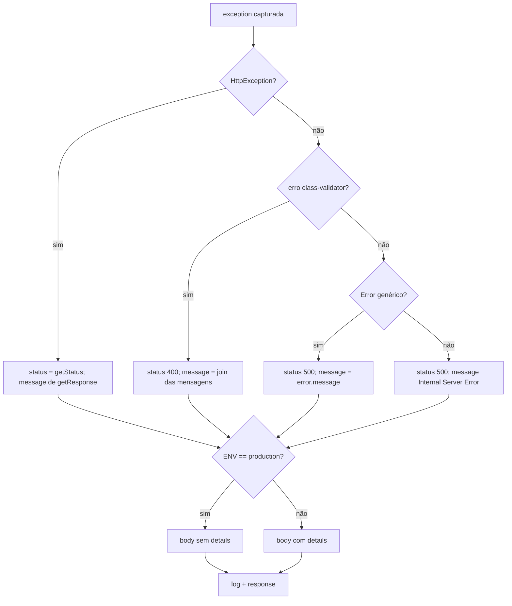

# Gateway Foundation

> Feature 1 de 7 do **whiz-gateway**. Infraestrutura base. As demais features (`cadastro-ambientes`, `cadastro-inboxes`, `fila-mensagens-mortas`, `webhook-ingestao`, `despacho-mensagens`, `reenvio-mensagens`) referenciam o schema e a infra definidos aqui.

## 1. Context

O **whiz-gateway** é um gateway que fica entre a **Meta** (webhooks do WhatsApp Cloud) e a aplicação de mensageria em `https://*.whiz.net.br`. Ele recebe webhooks da Meta, identifica o inbox de destino pelo **PID** (`phone_number_id`), enfileira a mensagem em uma fila RabbitMQ dinâmica por inbox, consome essa fila e **re-envia o webhook** para a URL do ambiente do inbox, com retentativas. Qualquer falha em qualquer ponto resulta no envio da mensagem para a tabela de mensagens mortas (`fila_mensagens_mortas`).

O gateway é um **passthrough**: não interpreta o conteúdo do payload. Os DTOs são genéricos e os pipes ficam limpos.

Esta spec entrega a **fundação**: configuração do Prisma e do schema das 3 tabelas, módulo global de RabbitMQ (topologia de filas), pipe de validação global, filtro global de exceções, logger Winston, Swagger, healthcheck e configuração de ambiente via `ConfigService`. Sem esta base, nenhuma das outras 6 features compila ou executa.

**Usuários/atores:** a plataforma Meta (origem dos webhooks), os operadores que monitoram o `/docs` e o healthcheck, e os ambientes de mensageria (destino dos re-envios).

## 2. Scope

**In:**
- Datasource Prisma (PostgreSQL) + 3 models (`ambiente`, `inboxes`, `fila_mensagens_mortas`) + enum `StatusFalhaMensagem`. **ERD compartilhado mora aqui.**
- Migrations de criação das tabelas + migration **separada** de seed inserindo os 3 ambientes fixos.
- `PrismaModule` + `PrismaService` (wrapper de conexão) e o padrão de repositório (injeção por interface + token).
- `RabbitMQModule` `@Global()` envolvendo `amqp-connection-manager`, expondo `IRabbitMQService`, `QueueNameFactory` e a topologia de filas (DLQ estática + args de dynamic queues).
- Assert da DLQ estática `inbox.dead-letter` no bootstrap.
- `ValidationPipe` global `{ whitelist, forbidNonWhitelisted, transform }`.
- Filtro global de exceções (`GlobalExceptionFilter`) + `LoggerService` (Winston, console + file).
- Swagger UI em `/docs` (PT-BR).
- Healthcheck `GET /`.
- `ConfigModule` global tipado (todas as envs).
- Registro do `@nestjs/schedule` (usado depois pela feature `fila-mensagens-mortas`).
- Dockerfile multi-stage + `.dockerignore` (documentado aqui; arquivo gerado na fase de código).

**Out (features próprias):**
- CRUD de `ambiente` → **`cadastro-ambientes`**.
- CRUD de `inboxes` + ciclo de vida `assertQueue`/`startConsuming`/`stopConsuming`/`deleteQueue` por inbox → **`cadastro-inboxes`**.
- Leitura/CRUD da `fila_mensagens_mortas`, `DeadLetterConsumerService` e cron de hard-delete (>30 dias) → **`fila-mensagens-mortas`**.
- `GET/POST /webhook` (verify handshake, validação de assinatura, roteamento por PID, enfileiramento) → **`webhook-ingestao`**.
- Consumo da fila do inbox + re-envio HTTP + retry + dead-letter → **`despacho-mensagens`**.
- `/messages/resend` (filtro por data ou PID) → **`reenvio-mensagens`**.

## 3. Glossary

| Termo | Significado |
|---|---|
| **PID** | `phone_number_id` da Meta; identifica o número/WhatsApp de origem. Correlaciona o webhook a um `inbox`. |
| **Ambiente** | Destino lógico do re-envio (`development`/`staging`/`production`), cada um com uma `url` base. |
| **Inbox** | Caixa que correlaciona um PID a um ambiente; cada inbox tem uma fila RabbitMQ dinâmica própria. |
| **Mensagem morta** | Webhook que falhou em algum ponto do fluxo; persistido em `fila_mensagens_mortas` com um `status`. |
| **DLQ** | Dead-letter queue estática única: `inbox.dead-letter`. |
| **Dynamic queue** | Fila criada sob demanda por inbox, nomeada `inbox.<inboxId>`. |
| **Passthrough** | Gateway não interpreta o conteúdo do payload; trafega o JSON cru. |
| **`del`** | Soft-delete booleano presente em todas as tabelas. |

## 4. Functional requirements

- **FR-1:** O Prisma expõe os models `ambiente`, `inboxes` e `fila_mensagens_mortas` e o enum `StatusFalhaMensagem`, conforme §6, usando `DATABASE_URL` lido via `ConfigService`.
- **FR-2:** As migrations criam as 3 tabelas **primeiro**; uma migration **separada e posterior** insere os 3 ambientes fixos: `(1, development, https://dev.2.whiz.net.br)`, `(2, staging, https://staging.2.whiz.net.br)`, `(3, production, https://server.whiz.net.br)`.
- **FR-3:** `PrismaService` conecta no `onModuleInit` e desconecta no `onModuleDestroy`; é injetável pelos repositórios.
- **FR-4:** `RabbitMQModule` é `@Global()`, conecta no `RABBITMQ_URL` (via `ConfigService`) usando `amqp-connection-manager`, e expõe a implementação de `IRabbitMQService` pelo token de interface.
- **FR-5:** `IRabbitMQService` define `assertQueue(name, dlqArgs)`, `deleteQueue(name)`, `startConsuming(name, handler)`, `stopConsuming(name)` e `sendToQueue(name, payload)`. (A invocação desses métodos por inbox é responsabilidade de outras features.)
- **FR-6:** `QueueNameFactory.inbox(id)` retorna `inbox.<id>`. Nenhum nome de fila é hardcoded fora dessa factory.
- **FR-7:** No bootstrap da aplicação, a DLQ estática `inbox.dead-letter` é declarada (`assertQueue`) de forma idempotente.
- **FR-8:** O argumento padrão de dynamic queue (`dlqArgs`) é `{ 'x-dead-letter-exchange': '', 'x-dead-letter-routing-key': 'inbox.dead-letter' }`, exposto pela infra para reuso.
- **FR-9:** `ValidationPipe` global com `{ whitelist: true, forbidNonWhitelisted: true, transform: true }` é aplicado em toda a aplicação.
- **FR-10:** `GlobalExceptionFilter` global captura qualquer exceção e responde `{ statusCode, timestamp, message }` (+ `details` apenas quando `ENV !== 'production'`), conforme §7/§11.
- **FR-11:** O filtro registra a falha via `LoggerService` (Winston, **transport de console apenas** — colorido em dev, JSON em prod; persistência de arquivo delegada ao orquestrador de container — OQ-3). **Não** persiste logs em Cassandra.
- **FR-12:** Erros do class-validator viram `400` com `message` agregando as mensagens de validação (join por `, `).
- **FR-13:** Swagger UI é servido em `/docs`; o documento usa textos PT-BR e o esquema de auth `bearer` (`@ApiBearerAuth('bearer')`) onde houver guard.
- **FR-14:** `GET /` é **readiness** (OQ-6) via `@nestjs/terminus`: checa conectividade de DB (`PrismaHealthIndicator`) e broker (indicador RabbitMQ), sem autenticação. Responde `200` com `HealthResponseDto { status: 'ok', timestamp: ISO8601, checks: { database, broker } }` quando saudável; `503` quando um indicador falha.
- **FR-15:** `ConfigModule` é global e disponibiliza, via `ConfigService`: `DATABASE_URL`, `RABBITMQ_URL`, `ENV` (default `development` — OQ-2), `PORT` (default `3000` — OQ-4), `META_VERIFY_TOKEN`, `META_APP_SECRET`, `DISPATCH_MAX_RETRIES` (default `5`), `DISPATCH_BACKOFF_BASE_MS` (default `1000` — OQ-1). Nenhum acesso a `process.env` fora do `ConfigModule` (inclui `PORT` no `main.ts`).
- **FR-16:** `@nestjs/schedule` (`ScheduleModule.forRoot()`) é registrado no `AppModule` (consumido depois pela cron de `fila-mensagens-mortas`).

## 5. Non-functional

- **NFR-1 (segurança):** Em `ENV === 'production'`, a resposta de erro **não** inclui `details`, stack trace, headers, params ou query — apenas `{ statusCode, timestamp, message }`.
- **NFR-2 (segurança):** Segredos (`DATABASE_URL`, `RABBITMQ_URL`, `META_APP_SECRET`, `META_VERIFY_TOKEN`) nunca aparecem em logs nem em respostas HTTP.
- **NFR-3 (observabilidade):** Toda exceção capturada gera uma entrada de log (Winston, **console apenas** — OQ-3) com `HTTP <status> ON <method> | <route> - <message>` e, fora de produção, contexto adicional (headers/params/query) limitado a `MAX_PAYLOAD_BODY_BYTES = 10240` para o corpo.
- **NFR-4 (resiliência):** A conexão RabbitMQ usa `amqp-connection-manager`, reconectando automaticamente em quedas; a aplicação sobe mesmo se o broker estiver temporariamente indisponível (reconecta quando voltar).
- **NFR-5 (performance):** ⚠️ **Revisto (OQ-6):** `GET /` passou de liveness puro para **readiness** (checa DB + broker), portanto o alvo P95 ≤ 50ms **não se aplica** — a latência depende das checagens de conectividade. Aceito pelo usuário.
- **NFR-6 (imagem):** A imagem Docker final é multi-stage, contém apenas build output (`dist`), `node_modules` de produção e artefatos do Prisma; sem código-fonte TS, sem devDependencies, sem `.git`.
- **NFR-7 (config):** Ausência de qualquer env obrigatória falha o bootstrap com mensagem clara (validação de schema de env).

## 6. Data model



**Enum `StatusFalhaMensagem`** — onde a mensagem falhou:

| Valor | Significado |
|---|---|
| `INBOX_NAO_REGISTRADA` | PID recebido não corresponde a nenhum inbox ativo. |
| `FALHA_ENFILEIRAMENTO` | Erro ao enfileirar na fila do inbox. |
| `NACK_RECEBIDO` | Consumidor devolveu `nack` para a mensagem. |
| `FALHA_ENVIO` | Re-envio HTTP ao ambiente falhou após esgotar as retentativas. |
| `AMBIENTE_INDISPONIVEL` | Backend de destino inacessível no momento (conexão recusada/timeout). |

**Tabela de campos**

| Tabela | Campo | Tipo | Regras |
|---|---|---|---|
| `ambiente` | `id` | Int PK | Fixo (1/2/3), **sem** autoincrement |
| `ambiente` | `nome` | String | obrigatório |
| `ambiente` | `url` | String | URL base do ambiente |
| `ambiente` | `del` | Boolean | default `false` |
| `inboxes` | `id` | String PK | uuid |
| `inboxes` | `id_ambiente` | Int FK | → `ambiente.id` |
| `inboxes` | `pid` | String | **unique**; `phone_number_id` da Meta |
| `inboxes` | `nome` | String | obrigatório |
| `inboxes` | `del` | Boolean | default `false` |
| `inboxes` | `data` | DateTime | default `now()` |
| `fila_mensagens_mortas` | `id` | String PK | uuid |
| `fila_mensagens_mortas` | `message` | Json | payload cru do webhook |
| `fila_mensagens_mortas` | `id_inbox` | String? FK | **nullable** → `inboxes.id` |
| `fila_mensagens_mortas` | `status` | `StatusFalhaMensagem` | obrigatório |
| `fila_mensagens_mortas` | `reenviado` | Boolean | default `false` |
| `fila_mensagens_mortas` | `del` | Boolean | default `false` |
| `fila_mensagens_mortas` | `data` | DateTime | default `now()` |

**Migrations (ordem obrigatória):**
1. `create_tables` — cria `ambiente`, `inboxes`, `fila_mensagens_mortas` e o enum.
2. `seed_ambientes` (migration **separada**, posterior) — `INSERT` dos 3 ambientes fixos.

## 7. API contract

### GET /  (healthcheck — readiness)
- **Auth**: nenhuma
- **Request**: —
- **Responses**:
  - `200 HealthResponseDto` — `{ status: 'ok', timestamp: ISO8601, checks: { database, broker } }` (DB + broker saudáveis)
  - `503` — quando um indicador (`@nestjs/terminus`) falha

### GET /docs  (Swagger UI)
- **Auth**: nenhuma (UI da documentação)
- **Responses**: `200 text/html` — interface Swagger; documento OpenAPI em PT-BR, esquema de segurança `bearer`.

### Topologia de filas (RabbitMQ)

```
### QUEUE inbox.dead-letter  (DLQ estática)
- Declaração: assertQueue no bootstrap da aplicação (idempotente)
- Direction: definida pela feature fila-mensagens-mortas (consumo)
- Payload: mensagem original + headers AMQP x-death

### QUEUE inbox.<inboxId>  (dynamic — criada com o inbox)
- Args: { 'x-dead-letter-exchange': '', 'x-dead-letter-routing-key': 'inbox.dead-letter' }
- Nome: QueueNameFactory.inbox(id) -> 'inbox.<id>'
- Lifecycle: assertQueue/startConsuming na criação · stopConsuming/deleteQueue na remoção
  (executado pela feature cadastro-inboxes — NÃO por esta feature)
```

A fundação **apenas** declara a DLQ e expõe a API de filas; o uso por inbox é de outras features.

### Resposta de erro (qualquer rota, via GlobalExceptionFilter)
```
{ "statusCode": number, "timestamp": ISO8601, "message": string, "details"?: object|string }
```
`details` presente **somente** quando `ENV !== 'production'`.

## 8. Module boundaries



**Regras de DI:** serviços injetam **interfaces + tokens** (ex.: `IRabbitMQService`), nunca classes concretas. Repositórios são injetados por interface. Controllers fazem só mapeamento HTTP e retornam `ResponseDto`, nunca entidades cruas.

## 9. Flows

### Bootstrap da aplicação



### Tratamento de exceção (filtro global)



## 10. State machines

Ciclo de vida de um registro em `fila_mensagens_mortas` (campos `status` + `reenviado`). A fundação **define** a forma; as transições são efetuadas por outras features.



## 11. Business rules

### Resolução de status/details no filtro global



### Regras adicionais
- `ambiente.id` é **fixo** (1/2/3) — nunca autoincrement; novos ambientes só por migration.
- Nome de fila **sempre** via `QueueNameFactory.inbox(id)`.
- Dynamic queue **sempre** declarada com os `dlqArgs` padrão (FR-8).
- `del = true` é soft-delete; hard-delete só existe na cron de `fila-mensagens-mortas`.

## 12. Edge cases & errors

- **Env faltando** → bootstrap falha com erro de validação de schema (não sobe servidor).
- **Banco indisponível no bootstrap** → `PrismaService.$connect` falha; aplicação não sobe (log de erro claro).
- **Broker indisponível no bootstrap** → `amqp-connection-manager` mantém tentando reconectar; HTTP continua respondendo (healthcheck OK).
- **DLQ já existe** → `assertQueue` é idempotente; sem erro.
- **Exceção não-`Error` (ex.: string lançada)** → cai no ramo default `500 Internal Server Error`.
- **Payload de log > 10240 bytes** → truncado com sufixo `…`.
- **`ENV` ausente** → tratado como `development` (default), nunca como produção (fail-safe para não vazar `details`? Não: §14).

## 13. Acceptance criteria

- **AC-1** `[backend]`: Dado o schema Prisma, quando rodar `prisma migrate`, então existem as tabelas `ambiente`, `inboxes`, `fila_mensagens_mortas` e o enum `StatusFalhaMensagem` com os campos da §6.
- **AC-2** `[backend]`: Dada a ordem de migrations, quando aplicadas, então as tabelas são criadas antes do seed e a tabela `ambiente` contém exatamente as linhas `(1, development, https://dev.2.whiz.net.br)`, `(2, staging, https://staging.2.whiz.net.br)`, `(3, production, https://server.whiz.net.br)`.
- **AC-3** `[backend]`: Dado `QueueNameFactory`, quando `inbox('abc')`, então retorna `'inbox.abc'`.
- **AC-4** `[backend]`: Dado o bootstrap, quando a app sobe, então `inbox.dead-letter` é declarada via `assertQueue` (idempotente — chamar duas vezes não lança).
- **AC-5** `[backend]`: Dado o `dlqArgs` padrão exposto pela infra, então é igual a `{ 'x-dead-letter-exchange': '', 'x-dead-letter-routing-key': 'inbox.dead-letter' }`.
- **AC-6** `[e2e]`: Dada a app iniciada (DB + broker saudáveis), quando `GET /`, então `200` com body contendo `status: 'ok'` e `timestamp` ISO8601 (readiness via terminus; presença dos campos, sem exigir ausência de `checks`).
- **AC-7** `[e2e]`: Dada a app iniciada, quando `GET /docs`, então `200` com a UI Swagger (HTML) e o documento OpenAPI com `info`/tags em PT-BR.
- **AC-8** `[e2e]`: Dado `ENV != production`, quando uma rota lança `Error` genérico, então `500` com body `{ statusCode, timestamp, message, details }` (com `details`).
- **AC-9** `[e2e]`: Dado `ENV == production`, quando uma rota lança `Error` genérico, então `500` com body `{ statusCode, timestamp, message }` **sem** `details`.
- **AC-10** `[e2e]`: Dado um DTO inválido enviado a uma rota com `ValidationPipe`, quando recebido, então `400` com `message` agregando as mensagens de validação.
- **AC-11** `[e2e]`: Dada uma rota com propriedade não permitida no body (`forbidNonWhitelisted`), quando recebida, então `400`.
- **AC-12** `[backend]`: Dado o filtro global, quando captura uma exceção, então invoca `LoggerService.error` (Winston) e **não** executa nenhuma escrita em Cassandra.
- **AC-13** `[backend]`: Dado o `ConfigService`, quando consultado, então fornece `DATABASE_URL`, `RABBITMQ_URL`, `ENV` (default `development`), `PORT` (default `3000`), `META_VERIFY_TOKEN`, `META_APP_SECRET`, `DISPATCH_MAX_RETRIES` (default `5`) e `DISPATCH_BACKOFF_BASE_MS` (default `1000`); nenhum `process.env` é lido fora do `ConfigModule`.
- **AC-14** `[backend]`: Dado `ScheduleModule.forRoot()` no `AppModule`, quando a app sobe, então o agendador está disponível para registro de crons.

## 14. Open questions — RESOLVIDAS

- **OQ-1 ✅:** `DISPATCH_BACKOFF_BASE_MS` default = `1000` (sequência exponencial 1s/2s/4s/8s/16s; reconfirmar em `despacho-mensagens`).
- **OQ-2 ✅:** `ENV` ausente assume `development` (mostra `details`) — alinha com `whiz_server_2.0`.
- **OQ-3 ✅:** Winston **somente console** (colorido em dev, JSON em prod). Sem file transport — persistência delegada ao orquestrador de container. Atualiza FR-11 e NFR-3.
- **OQ-4 ✅:** `PORT` é env própria (default `3000`), lida via `ConfigService`; `main.ts` não usa `process.env`. Atualiza FR-15.
- **OQ-5 ✅:** Enum `StatusFalhaMensagem` mantém os 5 valores propostos (§6).
- **OQ-6 ✅:** `GET /` é **readiness** (checa DB + broker via `@nestjs/terminus`). Atualiza FR-14, §7 e NFR-5 (alvo P95≤50ms revogado).
