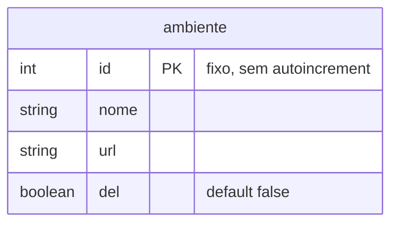
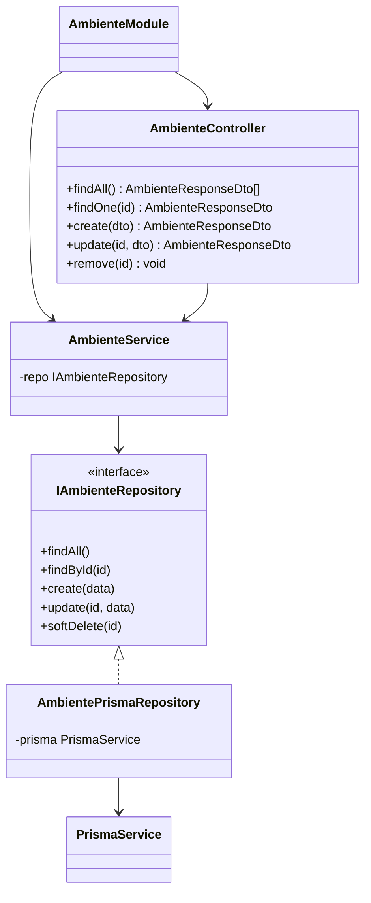
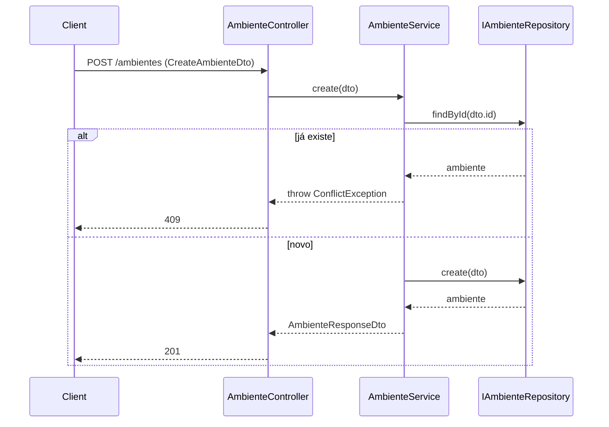
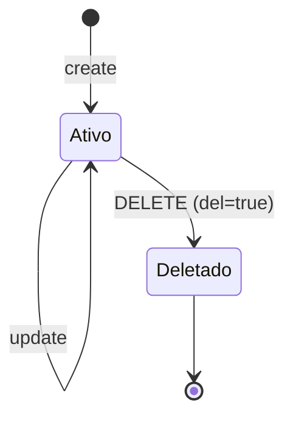
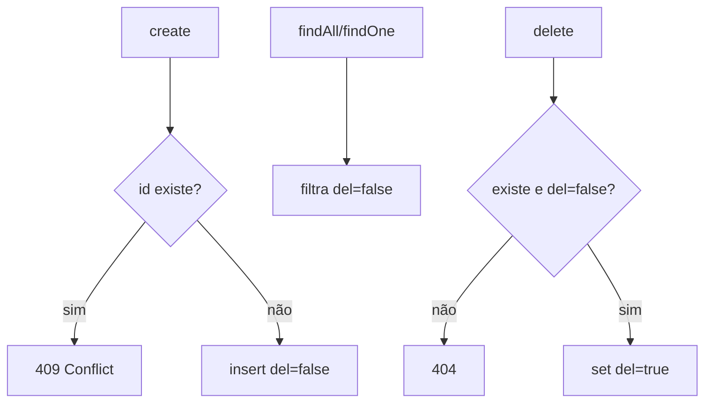

# Cadastro de Ambientes

> Feature 2 de 7 do **whiz-gateway**. CRUD da tabela `ambiente`. Schema e infra definidos em [`gateway-foundation`](./gateway-foundation.md) (§6/§8).

## 1. Context

`ambiente` mapeia cada destino lógico de re-envio (`development`/`staging`/`production`) a uma `url` base. Os `inboxes` apontam para um ambiente via `id_ambiente`, e o `despacho-mensagens` usa a `url` do ambiente para re-enviar o webhook. Os 3 ambientes já são inseridos por migration de seed (ver `gateway-foundation` FR-2), com `id` fixo (1/2/3). Esta feature entrega o módulo CRUD para listar, consultar, criar, atualizar e soft-deletar ambientes pela API, com Swagger PT-BR.

**Usuários/atores:** operadores/administradores que gerenciam os destinos de re-envio.

## 2. Scope

**In:**
- Módulo `AmbienteModule` (controller + service + repository + DTOs).
- `IAmbienteRepository` (token de interface) sobre `PrismaService`.
- Endpoints CRUD: `GET /ambientes`, `GET /ambientes/:id`, `POST /ambientes`, `PATCH /ambientes/:id`, `DELETE /ambientes/:id` (soft-delete via `del`).
- `AmbienteResponseDto` (nunca expõe entidade Prisma crua).
- Swagger PT-BR em todos os decorators.

**Out:**
- Schema/migrations/seed dos ambientes → `gateway-foundation`.
- Uso da `url` no re-envio → `despacho-mensagens`.
- Vínculo inbox→ambiente → `cadastro-inboxes`.

## 3. Glossary

| Termo | Significado |
|---|---|
| **Ambiente** | Destino de re-envio com `url` base; `id` fixo. |
| **Soft-delete** | `del = true`; registro permanece no banco mas é ocultado das listagens. |

## 4. Functional requirements

- **FR-1:** `GET /ambientes` retorna todos os ambientes com `del = false`, como `AmbienteResponseDto[]`.
- **FR-2:** `GET /ambientes/:id` retorna o ambiente (com `del = false`) ou `404` se inexistente/deletado.
- **FR-3:** `POST /ambientes` cria um ambiente a partir de `CreateAmbienteDto` (`id`, `nome`, `url`) e retorna `201 AmbienteResponseDto`. (`id` é fornecido — sem autoincrement, ver `gateway-foundation`.)
- **FR-4:** `POST /ambientes` com `id` já existente retorna `409 Conflict`.
- **FR-5:** `PATCH /ambientes/:id` atualiza `nome` e/ou `url` a partir de `UpdateAmbienteDto` e retorna `200 AmbienteResponseDto`; `404` se inexistente.
- **FR-6:** `DELETE /ambientes/:id` faz soft-delete (`del = true`) e retorna `200` (ou `204`); `404` se inexistente.
- **FR-7:** O repositório é injetado por interface (`IAmbienteRepository`), nunca pela classe concreta; o service nunca retorna entidade Prisma crua.
- **FR-8:** Todos os endpoints documentados em PT-BR no Swagger (`@ApiOperation`, `@ApiResponse`, `@ApiProperty`).

## 5. Non-functional

- **NFR-1:** `url` validada como URL absoluta (`@IsUrl`).
- **NFR-2:** `id` validado como inteiro positivo (`@IsInt`, `@Min(1)`).
- **NFR-3:** Listagem nunca expõe registros com `del = true`.
- **NFR-4:** Respostas sempre via `AmbienteResponseDto` (sem vazar campos internos além dos definidos).

## 6. Data model

Reutiliza o model `ambiente` de [`gateway-foundation` §6](./gateway-foundation.md). Sem novas tabelas.

**DTOs**

| DTO | Campos |
|---|---|
| `CreateAmbienteDto` | `id: int>=1`, `nome: string`, `url: string(url)` |
| `UpdateAmbienteDto` | `nome?: string`, `url?: string(url)` |
| `AmbienteResponseDto` | `id: int`, `nome: string`, `url: string`, `del: boolean` |

## 7. API contract

### GET /ambientes
- **Auth**: Bearer JWT
- **Responses**: `200 AmbienteResponseDto[]`

### GET /ambientes/:id
- **Auth**: Bearer JWT
- **Request**: param `id: int`
- **Responses**: `200 AmbienteResponseDto` | `404`

### POST /ambientes
- **Auth**: Bearer JWT
- **Request**: `CreateAmbienteDto` — `id:int>=1`, `nome:string`, `url:string(url)`
- **Responses**: `201 AmbienteResponseDto` | `400 validação` | `409 id duplicado`

### PATCH /ambientes/:id
- **Auth**: Bearer JWT
- **Request**: param `id:int`; `UpdateAmbienteDto` — `nome?:string`, `url?:string(url)`
- **Responses**: `200 AmbienteResponseDto` | `400` | `404`

### DELETE /ambientes/:id
- **Auth**: Bearer JWT
- **Request**: param `id:int`
- **Responses**: `200`/`204` | `404`

## 8. Module boundaries

## 9. Flows

## 10. State machines

## 11. Business rules

## 12. Edge cases & errors

- `POST` com `id` de ambiente soft-deletado → decisão: `409` (id ocupado) ou reativar? Ver §14.
- `PATCH`/`DELETE` em id inexistente ou já `del=true` → `404`.
- `url` malformada → `400`.
- Body com campo extra → `400` (`forbidNonWhitelisted`).

## 13. Acceptance criteria

- **AC-1** `[e2e]`: Dado ambientes seedados, quando `GET /ambientes`, então `200` com os 3 ambientes (`del=false`).
- **AC-2** `[e2e]`: Dado id existente, quando `GET /ambientes/2`, então `200` com `nome=staging`, `url=https://staging.2.whiz.net.br`.
- **AC-3** `[e2e]`: Dado id inexistente, quando `GET /ambientes/99`, então `404`.
- **AC-4** `[e2e]`: Dado `CreateAmbienteDto` válido com `id` novo, quando `POST /ambientes`, então `201 AmbienteResponseDto`.
- **AC-5** `[backend]`: Dado `id` já existente, quando `create`, então `ConflictException` (409).
- **AC-6** `[e2e]`: Dado `url` inválida, quando `POST /ambientes`, então `400`.
- **AC-7** `[e2e]`: Dado id existente, quando `PATCH /ambientes/:id` com `nome` novo, então `200` e `nome` atualizado.
- **AC-8** `[e2e]`: Dado id existente, quando `DELETE /ambientes/:id`, então soft-delete e ausente em `GET /ambientes`.
- **AC-9** `[backend]`: Dado o service, quando retorna, então o tipo é `AmbienteResponseDto` (sem entidade Prisma crua).

## 14. Open questions

- **OQ-1:** Estratégia de auth (JWT) — guard global do app ou por módulo? (assumido Bearer; definir em feature de auth, se existir).
- **OQ-2:** `POST` com `id` de ambiente soft-deletado deve reativar (`del=false`) ou retornar `409`? Proposto `409`.
- **OQ-3:** Permitir criação livre de ambientes via API conflita com `id` fixo da migration? Proposto: permitir, mas `id` continua manual (sem autoincrement).
