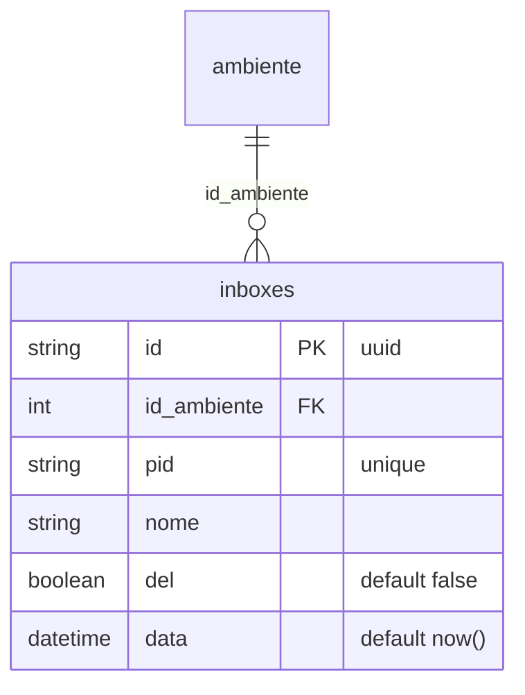
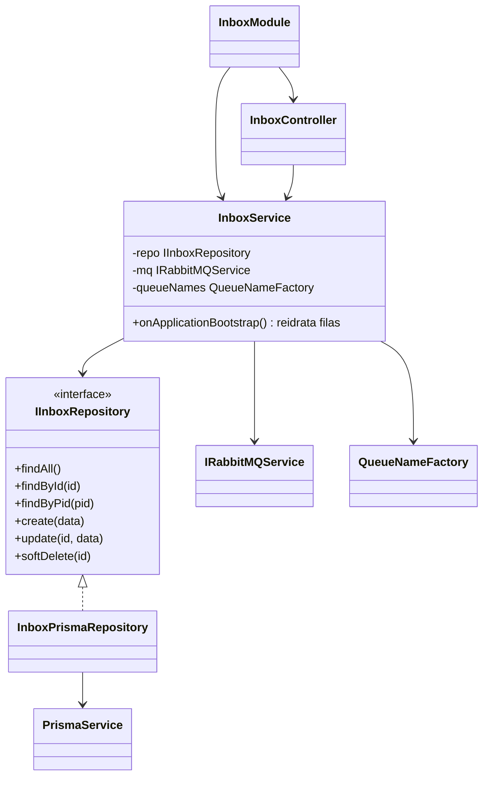
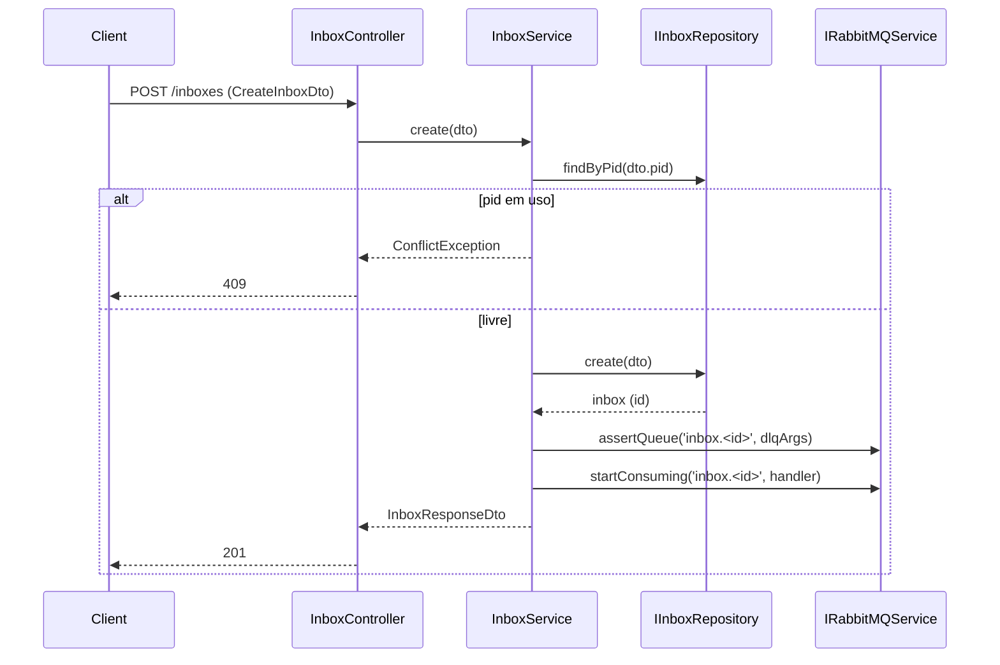
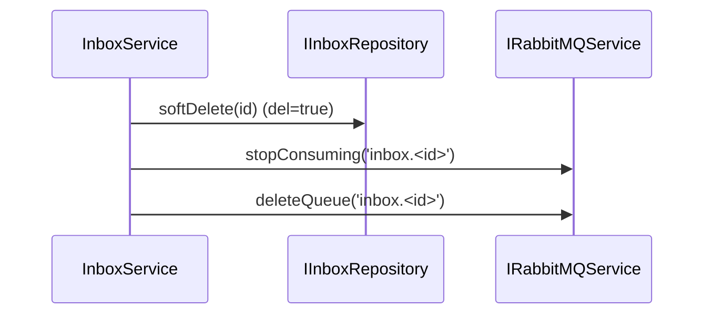
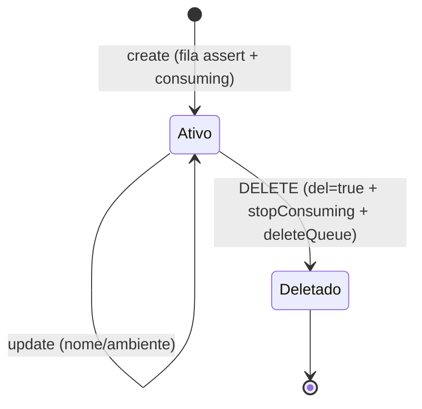
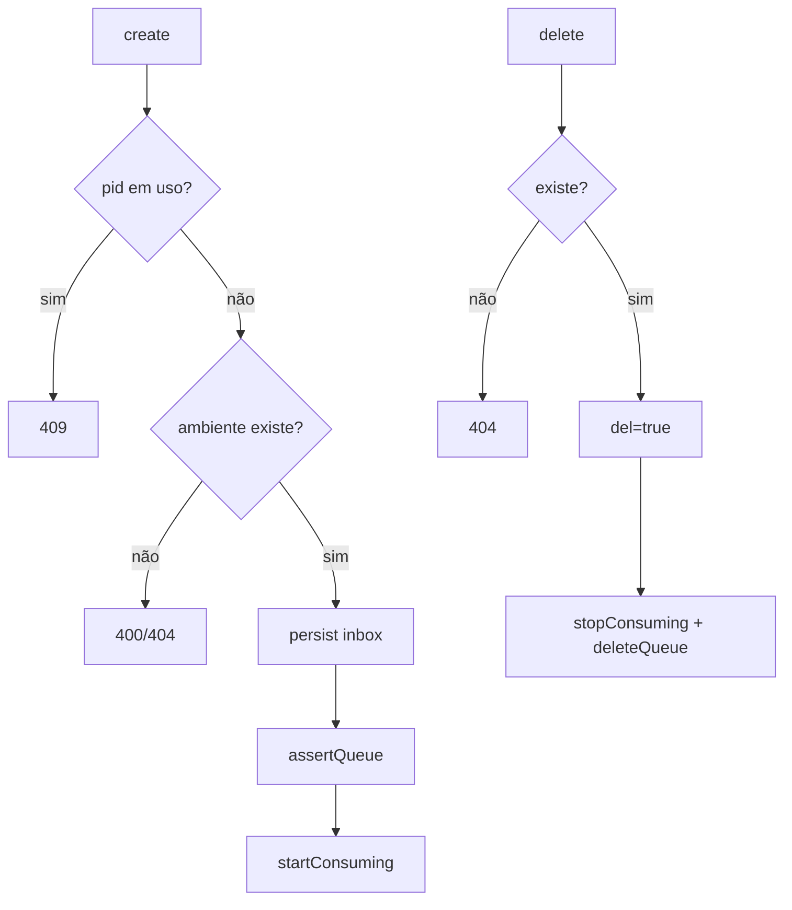

# Cadastro de Inboxes

> Feature 3 de 7 do **whiz-gateway**. CRUD da tabela `inboxes` **+** ciclo de vida da fila RabbitMQ por inbox. Schema e `IRabbitMQService`/`QueueNameFactory` em [`gateway-foundation`](./gateway-foundation.md) (§6/§8).

## 1. Context

Cada `inbox` correlaciona um **PID** (`phone_number_id` da Meta) a um **ambiente** de destino. Quando o webhook chega (`webhook-ingestao`), o PID é usado para achar o inbox e enfileirar a mensagem na fila dinâmica daquele inbox (`inbox.<id>`), consumida por `despacho-mensagens`.

Por isso, o ciclo de vida da fila acompanha o ciclo de vida do inbox: **na criação** do inbox, a fila é declarada (`assertQueue`) e o consumo iniciado (`startConsuming`); **na remoção**, o consumo é parado (`stopConsuming`) e a fila apagada (`deleteQueue`). Conforme as regras do projeto, **somente o inbox service** executa essas operações de fila.

**Usuários/atores:** operadores que cadastram inboxes; a infra RabbitMQ.

## 2. Scope

**In:**
- `InboxModule` (controller + service + repository + DTOs).
- `IInboxRepository` (token) sobre `PrismaService`.
- CRUD: `GET /inboxes`, `GET /inboxes/:id`, `POST /inboxes`, `PATCH /inboxes/:id`, `DELETE /inboxes/:id` (soft-delete via `del`).
- Ciclo de vida da fila no `InboxService`: criar inbox → `assertQueue(QueueNameFactory.inbox(id), dlqArgs)` + `startConsuming(...)`; remover inbox → `stopConsuming(...)` + `deleteQueue(...)`.
- Re-assert/re-consumo das filas dos inboxes ativos no **bootstrap** (reidratação após restart).
- Validação de `pid` único e `id_ambiente` existente.
- `InboxResponseDto`; Swagger PT-BR.

**Out:**
- Schema/migrations → `gateway-foundation`.
- `IRabbitMQService`, `QueueNameFactory`, `dlqArgs`, DLQ estática → `gateway-foundation`.
- Handler real do consumo (re-envio HTTP) → `despacho-mensagens` (esta feature inicia o consumo apontando para o handler exportado por `despacho-mensagens`; ver §14).
- Roteamento de webhook por PID → `webhook-ingestao`.

## 3. Glossary

| Termo | Significado |
|---|---|
| **PID** | `phone_number_id` da Meta; único por inbox. |
| **Fila dinâmica** | `inbox.<id>`, criada/destruída junto do inbox. |
| **Reidratação** | No bootstrap, re-assert + re-consumo das filas dos inboxes ativos. |

## 4. Functional requirements

- **FR-1:** `POST /inboxes` cria inbox a partir de `CreateInboxDto` (`id_ambiente`, `pid`, `nome`) e retorna `201 InboxResponseDto`.
- **FR-2:** `pid` é **único**; `POST` com `pid` já usado (em inbox `del=false`) retorna `409 Conflict`.
- **FR-3:** `id_ambiente` deve referenciar um `ambiente` existente (`del=false`); caso contrário `400`/`404` (ver §14).
- **FR-4:** Ao criar inbox, o service chama `IRabbitMQService.assertQueue(QueueNameFactory.inbox(id), dlqArgs)` e depois `startConsuming(QueueNameFactory.inbox(id), handler)`. A persistência ocorre **antes** das operações de fila.
- **FR-5:** `GET /inboxes` retorna inboxes `del=false` como `InboxResponseDto[]`; `GET /inboxes/:id` retorna um ou `404`.
- **FR-6:** `PATCH /inboxes/:id` atualiza `nome` e/ou `id_ambiente` (não altera `pid`; ver §14) e retorna `200`.
- **FR-7:** `DELETE /inboxes/:id` faz soft-delete (`del=true`) e, em seguida, `IRabbitMQService.stopConsuming` + `deleteQueue` da fila do inbox; retorna `200`/`204`.
- **FR-8:** No bootstrap, o service reidrata: para cada inbox `del=false`, `assertQueue` + `startConsuming` (idempotente).
- **FR-9:** Repositório injetado por interface; nunca retorna entidade Prisma crua.
- **FR-10:** Swagger PT-BR em todos os endpoints/DTOs.

## 5. Non-functional

- **NFR-1:** `assertQueue` e `deleteQueue` idempotentes — recriar/remover fila inexistente não derruba a aplicação.
- **NFR-2:** Falha na operação de fila após persistir o inbox não deve deixar estado inconsistente silencioso: logar e (ver §14) compensar/marcar.
- **NFR-3:** `pid` indexado para lookup rápido (usado por `webhook-ingestao`).
- **NFR-4:** Reidratação no bootstrap não bloqueia o healthcheck por muito tempo (executa de forma resiliente).

## 6. Data model

Reutiliza `inboxes` de [`gateway-foundation` §6](./gateway-foundation.md).

**DTOs**

| DTO | Campos |
|---|---|
| `CreateInboxDto` | `id_ambiente: int`, `pid: string`, `nome: string` |
| `UpdateInboxDto` | `nome?: string`, `id_ambiente?: int` |
| `InboxResponseDto` | `id: string`, `id_ambiente: int`, `pid: string`, `nome: string`, `del: boolean`, `data: ISO8601` |

## 7. API contract

### POST /inboxes
- **Auth**: Bearer JWT
- **Request**: `CreateInboxDto` — `id_ambiente:int`, `pid:string`, `nome:string`
- **Responses**: `201 InboxResponseDto` | `400 validação/ambiente inexistente` | `409 pid duplicado`

### GET /inboxes
- **Auth**: Bearer JWT
- **Responses**: `200 InboxResponseDto[]`

### GET /inboxes/:id
- **Auth**: Bearer JWT
- **Responses**: `200 InboxResponseDto` | `404`

### PATCH /inboxes/:id
- **Auth**: Bearer JWT
- **Request**: `UpdateInboxDto`
- **Responses**: `200 InboxResponseDto` | `400` | `404`

### DELETE /inboxes/:id
- **Auth**: Bearer JWT
- **Responses**: `200`/`204` | `404`

### QUEUE inbox.<inboxId>  (dynamic)
- **Lifecycle**: `assertQueue` + `startConsuming` na criação · `stopConsuming` + `deleteQueue` na remoção · re-assert/re-consumo no bootstrap
- **Args**: `dlqArgs` padrão (ver `gateway-foundation` FR-8)
- **On failure**: → `inbox.dead-letter`

## 8. Module boundaries

## 9. Flows

### Criação de inbox + fila

### Remoção de inbox + fila

## 10. State machines

## 11. Business rules

## 12. Edge cases & errors

- `pid` duplicado → `409`.
- `id_ambiente` inexistente → `400`/`404` (§14).
- Falha de `assertQueue` após persistir → logar; estado de compensação em §14.
- Restart da app → reidratação re-assert + re-consumo (idempotente).
- `DELETE` de inbox já `del=true` → `404`.
- Tentativa de alterar `pid` via `PATCH` → ignorada/`400` (§14).
- `deleteQueue` de fila inexistente → idempotente, sem erro.

## 13. Acceptance criteria

- **AC-1** `[e2e]`: Dado `CreateInboxDto` válido, quando `POST /inboxes`, então `201 InboxResponseDto` com `id` uuid e `del=false`.
- **AC-2** `[backend]`: Dado o create, quando o inbox é persistido, então `IRabbitMQService.assertQueue('inbox.<id>', dlqArgs)` e `startConsuming('inbox.<id>', handler)` são chamados nessa ordem, após a persistência.
- **AC-3** `[backend]`: Dado `pid` já usado em inbox `del=false`, quando `create`, então `ConflictException` (409) e **nenhuma** fila é criada.
- **AC-4** `[backend]`: Dado `id_ambiente` inexistente, quando `create`, então erro (`400`/`404`) e nenhuma persistência.
- **AC-5** `[e2e]`: Dado inbox existente, quando `DELETE /inboxes/:id`, então `del=true`, `stopConsuming` e `deleteQueue('inbox.<id>')` chamados.
- **AC-6** `[e2e]`: Dado inbox deletado, quando `GET /inboxes`, então não aparece na lista.
- **AC-7** `[backend]`: Dado bootstrap com N inboxes `del=false`, quando `onApplicationBootstrap`, então `assertQueue` + `startConsuming` chamados para cada um (idempotente).
- **AC-8** `[e2e]`: Dado inbox existente, quando `PATCH` altera `nome`, então `200` e `nome` atualizado; `pid` inalterado.
- **AC-9** `[backend]`: Dado o service, quando retorna, então tipo `InboxResponseDto` (sem entidade Prisma crua).

## 14. Open questions

- **OQ-1:** `id_ambiente` inexistente → `400` (validação de negócio) ou `404`? Proposto `400` com mensagem clara.
- **OQ-2:** Compensação se `assertQueue` falhar após persistir: rollback do inbox (transação) ou marcar e retentar no bootstrap? Proposto: log + reidratação no bootstrap cobre o caso.
- **OQ-3:** O `handler` de consumo pertence a `despacho-mensagens`. Como `InboxService` (que inicia o consumo) referencia esse handler sem `forwardRef`? Proposto: `IDispatchHandler` (token) exportado por `despacho-mensagens`, injetado no `InboxService`. **Decisão necessária antes da fase de código desta feature.**
- **OQ-4:** `PATCH` pode alterar `pid`? Proposto: **não** (pid é a chave de correlação com a Meta); alterar exige recriar inbox.
- **OQ-5:** Reidratação no bootstrap vive em `cadastro-inboxes` ou em `despacho-mensagens`? Proposto: aqui (dono do ciclo de vida da fila), consumindo o handler injetado.
