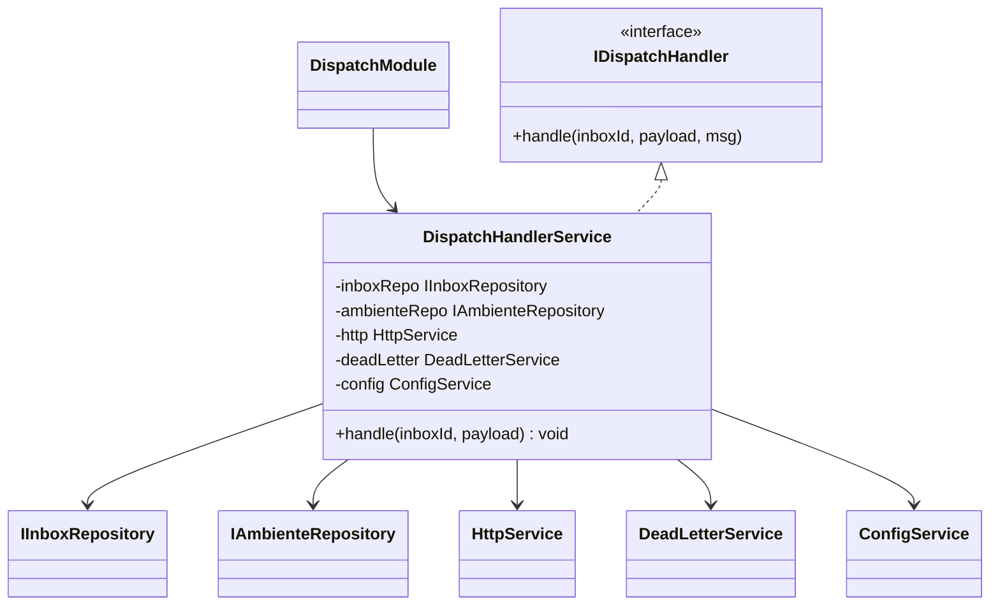
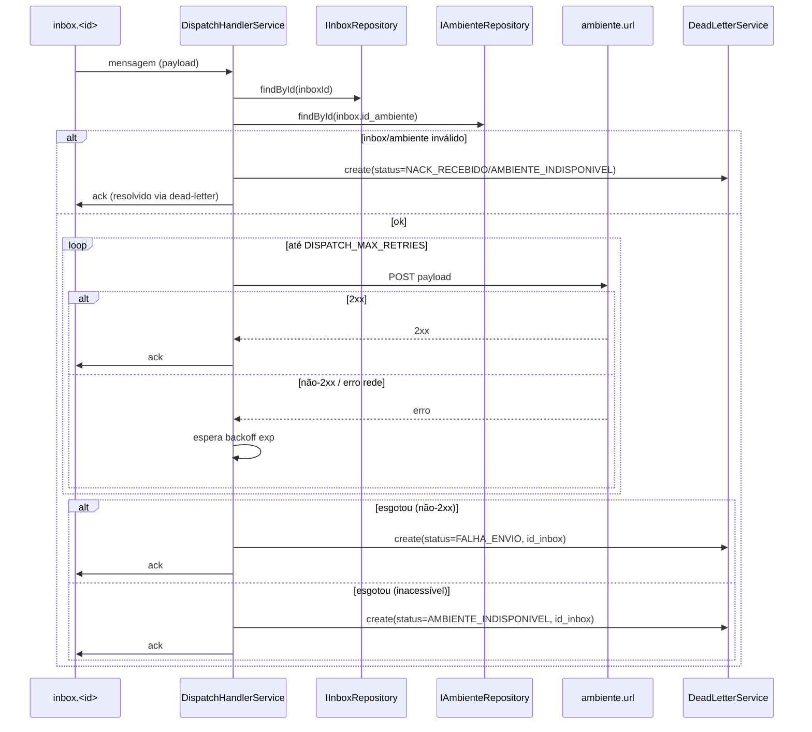
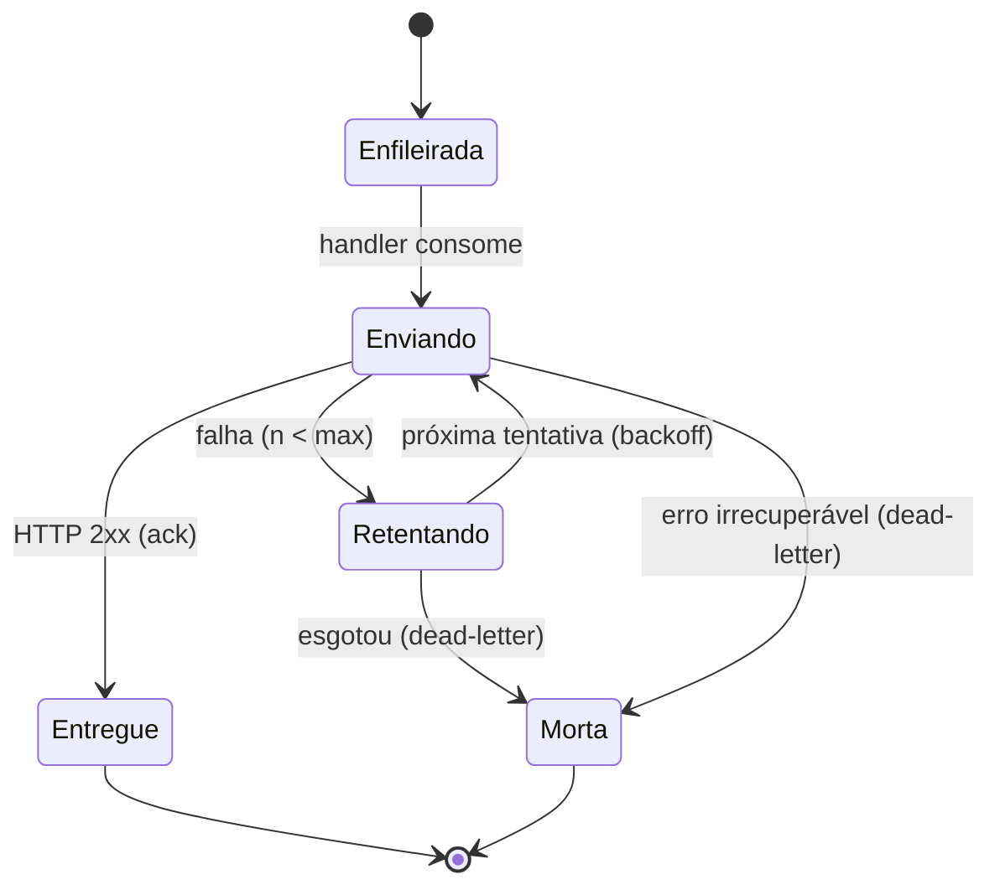
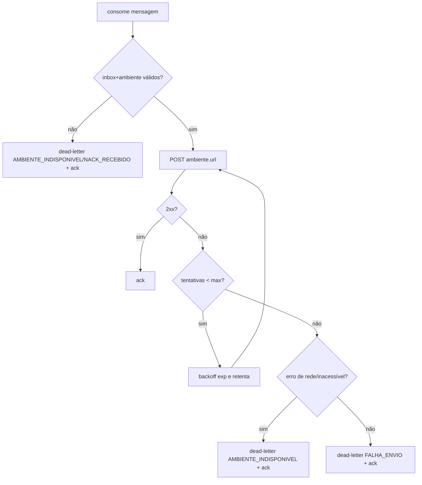

# Despacho de Mensagens

> Feature 6 de 7 do **whiz-gateway**. Consome a fila do inbox e re-envia o webhook à URL do ambiente, com retentativas; falhas vão para a dead-letter. Infra/schema em [`gateway-foundation`](./gateway-foundation.md); filas em [`cadastro-inboxes`](./cadastro-inboxes.md); dead-letter em [`fila-mensagens-mortas`](./fila-mensagens-mortas.md).

## 1. Context

Depois que `webhook-ingestao` enfileira o payload cru em `inbox.<id>`, esta feature **consome** essa fila e **re-envia** (POST HTTP) o payload para a `url` do ambiente correlacionado ao inbox (via `id_ambiente → ambiente.url`). O envio tem **retentativas com backoff exponencial** (default 5). Se todas falharem, ou se o consumo der `nack`, ou se o backend de destino estiver indisponível, a mensagem é dead-lettered em `fila_mensagens_mortas` com o `status` adequado.

Esta feature fornece o **handler de consumo** que `cadastro-inboxes` registra via `startConsuming` (a fronteira está em `cadastro-inboxes` OQ-3: handler exposto por `IDispatchHandler`).

**Usuários/atores:** infra RabbitMQ (fila do inbox); ambiente de destino (HTTP); `fila-mensagens-mortas` (falhas).

## 2. Scope

**In:**
- `DispatchModule` (service + handler + cliente HTTP).
- `IDispatchHandler` (token) — função `handle(inboxId, payload, channelMsg)` registrada por `cadastro-inboxes` no `startConsuming`.
- Re-envio HTTP (`@nestjs/axios`/`HttpService` ou `fetch`) para `ambiente.url`, resolvendo `inbox → ambiente`.
- Retry com backoff exponencial: `DISPATCH_MAX_RETRIES` (default 5), `DISPATCH_BACKOFF_BASE_MS`.
- `ack` em sucesso (HTTP 2xx); dead-letter + decisão `ack`/`nack` em falha.
- Inserção em `fila_mensagens_mortas` com `status` `FALHA_ENVIO`, `NACK_RECEBIDO` ou `AMBIENTE_INDISPONIVEL`.
- Swagger N/A (sem endpoint HTTP próprio); documentar a topologia de consumo.

**Out:**
- Criação/registro da fila e `startConsuming` → `cadastro-inboxes` (esta feature só fornece o handler).
- Persistência/leitura da dead-letter → `fila-mensagens-mortas` (chama `create`).
- Recebimento do webhook da Meta → `webhook-ingestao`.
- Re-disparo manual (`/messages/resend`) → `reenvio-mensagens`.

## 3. Glossary

| Termo | Significado |
|---|---|
| **Re-envio** | POST HTTP do payload cru para a `url` do ambiente do inbox. |
| **Backoff exponencial** | Espera crescente entre tentativas (`base * 2^n`). |
| **`ack`/`nack`** | Confirmação/recusa da mensagem no RabbitMQ. |
| **Handler** | Função registrada no `startConsuming` que processa cada mensagem. |

## 4. Functional requirements

- **FR-1:** O handler recebe `(inboxId, payload)` de uma mensagem da fila `inbox.<inboxId>`, resolve o inbox e o `ambiente` (`id_ambiente → ambiente.url`).
- **FR-2:** Faz `POST {ambiente.url}` com o payload cru (passthrough) e headers apropriados (`Content-Type: application/json`).
- **FR-3:** Em resposta HTTP 2xx → `ack` da mensagem; processamento concluído.
- **FR-4:** Em resposta não-2xx ou erro de rede, **retenta** com backoff exponencial até `DISPATCH_MAX_RETRIES` (default 5) tentativas.
- **FR-5:** Esgotadas as tentativas por resposta não-2xx → dead-letter com `status=FALHA_ENVIO`, `id_inbox=inboxId`; mensagem removida da fila (decisão `ack` vs `nack`→DLQ em §14).
- **FR-6:** Esgotadas as tentativas por backend inacessível (conexão recusada/timeout/DNS) → dead-letter com `status=AMBIENTE_INDISPONIVEL`, `id_inbox=inboxId`.
- **FR-7:** Se o consumo precisar dar `nack` (erro irrecuperável antes do envio, ex.: inbox/ambiente não resolvido) → dead-letter com `status=NACK_RECEBIDO` (a DLQ recebe via `x-dead-letter-routing-key`) — ver §11/§14.
- **FR-8:** O ambiente é resolvido via repositórios já existentes (`IInboxRepository`, `IAmbienteRepository`) por interface/token.
- **FR-9:** Knobs de retry lidos via `ConfigService` (`DISPATCH_MAX_RETRIES`, `DISPATCH_BACKOFF_BASE_MS`).
- **FR-10:** Inbox `del=true` ou ambiente inexistente no momento do consumo → dead-letter (status em §14) sem reter indefinidamente.

## 5. Non-functional

- **NFR-1 (resiliência):** Backoff exponencial: tentativa `n` espera `DISPATCH_BACKOFF_BASE_MS * 2^(n-1)` (ex.: base 1000 → 1s/2s/4s/8s/16s para 5 tentativas).
- **NFR-2 (observabilidade):** Cada tentativa falha é logada (`Logger`) com inbox, ambiente, status/erro e número da tentativa.
- **NFR-3 (segurança):** Payload re-enviado é o cru recebido; nenhuma transformação. Segredos não logados.
- **NFR-4 (throughput):** Consumo com prefetch configurável para não sobrecarregar o destino (§14).
- **NFR-5:** Timeout por requisição HTTP configurável (§14) para não travar a tentativa indefinidamente.

## 6. Data model

Sem tabelas próprias. Lê `inboxes`/`ambiente`; escreve em `fila_mensagens_mortas` (via `fila-mensagens-mortas`). Ver [`gateway-foundation` §6](./gateway-foundation.md).

## 7. API contract

Sem endpoint HTTP. Topologia de consumo:

```
### QUEUE inbox.<inboxId>  (consume)
- **Direction**: consume (handler de DispatchModule, registrado por cadastro-inboxes)
- **Payload**: payload cru do webhook (passthrough)
- **Sucesso**: HTTP 2xx no ambiente.url -> ack
- **Falha**: retry (backoff exp, max DISPATCH_MAX_RETRIES) -> dead-letter
- **DLQ**: inbox.dead-letter (x-dead-letter-routing-key) para o caso nack
```

## 8. Module boundaries



> `cadastro-inboxes` injeta `IDispatchHandler` (sem `forwardRef`) e usa `handler.handle` no `startConsuming`.

## 9. Flows

### Consumo + re-envio com retry



## 10. State machines

Estado da mensagem **em trânsito** na fila do inbox:



## 11. Business rules



### Regras
- `status`: não-2xx após retries → `FALHA_ENVIO`; conexão recusada/timeout/DNS → `AMBIENTE_INDISPONIVEL`; `nack` por erro irrecuperável pré-envio → `NACK_RECEBIDO`.
- Payload re-enviado é o cru (passthrough).
- Decisão de `ack` vs deixar `nack` rotear para a DLQ nativa: ver §14 — proposto **insert direto + ack** para controlar o `status`.

## 12. Edge cases & errors

- Backend retorna 5xx transitório → retenta; persistente → `FALHA_ENVIO`.
- Backend recusa conexão / timeout → `AMBIENTE_INDISPONIVEL`.
- Inbox apagado entre enfileiramento e consumo → dead-letter (status §14).
- Ambiente `del=true`/inexistente → dead-letter.
- Payload não-JSON na fila → re-envia como veio (passthrough); se destino rejeitar → trilha de retry/`FALHA_ENVIO`.
- Mensagem re-entregue pelo broker após crash → reprocessada (idempotência do destino fora de escopo).

## 13. Acceptance criteria

- **AC-1** `[backend]`: Dada uma mensagem na fila e ambiente que responde 2xx, quando o handler processa, então faz `POST {ambiente.url}` com o payload cru e dá `ack`.
- **AC-2** `[backend]`: Dado ambiente que responde não-2xx, quando o handler processa, então retenta até `DISPATCH_MAX_RETRIES` com backoff exponencial.
- **AC-3** `[backend]`: Dado backoff exponencial com base `B`, quando retenta, então a espera da tentativa `n` é `B * 2^(n-1)`.
- **AC-4** `[backend]`: Dadas todas as tentativas com não-2xx, quando esgota, então `DeadLetterService.create` com `status=FALHA_ENVIO`, `id_inbox`.
- **AC-5** `[backend]`: Dado backend inacessível (conexão recusada/timeout) em todas as tentativas, quando esgota, então dead-letter com `status=AMBIENTE_INDISPONIVEL`.
- **AC-6** `[backend]`: Dado inbox/ambiente não resolvível no consumo, quando processa, então dead-letter (`NACK_RECEBIDO`/`AMBIENTE_INDISPONIVEL`) sem retentar HTTP.
- **AC-7** `[backend]`: Dado HTTP 2xx, quando processa, então **não** insere nada em `fila_mensagens_mortas`.
- **AC-8** `[backend]`: Dado `DISPATCH_MAX_RETRIES` e `DISPATCH_BACKOFF_BASE_MS`, quando o handler roda, então os valores vêm do `ConfigService`.
- **AC-9** `[backend]`: Dado `IDispatchHandler`, quando `cadastro-inboxes` registra o consumo, então usa `handle` deste módulo (injetado por token, sem `forwardRef`).

## 14. Open questions

- **OQ-1:** Após dead-letter, dar `ack` (insert direto controla `status`) ou `nack` (DLQ nativa via `x-dead-letter-routing-key`)? Proposto: **insert direto + ack** para registrar o `status` correto; deixar a rota DLQ nativa só para `nack` de erro irrecuperável.
- **OQ-2:** `DISPATCH_BACKOFF_BASE_MS` default (proposto `1000`).
- **OQ-3:** Timeout HTTP por tentativa (proposto `10s`).
- **OQ-4:** Prefetch/concorrência do consumidor (proposto `10`).
- **OQ-5:** O que conta como "2xx de sucesso"? Apenas `2xx`, ou também `3xx`? Proposto: apenas `2xx`.
- **OQ-6:** Inbox apagado entre enfileiramento e consumo: qual `status`? Proposto `NACK_RECEBIDO` (não há para onde entregar).
- **OQ-7:** Retentar dentro do handler (sleep no consumidor, segura a mensagem) ou re-publicar com delay (requeue)? Proposto: retry **in-handler** com backoff (mais simples); avaliar requeue com delay se prefetch sofrer.

## 17. Changelog

| Data | Tipo | Descrição |
|---|---|---|
| 2026-06-08 | hotfix | `DISPATCH_MAX_RETRIES` default elevado de `5` para `10`. Log de tentativa falha enriquecido com URL do ambiente e HTTP status code. Sem alteração de FR/AC — comportamento de retry e dead-letter inalterado. Ver `docs/fixes/despacho-mensagens-hotfix-despacho-retries-log.md`. |
