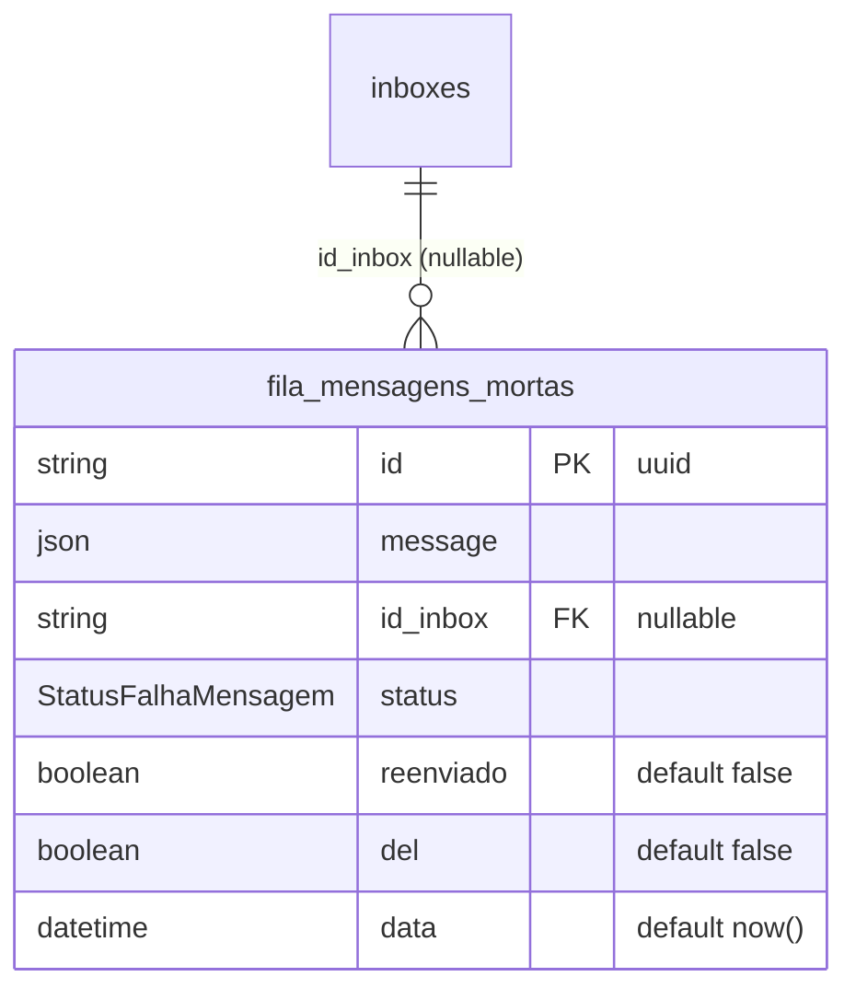
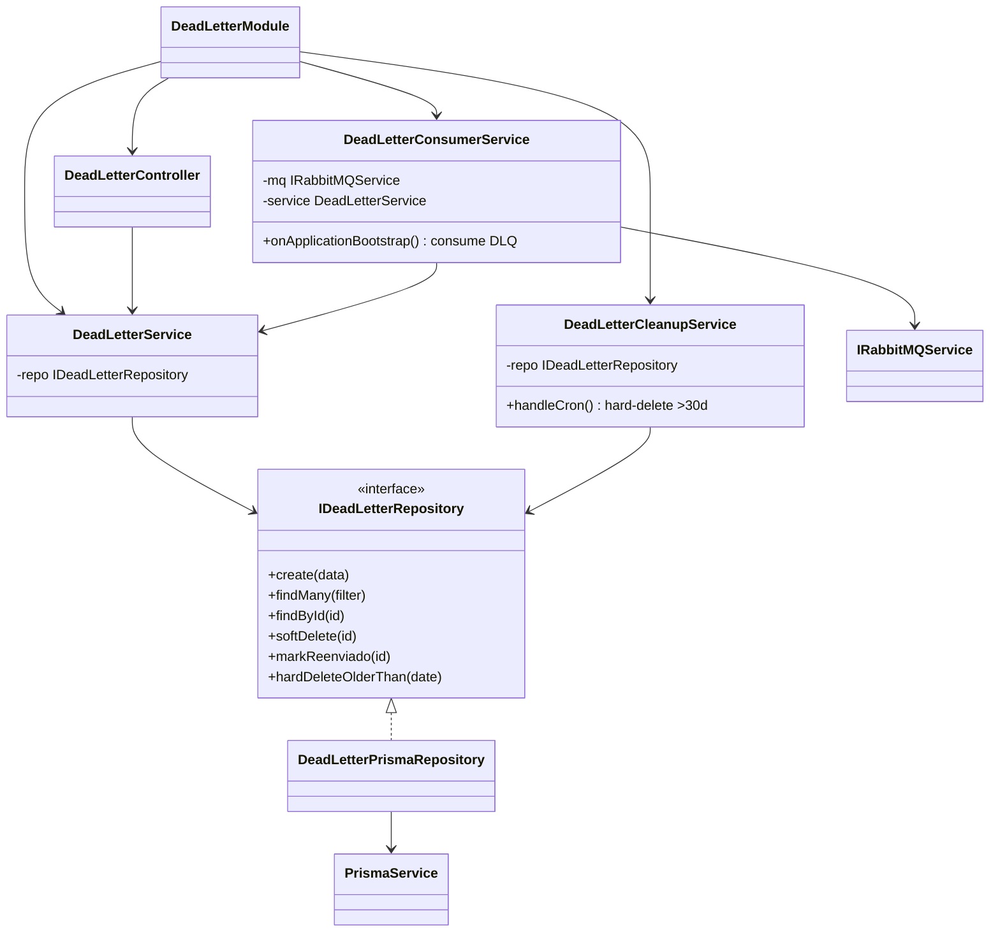
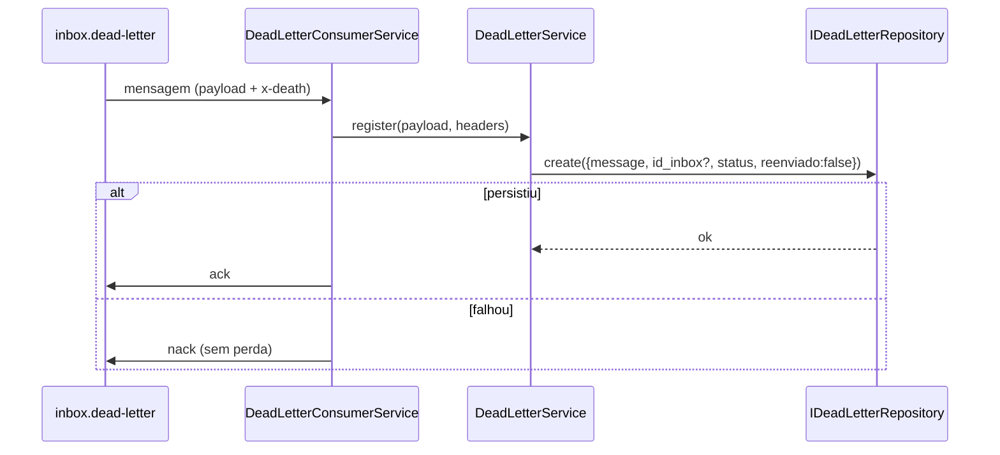
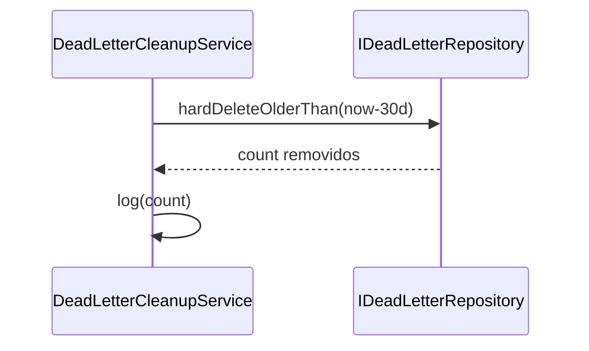
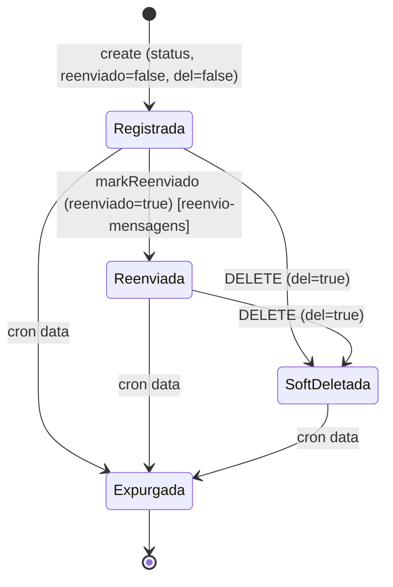
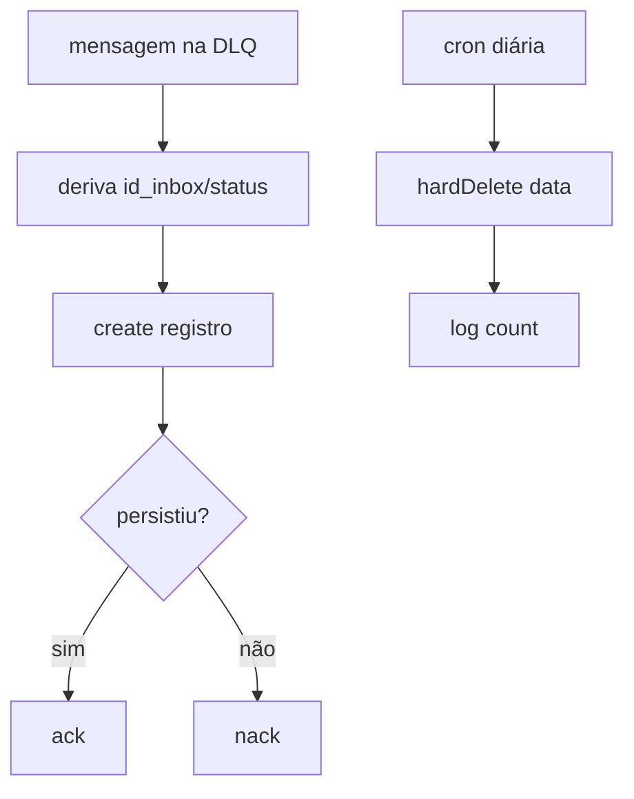

# Fila de Mensagens Mortas

> Feature 4 de 7 do **whiz-gateway**. Leitura/CRUD da tabela `fila_mensagens_mortas`, consumidor da DLQ `inbox.dead-letter` e cron de hard-delete (>30 dias). Schema/infra em [`gateway-foundation`](./gateway-foundation.md) (§6/§8).

## 1. Context

Toda mensagem que falha em qualquer ponto do fluxo (PID sem inbox, falha de enfileiramento, `nack`, falha de re-envio HTTP, backend indisponível) é persistida em `fila_mensagens_mortas` com um `status` (enum `StatusFalhaMensagem`) indicando **onde** falhou, mais o `reenviado` (boolean) indicando se já foi reenviada. Esta feature entrega:

1. O **`DeadLetterConsumerService`**, que consome a DLQ estática `inbox.dead-letter` no bootstrap e persiste os registros.
2. Endpoints de **leitura/CRUD** sobre a tabela (consulta, soft-delete).
3. Uma **cron** (`@nestjs/schedule`) que faz **hard-delete** dos registros com `data < now - 30 dias`.

`reenvio-mensagens` (feature 7) consome esses registros para re-disparar.

**Usuários/atores:** operadores que inspecionam falhas; a infra RabbitMQ (DLQ); o agendador.

## 2. Scope

**In:**
- `DeadLetterModule` (controller + service + repository + DTOs).
- `IDeadLetterRepository` (token) sobre `PrismaService`: criar, listar (com filtros básicos), buscar por id, soft-delete, hard-delete por data, marcar `reenviado`.
- `DeadLetterConsumerService` — consome `inbox.dead-letter` no bootstrap; cada mensagem vira uma linha em `fila_mensagens_mortas`.
- Endpoints: `GET /dead-letter`, `GET /dead-letter/:id`, `DELETE /dead-letter/:id` (soft-delete).
- Cron `@Cron` diária: hard-delete de `data < now - 30d`.
- `DeadLetterResponseDto`; Swagger PT-BR.

**Out:**
- Schema/enum/migrations → `gateway-foundation`.
- DLQ estática `inbox.dead-letter` (assert no bootstrap) → `gateway-foundation`.
- Inserção de registros nas falhas de **roteamento** → `webhook-ingestao` (chama o repositório/serviço desta feature).
- Inserção de registros nas falhas de **re-envio** → `despacho-mensagens`.
- Re-disparo (`/messages/resend`) e set de `reenviado=true` → `reenvio-mensagens`.

> Nota de fronteira: as features 5 e 6 inserem em `fila_mensagens_mortas` de duas formas possíveis — direto via `IDeadLetterRepository`/serviço **ou** publicando na DLQ que o `DeadLetterConsumerService` consome. Padrão adotado: **falhas com `nack` caem naturalmente na DLQ** (consumidas aqui); **falhas detectadas em código** (PID inexistente, retries esgotados) são inseridas **direto** via serviço desta feature com o `status` apropriado. Ver §14.

## 3. Glossary

| Termo | Significado |
|---|---|
| **DLQ** | `inbox.dead-letter`, fila estática única. |
| **Hard-delete** | Remoção física do registro (diferente do soft-delete `del=true`). |
| **`reenviado`** | Boolean: a mensagem já foi re-disparada com sucesso. |
| **`status`** | Enum `StatusFalhaMensagem` — onde a mensagem falhou. |

## 4. Functional requirements

- **FR-1:** `DeadLetterConsumerService` consome `inbox.dead-letter` no bootstrap; cada mensagem dead-lettered é persistida em `fila_mensagens_mortas` com `message` (payload cru), `id_inbox` (se derivável dos headers/`x-death`, senão `null`), `status` adequado, `reenviado=false`, `del=false`.
- **FR-2:** Mensagem consumida da DLQ é `ack`ada **após** a persistência bem-sucedida.
- **FR-3:** `GET /dead-letter` lista registros `del=false`, com filtros opcionais `pid`, `id_inbox`, `status`, `reenviado`, intervalo de `data` (`dataInicio`/`dataFim`), paginado. Retorna `DeadLetterResponseDto[]`.
- **FR-4:** `GET /dead-letter/:id` retorna um registro ou `404`.
- **FR-5:** `DELETE /dead-letter/:id` faz soft-delete (`del=true`); `404` se inexistente.
- **FR-6:** Cron diária remove **fisicamente** (hard-delete) registros com `data < now - 30 dias` (independente de `del`/`reenviado`).
- **FR-7:** O repositório expõe `markReenviado(id)` (usado por `reenvio-mensagens`) e `create(data)` (usado por features 1/5/6) — ambos por interface/token.
- **FR-8:** Repositório injetado por interface; nunca retorna entidade Prisma crua.
- **FR-9:** Swagger PT-BR em endpoints/DTOs.

## 5. Non-functional

- **NFR-1:** Se a persistência falhar ao consumir a DLQ, a mensagem **não** é `ack`ada (evita perda) — `nack`/requeue conforme política (§14).
- **NFR-2:** A cron loga quantos registros removeu.
- **NFR-3:** `GET /dead-letter` paginado (default `limit=50`) para não retornar volume ilimitado.
- **NFR-4:** Hard-delete em lote eficiente (`deleteMany` por data), executado fora do horário de pico (cron diária — horário em §14).
- **NFR-5:** `message` (Json) pode ser grande; respostas podem truncar/omitir conforme §14.

## 6. Data model

Reutiliza `fila_mensagens_mortas` e o enum `StatusFalhaMensagem` de [`gateway-foundation` §6](./gateway-foundation.md).

**DTOs**

| DTO | Campos |
|---|---|
| `ListDeadLetterQueryDto` | `pid?: string`, `id_inbox?: string`, `status?: StatusFalhaMensagem`, `reenviado?: boolean`, `dataInicio?: ISO8601`, `dataFim?: ISO8601`, `limit?: int=50`, `offset?: int=0` |
| `DeadLetterResponseDto` | `id: string`, `message: Json`, `id_inbox: string\|null`, `status: StatusFalhaMensagem`, `reenviado: boolean`, `del: boolean`, `data: ISO8601` |

## 7. API contract

### GET /dead-letter
- **Auth**: Bearer JWT
- **Request**: query `ListDeadLetterQueryDto`
- **Responses**: `200 DeadLetterResponseDto[]`

### GET /dead-letter/:id
- **Auth**: Bearer JWT
- **Responses**: `200 DeadLetterResponseDto` | `404`

### DELETE /dead-letter/:id
- **Auth**: Bearer JWT
- **Responses**: `200`/`204` | `404`

### QUEUE inbox.dead-letter  (consumo)
- **Direction**: consume (`DeadLetterConsumerService`, bootstrap)
- **Payload**: mensagem original + headers AMQP `x-death`
- **Persistência**: 1 linha em `fila_mensagens_mortas` por mensagem; `ack` após persistir

### CRON  hard-delete (>30d)
- **Schedule**: diária (`@Cron`, horário em §14)
- **Ação**: `DELETE FROM fila_mensagens_mortas WHERE data < now() - 30 days`

## 8. Module boundaries

## 9. Flows

### Consumo da DLQ

### Cron de expurgo

## 10. State machines

## 11. Business rules

### Regras
- `status` da DLQ: quando vier de `nack` no consumo do inbox, `NACK_RECEBIDO` (ou o `x-death` reason). Falhas inseridas direto pelas features 5/6 já trazem o `status` correto.
- Hard-delete ignora `del`/`reenviado` — critério é só `data < now-30d`.
- Soft-delete (`del=true`) apenas oculta das listagens.

## 12. Edge cases & errors

- Mensagem na DLQ sem `id_inbox` derivável → `id_inbox = null`.
- Persistência falha no consumo → `nack` (não perde a mensagem).
- Cron roda com 0 registros antigos → no-op, loga `0`.
- `message` JSON inválido/grande → persistir como veio (passthrough); resposta pode truncar (§14).
- `DELETE` em id inexistente → `404`.
- Concorrência: cron expurga registro enquanto `reenvio-mensagens` o processa → ver §14.

## 13. Acceptance criteria

- **AC-1** `[backend]`: Dada uma mensagem na DLQ, quando consumida, então cria 1 linha em `fila_mensagens_mortas` com `message`, `status`, `reenviado=false`, `del=false`, e dá `ack`.
- **AC-2** `[backend]`: Dada falha de persistência ao consumir, quando processa, então **não** dá `ack` (dá `nack`).
- **AC-3** `[e2e]`: Dados registros existentes, quando `GET /dead-letter`, então `200` com `del=false`, paginado.
- **AC-4** `[e2e]`: Dado filtro `?status=FALHA_ENVIO`, quando `GET /dead-letter`, então só registros com esse status.
- **AC-5** `[e2e]`: Dado filtro `?dataInicio&dataFim`, quando `GET /dead-letter`, então só registros no intervalo.
- **AC-6** `[e2e]`: Dado registro existente, quando `DELETE /dead-letter/:id`, então `del=true` e some da listagem.
- **AC-7** `[backend]`: Dado registro com `data < now-30d`, quando a cron roda, então é **fisicamente** removido (não retornável por id).
- **AC-8** `[backend]`: Dado registro com `data >= now-30d`, quando a cron roda, então **permanece**.
- **AC-9** `[backend]`: Dado `markReenviado(id)`, quando chamado, então `reenviado=true` no registro.
- **AC-10** `[backend]`: Dado o service, quando retorna, então tipo `DeadLetterResponseDto` (sem entidade Prisma crua).

## 14. Open questions

- **OQ-1:** Inserção das falhas das features 5/6 — **direto via serviço** ou **publicando na DLQ**? Proposto: nack natural → DLQ (consumida aqui); falhas detectadas em código → insert direto via `DeadLetterService.create` com `status`.
- **OQ-2:** Política de `nack` no consumo da DLQ quando a persistência falha: requeue imediato (risco de loop) ou requeue com delay? Proposto: requeue com limite de tentativas + log.
- **OQ-3:** Horário da cron diária. Proposto: `@Cron('0 3 * * *')` (03:00).
- **OQ-4:** `GET /dead-letter` deve retornar `message` completo ou resumido (truncado)? Proposto: completo no `GET /:id`, resumido/omitido na listagem.
- **OQ-5:** Concorrência cron × reenvio: como evitar expurgar registro em processamento? Proposto: cron usa `data` (30d) — janela larga torna a colisão improvável; aceitar.
- **OQ-6:** Como derivar `id_inbox` e `status` a partir dos headers `x-death` da DLQ? Depende do nome da fila de origem (`inbox.<id>`). Confirmar mapeamento na fase de código.
