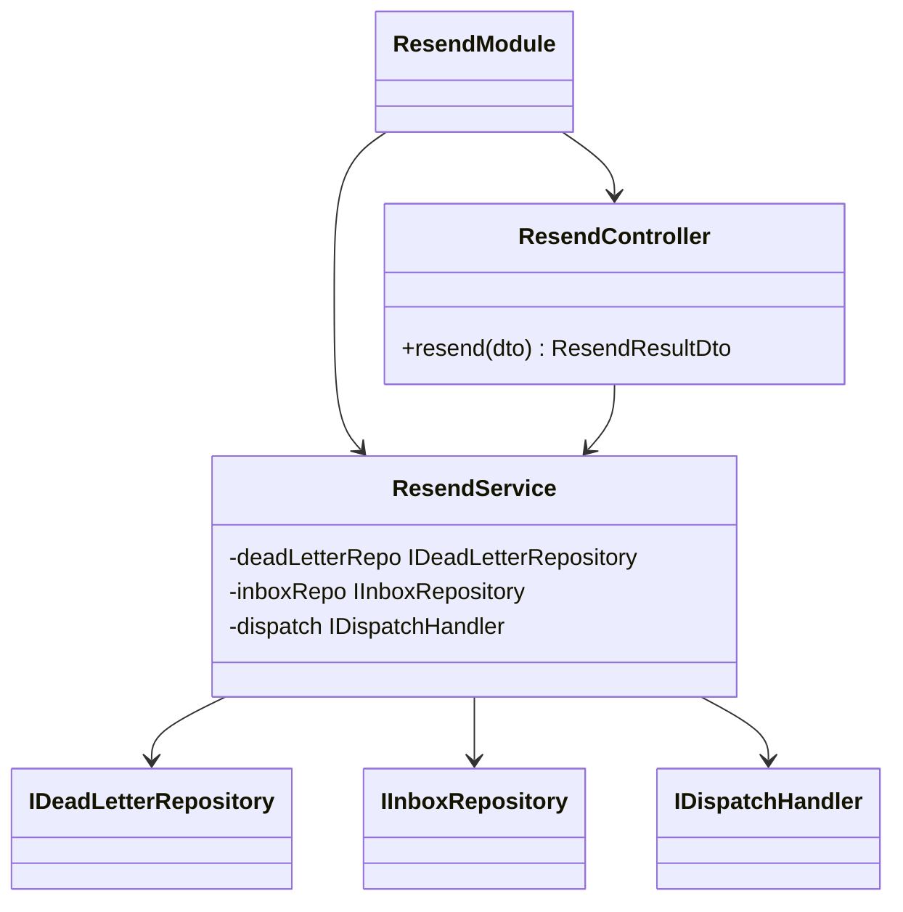
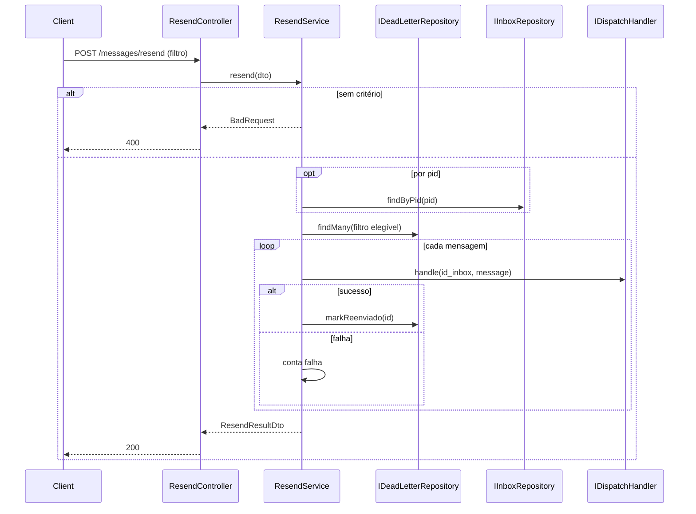
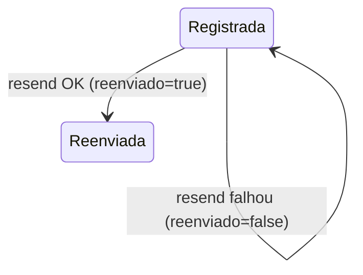
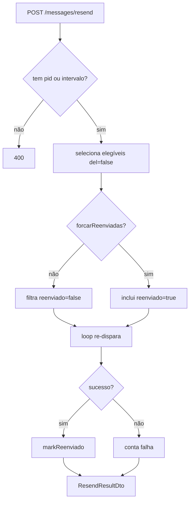

# Reenvio de Mensagens

> Feature 7 de 7 do **whiz-gateway**. Endpoint `/messages/resend` para re-disparar mensagens mortas filtrando por data ou PID. Depende de [`fila-mensagens-mortas`](./fila-mensagens-mortas.md), [`despacho-mensagens`](./despacho-mensagens.md), [`cadastro-inboxes`](./cadastro-inboxes.md) e [`gateway-foundation`](./gateway-foundation.md).

## 1. Context

Mensagens que falharam ficam em `fila_mensagens_mortas` com `reenviado=false`. Operadores precisam **re-disparar** essas mensagens — por exemplo, depois que um ambiente que estava fora volta ao ar. Esta feature expõe `/messages/resend`, que seleciona mensagens mortas por **filtro de data** ou por **PID** e as re-enfileira/re-envia. Em re-disparo bem-sucedido, o registro recebe `reenviado=true`.

**Usuários/atores:** operadores que disparam o reprocessamento; `despacho-mensagens` (mecanismo de envio); `fila-mensagens-mortas` (origem dos registros e `markReenviado`).

## 2. Scope

**In:**
- `ResendModule` (controller + service).
- `POST /messages/resend` — corpo com filtro **por data** (`dataInicio`/`dataFim`) **ou** por `pid` (mutuamente suficientes; pelo menos um).
- Seleção das mensagens mortas elegíveis (`del=false`, e por padrão `reenviado=false`; ver §14) via `IDeadLetterRepository`.
- Re-disparo de cada mensagem: re-enfileira na fila do inbox correspondente **ou** re-envia direto via `IDispatchHandler` (decisão em §14).
- `markReenviado(id)` em sucesso.
- Resposta com resumo (`total`, `reenviadas`, `falhas`).
- Swagger PT-BR.

**Out:**
- Persistência/listagem/cron da dead-letter → `fila-mensagens-mortas`.
- Mecânica de envio HTTP + retry → `despacho-mensagens`.
- Recebimento do webhook → `webhook-ingestao`.
- Resolução de inbox/ambiente → repositórios existentes.

## 3. Glossary

| Termo | Significado |
|---|---|
| **Re-disparo** | Reprocessar uma mensagem morta pelo mesmo caminho de envio. |
| **Elegível** | Registro `del=false` que casa com o filtro (e, por padrão, `reenviado=false`). |
| **`reenviado`** | Boolean marcado `true` após re-disparo bem-sucedido. |

## 4. Functional requirements

- **FR-1:** `POST /messages/resend` aceita `ResendRequestDto` com **filtro por data** (`dataInicio`/`dataFim`) **ou** `pid`. Pelo menos um critério é obrigatório; nenhum → `400`.
- **FR-2:** Por `pid`: resolve o inbox por PID (`IInboxRepository.findByPid`); seleciona mensagens mortas elegíveis com `id_inbox` daquele inbox.
- **FR-3:** Por data: seleciona mensagens mortas elegíveis com `data` no intervalo `[dataInicio, dataFim]`.
- **FR-4:** `pid` + data juntos → aplica os dois (interseção).
- **FR-5:** Para cada mensagem selecionada, re-dispara o `message` (payload cru) pelo mecanismo de envio (re-enfileira em `inbox.<id>` **ou** chama `IDispatchHandler.handle`; ver §14).
- **FR-6:** Re-disparo bem-sucedido → `IDeadLetterRepository.markReenviado(id)` (`reenviado=true`). Falha → permanece `reenviado=false` (contabilizada como falha).
- **FR-7:** Responde `200 ResendResultDto` com `{ total, reenviadas, falhas }` (e opcionalmente ids; §14).
- **FR-8:** Mensagem morta sem `id_inbox` (`INBOX_NAO_REGISTRADA`) só é re-disparável por `pid` (que provê o inbox); por data sozinha, é pulada/contada como falha (ver §14).
- **FR-9:** Swagger PT-BR.

## 5. Non-functional

- **NFR-1:** Re-disparo em lote processado de forma resiliente; uma falha individual não aborta o lote.
- **NFR-2:** Operação idempotente o suficiente: por padrão só re-dispara `reenviado=false` (evita reenvio duplo); flag para forçar (§14).
- **NFR-3:** Lote grande não deve estourar memória — processa em páginas/stream (§14).
- **NFR-4:** Resposta inclui contagem clara para auditoria; cada re-disparo logado.

## 6. Data model

Sem tabelas próprias. Lê/atualiza `fila_mensagens_mortas` (`markReenviado`), lê `inboxes`. Ver [`gateway-foundation` §6](./gateway-foundation.md).

**DTOs**

| DTO | Campos |
|---|---|
| `ResendRequestDto` | `pid?: string`, `dataInicio?: ISO8601`, `dataFim?: ISO8601`, `forcarReenviadas?: boolean=false` |
| `ResendResultDto` | `total: int`, `reenviadas: int`, `falhas: int` |

> Validação: pelo menos um de `pid` / (`dataInicio`+`dataFim`) presente.

## 7. API contract

### POST /messages/resend
- **Auth**: Bearer JWT
- **Request**: `ResendRequestDto` — `pid?:string`, `dataInicio?:ISO8601`, `dataFim?:ISO8601`, `forcarReenviadas?:boolean`
- **Responses**: `200 ResendResultDto` | `400` (nenhum critério / intervalo inválido) | `404` (pid sem inbox, se aplicável — §14)

## 8. Module boundaries

> Reusa `IDeadLetterRepository` (de `fila-mensagens-mortas`) e `IDispatchHandler` (de `despacho-mensagens`) por token, sem `forwardRef`.

## 9. Flows

## 10. State machines

Reusa o ciclo de `fila_mensagens_mortas` (ver `fila-mensagens-mortas` §10). Transição relevante:

## 11. Business rules

### Regras
- Critério obrigatório: `pid` ou intervalo de data.
- Por padrão só re-dispara `reenviado=false`; `forcarReenviadas=true` inclui já reenviadas.
- Mensagem sem `id_inbox` exige `pid` para resolver destino.
- Re-disparo usa o payload cru (`message`) — passthrough.

## 12. Edge cases & errors

- Nenhum critério → `400`.
- `dataInicio > dataFim` ou datas inválidas → `400`.
- `pid` sem inbox ativo → `404` (ou resultado vazio; §14).
- Seleção vazia → `200` com `total=0`.
- Mensagem sem `id_inbox` e filtro só por data → pulada/contada como falha (§14).
- Falha de re-disparo individual → lote continua; conta em `falhas`.
- Re-disparo de `reenviado=true` sem `forcarReenviadas` → ignorada.

## 13. Acceptance criteria

- **AC-1** `[e2e]`: Dado nenhum critério no body, quando `POST /messages/resend`, então `400`.
- **AC-2** `[e2e]`: Dado `pid` com mensagens mortas `reenviado=false`, quando `POST /messages/resend`, então re-dispara cada uma e responde `ResendResultDto` com `reenviadas` > 0.
- **AC-3** `[backend]`: Dado re-disparo bem-sucedido, quando processa, então `markReenviado(id)` é chamado (`reenviado=true`).
- **AC-4** `[backend]`: Dado re-disparo que falha, quando processa, então o registro permanece `reenviado=false` e entra em `falhas`.
- **AC-5** `[e2e]`: Dado filtro por intervalo de data, quando `POST /messages/resend`, então só mensagens com `data` no intervalo são re-disparadas.
- **AC-6** `[e2e]`: Dado `dataInicio > dataFim`, quando `POST /messages/resend`, então `400`.
- **AC-7** `[backend]`: Dado `forcarReenviadas=false` (default), quando seleciona, então mensagens `reenviado=true` são ignoradas.
- **AC-8** `[backend]`: Dado `forcarReenviadas=true`, quando seleciona, então mensagens `reenviado=true` também são re-disparadas.
- **AC-9** `[backend]`: Dado o re-disparo, quando envia, então usa `IDispatchHandler` (mesmo caminho de `despacho-mensagens`), com o payload cru.
- **AC-10** `[e2e]`: Dada seleção vazia, quando `POST /messages/resend`, então `200` com `total=0`, `reenviadas=0`, `falhas=0`.

## 14. Open questions

- **OQ-1:** Re-disparo deve **re-enfileirar** em `inbox.<id>` (passa de novo pelo retry do consumidor) ou chamar `IDispatchHandler.handle` **direto** (síncrono)? Proposto: **re-enfileirar** (reusa retry/backoff e mantém o fluxo único). Confirmar.
- **OQ-2:** `markReenviado` quando re-enfileira: marcar no momento do enfileiramento ou só após confirmação de entrega? Proposto: marcar após entrega confirmada — exige correlação (complexa). Alternativa: marcar ao re-enfileirar e re-dead-letter se falhar de novo. Decidir na fase de código.
- **OQ-3:** `pid` sem inbox → `404` ou `200 total=0`? Proposto `200 total=0` (idempotente/operacional).
- **OQ-4:** Mensagem sem `id_inbox` e filtro só por data: pular silenciosamente, contar como falha, ou exigir `pid`? Proposto: contar como `falhas` com motivo logado.
- **OQ-5:** `ResendResultDto` deve listar os ids processados? Proposto: incluir `ids?: string[]` opcional.
- **OQ-6:** Paginação/stream para lotes grandes — page size default (proposto `100`).
- **OQ-7:** `forcarReenviadas` é necessário no MVP? Proposto: manter (cobre reprocessamento total).
