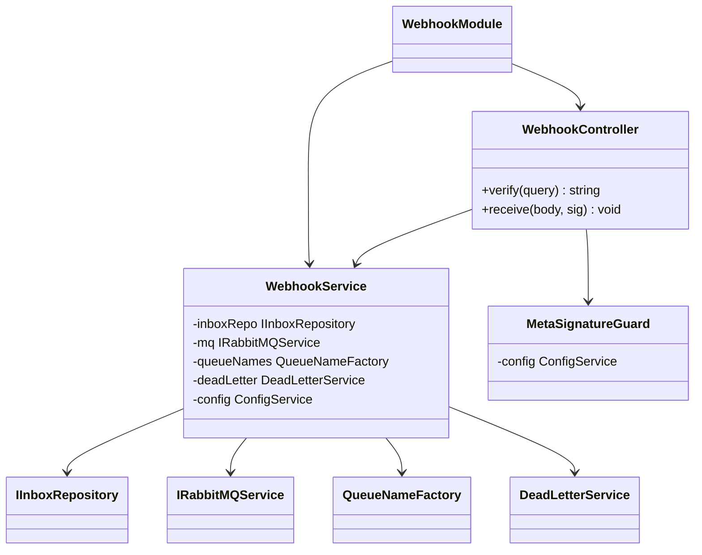
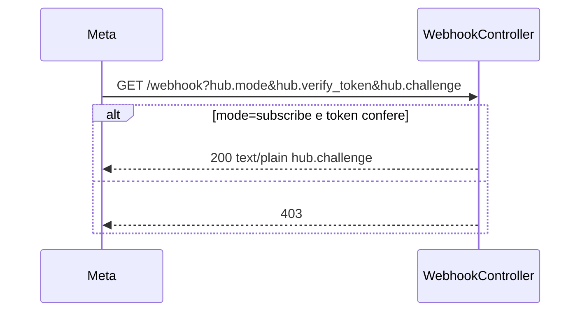
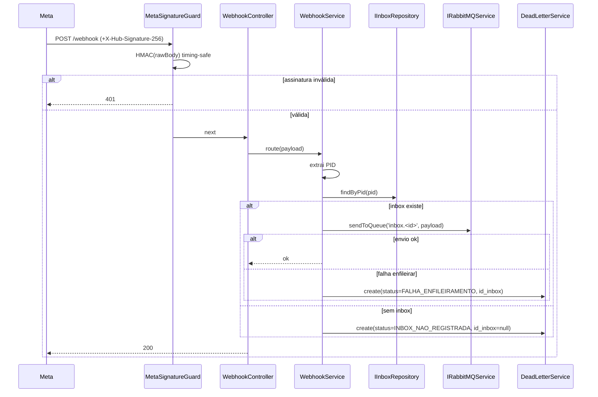
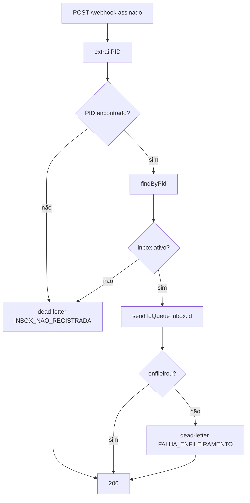

# Webhook Ingestão

> Feature 5 de 7 do **whiz-gateway**. Recebe webhooks da Meta, valida, roteia por PID e enfileira na fila do inbox. Infra/schema em [`gateway-foundation`](./gateway-foundation.md); inboxes em [`cadastro-inboxes`](./cadastro-inboxes.md); dead-letter em [`fila-mensagens-mortas`](./fila-mensagens-mortas.md).

## 1. Context

A Meta entrega eventos do WhatsApp Cloud via webhook. O fluxo da Meta tem duas partes:
1. **Verificação (handshake):** a Meta faz `GET /webhook?hub.mode=subscribe&hub.verify_token=...&hub.challenge=...`. O gateway responde o `hub.challenge` em texto puro **se** o `hub.verify_token` casar com `META_VERIFY_TOKEN`.
2. **Eventos:** a Meta faz `POST /webhook` com o payload do evento e assina o corpo com `X-Hub-Signature-256` (HMAC-SHA256 usando `META_APP_SECRET`).

O gateway é **passthrough**: não interpreta o conteúdo. Ele apenas (a) valida a assinatura, (b) extrai o **PID** (`phone_number_id`) do payload de forma mínima, (c) acha o inbox por PID, (d) enfileira o payload cru na fila `inbox.<id>`. Falhas (PID sem inbox, erro de enfileiramento) vão para `fila_mensagens_mortas` com o `status` adequado.

**Usuários/atores:** plataforma Meta (origem); `cadastro-inboxes` (resolução de inbox); `despacho-mensagens` (consome a fila); `fila-mensagens-mortas` (destino das falhas).

## 2. Scope

**In:**
- `WebhookModule` (controller + service).
- `GET /webhook` — verify handshake (`hub.mode`/`hub.verify_token`/`hub.challenge`).
- `POST /webhook` — recebe evento; valida `X-Hub-Signature-256`; extrai PID; resolve inbox; enfileira.
- `MetaSignatureGuard` — valida HMAC-SHA256 do corpo cru com `META_APP_SECRET`.
- DTO **genérico** de passthrough (corpo cru, sem validação de conteúdo) + extração mínima do PID.
- Inserção em `fila_mensagens_mortas` (via serviço de `fila-mensagens-mortas`) quando PID não tem inbox (`INBOX_NAO_REGISTRADA`) ou falha de enfileiramento (`FALHA_ENFILEIRAMENTO`).
- Swagger PT-BR.

**Out:**
- Consumo da fila + re-envio → `despacho-mensagens`.
- CRUD de inbox + ciclo de vida da fila → `cadastro-inboxes`.
- Schema/`IRabbitMQService`/DLQ → `gateway-foundation`.
- Persistência/leitura da dead-letter → `fila-mensagens-mortas` (esta feature só chama `create`).

## 3. Glossary

| Termo | Significado |
|---|---|
| **Verify token** | `META_VERIFY_TOKEN`; comparado ao `hub.verify_token` no handshake. |
| **App secret** | `META_APP_SECRET`; chave HMAC para `X-Hub-Signature-256`. |
| **Raw body** | Corpo HTTP cru (bytes), necessário para validar a assinatura corretamente. |
| **PID** | `phone_number_id` extraído de `entry[].changes[].value.metadata.phone_number_id`. |

## 4. Functional requirements

- **FR-1:** `GET /webhook` — se `hub.mode === 'subscribe'` **e** `hub.verify_token === META_VERIFY_TOKEN`, responde `200` com o valor de `hub.challenge` em `text/plain`. Senão, `403`.
- **FR-2:** `POST /webhook` exige header `X-Hub-Signature-256`. O `MetaSignatureGuard` calcula `sha256=HMAC(META_APP_SECRET, rawBody)` e compara (timing-safe) com o header. Divergência → `401`.
- **FR-3:** A app deve preservar o **raw body** para o cálculo da assinatura (raw body middleware/config no bootstrap).
- **FR-4:** Após assinatura válida, o service extrai o PID de forma mínima (`entry[].changes[].value.metadata.phone_number_id`). Payload pode conter múltiplas `entry`/`changes` → processa cada uma (ver §14).
- **FR-5:** Para cada PID extraído, resolve o inbox ativo via `IInboxRepository.findByPid(pid)`. Se não houver inbox (`del=false`), insere o payload em `fila_mensagens_mortas` com `status=INBOX_NAO_REGISTRADA`, `id_inbox=null`.
- **FR-6:** Havendo inbox, enfileira o **payload cru** na fila `QueueNameFactory.inbox(inbox.id)` via `IRabbitMQService.sendToQueue`. Falha no envio → insere em `fila_mensagens_mortas` com `status=FALHA_ENFILEIRAMENTO`, `id_inbox=inbox.id`.
- **FR-7:** `POST /webhook` responde rápido (`200`/`202`) à Meta assim que o roteamento/enfileiramento (ou dead-letter) é resolvido — não espera o re-envio ao ambiente (assíncrono).
- **FR-8:** Sem PID extraível no payload → registra em `fila_mensagens_mortas` com `status=INBOX_NAO_REGISTRADA` e `id_inbox=null` (ver §14) e responde `200` (não devolve erro à Meta para evitar reentrega infinita; §14).
- **FR-9:** DTO de entrada é genérico (passthrough) — sem `forbidNonWhitelisted` no corpo do webhook (o whitelist quebraria payloads variáveis da Meta). Ver §11.
- **FR-10:** Swagger PT-BR para ambos os endpoints.

## 5. Non-functional

- **NFR-1 (segurança):** Comparação de assinatura é **timing-safe** (`crypto.timingSafeEqual`).
- **NFR-2 (segurança):** `META_APP_SECRET`/`META_VERIFY_TOKEN` lidos via `ConfigService`; nunca logados.
- **NFR-3 (performance):** `POST /webhook` responde em P95 ≤ 200ms (só valida, extrai PID, enfileira; não faz HTTP de saída).
- **NFR-4 (robustez):** O gateway não valida o conteúdo do payload (passthrough); qualquer JSON válido com PID é roteado.
- **NFR-5 (idempotência):** Reentregas da Meta (mesmo evento) podem gerar enfileiramentos duplicados → aceito nesta camada (dedup fora de escopo; §14).

## 6. Data model

Sem tabelas próprias. Lê `inboxes` (por `pid`) e escreve em `fila_mensagens_mortas` (via `fila-mensagens-mortas`). Ver [`gateway-foundation` §6](./gateway-foundation.md).

**DTOs**

| DTO | Campos |
|---|---|
| `WebhookVerifyQueryDto` | `hub.mode: string`, `hub.verify_token: string`, `hub.challenge: string` (mapeados de query) |
| `WebhookEventDto` | passthrough — corpo cru `Record<string, any>` (sem validação de forma) |

## 7. API contract

### GET /webhook  (verify handshake)
- **Auth**: nenhuma (validação por `verify_token`)
- **Request**: query `hub.mode`, `hub.verify_token`, `hub.challenge`
- **Responses**: `200 text/plain` (echo de `hub.challenge`) | `403` (token inválido)

### POST /webhook  (evento)
- **Auth**: `MetaSignatureGuard` (header `X-Hub-Signature-256`, HMAC-SHA256 do raw body)
- **Request**: header `X-Hub-Signature-256`; body `WebhookEventDto` (passthrough)
- **Responses**: `200`/`202` (roteado ou dead-lettered) | `401` (assinatura inválida)

### Efeitos
- **Enfileira** em `inbox.<inboxId>` (payload cru) — consumido por `despacho-mensagens`.
- **Dead-letter** (`fila_mensagens_mortas`) com `status` `INBOX_NAO_REGISTRADA` ou `FALHA_ENFILEIRAMENTO`.

## 8. Module boundaries

## 9. Flows

### Verify handshake

### Evento → roteamento

## 10. State machines

N/A — esta feature não mantém estado próprio; o estado da mensagem nasce em `fila_mensagens_mortas` (ver `fila-mensagens-mortas` §10) ou segue na fila do inbox (ver `despacho-mensagens`).

## 11. Business rules

### Regras
- Passthrough: o conteúdo não é validado; só o PID é extraído.
- Whitelist/forbidNonWhitelisted **não** se aplica ao corpo do webhook (payload variável da Meta).
- Sempre responder `200` à Meta após resolução (roteado ou dead-lettered) para evitar reentrega agressiva, exceto `401` de assinatura.

## 12. Edge cases & errors

- `X-Hub-Signature-256` ausente/ inválido → `401`.
- `verify_token` divergente no `GET` → `403`.
- Payload sem `phone_number_id` → dead-letter `INBOX_NAO_REGISTRADA`, `200`.
- Múltiplas `entry`/`changes` no mesmo POST → processa cada PID (§14).
- PID de inbox `del=true` → tratado como inexistente → `INBOX_NAO_REGISTRADA`.
- Broker indisponível → `sendToQueue` falha → dead-letter `FALHA_ENFILEIRAMENTO`.
- Reentrega Meta → possível duplicidade na fila (aceito; §14).

## 13. Acceptance criteria

- **AC-1** `[e2e]`: Dado `hub.mode=subscribe` e `hub.verify_token` correto, quando `GET /webhook`, então `200` com corpo igual ao `hub.challenge` (text/plain).
- **AC-2** `[e2e]`: Dado `hub.verify_token` incorreto, quando `GET /webhook`, então `403`.
- **AC-3** `[e2e]`: Dado `X-Hub-Signature-256` válido para o raw body, quando `POST /webhook`, então `200` e mensagem enfileirada.
- **AC-4** `[e2e]`: Dado `X-Hub-Signature-256` inválido, quando `POST /webhook`, então `401` e **nada** enfileirado.
- **AC-5** `[backend]`: Dada assinatura válida e PID com inbox ativo, quando roteia, então `IRabbitMQService.sendToQueue('inbox.<id>', payload)` chamado com o payload cru.
- **AC-6** `[backend]`: Dada assinatura válida e PID sem inbox, quando roteia, então `DeadLetterService.create` com `status=INBOX_NAO_REGISTRADA`, `id_inbox=null`; nada enfileirado.
- **AC-7** `[backend]`: Dada falha no `sendToQueue`, quando roteia, então `DeadLetterService.create` com `status=FALHA_ENFILEIRAMENTO`, `id_inbox` do inbox.
- **AC-8** `[backend]`: Dado payload sem `phone_number_id`, quando roteia, então dead-letter `INBOX_NAO_REGISTRADA` e resposta `200`.
- **AC-9** `[backend]`: Dada a comparação de assinatura, quando executada, então usa `crypto.timingSafeEqual` (timing-safe).

## 14. Open questions

- **OQ-1:** Múltiplas `entry`/`changes` por POST: enfileirar 1 mensagem por `change` ou 1 pelo payload inteiro? Proposto: **1 por payload bruto** (passthrough puro), repetindo por PID distinto se houver mais de um.
- **OQ-2:** Formato exato do header `X-Hub-Signature-256` (`sha256=<hex>`) — confirmar prefixo na implementação.
- **OQ-3:** Como obter o raw body no NestJS/Express preservando o parse JSON (rawBody no `NestFactory.create({ rawBody: true })` ou middleware dedicado)? Definir na fase de código.
- **OQ-4:** Dedup de reentregas da Meta (por `id` do evento) — fora de escopo agora? Proposto: sim, fora de escopo.
- **OQ-5:** Resposta à Meta: `200` ou `202`? Proposto `200`.
- **OQ-6:** Falhas de roteamento devem ir **direto** à tabela (via `DeadLetterService`) ou publicar na DLQ? Alinhar com `fila-mensagens-mortas` OQ-1 — proposto: insert direto via serviço.
