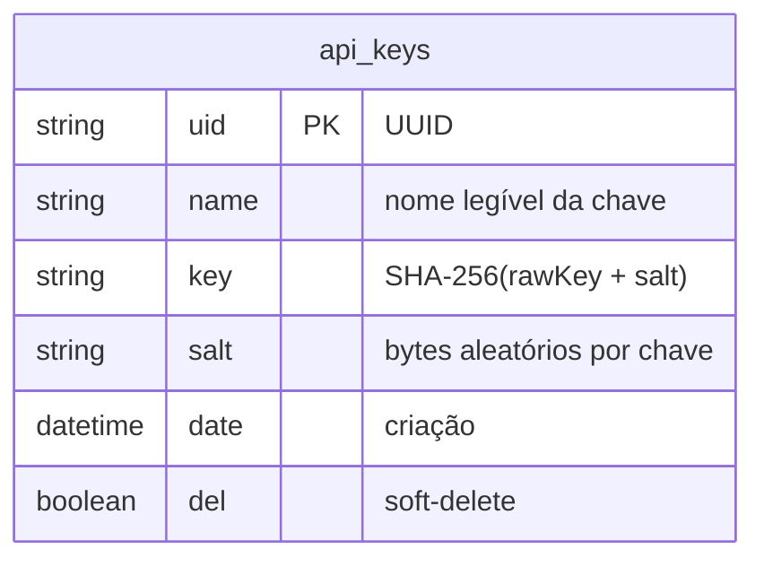
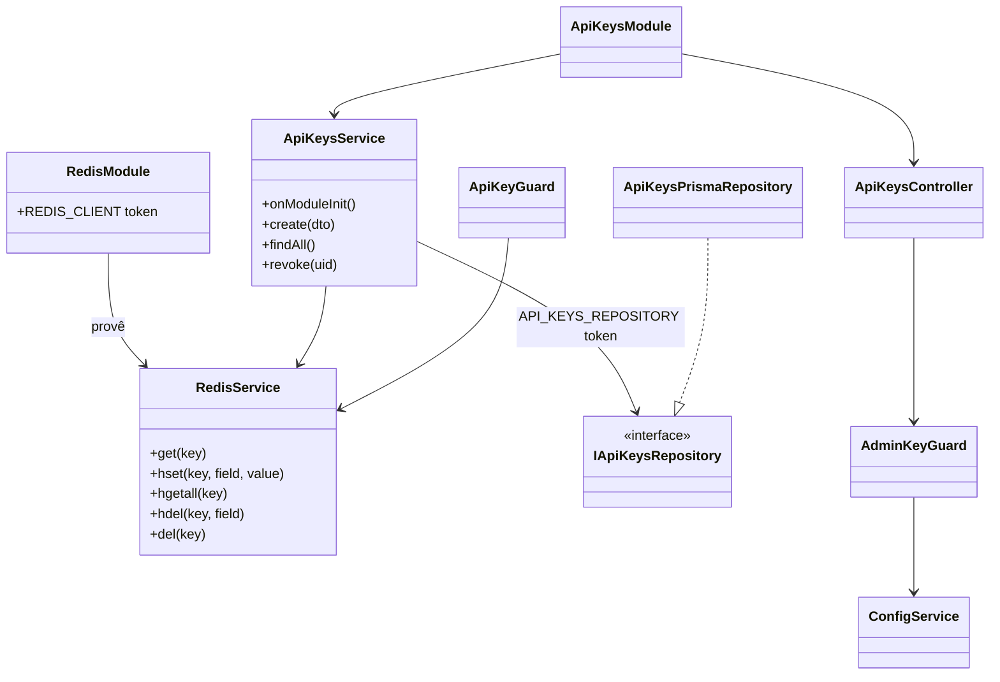
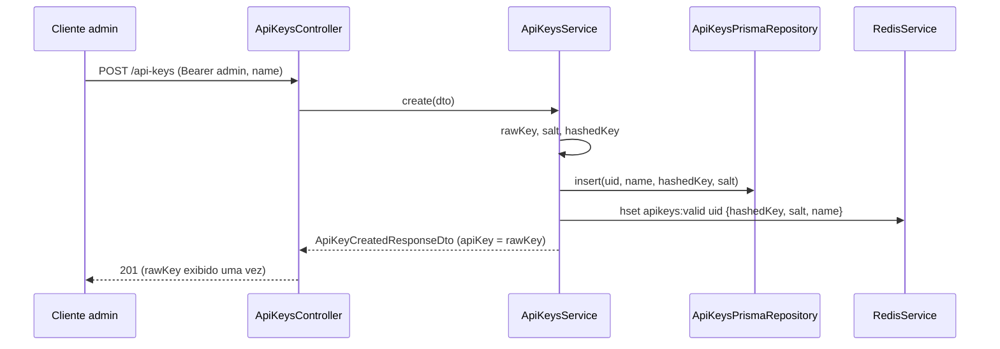
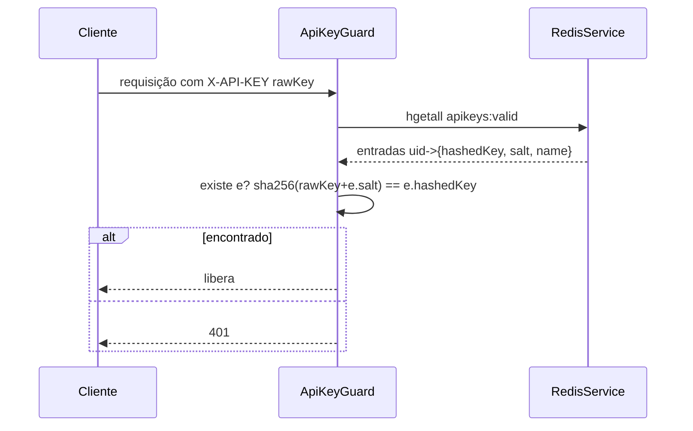
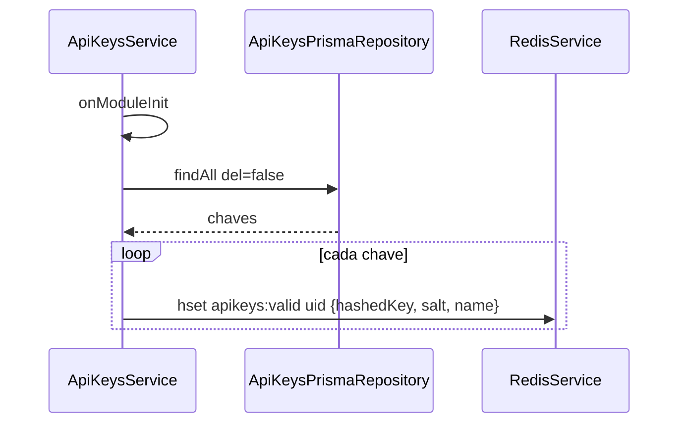
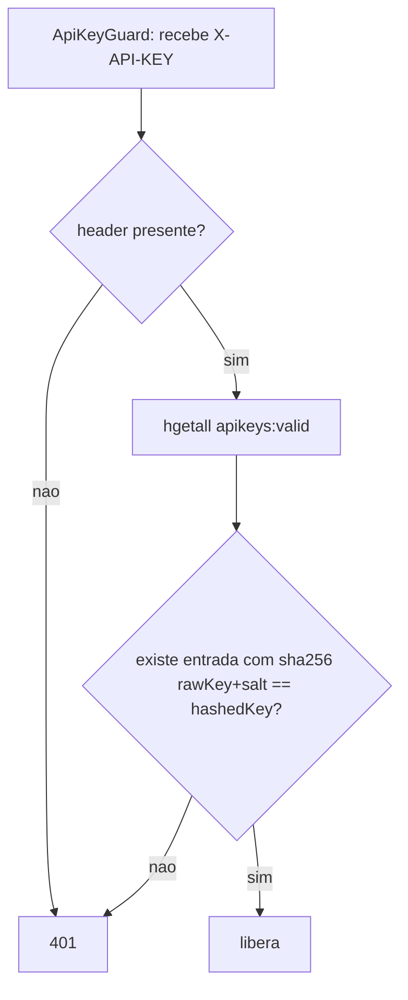

# API Keys Foundation

> **Feature 1 de 8 do whiz-gateway** (batch WhatsApp Meta Adapter). Fundação de autenticação para o adapter WhatsApp Meta. Define a geração/armazenamento de API keys, o cache Redis e os dois guards (`AdminKeyGuard`, `ApiKeyGuard`) consumidos pelos módulos `/wpp/*`. Esta é a primeira feature da família WhatsApp Meta Adapter; os specs `wpp-adapter-core` e os de domínio (`wpp-messages`, `wpp-templates`, …) dependem dela.

## 1. Context

O microserviço passará a centralizar chamadas à WhatsApp Cloud API via rotas `/wpp/*`. Essas rotas precisam ser protegidas por uma chave de API emitida e gerenciada internamente. Esta feature entrega:

- Um módulo `api-keys` que **gera**, **lista** e **revoga** chaves de API.
- A chave real (`rawKey`) é exibida **uma única vez** na criação; o banco guarda apenas o hash (`key`) + `salt`.
- Um `RedisModule` global e o cache das chaves válidas no Redis (carregado no boot e atualizado em cada criação/revogação) para que a validação no caminho quente (`/wpp/*`) não toque o banco.
- Dois guards reutilizáveis: `AdminKeyGuard` (protege os endpoints administrativos `/api-keys`) e `ApiKeyGuard` (protege `/wpp/*`).

**Usuários**: operadores internos (administração de chaves via `ADMIN_API_KEY`) e sistemas clientes (consomem `/wpp/*` portando uma `X-API-KEY`).

## 2. Scope

**In:**
- Tabela `api_keys(uid, name, key, salt, date, del)` + migration.
- `RedisModule` global (`ioredis`, env `REDIS_URL`) + `RedisService` wrapper.
- `ApiKeysModule`: service, repository (interface + impl Prisma), controller, DTOs, token DI.
- Geração de `rawKey`/`salt`, hashing SHA-256, exibição única.
- Cache Redis: popular no `onModuleInit`, adicionar na criação, remover na revogação.
- `AdminKeyGuard` (Bearer vs `ADMIN_API_KEY`).
- `ApiKeyGuard` (header `X-API-KEY` vs Redis).
- Endpoints `POST /api-keys`, `GET /api-keys`, `DELETE /api-keys/:uid`.
- Env novas: `REDIS_URL`, `ADMIN_API_KEY` em `config.validation.ts`.

**Out:**
- As rotas `/wpp/*` em si (ver `wpp-adapter-core` e specs de domínio).
- Rotação automática de chaves, escopos/permissões por chave, expiração (TTL). Apenas `del` (revogação manual).
- Rate limiting por chave (pode virar `/fix` futuro).

## 3. Glossary

| Termo | Significado |
|---|---|
| `rawKey` | Valor secreto da chave em claro. Gerado uma vez, devolvido só na criação, nunca persistido. |
| `key` (coluna) | Hash SHA-256 de `rawKey + salt`. Único valor persistido derivado do segredo. |
| `salt` | Bytes aleatórios por chave, persistidos, usados no hash. |
| Chave válida | Registro com `del = false`. Presente no cache Redis. |
| `ADMIN_API_KEY` | Segredo único (env) que autoriza administrar chaves. Não fica no banco. |
| `X-API-KEY` | Header que o cliente envia em `/wpp/*` portando o `rawKey`. |

## 4. Functional requirements

- **FR-1**: `POST /api-keys` com `CreateApiKeyDto { name }` gera `rawKey` (`randomBytes(32).toString('hex')`, 64 chars) e `salt` (`randomBytes(16).toString('hex')`), persiste `{ uid, name, key: sha256(rawKey+salt), salt, date: now, del: false }` e retorna `201` `ApiKeyCreatedResponseDto { uid, name, apiKey: rawKey, date }`.
- **FR-2**: `rawKey` aparece **apenas** na resposta do `POST`. Nenhum outro endpoint o retorna ou reconstrói.
- **FR-3**: `GET /api-keys` retorna `200` `ApiKeyResponseDto[]` com `{ uid, name, date }` apenas — nunca `key` (hash), `salt` ou `rawKey`. Só registros com `del = false`.
- **FR-4**: `DELETE /api-keys/:uid` faz soft-delete (`del = true`), retorna `204`. Idempotente sobre uid inexistente/já revogado → `404` se uid não existe.
- **FR-5**: Na criação (FR-1), o registro é gravado no Redis em `apikeys:valid` como `HSET apikeys:valid {uid} → JSON({ hashedKey, salt, name })` antes da resposta.
- **FR-6**: Na revogação (FR-4), o registro é removido do Redis: `HDEL apikeys:valid {uid}`.
- **FR-7**: No `ApiKeysService.onModuleInit()`, todas as chaves com `del = false` são carregadas do banco e gravadas no Redis (reconstrução do cache no boot).
- **FR-8**: `AdminKeyGuard` libera a requisição apenas se o header `Authorization: Bearer {token}` existir e `token === ADMIN_API_KEY` (comparação timing-safe). Caso contrário `401`.
- **FR-9**: `ApiKeyGuard` lê o header `X-API-KEY` (= `rawKey`), faz `HGETALL apikeys:valid` e libera se existir alguma entrada `e` tal que `sha256(rawKey + e.salt) === e.hashedKey` (comparação timing-safe). Caso contrário `401`.
- **FR-10**: Os três endpoints `/api-keys` são protegidos por `AdminKeyGuard`.

## 5. Non-functional

- **NFR-1** (segurança): `rawKey` e `salt` gerados com `crypto.randomBytes` (CSPRNG). `rawKey` nunca logado nem persistido. Comparações de segredo via `crypto.timingSafeEqual`.
- **NFR-2** (segurança): hash SHA-256 sobre `rawKey + salt`; `salt` distinto por chave.
- **NFR-3** (perf): validação de `ApiKeyGuard` resolve via Redis (`HGETALL`), sem tocar Postgres no caminho quente. Custo O(k), k = nº de chaves ativas (esperado dezenas).
- **NFR-4** (config): `REDIS_URL` e `ADMIN_API_KEY` obrigatórias, validadas por Joi no bootstrap (`config.validation.ts`); ausência falha o boot.
- **NFR-5** (resiliência): se o Redis estiver indisponível no `onModuleInit`, o boot falha (fail-fast) — a autenticação `/wpp/*` depende do cache.
- **NFR-6** (observabilidade): criação/revogação logadas via `Logger` (sem expor `rawKey`/hash).

## 6. Data model



| Campo | Tipo Prisma | Regras |
|---|---|---|
| `uid` | `String @id @default(uuid())` | PK |
| `name` | `String` | obrigatório, não vazio |
| `key` | `String` | hash SHA-256 hex (64 chars) |
| `salt` | `String` | hex (32 chars) |
| `date` | `DateTime @default(now())` | imutável |
| `del` | `Boolean @default(false)` | soft-delete |

Estrutura Redis: hash `apikeys:valid`, field = `uid`, value = JSON `{ "hashedKey": string, "salt": string, "name": string }`.

## 7. API contract

### POST /api-keys
- **Auth**: `AdminKeyGuard` — `Authorization: Bearer {ADMIN_API_KEY}`
- **Request**: `CreateApiKeyDto` — `name: string` (obrigatório, 1–120 chars)
- **Responses**: `201` `ApiKeyCreatedResponseDto { uid, name, apiKey, date }` | `400` validação | `401` admin inválido

### GET /api-keys
- **Auth**: `AdminKeyGuard`
- **Responses**: `200` `ApiKeyResponseDto[] { uid, name, date }` | `401`

### DELETE /api-keys/:uid
- **Auth**: `AdminKeyGuard`
- **Request**: path `uid: uuid`
- **Responses**: `204` | `401` | `404` uid não encontrado

> `ApiKeyGuard` e `AdminKeyGuard` são exportados por este módulo para uso em `/wpp/*` (ver `wpp-adapter-core`). Não há endpoint que exponha `key`, `salt` ou `apiKey` fora do `POST`.

## 8. Module boundaries



DI: `RedisModule` `@Global()` provê `REDIS_CLIENT` (Symbol) + `RedisService`. `ApiKeysModule` provê `API_KEYS_REPOSITORY` (Symbol → `ApiKeysPrismaRepository` via `useExisting`), exporta `ApiKeyGuard` + `AdminKeyGuard`.

## 9. Flows

### Criação de chave


### Validação em /wpp (ApiKeyGuard)


### Boot — repopular cache


## 10. State machines

```mermaid
stateDiagram-v2
    [*] --> Ativa: POST /api-keys
    Ativa --> Revogada: DELETE /api-keys/:uid (del=true)
    Revogada --> [*]
    note right of Ativa: presente em apikeys:valid (Redis)
    note right of Revogada: removida do Redis; passa a falhar no ApiKeyGuard
```

## 11. Business rules



## 12. Edge cases & errors

- `POST` sem `name` ou `name` vazio → `400` (ValidationPipe).
- `Authorization` ausente/sem `Bearer `/token errado → `401` (AdminKeyGuard).
- `X-API-KEY` ausente → `401` (ApiKeyGuard).
- `X-API-KEY` de chave revogada → `401` (não está mais no Redis).
- `DELETE` de uid inexistente → `404`. `DELETE` de uid já revogado → `404` (já `del=true`, não encontrado por filtro `del=false`).
- Redis indisponível no boot → falha o `onModuleInit` (fail-fast, NFR-5).
- Colisão de `uid` (UUID) → desprezível.
- Duas chaves com mesmo `name` → permitido (`name` não é único).

## 13. Acceptance criteria

- **AC-1** `[backend]`: Given Bearer admin válido, when `POST /api-keys` com `{ name: "integração-x" }`, then `201` com `ApiKeyCreatedResponseDto` contendo `uid`, `name`, `apiKey` (64 hex chars) e `date`.
- **AC-2** `[backend]`: Given a chave criada na AC-1, when consulto o banco, then `key` é `sha256(apiKey+salt)` e `apiKey` não está persistido em lugar nenhum.
- **AC-3** `[backend]`: Given Bearer admin válido, when `GET /api-keys`, then `200` lista de `{ uid, name, date }` sem campos `key`, `salt` ou `apiKey`.
- **AC-4** `[backend]`: Given Bearer admin válido e uid existente, when `DELETE /api-keys/:uid`, then `204` e o registro fica `del = true`.
- **AC-5** `[backend]`: Given uid inexistente, when `DELETE /api-keys/:uid`, then `404`.
- **AC-6** `[backend]`: Given uma chave criada, when inspeciono o Redis, then `apikeys:valid` contém field `uid` com `{ hashedKey, salt, name }`.
- **AC-7** `[backend]`: Given uma chave revogada via `DELETE`, when inspeciono o Redis, then o field `uid` não existe mais em `apikeys:valid`.
- **AC-8** `[backend]`: Given banco com 3 chaves `del=false` e Redis vazio, when `ApiKeysService.onModuleInit()` roda, then as 3 chaves passam a existir em `apikeys:valid`.
- **AC-9** `[backend]`: Given `ADMIN_API_KEY` configurada, when requisição a `/api-keys` sem `Authorization` ou com Bearer errado, then `401` (AdminKeyGuard).
- **AC-10** `[backend]`: Given uma chave válida no Redis, when `ApiKeyGuard` recebe `X-API-KEY` igual ao `rawKey`, then libera; com `rawKey` errado ou ausente, then `401`.
- **AC-11** `[e2e]`: Given app no ar com `ADMIN_API_KEY`, when fluxo HTTP cria chave (`POST`), usa em `ApiKeyGuard` (libera), revoga (`DELETE`) e tenta usar de novo, then a chave passa a retornar `401` após a revogação.

## 14. Open questions

- Limite máximo de chaves ativas? (assume ilimitado; O(k) no guard aceitável para dezenas)
- `ADMIN_API_KEY` única para todos os admins ou múltiplas? (assume única via env)
- Necessário endpoint para "rotacionar" (revogar + recriar atômico)? (fora de escopo; usar `/fix` se necessário)
