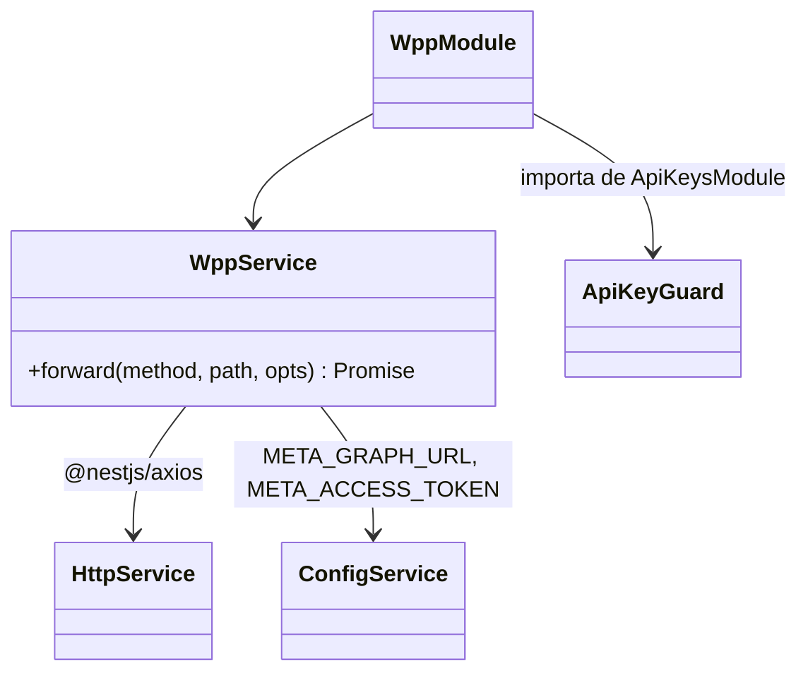
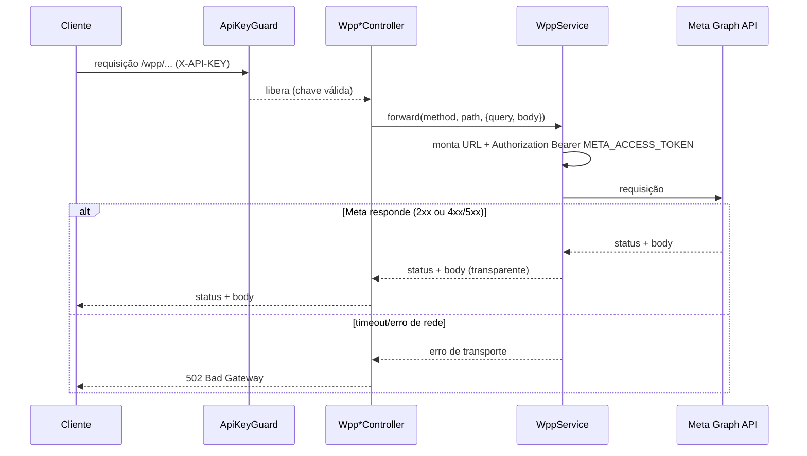
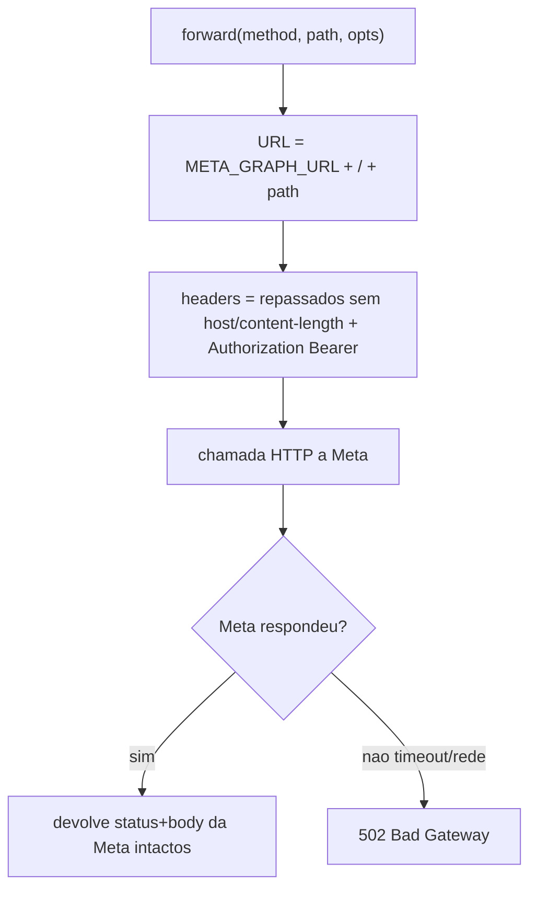

# WhatsApp Meta Adapter — Core

> **Feature 2 de 8 do whiz-gateway** (batch WhatsApp Meta Adapter). Base do adapter `/wpp/*`. Define o `WppService` (wrapper sobre `HttpService`), a configuração de ambiente da Meta Graph API, a injeção do token Meta, o mapeamento de erros e a aplicação do `ApiKeyGuard`. **Contrato comum reutilizado por todos os specs de domínio** (`wpp-messages`, `wpp-templates`, `wpp-phone-numbers`, `wpp-media`, `wpp-flows`, `wpp-misc`). Depende de `api-keys-foundation` (guards).

## 1. Context

O objetivo do projeto é centralizar todas as chamadas à WhatsApp Cloud API neste microserviço. Em vez de cada cliente falar direto com `graph.facebook.com` (e conhecer o `access token` da Meta), o cliente chama `/wpp/<rota Meta original>` autenticado por `X-API-KEY`. O adapter:

- Resolve a base `META_GRAPH_URL` (já inclui a versão, ex.: `https://graph.facebook.com/v20.0`) — o `{{Version}}` da Meta sai do path e vai para o `.env`.
- Injeta `Authorization: Bearer {META_ACCESS_TOKEN}` em toda chamada saída — o cliente nunca vê o token.
- Repassa método, sub-path, query params, headers relevantes e body.
- Devolve status + body da Meta sem modificação (transparência), traduzindo apenas falhas de transporte.

Este spec entrega a **infraestrutura compartilhada**. As rotas concretas por recurso são especificadas nos specs de domínio, mas todas reaproveitam o `WppService` e as regras aqui definidas.

## 2. Scope

**In:**
- `WppModule` (importa `HttpModule` do `@nestjs/axios`, `ApiKeysModule` para os guards).
- `WppService.forward(method, path, { query, body, headers, contentType })` → resposta Meta.
- Resolução de `META_GRAPH_URL` + injeção de `Authorization: Bearer {META_ACCESS_TOKEN}` via `ConfigService`.
- Mapeamento de erro: erro HTTP da Meta (4xx/5xx) → repassado com mesmo status+body; timeout/erro de rede → `502 Bad Gateway`.
- `ApiKeyGuard` aplicado no nível dos controllers `/wpp` (de `api-keys-foundation`).
- Convenção de mapeamento de rota: `/{{Version}}/<resto>` (Meta) → `/wpp/<resto>` (nosso).
- Env novas: `META_GRAPH_URL`, `META_ACCESS_TOKEN` em `config.validation.ts`.
- Um controller mínimo de prova (`GET /wpp/debug_token` ou healthcheck do adapter) **opcional** apenas para validar o contrato; demais rotas vêm dos domínios.

**Out:**
- Rotas de recurso concretas (messages, templates, media, flows, etc.) → specs de domínio.
- Geração/validação de API keys → `api-keys-foundation`.
- Cache de respostas da Meta, retry/backoff (Meta é idempotente só em parte; fora de escopo inicial).
- Rate limiting.

## 3. Glossary

| Termo | Significado |
|---|---|
| Meta Graph API | `https://graph.facebook.com/<version>/…` — WhatsApp Cloud API. |
| `META_GRAPH_URL` | Base com versão embutida (ex.: `https://graph.facebook.com/v20.0`). |
| `META_ACCESS_TOKEN` | Bearer token do app Meta. Injetado pelo adapter, nunca exposto ao caller. |
| Sub-path | Parte da rota Meta após a versão (ex.: `{phoneNumberId}/messages`). |
| Forward | Repassar a requisição ao destino Meta e devolver a resposta. |
| Transparência | Status code e body da Meta retornados sem alteração. |

## 4. Functional requirements

- **FR-1**: `WppService.forward(method, path, opts)` monta a URL `${META_GRAPH_URL}/${path}` (sem duplicar `/`), aplica `method`, `opts.query`, `opts.body`.
- **FR-2**: Toda chamada de saída inclui o header `Authorization: Bearer ${META_ACCESS_TOKEN}`. Headers `host` e `content-length` do request original **não** são repassados.
- **FR-3**: O `Content-Type` da chamada de saída segue `opts.contentType` (default `application/json`; `multipart/form-data` para uploads — ver `wpp-media`).
- **FR-4**: Em resposta de sucesso da Meta (2xx), o adapter devolve o mesmo status code e o body íntegro ao caller.
- **FR-5**: Em resposta de erro da Meta (4xx/5xx), o adapter devolve o **mesmo** status code e o body de erro da Meta íntegro.
- **FR-6**: Em timeout ou erro de rede (sem resposta da Meta), o adapter devolve `502 Bad Gateway` com `ErrorResponseDto`.
- **FR-7**: Query params recebidos pelo controller são encaminhados à Meta sem alteração (inclusive params com sintaxe de field expansion como `fields=...`).
- **FR-8**: Todos os controllers `/wpp/*` aplicam `@UseGuards(ApiKeyGuard)` (header `X-API-KEY`). Sem chave válida → `401` (ver `api-keys-foundation` FR-9).
- **FR-9**: A versão da API **não** aparece nas rotas `/wpp/*`; ela vive em `META_GRAPH_URL`.

## 5. Non-functional

- **NFR-1** (segurança): `META_ACCESS_TOKEN` lido só via `ConfigService`, nunca logado nem retornado ao caller.
- **NFR-2** (config): `META_GRAPH_URL` (uri) e `META_ACCESS_TOKEN` obrigatórias, validadas por Joi; ausência falha o boot.
- **NFR-3** (perf): adapter é stateless e fino; overhead de proxy desprezível ante a latência da Meta. Timeout de saída configurável (default 30s).
- **NFR-4** (observabilidade): cada forward loga `method`, `path` e status de resposta via `Logger` — sem logar `Authorization` nem bodies sensíveis.
- **NFR-5** (transparência): o adapter não reinterpreta o contrato Meta; corpo e status passam intactos (exceto falha de transporte → 502).

## 6. Data model

N/A — adapter stateless, sem persistência própria. (As entidades Meta vivem na Meta; este serviço não as armazena.)

## 7. API contract

Contrato **genérico** reutilizado pelos domínios. Cada spec de domínio define seus paths concretos; todos seguem:

```
### <MÉTODO> /wpp/<sub-path Meta>
- **Auth**: ApiKeyGuard (header X-API-KEY)
- **Forward**: <MÉTODO> ${META_GRAPH_URL}/<sub-path>  (+ Authorization: Bearer META_ACCESS_TOKEN)
- **Request**: body/query repassados (DTO definido no spec de domínio)
- **Responses**: status+body da Meta (transparente) | 401 sem X-API-KEY válida | 502 falha de transporte
```

Exemplo concreto (prova de contrato):

### GET /wpp/debug_token
- **Auth**: ApiKeyGuard
- **Query**: `input_token` (repassado)
- **Forward**: `GET ${META_GRAPH_URL}/debug_token?input_token=...`
- **Responses**: 200 (body Meta) | 401 | 502

## 8. Module boundaries



DI: `WppModule` importa `HttpModule` (`@nestjs/axios`) e `ApiKeysModule` (para `ApiKeyGuard`). Exporta `WppService` para os módulos de domínio. Cada módulo de domínio (`WppMessagesModule`, …) importa `WppModule` e injeta `WppService`.

## 9. Flows

### Forward genérico


## 10. State machines

N/A — sem entidade com ciclo de vida.

## 11. Business rules



## 12. Edge cases & errors

- Requisição sem `X-API-KEY` válida → `401` (ApiKeyGuard), antes de qualquer forward.
- `META_ACCESS_TOKEN`/`META_GRAPH_URL` ausentes → boot falha (NFR-2).
- Meta retorna 4xx (ex.: token expirado, recurso inexistente) → repassado com mesmo status/body (não vira 502).
- Timeout da Meta → `502`.
- Path com `/` inicial duplicado → normalizado (sem `//`).
- Body em `multipart/form-data` (uploads) → tratado conforme `wpp-media` (stream repassado).
- Query com caracteres especiais de field expansion (`fields=metric.name(...)`) → repassado já codificado, sem reprocessar.

## 13. Acceptance criteria

- **AC-1** `[backend]`: Given nenhum `X-API-KEY`, when qualquer `GET /wpp/...`, then `401` (ApiKeyGuard) e nenhuma chamada à Meta.
- **AC-2** `[backend]`: Given `X-API-KEY` inválida, when `GET /wpp/...`, then `401`.
- **AC-3** `[backend]`: Given `X-API-KEY` válida, when `GET /wpp/debug_token?input_token=abc`, then o `WppService` chama `GET ${META_GRAPH_URL}/debug_token?input_token=abc` com header `Authorization: Bearer ${META_ACCESS_TOKEN}` (HttpService mockado).
- **AC-4** `[backend]`: Given a Meta responde `200 { data: ... }`, when forward, then o caller recebe `200` e o mesmo body.
- **AC-5** `[backend]`: Given a Meta responde `400 { error: {...} }`, when forward, then o caller recebe `400` e o mesmo body de erro (não `502`).
- **AC-6** `[backend]`: Given o HttpService lança timeout/erro de rede, when forward, then o caller recebe `502` com `ErrorResponseDto`.
- **AC-7** `[backend]`: Given um `POST /wpp/.../messages` com body JSON, when forward, then o body é repassado íntegro e `Content-Type: application/json`.
- **AC-8** `[backend]`: Given query params na requisição, when forward, then são repassados sem alteração à Meta.
- **AC-9** `[e2e]`: Given app no ar com `X-API-KEY` válida e Meta stub, when `GET /wpp/debug_token`, then `200` com o body do stub e o header `Authorization` foi injetado (não veio do caller).

## 14. Open questions

- Timeout de saída ideal? (assume 30s; configurável via env futura se necessário)
- Repassar todos os headers do caller ou allowlist? (assume: dropar `host`/`content-length`/`authorization` do caller; injetar o nosso `Authorization`)
- Adapter deve validar shape do body por rota (DTOs) ou ser puro proxy? (decisão por domínio: specs de domínio definem DTOs com `@ApiProperty` para Swagger; validação estrita pode ficar `whitelist:false` em rotas proxy — ver cada domínio)
