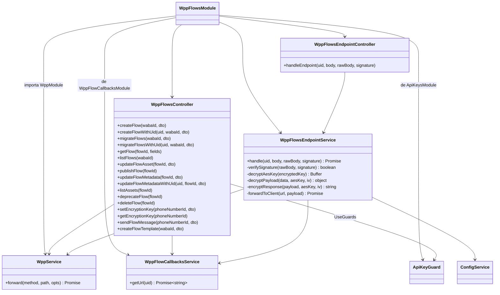
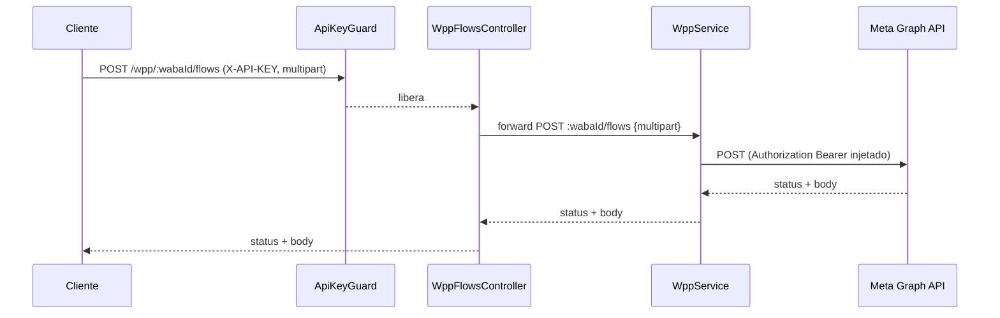
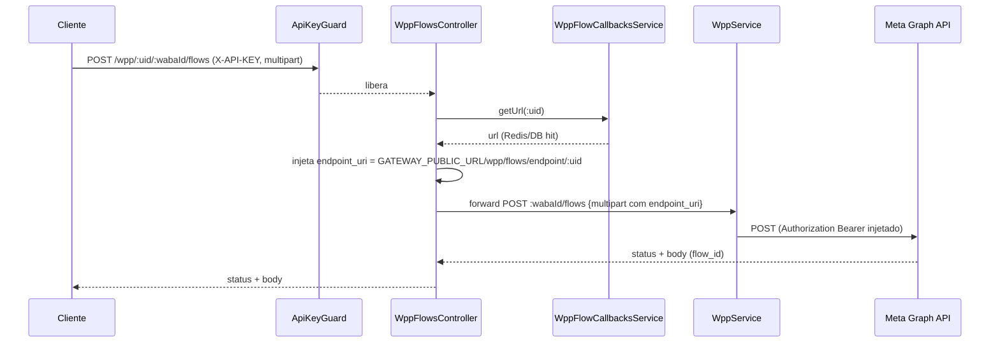
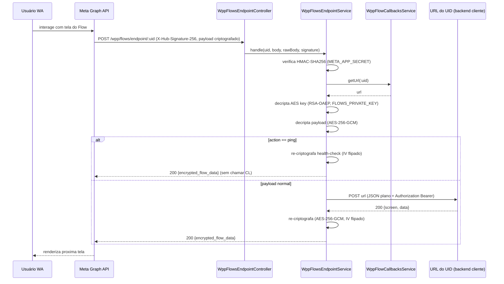
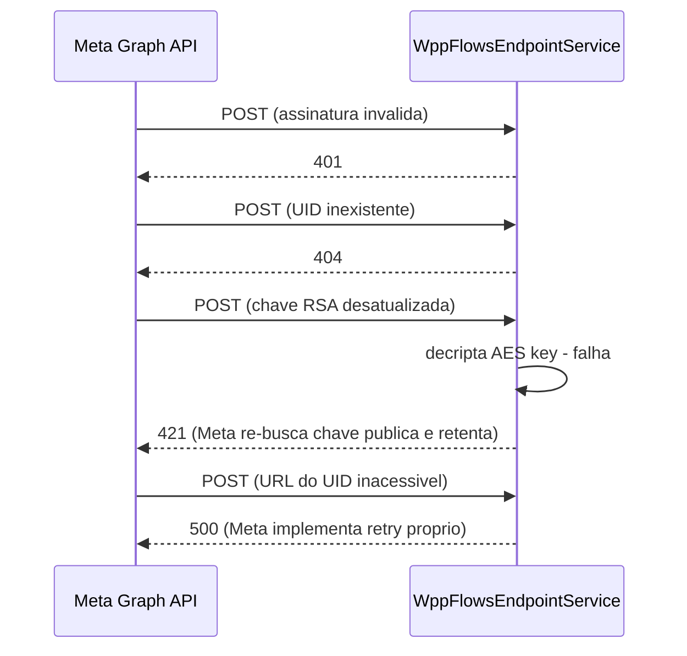
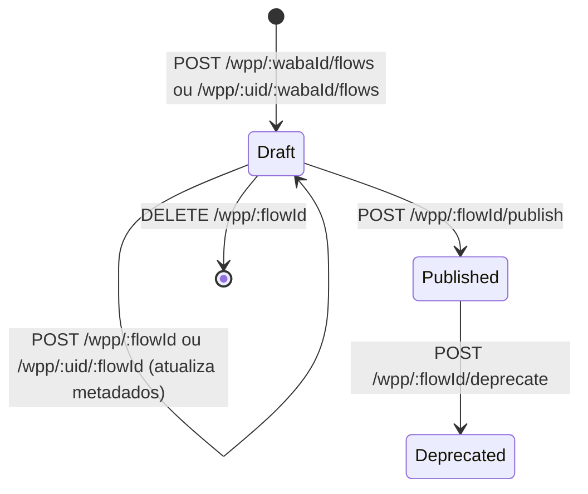
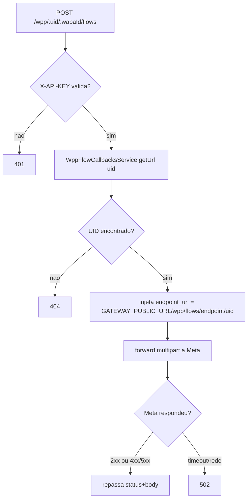
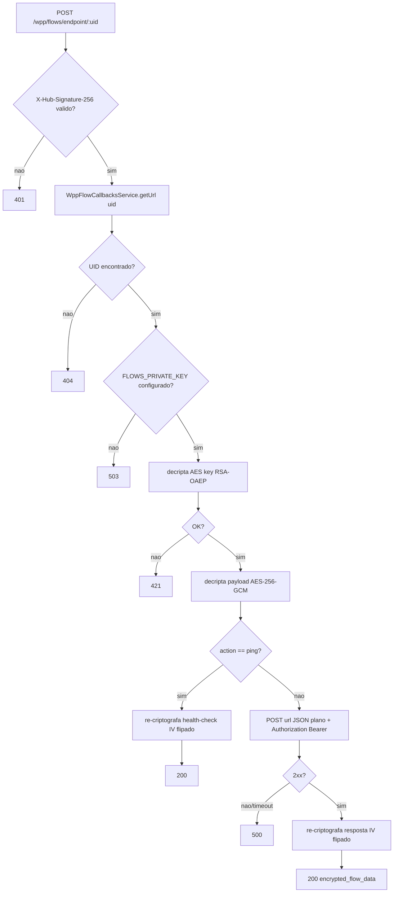

# WhatsApp Meta Adapter — Flows

> **Feature 7 de 8 do whiz-gateway** (batch WhatsApp Meta Adapter). Domínio **Flows** do adapter `/wpp/*`. Especifica as 24 rotas de proxy para a WhatsApp Flows API (criação, leitura, atualização, publicação, depreciação, exclusão, criptografia de endpoint, envio de Flow por mensagem e métricas) **mais variantes de rota com `:uid` para flows dinâmicos** (gateway injeta `endpoint_uri` automaticamente) e o **endpoint criptografado por UID** (`POST /wpp/flows/endpoint/:uid`) — onde a Meta POSTa payloads criptografados RSA-OAEP + AES-256-GCM; gateway descriptografa, encaminha ao URL registrado no UID e re-criptografa a resposta. **Depende de** `wpp-adapter-core` (forwarding, `WppService.forward`, injeção de `Authorization`, transparência, `502`), `api-keys-foundation` (`ApiKeyGuard`) e **`wpp-flow-callbacks`** (lookup de UID → URL via Redis/DB). O endpoint criptografado é autenticado por `X-Hub-Signature-256` (HMAC-SHA256 com `META_APP_SECRET`) — sem `ApiKeyGuard`.

## 1. Context

A WhatsApp Flows API permite criar e gerenciar **Flows** (formulários/jornadas interativas) dentro de um WABA. Este spec entrega o domínio Flows do adapter: cada rota da Meta `/{{Version}}/<resto>` vira `/wpp/<resto>`, protegida por `X-API-KEY` (`ApiKeyGuard`).

**Flows estáticos** (sem `endpoint_uri`): rotas de gerenciamento puras — proxy transparente via `WppService.forward`. Cliente não precisa de UID.

**Flows dinâmicos** (com `endpoint_uri`): quando o usuário interage com um Flow, a Meta criptografa o payload e POSTa no `endpoint_uri` configurado no flow. O gateway atua como intermediário criptográfico:

```
Meta → POST /wpp/flows/endpoint/:uid  { encrypted_flow_data, encrypted_aes_key, initial_vector }
         ↓ gateway: verifica X-Hub-Signature-256
         ↓ gateway: decripta AES key  (RSA-OAEP, FLOWS_PRIVATE_KEY)
         ↓ gateway: decripta payload  (AES-256-GCM)
Cliente ← POST <url registrado no uid>  (JSON plano)
Cliente → responde { screen, data }  (JSON plano)
         ↓ gateway: re-criptografa  (AES-256-GCM, mesmo key, IV XOR 0x01)
Meta  ← 200 { encrypted_flow_data }
```

O cliente é completamente agnóstico à criptografia — recebe e devolve JSON plano. Para criar um flow dinâmico, o cliente usa rotas com `:uid` prefixado (ex.: `POST /wpp/:uid/:wabaId/flows`); o gateway injeta automaticamente `endpoint_uri: GATEWAY_PUBLIC_URL/wpp/flows/endpoint/:uid` no body antes de encaminhar à Meta. O UID é obtido previamente via `wpp-flow-callbacks` (CRUD separado).

**Usuários das rotas de gerenciamento**: sistemas clientes portando `X-API-KEY`.
**Chamador do endpoint criptografado**: a Meta Graph API diretamente.

## 2. Scope

**In:**
- `WppFlowsModule` (importa `WppModule`, `ApiKeysModule`, `WppFlowCallbacksModule`).
- **24 rotas de proxy puro** (sem `:uid`) para flows estáticos — `ApiKeyGuard` + `WppService.forward`.
- **Variantes com `:uid`** para flows dinâmicos:
  - `POST /wpp/:uid/:wabaId/flows` — cria flow dinâmico (gateway injeta `endpoint_uri`).
  - `POST /wpp/:uid/:wabaId/migrate_flows` — migra flows dinâmicos.
  - `POST /wpp/:uid/:flowId` — atualiza metadados injetando novo `endpoint_uri`.
- **Endpoint criptografado**: `POST /wpp/flows/endpoint/:uid` — Meta chama aqui; gateway descriptografa, encaminha ao URL do UID, re-criptografa.
- `WppFlowsEndpointService` — lógica de decrypt/forward/re-encrypt.
- DTOs com `@ApiProperty`/`@ApiPropertyOptional` (PT-BR) para Swagger.

**Out:**
- CRUD de `flow_callbacks_urls` e Redis cache → `wpp-flow-callbacks`.
- Contrato de forwarding, injeção de token, transparência → `wpp-adapter-core`.
- Geração/validação de API keys → `api-keys-foundation`.
- Rotas canônicas de `/messages` e `/message_templates` → `wpp-messages` / `wpp-templates` (este spec é dono dos DTOs de Flow nesses bodies).
- Persistência local, cache de respostas, retry/backoff, rate limiting.

## 3. Glossary

| Termo | Significado |
|---|---|
| Flow | Formulário/jornada interativa do WhatsApp, criado e versionado na Meta. |
| WABA | WhatsApp Business Account. Container dos Flows; path var `:wabaId`. |
| Flow JSON / Asset | Documento JSON que define as telas do Flow. Enviado via `POST /wpp/:flowId/assets`. |
| Draft | Flow não publicado; editável, enviável em modo draft para teste. |
| Published | Flow publicado via `/publish`; imutável. |
| Deprecated | Flow obsoleto via `/deprecate`; não enviável a novos usuários. |
| UID | Identificador opaco gerado pelo gateway para uma entrada de `flow_callbacks_urls`. Incluso no path das rotas dinâmicas e no `endpoint_uri` configurado na Meta. |
| `endpoint_uri` | URL configurada por flow para flows dinâmicos. Nas rotas com `:uid`, o gateway injeta `GATEWAY_PUBLIC_URL/wpp/flows/endpoint/:uid` automaticamente. |
| `FLOWS_PRIVATE_KEY` | Chave privada RSA-2048 PEM no gateway. Decripta a AES Key recebida da Meta. |
| `GATEWAY_PUBLIC_URL` | URL pública do gateway (ex.: `https://gateway.example.com`). Usado para construir o `endpoint_uri`. |
| Encrypted Payload | Body enviado pela Meta: `{ encrypted_flow_data, encrypted_aes_key, initial_vector }` — todos base64. |
| AES Key | Chave AES-256 gerada pela Meta por interação, criptografada com RSA-OAEP (chave pública do gateway). |
| Ping / Health Check | `{ action: "ping" }` enviado pela Meta periodicamente para verificar se o endpoint está ativo. |
| `421` | Status que sinaliza à Meta erro de descriptografia; Meta re-busca chave pública e retenta. |
| `flow_callbacks_urls` | Tabela que armazena `uid → url`. Gerenciada por `wpp-flow-callbacks`. |
| Field expansion | Sintaxe Meta `?fields=...` para selecionar campos ou métricas. |

## 4. Functional requirements

FRs de gerenciamento herdam o contrato de `wpp-adapter-core`: `ApiKeyGuard`, `Authorization` injetado, transparência de status+body, `502` em falha de transporte, query repassada intacta.

**Criação e leitura (proxy puro):**
- **FR-1**: `POST /wpp/:wabaId/flows` (`multipart/form-data`: `name`, `categories`, `clone_flow_id?`, `endpoint_uri?`) → forward `POST ${META_GRAPH_URL}/:wabaId/flows` (multipart).
- **FR-2**: `POST /wpp/:wabaId/migrate_flows` (`multipart/form-data`: `source_waba_id`, `source_flow_names?`) → forward `POST ${META_GRAPH_URL}/:wabaId/migrate_flows` (multipart).
- **FR-3**: `GET /wpp/:flowId?fields=...` → forward `GET ${META_GRAPH_URL}/:flowId?fields=...` (Get Flow / Preview URL / Métricas — ver §12).
- **FR-4**: `GET /wpp/:wabaId/flows` → forward `GET ${META_GRAPH_URL}/:wabaId/flows`.

**Atualização e ciclo de vida (proxy puro):**
- **FR-5**: `POST /wpp/:flowId/assets` (`multipart/form-data`: `file`, `name`, `asset_type`) → forward `POST ${META_GRAPH_URL}/:flowId/assets` (multipart).
- **FR-6**: `POST /wpp/:flowId/publish` → forward `POST ${META_GRAPH_URL}/:flowId/publish`.
- **FR-7**: `POST /wpp/:flowId` (`multipart/form-data`: `name?`, `categories?`, `endpoint_uri?`) → forward `POST ${META_GRAPH_URL}/:flowId` (multipart) — Update Flow Metadata puro.
- **FR-8**: `GET /wpp/:flowId/assets` → forward `GET ${META_GRAPH_URL}/:flowId/assets`.
- **FR-9**: `POST /wpp/:flowId/deprecate` → forward `POST ${META_GRAPH_URL}/:flowId/deprecate`.
- **FR-10**: `DELETE /wpp/:flowId` → forward `DELETE ${META_GRAPH_URL}/:flowId`.

**Criptografia do endpoint (proxy puro):**
- **FR-11**: `POST /wpp/:phoneNumberId/whatsapp_business_encryption` (`multipart/form-data`: `business_public_key`) → forward (multipart).
- **FR-12**: `GET /wpp/:phoneNumberId/whatsapp_business_encryption` → forward.

**Envio de Flow por mensagem (proxy puro):**
- **FR-13**: `POST /wpp/:phoneNumberId/messages` com `type: interactive`, `interactive.type: flow` → forward JSON (Send Flow Message — draft/published por name/ID).
- **FR-14**: `POST /wpp/:wabaId/message_templates` com componente Flow → forward JSON (Create Flow Template — by Name / by Flow JSON / by ID).

**Métricas (proxy puro — mesma rota `GET /wpp/:flowId`, disambiguadas por `fields`):**
- **FR-15**: `GET /wpp/:flowId?fields=metric.name(ENDPOINT_REQUEST_COUNT)...` → forward intacto.
- **FR-16**: `GET /wpp/:flowId?fields=metric.name(ENDPOINT_REQUEST_ERROR)...` → forward intacto.
- **FR-17**: `GET /wpp/:flowId?fields=metric.name(ENDPOINT_REQUEST_ERROR_RATE)...` → forward intacto.
- **FR-18**: `GET /wpp/:flowId?fields=metric.name(ENDPOINT_REQUEST_LATENCY_SECONDS_CEIL)...` → forward intacto.
- **FR-19**: `GET /wpp/:flowId?fields=metric.name(ENDPOINT_AVAILABILITY)...` → forward intacto.

**Transversal de gerenciamento:**
- **FR-20**: Todos os controllers de gerenciamento aplicam `@UseGuards(ApiKeyGuard)`. Sem `X-API-KEY` válida → `401`.
- **FR-21**: Rotas `multipart/form-data` (FR-1, FR-2, FR-5, FR-7, FR-11) usam `opts.contentType: multipart/form-data` (`wpp-adapter-core` FR-3).

**Variantes com `:uid` (flows dinâmicos — inject `endpoint_uri`):**
- **FR-22**: `POST /wpp/:uid/:wabaId/flows` — resolve `:uid` via `WppFlowCallbacksService.getUrl(uid)` (Redis/DB). UID não encontrado ou `del=true` → `404`. Injeta `endpoint_uri: ${GATEWAY_PUBLIC_URL}/wpp/flows/endpoint/${uid}` no body multipart antes do forward. Demais campos repassados intactos.
- **FR-23**: `POST /wpp/:uid/:wabaId/migrate_flows` — idem FR-22 para migração.
- **FR-24**: `POST /wpp/:uid/:flowId` — idem FR-22 para atualização de metadados (troca `endpoint_uri` de um flow existente).

**Endpoint criptografado:**
- **FR-25**: `POST /wpp/flows/endpoint/:uid` — verifica `X-Hub-Signature-256: sha256=<hmac>` usando `META_APP_SECRET`. Inválido/ausente → `401`.
- **FR-26**: Resolve `:uid` via `WppFlowCallbacksService.getUrl(uid)`. UID não encontrado ou `del=true` → `404`.
- **FR-27**: Verifica `FLOWS_PRIVATE_KEY` configurado. Ausente → `503`.
- **FR-28**: Descriptografa AES Key: `crypto.privateDecrypt({ key: FLOWS_PRIVATE_KEY, oaepHash: 'sha256', padding: RSA_PKCS1_OAEP_PADDING }, Buffer.from(encrypted_aes_key, 'base64'))`. Falha → `421`.
- **FR-29**: Descriptografa payload: AES-256-GCM, últimos 16 bytes de `encrypted_flow_data` (base64-decoded) = auth tag. Falha → `421`.
- **FR-30**: Se payload descriptografado contém `{ action: "ping" }`: re-criptografa `{ data: "{\"version\":\"3.0\"}" }` com mesma chave AES e IV flipado (XOR `0x01` no primeiro byte), retorna `200 { encrypted_flow_data }` **sem** chamar o URL do UID.
- **FR-31**: Para demais payloads: POST `url` (do UID) com JSON descriptografado + `Authorization: Bearer META_ACCESS_TOKEN` + `Content-Type: application/json`. Timeout ou resposta não-2xx → `500`.
- **FR-32**: Re-criptografa resposta: AES-256-GCM, mesma chave, IV = cópia de `initial_vector` com XOR `0x01` no primeiro byte. Retorna `200 { encrypted_flow_data }`.

## 5. Non-functional

- **NFR-1** (transparência): rotas de proxy puro repassam status+body Meta intactos, incluindo 4xx/5xx e `validation_errors`.
- **NFR-2** (segurança): `META_ACCESS_TOKEN` injetado só pelo `WppService`; nunca exposto/logado. `FLOWS_PRIVATE_KEY` jamais logado. `ApiKeyGuard` protege 100% das rotas de gerenciamento.
- **NFR-3** (config): `FLOWS_PRIVATE_KEY` é `Joi.string().optional()`. `GATEWAY_PUBLIC_URL` é `Joi.string().uri().required()` (necessário para construir `endpoint_uri` nas rotas com `:uid`). Ambos adicionados a `src/config/config.validation.ts`.
- **NFR-4** (perf): domínio stateless; overhead de proxy desprezível. UID lookup usa Redis com TTL de 1 hora (implementado em `wpp-flow-callbacks`).
- **NFR-5** (observabilidade): cada forward loga `method`, `path`, status. Endpoint criptografado loga `uid`, `action`, status de descriptografia e status do forward — nunca loga payload descriptografado nem chave AES.
- **NFR-6** (Swagger): toda rota em PT-BR; `@ApiTags('Flows')`; `@ApiBearerAuth('bearer')` nas rotas com `ApiKeyGuard`.

## 6. Data model

N/A para este módulo — flows vivem na Meta; `flow_callbacks_urls` é gerenciado por `wpp-flow-callbacks`.

## 7. API contract

**Auth padrão das rotas de gerenciamento**: `ApiKeyGuard` (header `X-API-KEY`) | forward `Authorization: Bearer META_ACCESS_TOKEN` | responses: status+body Meta | `401` | `502`.

### POST /wpp/:wabaId/flows
- **Content-Type**: `multipart/form-data`
- **Request**: `CreateFlowDto` — `name`, `categories`, `clone_flow_id?`, `endpoint_uri?`
- **Forward**: `POST ${META_GRAPH_URL}/:wabaId/flows` (multipart)
- **Responses**: `200`/`201` | `400` | `401` | `502`

### POST /wpp/:uid/:wabaId/flows  _(dinâmico — injeta endpoint_uri)_
- **Auth**: `ApiKeyGuard`
- **Content-Type**: `multipart/form-data`
- **Request**: `CreateFlowDto` (sem `endpoint_uri` — gateway injeta)
- **Comportamento**: resolve UID → injeta `endpoint_uri: ${GATEWAY_PUBLIC_URL}/wpp/flows/endpoint/:uid` → forward multipart
- **Responses**: `200`/`201` | `400` | `401` | `404` UID não encontrado | `502`

### POST /wpp/:wabaId/migrate_flows
- **Content-Type**: `multipart/form-data`
- **Request**: `MigrateFlowsDto` — `source_waba_id`, `source_flow_names?`
- **Forward**: `POST ${META_GRAPH_URL}/:wabaId/migrate_flows` (multipart)
- **Responses**: `200` | `400` | `401` | `502`

### POST /wpp/:uid/:wabaId/migrate_flows  _(dinâmico)_
- **Auth**: `ApiKeyGuard`
- **Comportamento**: resolve UID → injeta `endpoint_uri` → forward multipart
- **Responses**: `200` | `400` | `401` | `404` | `502`

### GET /wpp/:flowId
- **Query**: `fields` (repassada intacta) — Get Flow / Preview URL / Métricas (ver §12)
- **Forward**: `GET ${META_GRAPH_URL}/:flowId?fields=...`
- **Responses**: `200` | `400` | `401` | `404` | `502`

### GET /wpp/:wabaId/flows
- **Forward**: `GET ${META_GRAPH_URL}/:wabaId/flows`
- **Responses**: `200` | `401` | `502`

### POST /wpp/:flowId/assets
- **Content-Type**: `multipart/form-data`
- **Request**: `UpdateFlowAssetDto` — `file`, `name`, `asset_type`
- **Forward**: `POST ${META_GRAPH_URL}/:flowId/assets` (multipart)
- **Responses**: `200` (pode conter `validation_errors`) | `400` | `401` | `502`

### POST /wpp/:flowId/publish
- **Forward**: `POST ${META_GRAPH_URL}/:flowId/publish`
- **Responses**: `200` | `400` | `401` | `502`

### POST /wpp/:flowId  _(Update Metadata — proxy puro)_
- **Content-Type**: `multipart/form-data`
- **Request**: `UpdateFlowMetadataDto` — `name?`, `categories?`, `endpoint_uri?`
- **Forward**: `POST ${META_GRAPH_URL}/:flowId` (multipart)
- **Responses**: `200` | `400` | `401` | `502`

### POST /wpp/:uid/:flowId  _(Update Metadata — injeta endpoint_uri)_
- **Auth**: `ApiKeyGuard`
- **Comportamento**: resolve UID → injeta/substitui `endpoint_uri` → forward multipart
- **Responses**: `200` | `400` | `401` | `404` | `502`

### GET /wpp/:flowId/assets
- **Forward**: `GET ${META_GRAPH_URL}/:flowId/assets`
- **Responses**: `200` | `401` | `502`

### POST /wpp/:flowId/deprecate
- **Forward**: `POST ${META_GRAPH_URL}/:flowId/deprecate`
- **Responses**: `200` | `400` | `401` | `502`

### DELETE /wpp/:flowId
- **Forward**: `DELETE ${META_GRAPH_URL}/:flowId`
- **Responses**: `200` | `401` | `404` | `502`

### POST /wpp/:phoneNumberId/whatsapp_business_encryption
- **Content-Type**: `multipart/form-data`
- **Request**: `SetEncryptionKeyDto` — `business_public_key` (PEM)
- **Forward**: `POST ${META_GRAPH_URL}/:phoneNumberId/whatsapp_business_encryption` (multipart)
- **Responses**: `200` | `400` | `401` | `502`

### GET /wpp/:phoneNumberId/whatsapp_business_encryption
- **Forward**: `GET ${META_GRAPH_URL}/:phoneNumberId/whatsapp_business_encryption`
- **Responses**: `200` | `401` | `502`

### POST /wpp/:phoneNumberId/messages
- **Request**: `SendFlowMessageDto` — `messaging_product: "whatsapp"`, `to`, `type: "interactive"`, `interactive` (`type: "flow"`, `flow_id`/`flow_name`, `mode: draft|published`, `flow_token`, `flow_cta`, ...)
- **Forward**: `POST ${META_GRAPH_URL}/:phoneNumberId/messages` (JSON)
- **Responses**: `200` | `400` | `401` | `502`
- **Nota**: rota canônica de `wpp-messages`; este spec é dono do body de Flow. Ver §12.

### POST /wpp/:wabaId/message_templates
- **Request**: `CreateFlowTemplateDto` — `name`, `language`, `category`, `components[]` com botão Flow
- **Forward**: `POST ${META_GRAPH_URL}/:wabaId/message_templates` (JSON)
- **Responses**: `200`/`201` | `400` | `401` | `502`
- **Nota**: rota canônica de `wpp-templates`; este spec é dono do body de Flow Template. Ver §12.

### POST /wpp/flows/endpoint/:uid  _(chamado pela Meta)_
- **Auth**: `X-Hub-Signature-256` (HMAC-SHA256 com `META_APP_SECRET`) — sem `ApiKeyGuard`
- **Request**: `FlowEndpointRequestDto` — `encrypted_flow_data: string`, `encrypted_aes_key: string`, `initial_vector: string` (todos base64)
- **Comportamento**: verifica assinatura → resolve UID → decripta AES key (RSA-OAEP) → decripta payload (AES-256-GCM) → ping shortcut ou POST ao URL registrado → re-criptografa (IV flipado) → retorna
- **Responses**: `200 { encrypted_flow_data }` | `401` assinatura inválida | `404` UID não encontrado | `421` erro de descriptografia | `503` sem `FLOWS_PRIVATE_KEY` | `500` URL inacessível

## 8. Module boundaries



`WppFlowsModule` importa `WppModule`, `ApiKeysModule` e `WppFlowCallbacksModule` (provê/exporta `WppFlowCallbacksService`). Nenhum repositório próprio, nenhuma fila nova.

## 9. Flows

### Criar Flow estático (proxy puro)


### Criar Flow dinâmico (com UID — injeta endpoint_uri)


### Interação com Flow dinâmico (endpoint criptografado)


### Falha no endpoint criptografado


## 10. State machines

Ciclo de vida do Flow mantido na Meta. Transições via rotas de proxy:



## 11. Business rules





## 12. Edge cases & errors

- **`GET /wpp/:flowId` multiplexada**: Get Flow / Preview URL (`fields=preview.invalidate(false)`) / 5 métricas (`fields=metric.name(...)...`) — proxy puro, a Meta interpreta `fields`.
- **`POST /wpp/:flowId` vs `POST /wpp/:uid/:flowId`**: rotas distintas no NestJS; a com `:uid` injeta `endpoint_uri`; a sem `:uid` é proxy puro (cliente passa `endpoint_uri` explicitamente se quiser).
- **`POST /wpp/flows/endpoint/:uid` vs `POST /wpp/:uid/:flowId`**: `/flows/` é literal fixo; NestJS resolve rota estática antes de dinâmica. Sem colisão.
- **Overlap com `wpp-messages`/`wpp-templates`**: ver §2 Out. Rota registrada uma única vez no dono canônico; este spec contribui com DTOs de Flow.
- **Rotas multipart**: `opts.contentType: multipart/form-data` via `WppService.forward` (`wpp-adapter-core` FR-3). Body enviado como JSON nessas rotas → erro da Meta repassado (transparência).
- **`X-API-KEY` inválida** → `401` (ApiKeyGuard) antes de qualquer forward.
- **`X-Hub-Signature-256` ausente** → `401`. A Meta sempre envia o header; ausência indica chamada não-Meta.
- **UID inválido/deletado** → `404` (nas rotas `:uid` e no endpoint criptografado).
- **Chave RSA desatualizada** (`encrypted_aes_key` gerado com chave pública antiga): descriptografia falha → `421`; Meta re-busca a chave pública registrada via `/whatsapp_business_encryption` e retenta.
- **IV flipado**: XOR `0x01` no primeiro byte do `initial_vector` — convenção da Meta para evitar reuso de nonce na re-criptografia.
- **URL do UID inacessível ou resposta não-2xx**: gateway retorna `500`; Meta implementa retry próprio.
- **Ping sem `FLOWS_PRIVATE_KEY`**: `503` → Meta marcará endpoint como inativo.
- **Erro de validação do Flow JSON** (assets): Meta retorna `200` com `validation_errors` ou `4xx` → repassado intacto.
- **Publish/Deprecate/Delete com estado inválido**: regras de transição da Meta; `4xx` repassado.
- **Timeout/erro de rede com a Meta** → `502`.
- **Query de métricas com parênteses**: repassada já codificada, sem reprocessar (`wpp-adapter-core` FR-7).

## 13. Acceptance criteria

- **AC-1** `[backend]`: Given `X-API-KEY` válida, when `POST /wpp/:wabaId/flows` (multipart com `name`, `categories`), then `WppService` chama `POST ${META_GRAPH_URL}/:wabaId/flows` com `Authorization: Bearer` e `Content-Type: multipart/form-data`; status+body Meta repassados.
- **AC-2** `[backend]`: Given `X-API-KEY` válida e UID existente, when `POST /wpp/:uid/:wabaId/flows` (multipart), then `WppFlowCallbacksService.getUrl` chamado com o UID; body multipart forwarded contém `endpoint_uri = ${GATEWAY_PUBLIC_URL}/wpp/flows/endpoint/:uid`; outros campos intactos.
- **AC-3** `[backend]`: Given `X-API-KEY` válida e UID inexistente, when `POST /wpp/:uid/:wabaId/flows`, then `404` sem forward.
- **AC-4** `[backend]`: Given `X-API-KEY` válida e UID existente, when `POST /wpp/:uid/:flowId` (multipart Update Metadata), then `endpoint_uri` injetado/substituído; forward multipart correto.
- **AC-5** `[backend]`: Given `X-API-KEY` válida, when `GET /wpp/:wabaId/flows`, then forward `GET ${META_GRAPH_URL}/:wabaId/flows`.
- **AC-6** `[backend]`: Given `X-API-KEY` válida, when `GET /wpp/:flowId?fields=id,name,status`, then forward com `fields` intacto.
- **AC-7** `[backend]`: Given `X-API-KEY` válida, when `GET /wpp/:flowId?fields=preview.invalidate(false)`, then forward com `fields` intacto.
- **AC-8** `[backend]`: Given `X-API-KEY` válida, when `POST /wpp/:flowId/assets` (multipart com `file`, `name`, `asset_type`), then forward multipart correto.
- **AC-9** `[backend]`: Given `X-API-KEY` válida, when `POST /wpp/:flowId/publish`, then forward a `/:flowId/publish`.
- **AC-10** `[backend]`: Given `X-API-KEY` válida, when `GET /wpp/:flowId?fields=metric.name(ENDPOINT_REQUEST_COUNT)...`, then query repassada intacta (parênteses preservados).
- **AC-11** `[backend]`: Given `X-API-KEY` válida, when `POST /wpp/:phoneNumberId/whatsapp_business_encryption` (multipart com `business_public_key`), then forward multipart; GET correspondente → forward GET.
- **AC-12** `[backend]`: Given `X-API-KEY` válida, when `POST /wpp/:phoneNumberId/messages` (`type: interactive`, `interactive.type: flow`), then body JSON repassado íntegro.
- **AC-13** `[backend]`: Given `X-API-KEY` inválida/ausente, when qualquer rota de gerenciamento, then `401` sem forward.
- **AC-14** `[backend]`: Given Meta responde `4xx`, when forward, then mesmo status/body (não `502`); timeout/rede → `502`.
- **AC-15** `[backend]`: Given `FLOWS_PRIVATE_KEY` configurado, UID existente, `X-Hub-Signature-256` válido, payload criptografado corretamente, when `POST /wpp/flows/endpoint/:uid`, then: AES key decriptada com RSA-OAEP; payload decriptado com AES-256-GCM; forward JSON plano ao URL do UID com `Authorization: Bearer META_ACCESS_TOKEN`; resposta re-criptografada com IV flipado; `200 { encrypted_flow_data }` retornado.
- **AC-16** `[backend]`: Given payload decriptado com `{ action: "ping" }`, when `POST /wpp/flows/endpoint/:uid`, then `200` com health-check re-criptografado; URL do UID não chamado.
- **AC-17** `[backend]`: Given `X-Hub-Signature-256` inválido, when `POST /wpp/flows/endpoint/:uid`, then `401`.
- **AC-18** `[backend]`: Given UID inexistente, when `POST /wpp/flows/endpoint/:uid` com assinatura válida, then `404`.
- **AC-19** `[backend]`: Given `FLOWS_PRIVATE_KEY` ausente, when `POST /wpp/flows/endpoint/:uid` com assinatura válida e UID existente, then `503`.
- **AC-20** `[backend]`: Given chave RSA incorreta, when `POST /wpp/flows/endpoint/:uid`, then `421`.
- **AC-21** `[backend]`: Given URL do UID retorna timeout, when `POST /wpp/flows/endpoint/:uid`, then `500`.
- **AC-22** `[e2e]`: Given app no ar, `X-API-KEY` válida, UID existente, `GATEWAY_PUBLIC_URL` configurado, Meta stub, when `POST /wpp/:uid/:wabaId/flows` (multipart), then stub recebe body com `endpoint_uri` correto; `Authorization` injetado pelo adapter.
- **AC-23** `[e2e]`: Given app no ar, `FLOWS_PRIVATE_KEY`, `META_APP_SECRET`, UID com URL de stub, payload criptografado com chave pública correspondente, stub retornando `{ screen: "SUCCESS" }`, when `POST /wpp/flows/endpoint/:uid` com `X-Hub-Signature-256` válido, then `200` com `encrypted_flow_data` descriptografável para `{ screen: "SUCCESS" }`.

## 14. Open questions

- Dividir `WppFlowsController` por grupo (CRUD / encryption / send / metrics / uid-routes) ou único? (assume: separar pelo menos uid-routes em controller próprio para clareza — decidir na fase de código)
- Validação mínima de DTOs ou proxy puro? (assume: proxy puro; DTOs só para Swagger)
- Rotas `POST /messages` e `POST /message_templates`: registrar controller aqui ou apenas DTOs? (assume: DTOs aqui; rota registrada no dono canônico)
- Se cliente enviar `endpoint_uri` explícito na rota com `:uid`, gateway sobrescreve ou usa o do cliente? (assume: gateway sobrescreve sempre com o derivado do UID — garantia de integridade do roteamento)
- `FLOWS_PRIVATE_KEY` em formato PEM direto na env ou como path para arquivo? (assume: PEM string direta na env, com `\n` escapados, conforme padrão de outras envs do projeto)
