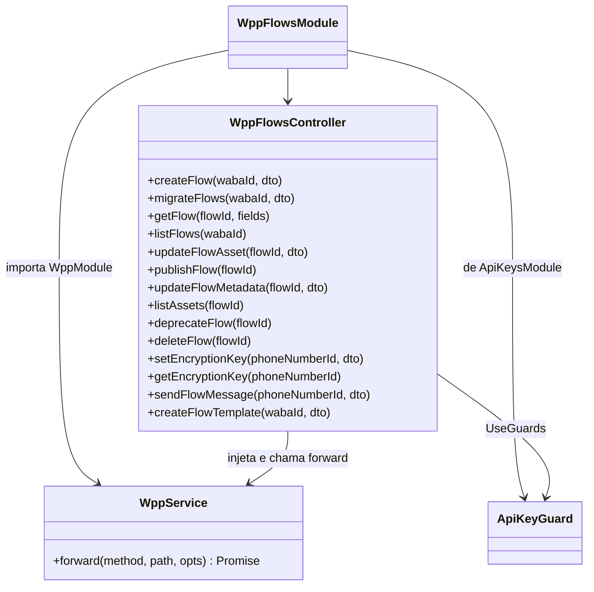
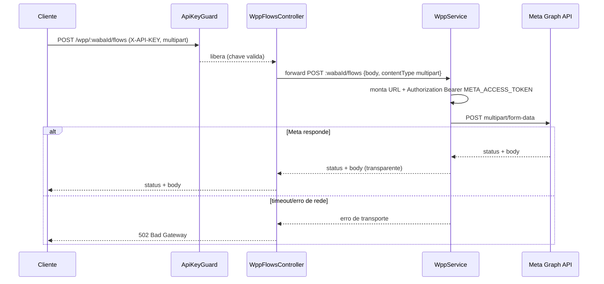
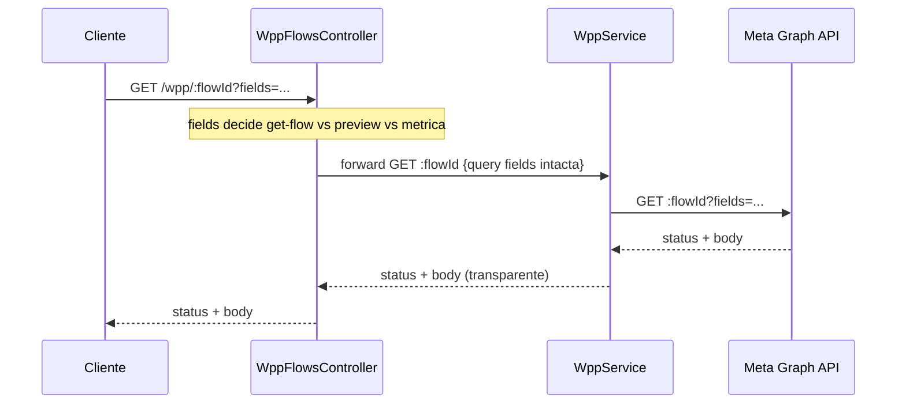
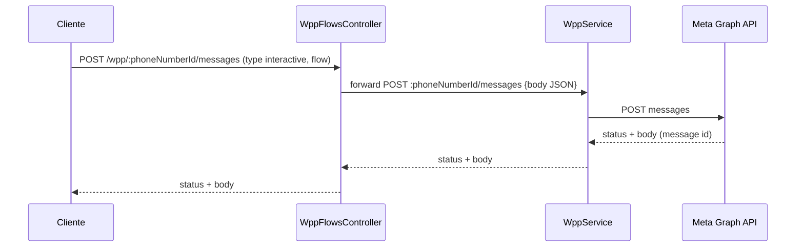
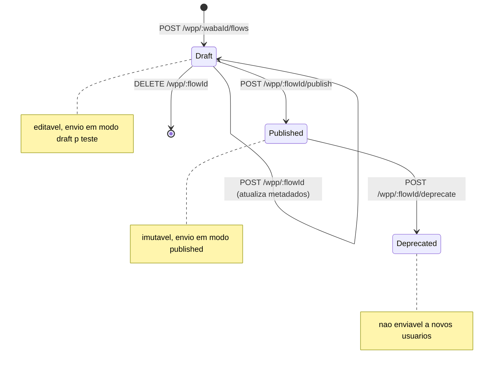
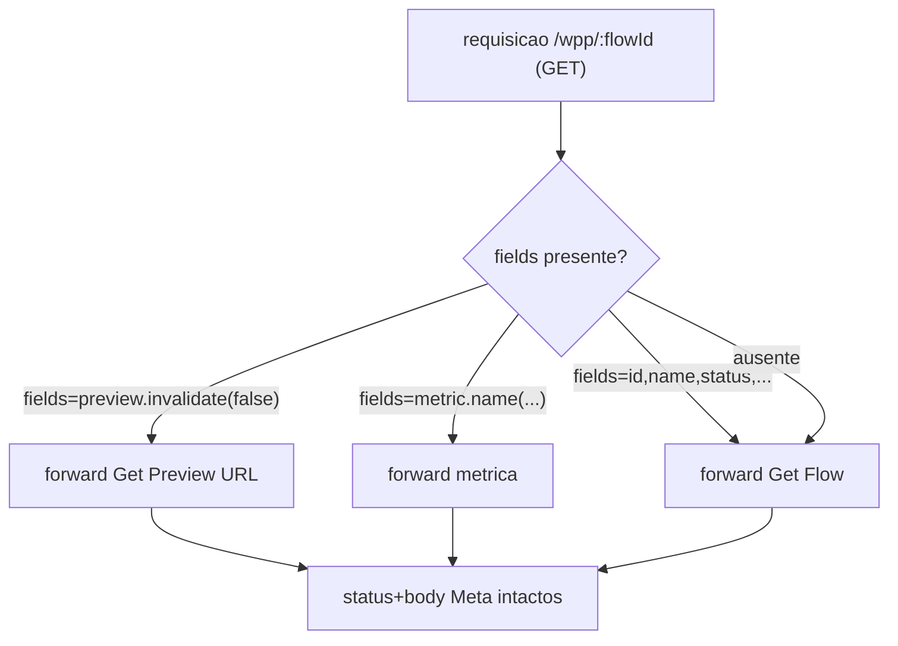
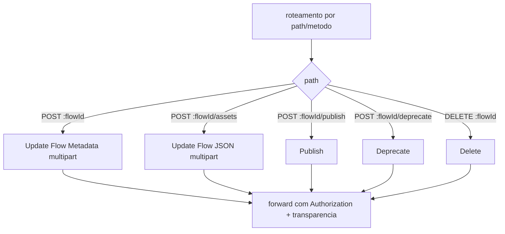

# WhatsApp Meta Adapter — Flows

> **Feature 7 de 8 do whiz-gateway** (batch WhatsApp Meta Adapter). Domínio **Flows** do adapter `/wpp/*`. Especifica as 24 rotas de proxy para a WhatsApp Flows API (criação, leitura, atualização, publicação, depreciação, exclusão, criptografia de endpoint, envio de Flow por mensagem e métricas). **Depende de** `wpp-adapter-core` (contrato de forwarding, `WppService.forward`, `META_GRAPH_URL`, injeção de `Authorization: Bearer META_ACCESS_TOKEN`, mapeamento de erro, transparência) e de `api-keys-foundation` (`ApiKeyGuard`). Não redefine esse contrato — apenas define os paths concretos, DTOs e Swagger PT-BR deste domínio.

## 1. Context

A WhatsApp Flows API permite criar e gerenciar **Flows** (formulários/jornadas interativas) dentro de um WABA, publicá-los, versioná-los via assets (JSON do Flow), configurar a criptografia do endpoint, enviá-los como mensagens interativas e consultar métricas operacionais. Hoje o cliente teria que falar direto com `graph.facebook.com`, conhecendo a versão da API e o `access token` da Meta.

Este spec entrega o domínio **Flows** do adapter: cada rota da Meta `/{{Version}}/<resto>` vira `/wpp/<resto>`, protegida por `X-API-KEY` (`ApiKeyGuard`). O `WppService.forward` repassa método, sub-path, query, headers relevantes e body, injeta `Authorization: Bearer {META_ACCESS_TOKEN}` e devolve status + body da Meta de forma transparente (falha de transporte → `502`). Várias rotas usam `multipart/form-data` (uploads de arquivo do Flow JSON, chave pública, criação de Flow), reaproveitando o hook `opts.contentType` definido em `wpp-adapter-core` FR-3.

**Usuários**: sistemas clientes que gerenciam Flows do WhatsApp via `/wpp/*` portando `X-API-KEY`.

## 2. Scope

**In:**
- `WppFlowsModule` (importa `WppModule` para `WppService`; `ApiKeyGuard` aplicado nos controllers).
- 24 rotas de proxy agrupadas em: criação/leitura, atualização/ciclo de vida, criptografia, envio de Flow por mensagem e métricas.
- DTOs com `@ApiProperty`/`@ApiPropertyOptional` (description + example, PT-BR) para body/query, apenas para documentação Swagger — repasse transparente do body à Meta.
- Rotas `multipart/form-data` (criação de Flow, migração, atualização de assets/Flow JSON, atualização de metadados, criptografia) usando `opts.contentType` (`wpp-adapter-core` FR-3).
- Mapeamento de path vars Meta → params nomeados: `{{WABA-ID}}` → `:wabaId`, `{{Flow-ID}}` → `:flowId`, `{{Phone-Number-ID}}` → `:phoneNumberId`.

**Out:**
- Contrato de forwarding, injeção de token, mapeamento de erro 4xx/5xx/502, transparência → `wpp-adapter-core`.
- Geração/validação de API keys e guards → `api-keys-foundation`.
- Definição canônica das rotas genéricas `/messages` e `/message_templates` (envio de mensagens e criação de templates em geral) → `wpp-messages` e `wpp-templates`. Este spec é o dono **apenas dos bodies específicos de Flow** nessas rotas (ver §12).
- Persistência local, cache de respostas, retry/backoff, rate limiting.
- Validação estrita de shape do body (proxy puro; DTOs servem ao Swagger).

## 3. Glossary

| Termo | Significado |
|---|---|
| Flow | Formulário/jornada interativa do WhatsApp, criado e versionado na Meta. |
| WABA | WhatsApp Business Account. Container dos Flows; path var `:wabaId`. |
| Flow JSON | Documento que define a estrutura/telas do Flow, enviado como asset (upload `multipart`). |
| Asset | Recurso versionado de um Flow (ex.: o Flow JSON). `asset_type` identifica o tipo. |
| Draft (rascunho) | Flow ainda não publicado; pode ser editado e enviado em modo draft para teste. |
| Published (publicado) | Flow publicado via `/publish`; imutável (novas mudanças exigem novo asset/versão). |
| Deprecated (depreciado) | Flow marcado como obsoleto via `/deprecate`; não enviável a novos usuários. |
| Preview URL | URL temporária de visualização do Flow, obtida via `fields=preview.invalidate(false)`. |
| Endpoint URI | URI do data endpoint do Flow (Flows dinâmicos), configurável na criação/metadados. |
| Encryption public key | Chave pública (RSA) registrada no `phoneNumberId` para criptografia do endpoint do Flow. |
| Métrica de Flow | Indicador operacional do endpoint do Flow (request count, error, error rate, latency, availability) via field expansion `metric.name(...)`. |
| Field expansion | Sintaxe Meta de `?fields=...` para selecionar campos/recursos aninhados ou métricas. |

## 4. Functional requirements

Todos os FRs herdam o contrato de `wpp-adapter-core`: `ApiKeyGuard` (FR-8 core), forward com `Authorization` injetado (FR-2 core), transparência de status+body (FR-4/FR-5 core), `502` em falha de transporte (FR-6 core), query repassada intacta (FR-7 core).

**Criação e leitura:**
- **FR-1**: `POST /wpp/:wabaId/flows` (`multipart/form-data`: `name`, `categories`, `clone_flow_id?`, `endpoint_uri?`) → forward `POST ${META_GRAPH_URL}/:wabaId/flows` com `contentType: multipart/form-data`.
- **FR-2**: `POST /wpp/:wabaId/migrate_flows` (`multipart/form-data`: `source_waba_id`, `source_flow_names?`) → forward `POST ${META_GRAPH_URL}/:wabaId/migrate_flows` (`multipart`).
- **FR-3**: `GET /wpp/:flowId?fields=id,name,categories,preview,status,...` → forward `GET ${META_GRAPH_URL}/:flowId?fields=...` — query `fields` repassada intacta (Get Flow).
- **FR-4**: `GET /wpp/:flowId?fields=preview.invalidate(false)` → forward `GET ${META_GRAPH_URL}/:flowId?fields=preview.invalidate(false)` — mesma rota da FR-3, disambiguada pelo `fields` (Get Preview URL).
- **FR-5**: `GET /wpp/:wabaId/flows` → forward `GET ${META_GRAPH_URL}/:wabaId/flows` (List Flows).

**Atualização e ciclo de vida:**
- **FR-6**: `POST /wpp/:flowId/assets` (`multipart/form-data`: `file`, `name`, `asset_type`) → forward `POST ${META_GRAPH_URL}/:flowId/assets` (`multipart`) — Update Flow JSON.
- **FR-7**: `POST /wpp/:flowId/publish` → forward `POST ${META_GRAPH_URL}/:flowId/publish` (Publish Flow).
- **FR-8**: `POST /wpp/:flowId` (`multipart/form-data`: `name?`, `categories?`, `endpoint_uri?`) → forward `POST ${META_GRAPH_URL}/:flowId` (`multipart`) — Update Flow Metadata.
- **FR-9**: `GET /wpp/:flowId/assets` → forward `GET ${META_GRAPH_URL}/:flowId/assets` — List Assets (Get Flow JSON URL).
- **FR-10**: `POST /wpp/:flowId/deprecate` → forward `POST ${META_GRAPH_URL}/:flowId/deprecate` (Deprecate Flow).
- **FR-11**: `DELETE /wpp/:flowId` → forward `DELETE ${META_GRAPH_URL}/:flowId` (Delete Flow).

**Criptografia do endpoint:**
- **FR-12**: `POST /wpp/:phoneNumberId/whatsapp_business_encryption` (`multipart/form-data`: `business_public_key`) → forward `POST ${META_GRAPH_URL}/:phoneNumberId/whatsapp_business_encryption` (`multipart`) — Set Encryption Public Key.
- **FR-13**: `GET /wpp/:phoneNumberId/whatsapp_business_encryption` → forward `GET ${META_GRAPH_URL}/:phoneNumberId/whatsapp_business_encryption` — Get Encryption Public Key.

**Envio de Flow por mensagem (overlap `wpp-messages` / `wpp-templates` — ver §12):**
- **FR-14**: `POST /wpp/:phoneNumberId/messages` com body `type: "interactive"`, `interactive.type: "flow"` → forward `POST ${META_GRAPH_URL}/:phoneNumberId/messages` (JSON). Cobre: Send Draft Flow by Name, Send Draft Flow by ID, Send Published Flow by Name, Send Published Flow by ID, Send Flow Template Message — distintos apenas pelo body (modo draft/published, identificação por `flow_name`/`flow_id`, ou template).
- **FR-15**: `POST /wpp/:wabaId/message_templates` com body de template contendo um botão/componente do tipo Flow → forward `POST ${META_GRAPH_URL}/:wabaId/message_templates` (JSON). Cobre: Create Flow Template Message by Name, by Flow JSON, by ID — distintos apenas pelo body.

**Métricas (todas na rota `GET /wpp/:flowId`, disambiguadas pelo `fields`):**
- **FR-16**: `GET /wpp/:flowId?fields=metric.name(ENDPOINT_REQUEST_COUNT).granularity(...).since(...).until(...)` → forward intacto (Endpoint Request Count).
- **FR-17**: `GET /wpp/:flowId?fields=metric.name(ENDPOINT_REQUEST_ERROR)...` → forward intacto (Request Error).
- **FR-18**: `GET /wpp/:flowId?fields=metric.name(ENDPOINT_REQUEST_ERROR_RATE)...` → forward intacto (Request Error Rate).
- **FR-19**: `GET /wpp/:flowId?fields=metric.name(ENDPOINT_REQUEST_LATENCY_SECONDS_CEIL)...` → forward intacto (Request Latencies).
- **FR-20**: `GET /wpp/:flowId?fields=metric.name(ENDPOINT_AVAILABILITY)...` → forward intacto (Availability).

**Transversais:**
- **FR-21**: Todos os controllers de Flows aplicam `@UseGuards(ApiKeyGuard)`. Sem `X-API-KEY` válida → `401` antes de qualquer forward.
- **FR-22**: Rotas `multipart/form-data` (FR-1, FR-2, FR-6, FR-8, FR-12) repassam o corpo como `multipart` via `opts.contentType` (`wpp-adapter-core` FR-3); demais rotas usam `application/json` (default).

## 5. Non-functional

- **NFR-1** (transparência): nenhuma rota reinterpreta o contrato Meta; status e body passam intactos (herdado de `wpp-adapter-core` NFR-5), inclusive corpos de métricas e Flow JSON URLs.
- **NFR-2** (segurança): `META_ACCESS_TOKEN` injetado só pelo `WppService` via `ConfigService`; nunca exposto ao caller nem logado. `ApiKeyGuard` protege 100% das rotas.
- **NFR-3** (config): nenhuma env nova além das de `wpp-adapter-core` (`META_GRAPH_URL`, `META_ACCESS_TOKEN`) e `api-keys-foundation`.
- **NFR-4** (perf): domínio stateless e fino; overhead de proxy desprezível ante a latência da Meta. Uploads `multipart` repassados por stream (sem buffer integral quando possível).
- **NFR-5** (observabilidade): cada forward loga `method`, `path` e status via `Logger`; nunca loga `Authorization`, `business_public_key`, conteúdo de `file` nem o Flow JSON.
- **NFR-6** (Swagger): toda rota documentada em PT-BR (`@ApiOperation` + `@ApiResponse` por status); todo campo de DTO com `@ApiProperty`/`@ApiPropertyOptional` + `description` + `example`; classes guardadas com `@ApiBearerAuth('bearer')` (X-API-KEY) e `@ApiTags('Flows')`.

## 6. Data model

N/A — domínio stateless, sem persistência própria. As entidades Flow vivem na Meta; este serviço apenas faz proxy.

## 7. API contract

Todas as rotas: **Auth** `ApiKeyGuard` (header `X-API-KEY`, senão `401`); **Forward** com `Authorization: Bearer META_ACCESS_TOKEN` injetado; **Responses** comuns: status+body da Meta (transparente) | `401` sem `X-API-KEY` válida | `502` falha de transporte. Abaixo, só as particularidades.

### POST /wpp/:wabaId/flows
- **Content-Type**: `multipart/form-data`
- **Request**: `CreateFlowDto` — `name` (texto), `categories` (lista de categorias), `clone_flow_id?`, `endpoint_uri?`
- **Forward**: `POST ${META_GRAPH_URL}/:wabaId/flows` (multipart)
- **Responses**: `200`/`201` (body Meta) | `400` (Meta) | `401` | `502`

### POST /wpp/:wabaId/migrate_flows
- **Content-Type**: `multipart/form-data`
- **Request**: `MigrateFlowsDto` — `source_waba_id`, `source_flow_names?`
- **Forward**: `POST ${META_GRAPH_URL}/:wabaId/migrate_flows` (multipart)
- **Responses**: `200` (body Meta) | `400` | `401` | `502`

### GET /wpp/:flowId
- **Query**: `fields` (repassada intacta) — serve **Get Flow**, **Get Preview URL** (`fields=preview.invalidate(false)`) e as 5 métricas (`fields=metric.name(...)...`). Disambiguação 100% pelo `fields` (ver §12).
- **Forward**: `GET ${META_GRAPH_URL}/:flowId?fields=...`
- **Responses**: `200` (body Meta) | `400` | `401` | `404` | `502`

### GET /wpp/:wabaId/flows
- **Forward**: `GET ${META_GRAPH_URL}/:wabaId/flows`
- **Responses**: `200` lista (body Meta) | `401` | `502`

### POST /wpp/:flowId/assets
- **Content-Type**: `multipart/form-data`
- **Request**: `UpdateFlowAssetDto` — `file` (arquivo Flow JSON), `name`, `asset_type` (ex.: `FLOW_JSON`)
- **Forward**: `POST ${META_GRAPH_URL}/:flowId/assets` (multipart)
- **Responses**: `200` (body Meta, com validation_errors quando houver) | `400` | `401` | `502`

### POST /wpp/:flowId/publish
- **Forward**: `POST ${META_GRAPH_URL}/:flowId/publish`
- **Responses**: `200` (body Meta) | `400` | `401` | `502`

### POST /wpp/:flowId
- **Content-Type**: `multipart/form-data`
- **Request**: `UpdateFlowMetadataDto` — `name?`, `categories?`, `endpoint_uri?` — serve **Update Flow Metadata** (ver §12).
- **Forward**: `POST ${META_GRAPH_URL}/:flowId` (multipart)
- **Responses**: `200` (body Meta) | `400` | `401` | `502`

### GET /wpp/:flowId/assets
- **Forward**: `GET ${META_GRAPH_URL}/:flowId/assets`
- **Responses**: `200` (body Meta, inclui Flow JSON download URL) | `401` | `502`

### POST /wpp/:flowId/deprecate
- **Forward**: `POST ${META_GRAPH_URL}/:flowId/deprecate`
- **Responses**: `200` (body Meta) | `400` | `401` | `502`

### DELETE /wpp/:flowId
- **Forward**: `DELETE ${META_GRAPH_URL}/:flowId`
- **Responses**: `200` (body Meta) | `401` | `404` | `502`

### POST /wpp/:phoneNumberId/whatsapp_business_encryption
- **Content-Type**: `multipart/form-data`
- **Request**: `SetEncryptionKeyDto` — `business_public_key` (chave pública RSA em PEM)
- **Forward**: `POST ${META_GRAPH_URL}/:phoneNumberId/whatsapp_business_encryption` (multipart)
- **Responses**: `200` (body Meta) | `400` | `401` | `502`

### GET /wpp/:phoneNumberId/whatsapp_business_encryption
- **Forward**: `GET ${META_GRAPH_URL}/:phoneNumberId/whatsapp_business_encryption`
- **Responses**: `200` (body Meta) | `401` | `502`

### POST /wpp/:phoneNumberId/messages
- **Request**: `SendFlowMessageDto` — `messaging_product: "whatsapp"`, `to`, `type: "interactive"`, `interactive` (`type: "flow"`, `action.parameters` com `flow_id`/`flow_name`, `mode: draft|published`, `flow_token`, `flow_cta`, ...). Cobre draft/published por name/ID e flow template message.
- **Forward**: `POST ${META_GRAPH_URL}/:phoneNumberId/messages` (JSON)
- **Responses**: `200` (body Meta) | `400` | `401` | `502`
- **Nota**: rota compartilhada com `wpp-messages` (dono canônico da rota genérica); aqui é dono apenas do body específico de Flow. Ver §12.

### POST /wpp/:wabaId/message_templates
- **Request**: `CreateFlowTemplateDto` — `name`, `language`, `category`, `components[]` com botão/componente do tipo Flow (`flow_id`/`flow_name`/Flow JSON). Cobre by Name / by Flow JSON / by ID.
- **Forward**: `POST ${META_GRAPH_URL}/:wabaId/message_templates` (JSON)
- **Responses**: `200`/`201` (body Meta) | `400` | `401` | `502`
- **Nota**: rota compartilhada com `wpp-templates` (dono canônico da rota genérica); aqui é dono apenas do body de template com Flow. Ver §12.

## 8. Module boundaries

DI: `WppFlowsModule` importa `WppModule` (provê `WppService`) e `ApiKeysModule` (provê `ApiKeyGuard`). O(s) controller(s) de Flows apenas mapeiam HTTP → `WppService.forward`, sem lógica de negócio. Pode haver um único `WppFlowsController` ou divisão por grupo (CRUD / encryption / send / metrics); a fronteira de módulo é a mesma.

## 9. Flows

### Criar Flow (multipart)

### Get Flow / Preview / Métricas (mesma rota, fields distintos)

### Enviar Flow por mensagem

## 10. State machines

Ciclo de vida do Flow é mantido **na Meta**; este adapter não persiste estado. Representação informativa (transições disparadas pelas rotas de proxy):

## 11. Business rules

## 12. Edge cases & errors

- **`GET /wpp/:flowId` multiplexada**: serve **Get Flow**, **Get Preview URL** e as **5 métricas** — disambiguada **puramente** pelo query param `fields` (passthrough transparente; o adapter não interpreta o valor). Sem `fields`, repassa do mesmo jeito (a Meta decide os campos default).
- **`POST /wpp/:flowId`**: serve **Update Flow Metadata** (multipart). É um POST sobre o ID do Flow — não confundir com os POSTs de sub-path (`/assets`, `/publish`, `/deprecate`).
- **Overlap com `wpp-messages`**: `POST /wpp/:phoneNumberId/messages` é a rota genérica de envio de mensagens, cujo **dono canônico é `wpp-messages`**. Este spec é dono apenas do **body específico de Flow** (`type: interactive`, `interactive.type: flow`, modos draft/published, by name/by ID, flow template message). Evitar duplicar o registro do controller — a rota é única; o `SendFlowMessageDto` documenta a variante Flow.
- **Overlap com `wpp-templates`**: `POST /wpp/:wabaId/message_templates` é a rota genérica de criação de templates, cujo **dono canônico é `wpp-templates`**. Este spec é dono apenas do **body de template com componente Flow** (by Name / by Flow JSON / by ID).
- **Rotas multipart** (criar Flow, migrar, assets/Flow JSON, metadados, encryption key): exigem `Content-Type: multipart/form-data`; usam `opts.contentType` (`wpp-adapter-core` FR-3). Caller que enviar JSON nessas rotas recebe o erro da Meta repassado (transparência).
- **Sem `X-API-KEY` válida** → `401` (ApiKeyGuard) antes de qualquer forward.
- **Erro de validação do Flow JSON** (assets) → a Meta retorna `200` com `validation_errors` ou `4xx`; repassado intacto (não vira `502`).
- **`flowId`/`wabaId`/`phoneNumberId` inexistente** → erro `4xx` da Meta repassado com mesmo status/body.
- **Publish de Flow com erros / Deprecate de Flow não publicado / Delete de Flow publicado** → regras de transição são da Meta; o adapter apenas repassa o `4xx` correspondente.
- **Timeout/erro de rede com a Meta** → `502 Bad Gateway` (`wpp-adapter-core` FR-6).
- **Query de métricas com parênteses** (`metric.name(...).granularity(...).since(...).until(...)`) → repassada já codificada, sem reprocessar (`wpp-adapter-core` FR-7).

## 13. Acceptance criteria

- **AC-1** `[backend]`: Given `X-API-KEY` válida, when `POST /wpp/:wabaId/flows` (`multipart` com `name`, `categories`), then o `WppService` chama `POST ${META_GRAPH_URL}/:wabaId/flows` com `Authorization: Bearer` injetado e `Content-Type: multipart/form-data`, e o status+body da Meta são repassados (HttpService mockado).
- **AC-2** `[backend]`: Given `X-API-KEY` válida, when `GET /wpp/:wabaId/flows`, then forward `GET ${META_GRAPH_URL}/:wabaId/flows` e body da Meta repassado (List Flows).
- **AC-3** `[backend]`: Given `X-API-KEY` válida, when `GET /wpp/:flowId?fields=id,name,status`, then forward com a mesma query `fields` intacta (Get Flow).
- **AC-4** `[backend]`: Given `X-API-KEY` válida, when `GET /wpp/:flowId?fields=preview.invalidate(false)`, then forward com `fields=preview.invalidate(false)` intacto (Get Preview URL) — mesma rota da AC-3.
- **AC-5** `[backend]`: Given `X-API-KEY` válida, when `POST /wpp/:flowId/assets` (`multipart` com `file`, `name`, `asset_type`), then forward `multipart` a `${META_GRAPH_URL}/:flowId/assets` (Update Flow JSON).
- **AC-6** `[backend]`: Given `X-API-KEY` válida, when `POST /wpp/:flowId/publish`, then forward `POST ${META_GRAPH_URL}/:flowId/publish` e body Meta repassado.
- **AC-7** `[backend]`: Given `X-API-KEY` válida, when `POST /wpp/:flowId` (`multipart` com `name`/`categories`/`endpoint_uri`), then forward `multipart` a `${META_GRAPH_URL}/:flowId` (Update Flow Metadata).
- **AC-8** `[backend]`: Given `X-API-KEY` válida, when `GET /wpp/:flowId/assets`, then forward `GET ${META_GRAPH_URL}/:flowId/assets` (List Assets / Flow JSON URL).
- **AC-9** `[backend]`: Given `X-API-KEY` válida, when `POST /wpp/:flowId/deprecate`, then forward `POST ${META_GRAPH_URL}/:flowId/deprecate`.
- **AC-10** `[backend]`: Given `X-API-KEY` válida, when `DELETE /wpp/:flowId`, then forward `DELETE ${META_GRAPH_URL}/:flowId` e status Meta repassado.
- **AC-11** `[backend]`: Given `X-API-KEY` válida, when `POST /wpp/:phoneNumberId/whatsapp_business_encryption` (`multipart` com `business_public_key`), then forward `multipart`; e `GET /wpp/:phoneNumberId/whatsapp_business_encryption` → forward `GET` (Set/Get Encryption Public Key).
- **AC-12** `[backend]`: Given `X-API-KEY` válida, when `GET /wpp/:flowId?fields=metric.name(ENDPOINT_REQUEST_COUNT).granularity(DAY).since(...).until(...)`, then a query de métrica é repassada intacta à Meta (passthrough), sem reprocessar os parênteses.
- **AC-13** `[backend]`: Given `X-API-KEY` válida, when `POST /wpp/:phoneNumberId/messages` com `type: interactive` e `interactive.type: flow`, then o body JSON é repassado íntegro a `${META_GRAPH_URL}/:phoneNumberId/messages` com `Content-Type: application/json` (Send Flow Message).
- **AC-14** `[backend]`: Given a Meta responde `4xx { error }` em qualquer rota de Flows, when forward, then o caller recebe o **mesmo** status e body de erro (não `502`); e em timeout/erro de rede, then `502`.
- **AC-15** `[backend]`: Given nenhuma/`inválida` `X-API-KEY`, when qualquer rota `/wpp/...` de Flows, then `401` (ApiKeyGuard) e nenhuma chamada à Meta.
- **AC-16** `[e2e]`: Given app no ar com `X-API-KEY` válida e Meta stub, when `POST /wpp/:wabaId/flows` (multipart) seguido de `GET /wpp/:wabaId/flows`, then `200` com body do stub e o header `Authorization` foi injetado pelo adapter (não veio do caller).

## 14. Open questions

- Dividir em um único `WppFlowsController` ou em controllers por grupo (CRUD / encryption / send / metrics)? (assume: agrupar por coesão; não afeta o contrato — decidir na fase de código)
- Validar shape mínimo dos DTOs Flow (`whitelist`) ou proxy puro? (assume proxy puro; DTOs só para Swagger, conforme `wpp-adapter-core` §14)
- As rotas `POST /messages` e `POST /message_templates` devem registrar o controller aqui ou apenas documentar a variante Flow para evitar conflito de rota com `wpp-messages`/`wpp-templates`? (assume: rota registrada uma única vez no dono canônico; este spec contribui apenas com os DTOs/variantes de Flow)
- `asset_type` aceita apenas `FLOW_JSON` ou outros valores futuros? (assume: repassar o valor recebido; a Meta valida)
