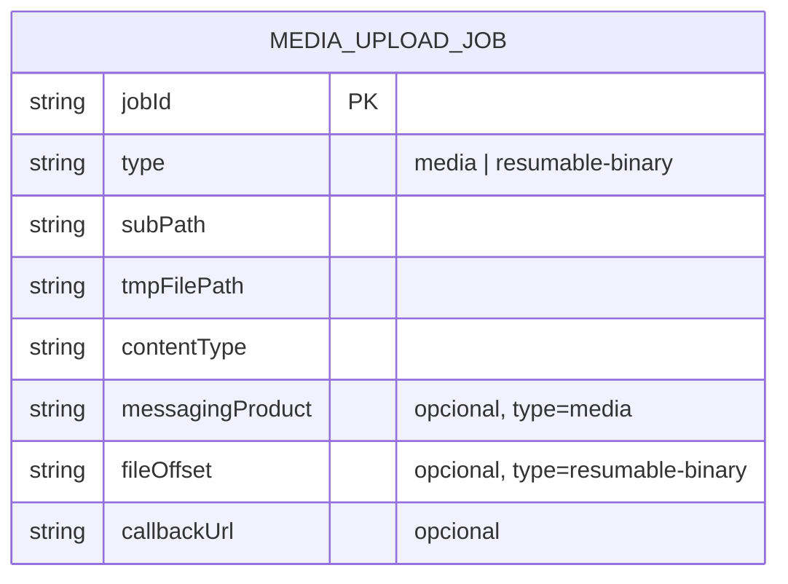
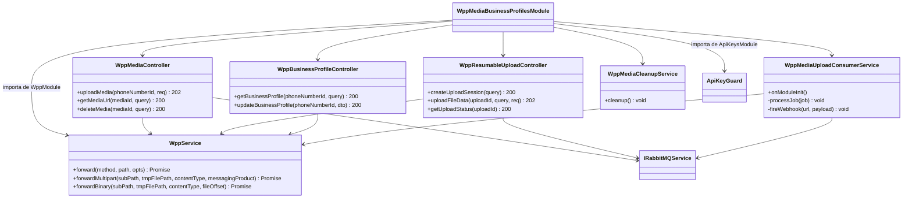
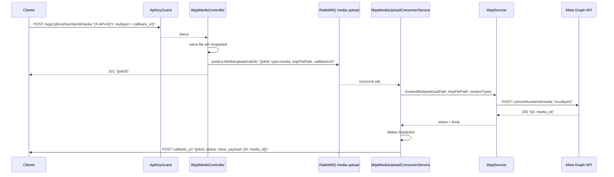
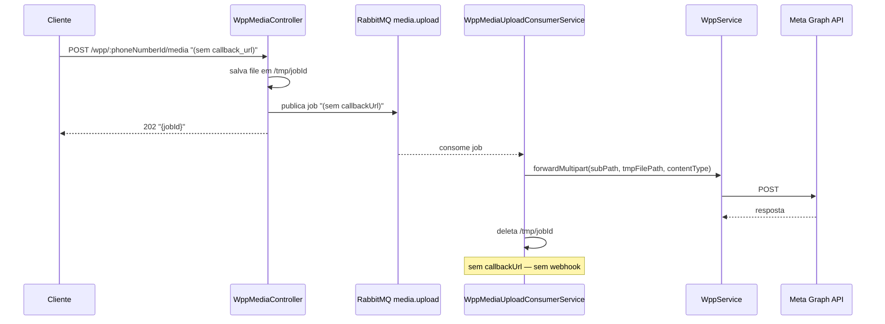
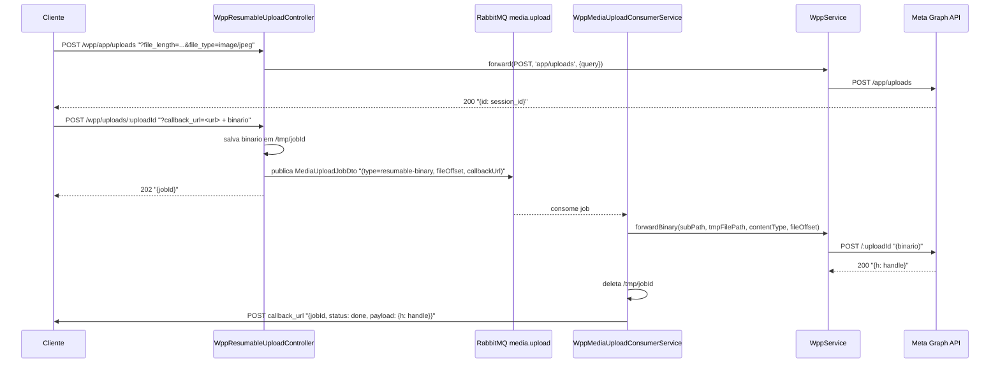
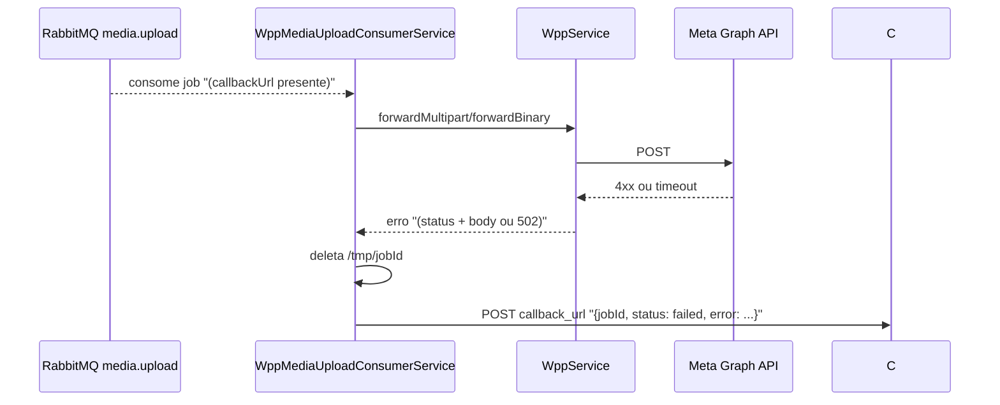
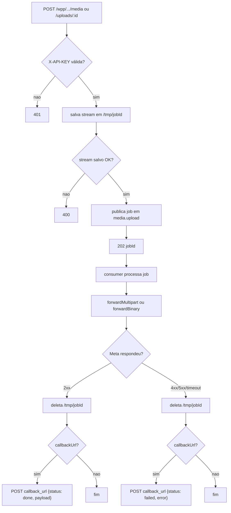

# WhatsApp Meta Adapter — Media & Business Profiles

> **Feature 6 de 8 do whiz-gateway** (batch WhatsApp Meta Adapter). Cobre dois domínios: **Media** (upload assíncrono via fila RabbitMQ com webhook de retorno, recuperação de URL e deleção) e **Business Profiles** (leitura e atualização do perfil, incluindo o fluxo completo de **resumable upload** assíncrono para foto de perfil). **Reaproveita integralmente o contrato comum de `wpp-adapter-core`** (forwarding via `WppService`, injeção de `Authorization: Bearer META_ACCESS_TOKEN`, transparência de status/body, `502` em falha de transporte) e **depende de `api-keys-foundation`** (`ApiKeyGuard`, header `X-API-KEY`) e de `gateway-foundation` (RabbitMQ via `IRabbitMQService`).

## 1. Context

A WhatsApp Cloud API expõe rotas para gerenciar arquivos de mídia (imagens, áudio, stickers, documentos) e o perfil público do negócio. Uploads de arquivos podem ser grandes e simultâneos — processar múltiplos streams em paralelo causa picos de RAM. Para evitar isso, o gateway adota um padrão assíncrono para todas as rotas que enviam corpo binário: o arquivo é salvo em disco temporário, um job é enfileirado no RabbitMQ, e a resposta ao cliente é `202 { jobId }`. Um consumer processa os jobs sequencialmente, faz forward à Meta e, se o cliente forneceu `callback_url`, dispara um webhook POST com o resultado.

Rotas de leitura (`GET`) e deleção (`DELETE`) permanecem síncronas (proxy transparente, sem corpo binário).

**Business Profile**: leitura e atualização de campos de texto e foto de perfil. Para atualizar a foto, a Meta exige um fluxo de **resumable upload** em três passos: criar sessão (`/app/uploads`), enviar o binário (assíncrono via fila), consultar o status.

**Usuários**: sistemas clientes portando `X-API-KEY` válida emitida por `api-keys-foundation`.

## 2. Scope

**In:**
- `WppMediaBusinessProfilesModule` (importa `WppModule`, `ApiKeysModule`, usa `IRabbitMQService` global).
- **WppService extensões** (em `src/wpp/wpp.service.ts`):
  - `forwardMultipart(subPath, tmpFilePath, contentType, messagingProduct)` — lê arquivo de disco, reconstrói multipart `{ messaging_product, file: stream }` e faz forward à Meta.
  - `forwardBinary(subPath, tmpFilePath, contentType, fileOffset)` — lê arquivo de disco e faz forward binário à Meta.
- **Fila estática RabbitMQ**: `media.upload` (declarada no bootstrap via `IRabbitMQService.assertQueue`).
- **Media (assíncrono)**:
  - `POST /wpp/:phoneNumberId/media` — salva multipart em `/tmp/wpp-uploads`, publica job, retorna `202 { jobId }`. Aceita `callback_url` como campo form-data (opcional).
  - `GET /wpp/:mediaId` — proxy síncrono (recupera URL + metadados, query `phone_number_id`).
  - `DELETE /wpp/:mediaId` — proxy síncrono (query `phone_number_id`).
- **Resumable Upload (assíncrono no passo binário)**:
  - `POST /wpp/app/uploads` — proxy síncrono (cria sessão; query: `file_length`, `file_type`, `file_name`).
  - `POST /wpp/uploads/:uploadId` — salva binário em `/tmp/wpp-uploads`, publica job, retorna `202 { jobId }`. Aceita `callback_url` como query param (opcional).
  - `GET /wpp/uploads/:uploadId` — proxy síncrono (consulta status da sessão).
- **Business Profile (síncrono)**:
  - `GET /wpp/:phoneNumberId/whatsapp_business_profile` — proxy síncrono (query `fields`).
  - `POST /wpp/:phoneNumberId/whatsapp_business_profile` — proxy síncrono (JSON).
- **Consumer** (`WppMediaUploadConsumerService`): consume `media.upload`, faz forward à Meta, dispara webhook se `callback_url` presente.
- **Cron de limpeza** (`WppMediaCleanupService`): varre `/tmp/wpp-uploads/` a cada hora e deleta arquivos com `mtime` > 1 hora (órfãos de crash do consumer).
- DTOs com `@ApiProperty` para Swagger PT-BR.

**Out:**
- Download de mídia (`lookaside.fbsbx.com`) — cliente baixa diretamente via URL retornada pelo `GET /wpp/:mediaId`.
- Polling de job por ID (sem `GET /wpp/media/jobs/:jobId`) — resultado entregue apenas via webhook.
- Forwarding genérico, guard, `META_GRAPH_URL` → `wpp-adapter-core`.
- Geração/validação de `X-API-KEY` → `api-keys-foundation`.
- Retry de webhook, autenticação do webhook (HMAC), cache, rate limiting.
- Validação estrita de shapes de body — proxy repassa íntegro; a Meta valida.

## 3. Glossary

| Termo | Significado |
|---|---|
| Media ID | ID Meta opaco que identifica um arquivo enviado. Retornado pelo consumer via webhook após upload concluído. |
| Upload Session ID | ID de sessão de resumable upload (`/app/uploads`). Retornado sincronamente; usado como `uploadId` no passo binário. |
| Job ID | UUID gerado pelo gateway ao receber um upload. Retornado no `202`; correlaciona a requisição com o webhook de retorno. |
| `media.upload` | Fila RabbitMQ estática que serializa jobs de upload. Consumer processa um job por vez. |
| `forwardMultipart` | Método de `WppService` que lê arquivo de disco e faz pipe multipart/form-data à Meta. |
| `forwardBinary` | Método de `WppService` que lê arquivo de disco e faz pipe binário à Meta com `Content-Type` e `file_offset`. |
| `callback_url` | URL opcional fornecida pelo cliente. Ao concluir o job, o consumer dispara `POST <callback_url>` com o resultado. |
| `profile_picture_handle` | Handle retornado pelo passo binário do resumable upload (via webhook). Usado em `UpdateBusinessProfileDto`. |
| Arquivo temporário | Arquivo salvo em `/tmp/wpp-uploads/<jobId>` durante o processamento. Deletado pelo consumer após forward à Meta. Órfãos (crash) removidos pelo cron de limpeza após 1 hora. |

## 4. Functional requirements

### Media
- **FR-1**: `POST /wpp/:phoneNumberId/media` recebe `multipart/form-data`. Gateway usa parser multipart em modo streaming (`busboy`) para: (a) extrair campos de texto (`messaging_product`, `callback_url`) em memória; (b) stream **somente** o campo `file` para `/tmp/wpp-uploads/<jobId>`. Publica `MediaUploadJobDto { jobId, type: "media", subPath, tmpFilePath, contentType, messagingProduct, callbackUrl? }` em `media.upload` e retorna `202 { jobId }`. O arquivo em `/tmp/wpp-uploads` contém apenas o binário do `file` — sem campos de texto embutidos.
- **FR-2**: `GET /wpp/:mediaId` repassa `GET ${META_GRAPH_URL}/:mediaId` com query (`phone_number_id`) via `WppService.forward`. Devolve status + body Meta (url, mime_type, sha256, file_size, id).
- **FR-3**: `DELETE /wpp/:mediaId` repassa `DELETE ${META_GRAPH_URL}/:mediaId` com query (`phone_number_id`). Devolve status + body Meta.

### Resumable Upload
- **FR-4**: `POST /wpp/app/uploads` repassa `POST ${META_GRAPH_URL}/app/uploads` com query (`file_length`, `file_type`, `file_name`) sem body via `forward`. Devolve `200 { id: "<session_id>" }`.
- **FR-5**: `POST /wpp/uploads/:uploadId` recebe body binário bruto. Gateway extrai `callback_url` da query (se presente), salva o stream em `/tmp/wpp-uploads/<jobId>`, publica `MediaUploadJobDto` na fila `media.upload` e retorna `202 { jobId }`.
- **FR-6**: `GET /wpp/uploads/:uploadId` repassa `GET ${META_GRAPH_URL}/:uploadId` via `forward`. Devolve status + body Meta.

### Business Profile
- **FR-7**: `GET /wpp/:phoneNumberId/whatsapp_business_profile` repassa `GET ${META_GRAPH_URL}/:phoneNumberId/whatsapp_business_profile` com query (`fields`). Devolve status + body Meta.
- **FR-8**: `POST /wpp/:phoneNumberId/whatsapp_business_profile` repassa `POST ${META_GRAPH_URL}/:phoneNumberId/whatsapp_business_profile` com body `UpdateBusinessProfileDto` íntegro. Devolve status + body Meta.

### Consumer
- **FR-9**: `WppMediaUploadConsumerService` consome mensagens de `media.upload` sequencialmente. Para cada job: lê o arquivo de `/tmp/wpp-uploads/<jobId>` via `fs.createReadStream`; se `type=media`, chama `forwardMultipart(subPath, tmpFilePath, contentType, messagingProduct)`; se `type=resumable-binary`, chama `forwardBinary(subPath, tmpFilePath, contentType, fileOffset)`; então deleta o arquivo temporário.
- **FR-10**: Após forward bem-sucedido, se `callbackUrl` presente no job, o consumer dispara `POST <callbackUrl>` com `WebhookCallbackDto { jobId, status: "done", payload: <body Meta> }`.
- **FR-11**: Em falha do forward (Meta responde 4xx/5xx ou timeout/502), se `callbackUrl` presente, o consumer dispara `POST <callbackUrl>` com `WebhookCallbackDto { jobId, status: "failed", error: <body Meta ou mensagem de transporte> }`. Arquivo temporário é deletado em qualquer caso.
- **FR-12**: Falha no disparo do webhook (callback_url inacessível ou resposta não-2xx) dispara retry com exponential backoff: até 5 tentativas adicionais, delay `2^attempt × 1 s` (1 s, 2 s, 4 s, 8 s, 16 s). Cada tentativa falha loga `Logger.warn` com `attempt` e `jobId`. Após 5 retries esgotados sem sucesso, loga `Logger.error` e descarta — sem impacto no fluxo do job.

### Limpeza
- **FR-15**: `WppMediaCleanupService` executa cron `0 * * * *` (a cada hora). Lê todos os arquivos em `/tmp/wpp-uploads/`; deleta aqueles cujo `mtime` seja anterior a 1 hora. Loga cada deleção via `Logger.log` com o nome do arquivo. Diretório ausente → sem erro (cria na primeira execução se necessário).

### Geral
- **FR-13**: Todos os controllers aplicam `@UseGuards(ApiKeyGuard)`. Requisição sem `X-API-KEY` válida → `401` antes de qualquer processamento.
- **FR-14**: Toda chamada síncrona de forward usa `WppService.forward/forwardMultipart/forwardBinary` com `Authorization: Bearer META_ACCESS_TOKEN`; falha de transporte → `502`.

## 5. Non-functional

- **NFR-1** (memória): uploads binários são salvos em disco (`/tmp`) antes do enfileiramento — sem buffer completo em RAM durante o recebimento.
- **NFR-2** (concorrência): fila `media.upload` serializa o processamento; sem pico de RAM por uploads simultâneos à Meta.
- **NFR-3** (segurança): `META_ACCESS_TOKEN` nunca logado nem exposto (herdado de `wpp-adapter-core` NFR-1).
- **NFR-4** (limpeza): arquivo temporário deletado pelo consumer após o forward (try/finally), com ou sem sucesso. Em crash do consumer, `WppMediaCleanupService` remove órfãos com `mtime` > 1 hora a cada hora.
- **NFR-5** (transparência): rotas síncronas repassam status+body Meta intactos, incluindo 4xx/5xx.
- **NFR-6** (observabilidade): consumer loga `jobId`, `subPath`, `status` (done/failed) e `callbackUrl` (sem dados sensíveis do arquivo).

## 6. Data model

N/A — sem persistência local. Job status não é armazenado (delivery via webhook); arquivos vivem apenas em `/tmp/wpp-uploads` durante processamento.

> `MEDIA_UPLOAD_JOB` é o payload da mensagem RabbitMQ — não uma tabela Postgres.

## 7. API contract

Rotas síncronas seguem contrato genérico de `wpp-adapter-core` §7. Rotas assíncronas retornam `202` imediatamente.

- **Auth global**: `ApiKeyGuard` (header `X-API-KEY`).
- **Responses comuns síncronas**: status+body Meta | `401` sem chave | `502` falha de transporte.
- **Responses assíncronas**: `202 { jobId }` | `400` falha ao salvar arquivo | `401` sem chave.

### MEDIA

#### POST /wpp/:phoneNumberId/media  _(assíncrono)_
- **Auth**: `ApiKeyGuard`
- **Request**: `multipart/form-data` — `messaging_product` (text, `"whatsapp"`), `file` (binary), `callback_url` (text, opcional)
- **Comportamento**: salva `file` em `/tmp/wpp-uploads/<jobId>`, publica job `type=media` em `media.upload`
- **Responses**: `202 { jobId }` | `400` | `401`
- **Webhook (assíncrono)**: `POST <callback_url>` → `{ jobId, status: "done", payload: { id: "<media_id>" } }` ou `{ jobId, status: "failed", error: ... }`

#### GET /wpp/:mediaId  _(síncrono)_
- **Auth**: `ApiKeyGuard`
- **Query**: `phone_number_id` (obrigatório Meta), demais repassados
- **Forward**: `GET ${META_GRAPH_URL}/:mediaId`
- **Responses**: `200 { url, mime_type, sha256, file_size, id }` | `401` | `502`

#### DELETE /wpp/:mediaId  _(síncrono)_
- **Auth**: `ApiKeyGuard`
- **Query**: `phone_number_id` (obrigatório Meta) — repassado
- **Forward**: `DELETE ${META_GRAPH_URL}/:mediaId`
- **Responses**: `200` (body Meta) | `401` | `502`

### RESUMABLE UPLOAD

#### POST /wpp/app/uploads  _(síncrono)_
- **Auth**: `ApiKeyGuard`
- **Query**: `file_length` (obrigatório), `file_type` (obrigatório), `file_name` (opcional)
- **Body**: sem body
- **Forward**: `POST ${META_GRAPH_URL}/app/uploads`
- **Responses**: `200 { id: "<upload_session_id>" }` | `401` | `502`

#### POST /wpp/uploads/:uploadId  _(assíncrono)_
- **Auth**: `ApiKeyGuard`
- **Query**: `callback_url` (opcional)
- **Headers repassados ao Meta**: `Content-Type`, `file_offset`
- **Body**: binário bruto
- **Comportamento**: salva binário em `/tmp/wpp-uploads/<jobId>`, publica job `type=resumable-binary` em `media.upload`
- **Responses**: `202 { jobId }` | `400` | `401`
- **Webhook (assíncrono)**: `POST <callback_url>` → `{ jobId, status: "done", payload: { h: "<handle>" } }` ou `{ jobId, status: "failed", error: ... }`

#### GET /wpp/uploads/:uploadId  _(síncrono)_
- **Auth**: `ApiKeyGuard`
- **Forward**: `GET ${META_GRAPH_URL}/:uploadId`
- **Responses**: `200` (status da sessão) | `401` | `502`

### BUSINESS PROFILE

#### GET /wpp/:phoneNumberId/whatsapp_business_profile  _(síncrono)_
- **Auth**: `ApiKeyGuard`
- **Query**: `fields` (opcional) — repassado
- **Forward**: `GET ${META_GRAPH_URL}/:phoneNumberId/whatsapp_business_profile`
- **Responses**: `200` (body Meta com campos do perfil) | `401` | `502`

#### POST /wpp/:phoneNumberId/whatsapp_business_profile  _(síncrono)_
- **Auth**: `ApiKeyGuard`
- **Request**: `UpdateBusinessProfileDto` — `messaging_product` (obrigatório), opcionais: `about`, `address`, `description`, `email`, `websites[]`, `vertical`, `profile_picture_handle`
- **Forward**: `POST ${META_GRAPH_URL}/:phoneNumberId/whatsapp_business_profile`
- **Responses**: `200` (body Meta) | `401` | `502`

### QUEUE

#### QUEUE media.upload  _(estática)_
- **Direção**: consume (`WppMediaUploadConsumerService`)
- **Payload**: `MediaUploadJobDto` — `jobId`, `type`, `subPath`, `tmpFilePath`, `contentType`, `fileOffset?`, `callbackUrl?`
- **Em falha**: → `inbox.dead-letter` (DLQ existente)
- **Lifecycle**: declarada no bootstrap via `IRabbitMQService.assertQueue('media.upload', dlqArgs)`

## 8. Module boundaries

## 9. Flows

### Upload de mídia assíncrono (com callback)

### Upload de mídia sem callback (fire-and-forget)

### Fluxo completo resumable upload (foto de perfil)

### Falha no forward (consumer)

## 10. State machines

N/A — sem entidade local persistida. Job existe apenas na fila durante processamento.

## 11. Business rules

## 12. Edge cases & errors

- **Colisão `GET /wpp/:mediaId` com `GET /wpp/:id`**: path idêntico ao de `wpp-phone-numbers`. Meta resolve por tipo de ID; proxy é opaco. Dois módulos NestJS registram handlers para o mesmo path — o último importado no `AppModule` assume. Decisão final na fase de código: verificar ordem de import ou consolidar em um handler compartilhado.
- **`POST /wpp/uploads/:uploadId` vs `POST /wpp/:phoneNumberId`**: gateway usa prefixo fixo `/uploads/` para evitar colisão. Sub-path forwarded à Meta é `/:uploadId` (sem `/uploads/`).
- **`POST /wpp/app/uploads`**: path `/app/` é literal — não conflita com parâmetros dinâmicos.
- **`callback_url` ausente**: `202` retornado normalmente; resultado não é entregue ao cliente. Fire-and-forget.
- **`callback_url` inacessível ou resposta não-2xx**: consumer retenta com exponential backoff (5 retries, delays 1 s/2 s/4 s/8 s/16 s). Após esgotamento, loga `Logger.error` e descarta (FR-12).
- **Arquivo temporário não deletado** (crash do consumer entre forward e delete): arquivo fica em `/tmp/wpp-uploads` como órfão. `WppMediaCleanupService` remove na próxima execução (max 1 hora de atraso).
- **Mensagem na fila sem arquivo `/tmp`** (crash entre publish e save, ou arquivo deletado manualmente): consumer tenta ler arquivo, falha com erro de I/O; mensagem vai para DLQ `inbox.dead-letter`.
- **`phone_number_id` ausente em `GET`/`DELETE /wpp/:mediaId`**: Meta retorna erro → repassado com mesmo status (transparência).
- **`file_offset` ausente em upload binário**: header não enviado ao Meta → Meta retorna `400` → repassado via webhook.
- **Meta responde 4xx em upload**: consumer dispara webhook `status: failed` com body Meta intacto.
- **Timeout na chamada Meta**: consumer dispara webhook `status: failed` com mensagem de transporte.

## 13. Acceptance criteria

- **AC-1** `[backend]`: Given `X-API-KEY` válida, when `POST /wpp/:phoneNumberId/media` com multipart `(messaging_product, file, callback_url)`, then gateway salva arquivo em `/tmp/wpp-uploads/<jobId>`, publica `MediaUploadJobDto` em `media.upload` e retorna `202 { jobId }` (sem chamar Meta diretamente).
- **AC-2** `[backend]`: Given job `type=media` na fila com `messagingProduct="whatsapp"`, when consumer processa, then `WppService.forwardMultipart` chamado com `subPath`, `tmpFilePath`, `contentType` e `messagingProduct="whatsapp"`; multipart reconstruído contém `messaging_product` + `file` (sem `callback_url`); `Authorization: Bearer META_ACCESS_TOKEN` injetado; arquivo `/tmp/wpp-uploads/<jobId>` deletado após forward.
- **AC-3** `[backend]`: Given consumer conclui forward com sucesso e job tem `callbackUrl`, when `POST <callbackUrl>` disparado, then payload é `{ jobId, status: "done", payload: <body Meta> }`.
- **AC-17** `[backend]`: Given consumer tenta disparar webhook e `callbackUrl` recusa (timeout ou não-2xx), when 1ª tentativa falha, then consumer retenta com delays 1 s, 2 s, 4 s, 8 s, 16 s (5 retries); cada falha loga `Logger.warn` com `attempt` e `jobId`. Given todas as 5 retentativas falharem, then `Logger.error` emitido e job segue sem relançar exceção.
- **AC-4** `[backend]`: Given consumer conclui forward com falha (Meta 4xx ou timeout) e job tem `callbackUrl`, when webhook disparado, then payload é `{ jobId, status: "failed", error: <body Meta ou mensagem de transporte> }` e arquivo temporário foi deletado.
- **AC-5** `[backend]`: Given `X-API-KEY` válida, when `GET /wpp/:mediaId?phone_number_id=<id>`, then forward síncrono é `GET ${META_GRAPH_URL}/:mediaId?phone_number_id=<id>` e body Meta repassado intacto (sem fila).
- **AC-6** `[backend]`: Given `X-API-KEY` válida, when `DELETE /wpp/:mediaId?phone_number_id=<id>`, then forward síncrono é `DELETE ${META_GRAPH_URL}/:mediaId?phone_number_id=<id>` e status+body Meta repassados (sem fila).
- **AC-7** `[backend]`: Given `X-API-KEY` válida, when `POST /wpp/app/uploads?file_length=1024&file_type=image/jpeg`, then forward síncrono é `POST ${META_GRAPH_URL}/app/uploads?...` e caller recebe `200 { id: "<session_id>" }` imediatamente (sem fila).
- **AC-8** `[backend]`: Given `X-API-KEY` válida, when `POST /wpp/uploads/:uploadId?callback_url=<url>` com binário e headers `Content-Type: image/jpeg`, `file_offset: 0`, then gateway salva binário em `/tmp/wpp-uploads/<jobId>`, publica job `type=resumable-binary` com `fileOffset="0"` em `media.upload`, retorna `202 { jobId }`.
- **AC-9** `[backend]`: Given job `type=resumable-binary` na fila, when consumer processa, then `WppService.forwardBinary` chamado com `subPath=":uploadId"`, `tmpFilePath`, `contentType="image/jpeg"`, `fileOffset="0"`; arquivo temporário deletado.
- **AC-10** `[backend]`: Given `X-API-KEY` válida, when `GET /wpp/uploads/:uploadId`, then forward síncrono `GET ${META_GRAPH_URL}/:uploadId` e status da sessão repassado (sem fila).
- **AC-11** `[backend]`: Given `X-API-KEY` válida, when `GET /wpp/:phoneNumberId/whatsapp_business_profile?fields=about,email`, then forward síncrono `GET ${META_GRAPH_URL}/:phoneNumberId/whatsapp_business_profile?fields=about,email`.
- **AC-12** `[backend]`: Given `X-API-KEY` válida, when `POST /wpp/:phoneNumberId/whatsapp_business_profile` com `{ messaging_product: "whatsapp", profile_picture_handle: "h_abc" }`, then body repassado íntegro (síncrono, sem fila).
- **AC-13** `[backend]`: Given nenhuma/inválida `X-API-KEY`, when qualquer rota, then `401` e sem escrita em disco nem publicação na fila.
- **AC-14** `[backend]`: Given `POST /wpp/:phoneNumberId/media` sem `callback_url`, when consumer processa e conclui, then nenhum webhook disparado e arquivo temporário deletado.
- **AC-16** `[backend]`: Given arquivo em `/tmp/wpp-uploads/<jobId>` com `mtime` > 1 hora, when `WppMediaCleanupService.cleanup()` executa, then arquivo é deletado e `Logger.log` emite o nome do arquivo. Given arquivo com `mtime` < 1 hora, then não é deletado.
- **AC-15** `[e2e]`: Given app no ar, `X-API-KEY` válida, Meta stub e endpoint de callback, when fluxo `POST /media` → consumer processa → webhook recebido em callback, then `202` imediato, webhook `status: done` com `mediaId` do stub, `Authorization` injetado pelo adapter (não veio do caller).

## 14. Open questions

- **Colisão `GET /wpp/:id`**: dois módulos registrando `GET /wpp/:id` — verificar ordem de import no `AppModule` na fase de código; considerar consolidar num único handler genérico se necessário.
- **Limpeza de arquivos órfãos**: coberta por `WppMediaCleanupService` (FR-15, AC-16) — cron horário em `/tmp/wpp-uploads/`.
- **Retry de webhook**: implementado em FR-12 (5 retries, exponential backoff 1 s → 16 s).
- **`forwardMultipart` / `forwardBinary`**: usam `fs.createReadStream` para ler do disco + Axios `data: stream`; confirmar na fase de código se `@nestjs/axios` suporta stream diretamente ou requer buffer.
- **Tamanho máximo de arquivo**: sem limite definido nesta feature; o limite da Meta (ou do próprio RabbitMQ para o job payload) é o teto. Endereçar em NFR futuro se necessário.
- **Redis para job status**: não necessário nesta feature (sem polling; resultado entregue via webhook). Considerar em feature futura se for necessário rastrear status de jobs (TTL-based, ex.: `SET job:<jobId> <status> EX 86400`) para clientes que não recebem o webhook.
