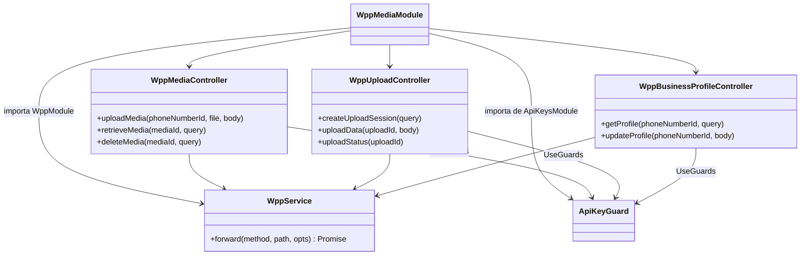
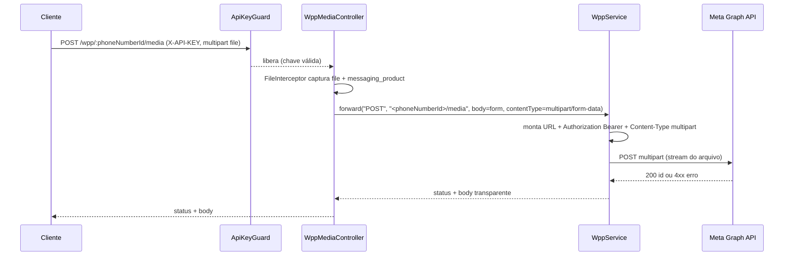
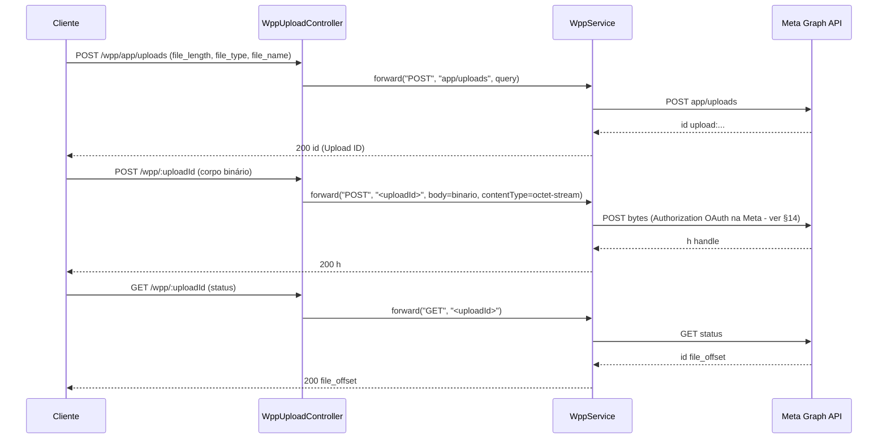
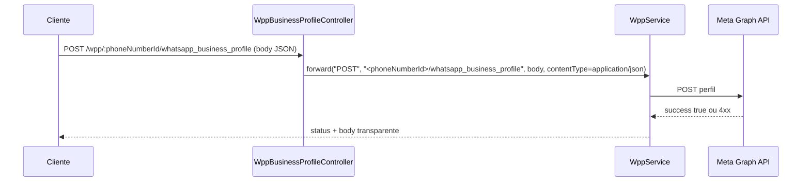
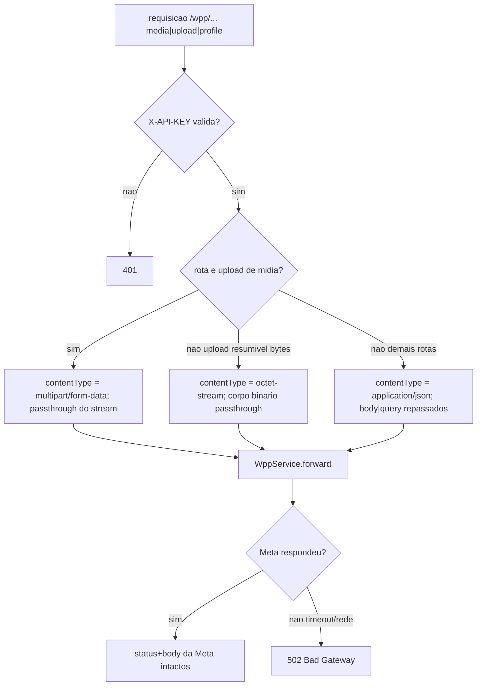

# WhatsApp Meta Adapter — Media & Business Profiles

> **Feature 6 de 8 do whiz-gateway** (batch WhatsApp Meta Adapter). Domínio do adapter `/wpp/*` responsável por **mídia** (upload, recuperação de URL, exclusão, download) e **business profiles** (perfil comercial + upload resumível de assets). Reaproveita integralmente o contrato compartilhado de `wpp-adapter-core` (`WppService.forward`, injeção de `Authorization: Bearer META_ACCESS_TOKEN`, transparência de status/body, `502` em falha de transporte) e o `ApiKeyGuard` de `api-keys-foundation`. **Este é o único domínio que repassa `multipart/form-data`** (streams de arquivo), não JSON.

## 1. Context

A WhatsApp Cloud API expõe rotas de mídia e de perfil comercial sob `/{{Version}}/...`. Em vez de o cliente falar direto com `graph.facebook.com` e conhecer o `access token` da Meta, ele chama `/wpp/<resto da rota Meta>` portando `X-API-KEY`. Este spec define as rotas concretas desse domínio.

Particularidades do domínio:

- **Upload de mídia** (imagem, sticker, áudio) é `multipart/form-data` — arquivo + `messaging_product`. O adapter precisa repassar o stream binário, não serializar JSON.
- **Upload resumível** (Resumable Upload API) tem três passos: criar sessão (`/app/uploads`), enviar bytes (`POST /<uploadId>` com corpo binário) e consultar status (`GET /<uploadId>`). Na Meta o passo de envio usa `Authorization: OAuth <token>` (não `Bearer`) — divergência a tratar (ver §12 e §14).
- **Download de mídia** é servido por host distinto (`lookaside.fbsbx.com`), não `graph.facebook.com` — caso especial fora do forward padrão (ver §12 e §14).
- **Business profile** é JSON puro (GET/POST) e segue o forward padrão.

**Usuários**: sistemas clientes que enviam/gerenciam mídia e configuram o perfil comercial via `/wpp/*` portando `X-API-KEY`.

## 2. Scope

**In:**
- `WppMediaModule` importando `WppModule` (de `wpp-adapter-core`) e injetando `WppService`.
- Controllers que mapeiam as rotas de mídia e business profile para `WppService.forward`.
- Suporte a `multipart/form-data` no forward de upload de mídia, via `opts.contentType: 'multipart/form-data'` (hook `opts.contentType` definido em `wpp-adapter-core` FR-3) com passthrough de stream/buffer do arquivo. Padrão `FileInterceptor` de `@nestjs/platform-express` no controller (apenas para capturar o arquivo; nenhuma transformação).
- Rotas de mídia: upload (image/sticker/audio), retrieve media URL, delete media.
- Rotas de upload resumível: criar sessão, enviar dados, consultar status.
- Rotas de business profile: get e update.
- DTOs com `@ApiProperty` (PT-BR) para documentação Swagger das query/body e do corpo multipart.

**Out:**
- `WppService` em si, injeção do token, mapeamento de erro, `ApiKeyGuard` → definidos em `wpp-adapter-core` e `api-keys-foundation`.
- Persistência local de mídia ou metadados (o adapter é stateless; a mídia vive na Meta).
- Validação semântica do arquivo (tamanho, mime, duração) — a Meta valida; o adapter repassa e devolve o erro Meta transparente.
- Download de mídia a partir do host `lookaside.fbsbx.com` — caso especial, ver §12/§14 (a definir; provisoriamente fora do forward padrão).
- A divergência de auth `OAuth` vs `Bearer` no upload resumível — flag em §14 (assume `Bearer` até decisão).

## 3. Glossary

| Termo | Significado |
|---|---|
| Media ID | Identificador da mídia na Meta, retornado no upload e usado para retrieve/delete. Mapeado em rota como `:mediaId`. |
| Phone Number ID | Identificador do número de telefone WhatsApp Business. Mapeado como `:phoneNumberId`. |
| Upload ID | Identificador da sessão de upload resumível (`upload:<...>`). Mapeado como `:uploadId`. |
| `messaging_product` | Campo obrigatório do upload, sempre `"whatsapp"`. |
| Resumable Upload | API da Meta para enviar assets grandes em sessão (criar → enviar bytes → status). |
| Business Profile | Perfil comercial do número (endereço, descrição, vertical, sobre, e-mail, sites, foto). |
| `profile_picture_handle` | Handle retornado pelo upload resumível, referenciado ao atualizar a foto do perfil. |
| `multipart/form-data` | Content-Type do upload de arquivo; o adapter repassa o stream sem serializar. |
| lookaside | Host `lookaside.fbsbx.com` que serve os bytes da mídia no download (≠ `graph.facebook.com`). |

## 4. Functional requirements

- **FR-1**: `POST /wpp/:phoneNumberId/media` aceita `multipart/form-data` com `messaging_product=whatsapp` e `file` (imagem). O controller captura o arquivo (`FileInterceptor`) e chama `WppService.forward('POST', '<phoneNumberId>/media', { body: <form>, contentType: 'multipart/form-data' })`. Resposta Meta (`{ id }`) repassada transparente.
- **FR-2**: A mesma rota `POST /wpp/:phoneNumberId/media` serve upload de **sticker** (`file` = sticker) e de **áudio** (`file` = áudio); o tipo é determinado pelo conteúdo do arquivo e validado pela Meta, não pelo adapter. Forward idêntico ao FR-1.
- **FR-3**: O forward de upload **não** serializa o corpo como JSON: usa `opts.contentType: 'multipart/form-data'` e repassa o stream/buffer do arquivo + o campo `messaging_product` ao destino Meta (passthrough), conforme `wpp-adapter-core` FR-3.
- **FR-4**: `GET /wpp/:mediaId?phone_number_id=<id>` faz forward `GET <mediaId>?phone_number_id=<id>` → retorna a URL da mídia (`{ url, mime_type, sha256, file_size, id, messaging_product }`) transparente. A query `phone_number_id` é repassada sem alteração (`wpp-adapter-core` FR-7).
- **FR-5**: `DELETE /wpp/:mediaId?phone_number_id=<id>` faz forward `DELETE <mediaId>?phone_number_id=<id>` → retorna `{ success: true }` da Meta transparente.
- **FR-6**: `POST /wpp/app/uploads?file_length=&file_type=&file_name=` cria sessão de upload resumível: forward `POST app/uploads?file_length=...&file_type=...&file_name=...` → retorna `{ id: "upload:<...>" }` (o Upload ID) transparente.
- **FR-7**: `POST /wpp/:uploadId` envia os bytes do arquivo da sessão resumível: corpo binário repassado ao destino Meta `<uploadId>`. Retorna `{ h: "<handle>" }` transparente. (Nota: na Meta este passo usa header `Authorization: OAuth <token>`, divergente do `Bearer` padrão — ver §12/§14.)
- **FR-8**: `GET /wpp/:uploadId` consulta o status da sessão resumível: forward `GET <uploadId>` → retorna `{ id, file_offset }` transparente.
- **FR-9**: `GET /wpp/:phoneNumberId/whatsapp_business_profile` faz forward `GET <phoneNumberId>/whatsapp_business_profile` (com query `fields=...` repassada se presente) → retorna o perfil transparente.
- **FR-10**: `POST /wpp/:phoneNumberId/whatsapp_business_profile` atualiza o perfil: body JSON `{ messaging_product, address, description, vertical, about, email, websites, profile_picture_handle }` repassado íntegro com `Content-Type: application/json` → retorna `{ success: true }` transparente.
- **FR-11**: Todos os controllers deste módulo aplicam `@UseGuards(ApiKeyGuard)` (header `X-API-KEY`). Sem chave válida → `401`, antes de qualquer forward (`wpp-adapter-core` FR-8).
- **FR-12**: Todas as respostas (sucesso 2xx e erro 4xx/5xx da Meta) são repassadas com mesmo status+body; falha de transporte → `502` (`wpp-adapter-core` FR-4/FR-5/FR-6).

## 5. Non-functional

- **NFR-1** (segurança): `META_ACCESS_TOKEN` injetado pelo `WppService`, nunca exposto ao caller nem logado (`wpp-adapter-core` NFR-1).
- **NFR-2** (perf/memória): upload de mídia deve repassar o arquivo como **stream/buffer** sem bufferizar desnecessariamente em disco; o `FileInterceptor` captura o arquivo em memória/temp e o passthrough segue para a Meta. Limite de tamanho fica a cargo da Meta (o adapter não impõe limite próprio além do default do interceptor — ver §14).
- **NFR-3** (transparência): o adapter não reinterpreta o contrato Meta de mídia/perfil; status e body passam intactos exceto falha de transporte → `502` (`wpp-adapter-core` NFR-5).
- **NFR-4** (config): nenhuma env nova neste domínio; reusa `META_GRAPH_URL` e `META_ACCESS_TOKEN` de `wpp-adapter-core`.
- **NFR-5** (observabilidade): cada forward loga `method`, `path` e status via `Logger`; nunca loga `Authorization` nem o conteúdo binário do arquivo (`wpp-adapter-core` NFR-4).

## 6. Data model

N/A — domínio stateless, sem persistência própria. Mídia e perfis vivem na Meta; o adapter apenas repassa.

## 7. API contract

Todas as rotas: **Auth** `ApiKeyGuard` (header `X-API-KEY`); **Responses** base: status+body da Meta (transparente) | `401` sem `X-API-KEY` válida | `502` falha de transporte. Abaixo só os detalhes específicos.

### POST /wpp/:phoneNumberId/media — Upload Image / Sticker / Audio
- **Forward**: `POST ${META_GRAPH_URL}/:phoneNumberId/media` (+ `Authorization: Bearer`)
- **Content-Type**: `multipart/form-data` (passthrough de stream — `opts.contentType: 'multipart/form-data'`)
- **Request (multipart)**: `UploadMediaDto` — `messaging_product: string` (`"whatsapp"`) + `file: Express.Multer.File` (binário; capturado via `FileInterceptor('file')`)
- **Responses**: `200` `{ id }` (Media ID) | `400` Meta (mime/tamanho inválido) | `401` | `502`

### GET /wpp/:mediaId — Retrieve Media URL
- **Forward**: `GET ${META_GRAPH_URL}/:mediaId?phone_number_id=<id>`
- **Query**: `RetrieveMediaQueryDto` — `phone_number_id: string` (repassado)
- **Responses**: `200` `{ url, mime_type, sha256, file_size, id, messaging_product }` | `401` | `502`

### DELETE /wpp/:mediaId — Delete Media
- **Forward**: `DELETE ${META_GRAPH_URL}/:mediaId?phone_number_id=<id>`
- **Query**: `DeleteMediaQueryDto` — `phone_number_id: string` (repassado)
- **Responses**: `200` `{ success: true }` | `401` | `502`

### POST /wpp/app/uploads — Resumable Upload (criar sessão)
- **Forward**: `POST ${META_GRAPH_URL}/app/uploads?file_length=&file_type=&file_name=`
- **Query**: `CreateUploadSessionQueryDto` — `file_length: number`, `file_type: string` (mime), `file_name: string` (repassados)
- **Responses**: `200` `{ id }` (Upload ID `upload:<...>`) | `401` | `502`

### POST /wpp/:uploadId — Resumable Upload (enviar dados)
- **Forward**: `POST ${META_GRAPH_URL}/:uploadId` (corpo binário passthrough)
- **Content-Type**: binário (`application/octet-stream` / stream raw)
- **Auth Meta**: na Meta este passo usa `Authorization: OAuth <token>` — divergente do `Bearer` padrão (ver §12/§14)
- **Request**: corpo binário (bytes do arquivo)
- **Responses**: `200` `{ h }` (handle) | `401` | `502`

### GET /wpp/:uploadId — Resumable Upload (status)
- **Forward**: `GET ${META_GRAPH_URL}/:uploadId`
- **Responses**: `200` `{ id, file_offset }` | `401` | `502`

### GET /wpp/:phoneNumberId/whatsapp_business_profile — Get Business Profile
- **Forward**: `GET ${META_GRAPH_URL}/:phoneNumberId/whatsapp_business_profile` (query `fields` repassada se presente)
- **Query (opcional)**: `fields: string` (field expansion, repassado)
- **Responses**: `200` perfil (body Meta) | `401` | `502`

### POST /wpp/:phoneNumberId/whatsapp_business_profile — Update Business Profile
- **Forward**: `POST ${META_GRAPH_URL}/:phoneNumberId/whatsapp_business_profile` (`Content-Type: application/json`)
- **Request**: `UpdateBusinessProfileDto` — `messaging_product: string`, `address?: string`, `description?: string`, `vertical?: string`, `about?: string`, `email?: string`, `websites?: string[]`, `profile_picture_handle?: string`
- **Responses**: `200` `{ success: true }` | `400` Meta (validação) | `401` | `502`

### GET /wpp/media/download — Download de mídia (caso especial, a definir)
- **Status**: aberto — o download é servido por `https://lookaside.fbsbx.com/...`, host ≠ `graph.facebook.com`. Não cabe no forward padrão (que usa `META_GRAPH_URL`). Ver §12/§14. Provisoriamente **fora de escopo** desta entrega.

## 8. Module boundaries

DI: `WppMediaModule` importa `WppModule` (de `wpp-adapter-core`, que exporta `WppService`) e `ApiKeysModule` (que exporta `ApiKeyGuard`). Não declara providers próprios além dos controllers; sem repositório nem persistência. O upload usa `FileInterceptor` de `@nestjs/platform-express` (já disponível na app Nest padrão).

## 9. Flows

### Upload de mídia (multipart)

### Upload resumível (3 passos)

### Update business profile (JSON)

## 10. State machines

N/A — sem entidade com ciclo de vida persistido localmente. (A sessão de upload resumível tem estados na Meta — `criada → recebendo bytes → completa` via `file_offset` — mas é gerenciada pela Meta, não pelo adapter.)

## 11. Business rules

## 12. Edge cases & errors

- **Multipart obrigatório no upload**: o `Content-Type` de saída precisa ser `multipart/form-data` com o stream do arquivo — se serializado como JSON, a Meta rejeita. O adapter usa o hook `opts.contentType` (`wpp-adapter-core` FR-3) e o `FileInterceptor` para capturar `file`. **Não** transformar nem revalidar o arquivo (validação fica na Meta).
- **Arquivo ausente no upload** (`file` não enviado) → o `FileInterceptor`/DTO pode rejeitar com `400` local, ou repassar e deixar a Meta retornar `400`. Decisão: ver §14 (assume repasse à Meta para manter transparência).
- **`phone_number_id` ausente** em retrieve/delete → repassado vazio; a Meta retorna o erro correspondente (transparente).
- **Mídia/Media ID inexistente** → Meta `404`/erro repassado com mesmo status+body (não vira `502`).
- **Download via `lookaside.fbsbx.com`** (`GET .../whatsapp_business/attachments/?mid=&source=&ext=&hash=`): host distinto de `graph.facebook.com`, **não** coberto por `META_GRAPH_URL`. O forward padrão não atende. Opções: (a) deixar o cliente baixar direto da URL retornada no retrieve (fora de escopo do proxy); (b) criar rota dedicada `GET /wpp/media/download` que faz forward para a base `lookaside` (env separada). Recomendado documentar como questão aberta (§14) e manter fora desta entrega.
- **Upload resumível — auth divergente**: o passo de envio de bytes usa, na Meta, `Authorization: OAuth <token>` em vez de `Bearer`. Se o `WppService.forward` injeta sempre `Bearer`, este passo pode falhar. Tratar como caso especial (header alternativo por rota) — ver §14.
- **Token Meta expirado/inválido** → Meta `401`/`190` repassado transparente (não confundir com o `401` do `ApiKeyGuard`, que ocorre antes do forward).
- **Timeout no upload de arquivo grande** → `502` (o timeout default de 30s de `wpp-adapter-core` NFR-3 pode ser insuficiente para uploads grandes — ver §14).
- **Body de update profile com campos extras** → repassado conforme política de proxy (sem `forbidNonWhitelisted` estrito nas rotas proxy — ver `wpp-adapter-core` §14).

## 13. Acceptance criteria

- **AC-1** `[backend]`: Given `X-API-KEY` válida e `WppService` mockado, when `POST /wpp/PHONE/media` com `multipart/form-data` (`messaging_product=whatsapp` + `file` imagem), then o `WppService.forward` é chamado com `("POST", "PHONE/media", { contentType: "multipart/form-data", body: <form com file> })` e o status+body da Meta (`{ id }`) são repassados.
- **AC-2** `[backend]`: Given upload de **sticker** e de **áudio** (mesma rota, `file` diferente), when `POST /wpp/PHONE/media`, then o forward usa `contentType: "multipart/form-data"` em ambos e o body Meta é repassado transparente.
- **AC-3** `[backend]`: Given `WppService` mockado, when `GET /wpp/MEDIA_ID?phone_number_id=PHONE`, then forward `("GET", "MEDIA_ID", { query: { phone_number_id: "PHONE" } })` e o body Meta (`{ url, mime_type, sha256, file_size, id, messaging_product }`) é repassado `200`.
- **AC-4** `[backend]`: Given `WppService` mockado, when `DELETE /wpp/MEDIA_ID?phone_number_id=PHONE`, then forward `("DELETE", "MEDIA_ID", { query: { phone_number_id: "PHONE" } })` e o body `{ success: true }` é repassado.
- **AC-5** `[backend]`: Given `WppService` mockado, when `POST /wpp/app/uploads?file_length=1024&file_type=image/jpeg&file_name=a.jpg`, then forward `("POST", "app/uploads", { query: { file_length, file_type, file_name } })` e o `{ id }` (Upload ID) é repassado.
- **AC-6** `[backend]`: Given `WppService` mockado, when `POST /wpp/UPLOAD_ID` com corpo binário, then forward `("POST", "UPLOAD_ID", { body: <binario>, contentType: octet-stream })` e o `{ h }` é repassado.
- **AC-7** `[backend]`: Given `WppService` mockado, when `GET /wpp/UPLOAD_ID`, then forward `("GET", "UPLOAD_ID")` e o `{ id, file_offset }` é repassado.
- **AC-8** `[backend]`: Given `WppService` mockado, when `GET /wpp/PHONE/whatsapp_business_profile`, then forward `("GET", "PHONE/whatsapp_business_profile")` e o perfil Meta é repassado `200`.
- **AC-9** `[backend]`: Given `WppService` mockado, when `POST /wpp/PHONE/whatsapp_business_profile` com body JSON `{ messaging_product, about, websites: [...] }`, then forward `("POST", "PHONE/whatsapp_business_profile", { body, contentType: "application/json" })` e o `{ success: true }` é repassado.
- **AC-10** `[backend]`: Given nenhum/`X-API-KEY` inválida, when qualquer rota deste módulo, then `401` (`ApiKeyGuard`) e nenhuma chamada ao `WppService`.
- **AC-11** `[backend]`: Given a Meta responde `400 { error: {...} }` (ex.: mime inválido no upload), when `POST /wpp/PHONE/media`, then o caller recebe `400` com o mesmo body de erro (não `502`); e given o `HttpService` lança timeout, then o caller recebe `502`.
- **AC-12** `[e2e]`: Given app no ar com `X-API-KEY` válida e Meta stub, when fluxo HTTP faz `POST /wpp/PHONE/media` (multipart com arquivo real pequeno), then `200` com o `{ id }` do stub, o `Authorization: Bearer` foi injetado (não veio do caller) e o stub recebeu `Content-Type: multipart/form-data`.

## 14. Open questions

- **Download via `lookaside.fbsbx.com`**: criar rota dedicada `GET /wpp/media/download` (com env de base `lookaside` própria) ou deixar o cliente baixar direto da URL do retrieve? O host difere de `graph.facebook.com`, então não cabe no forward padrão. (Recomendação inicial: fora de escopo; cliente baixa direto da URL retornada no retrieve.)
- **Auth do upload resumível (envio de bytes)**: a Meta usa `Authorization: OAuth <token>` neste passo, divergindo do `Bearer` padrão do `WppService.forward`. Precisamos de um hook por rota para trocar o esquema, ou `OAuth`/`Bearer` são intercambiáveis para este endpoint? (assume `Bearer` até teste contra a Meta confirmar).
- **Limite de tamanho de upload**: impor limite no `FileInterceptor`/Multer ou delegar 100% à Meta? (assume delegar à Meta; revisar se DoS for risco).
- **Timeout para uploads grandes**: o default de 30s (`wpp-adapter-core` NFR-3) pode ser insuficiente. Timeout maior por rota de upload? (a definir).
- **Streaming vs buffer**: `FileInterceptor` bufferiza o arquivo; para arquivos grandes, avaliar streaming direto (sem interceptor) para reduzir uso de memória. (a definir).
- **`file` ausente no upload**: rejeitar `400` localmente (DTO) ou repassar à Meta? (assume repassar à Meta para manter transparência do proxy).
