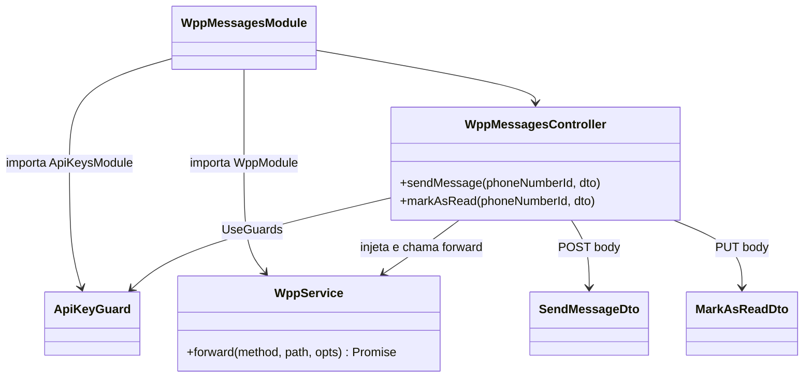
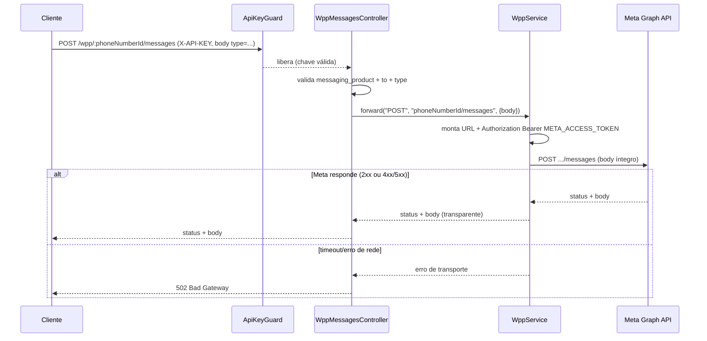
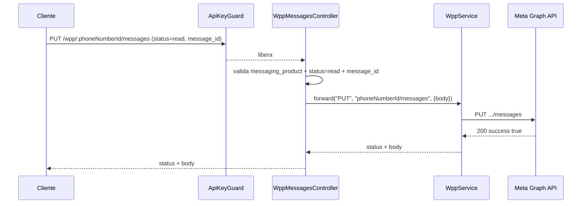
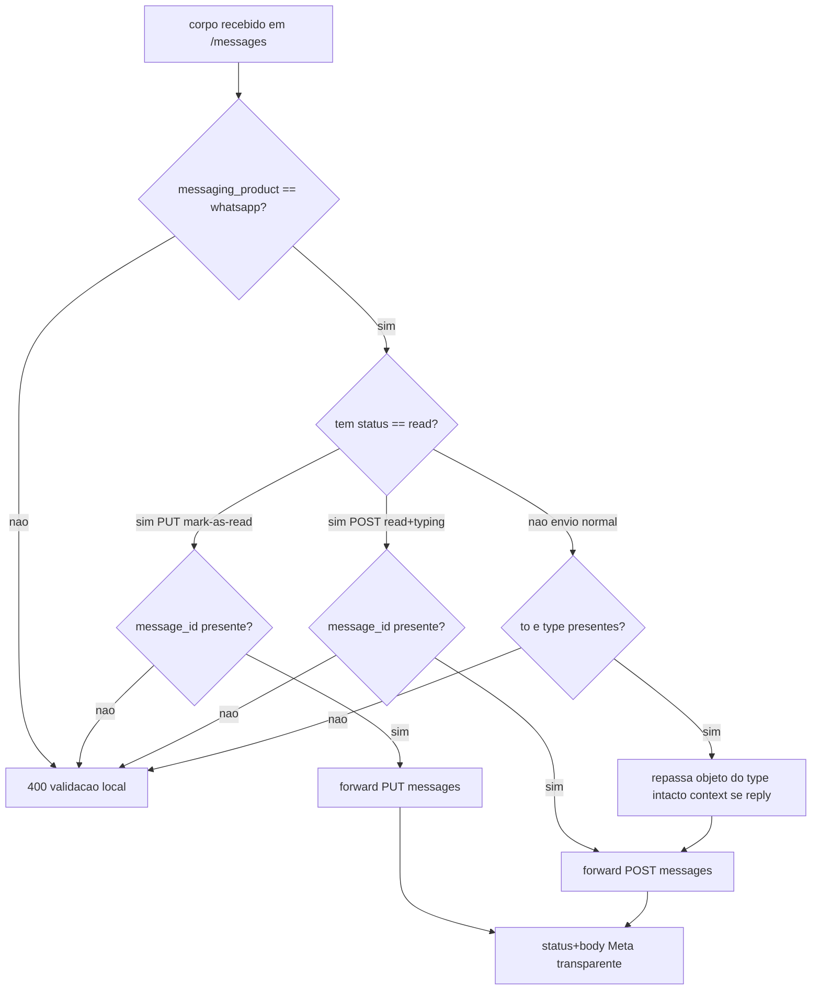

# WhatsApp Meta Adapter — Messages

> **Feature 3 de 8 do whiz-gateway** (batch WhatsApp Meta Adapter). Domínio **Messages** do adapter `/wpp/*`. Especifica o envio de mensagens da WhatsApp Cloud API através de um único endpoint `POST /wpp/:phoneNumberId/messages` (com dezenas de variantes de payload discriminadas por `type`) mais `PUT /wpp/:phoneNumberId/messages` (marcar como lida). **Depende de `wpp-adapter-core`** (contrato de forwarding, `WppService.forward`, mapeamento de rota, `ApiKeyGuard`) e de `api-keys-foundation` (guard). Este spec **não redefine** o contrato compartilhado — apenas o consome.

## 1. Context

A Meta expõe o envio de mensagens em `POST /{{Version}}/{{Phone-Number-ID}}/messages`. Um mesmo endpoint atende ~45 formatos de corpo (texto, reação, mídia por ID/URL, contatos, localização, templates, interativos, produtos, pagamentos), discriminados pelo campo `type` do JSON. Há ainda variantes de envio de recibo de leitura e indicador de digitação (`status: read` / `typing_indicator`) que, na Meta, também batem em `messages` — uma via `PUT` (mark-as-read clássico) e outra via `POST` (read + typing).

O cliente não fala com `graph.facebook.com` nem conhece o `META_ACCESS_TOKEN`. Ele chama `/wpp/:phoneNumberId/messages` autenticado por `X-API-KEY`, e o adapter:

- Resolve a base versionada em `META_GRAPH_URL` (o `{{Version}}` sai do path e vive no `.env`).
- Substitui `{{Phone-Number-ID}}` pelo path param nomeado `:phoneNumberId`.
- Injeta `Authorization: Bearer {META_ACCESS_TOKEN}` (via `WppService.forward`).
- Repassa o corpo íntegro à Meta e devolve status + body sem alteração (transparência); falha de transporte → `502`.

**Usuários**: sistemas clientes que precisam enviar mensagens WhatsApp sem custodiar o token Meta nem aprender a sintaxe de path versionado da Graph API.

## 2. Scope

**In:**
- `WppMessagesModule` importando `WppModule` (provê `WppService`) e `ApiKeysModule` (provê `ApiKeyGuard`).
- `WppMessagesController` com `@UseGuards(ApiKeyGuard)`, expondo:
  - `POST /wpp/:phoneNumberId/messages` — envia mensagem (`SendMessageDto`, união discriminada por `type`).
  - `PUT /wpp/:phoneNumberId/messages` — marca mensagem como lida (`MarkAsReadDto`).
- Cobertura de DTOs para cada `type`: `text`, `reaction`, `image`, `audio`, `document`, `sticker`, `video`, `contacts`, `location`, `template`, `interactive` (list, button, product, product_list, catalog_message, order_details, order_status), e os formatos de status (`read`, `read + typing_indicator`).
- Suporte às variantes de cada mídia **por ID** (`{ id }`) e **por URL** (`{ link }`).
- Suporte à variante **reply** em qualquer tipo aplicável via `context.message_id`.
- Forward transparente: o adapter repassa o corpo à Meta e devolve a resposta intacta.

**Out:**
- Infra de forwarding, injeção de token, mapeamento de erro 4xx/5xx → `502` (em `wpp-adapter-core`).
- Geração/validação de `X-API-KEY` (em `api-keys-foundation`).
- Upload de mídia (`POST .../media`) e download — domínio `wpp-media`.
- Gestão de templates (criar/listar/aprovar) — domínio `wpp-templates`.
- Webhooks de status de entrega/leitura recebidos da Meta — outro fluxo.
- Persistência de mensagens, histórico, idempotência, retry/backoff, rate limiting.

## 3. Glossary

| Termo | Significado |
|---|---|
| `phoneNumberId` | Path param que substitui `{{Phone-Number-ID}}` da Meta. Identifica o número remetente. |
| `messaging_product` | Campo obrigatório no corpo; sempre `"whatsapp"`. |
| `to` | Telefone do destinatário no formato E.164 (sem `+`), ex.: `5511999998888`. |
| `recipient_type` | `"individual"` (default) — tipo do destinatário. |
| `type` | Discriminador do payload (`text`, `image`, `interactive`, `template`, …). Define a variante. |
| `context.message_id` | ID de uma mensagem recebida; presente torna o envio uma **resposta** (reply). |
| Mídia por ID | Mídia previamente enviada à Meta, referida por `{ id }` (media ID). |
| Mídia por URL | Mídia hospedada externamente, referida por `{ link }` (URL pública). |
| Reaction | Reação com emoji a uma mensagem existente (`reaction.message_id` + `reaction.emoji`). |
| Interactive | Mensagem com UI rica: `list`, `button`, `product`, `product_list`, `catalog_message`, `order_details`, `order_status`. |
| Template | Mensagem `type: template` baseada em modelo aprovado (`name`, `language`, `components`). |
| Mark-as-read | `PUT .../messages` com `status: "read"` + `message_id` — marca uma mensagem recebida como lida. |
| Typing indicator | `POST .../messages` com `status: "read"` + `typing_indicator.type` — recibo de leitura + indicador de digitação. |
| Order Details / Status | Interativos de pagamento (mercados SG/IN): `interactive.type: order_details \| order_status`. |
| Transparência | Status e body da Meta retornados ao caller sem alteração (herdado de `wpp-adapter-core`). |

## 4. Functional requirements

- **FR-1**: `POST /wpp/:phoneNumberId/messages` chama `WppService.forward('POST', '<phoneNumberId>/messages', { body })` repassando o corpo íntegro; devolve status+body da Meta (transparente). Falha de transporte → `502` (herdado de `wpp-adapter-core` FR-6).
- **FR-2**: `PUT /wpp/:phoneNumberId/messages` chama `WppService.forward('PUT', '<phoneNumberId>/messages', { body })` repassando o corpo íntegro; devolve status+body da Meta.
- **FR-3**: Todo corpo aceito tem `messaging_product: "whatsapp"` (obrigatório). Ausência → `400` (validação local).
- **FR-4**: Todo corpo de **envio** (`POST`) tem `to` (string E.164) e `type` (string) obrigatórios. Ausência de qualquer um → `400`. Exceção: corpos de status (`status: "read"`) não exigem `type` — ver FR-15/FR-16.
- **FR-5** (text): `type: "text"` aceita `text { preview_url?: boolean, body: string }`. `preview_url: true` habilita prévia de link. Repassado íntegro.
- **FR-6** (reply): qualquer envio pode incluir `context { message_id: string }`; presente, a mensagem é enviada como resposta. O adapter não valida o `message_id`, apenas repassa.
- **FR-7** (reaction): `type: "reaction"` aceita `reaction { message_id: string, emoji: string }`. Repassado íntegro.
- **FR-8** (image): `type: "image"` aceita `image { id?: string, link?: string, caption?: string }` — exatamente uma de `id`/`link`. Suporta reply via `context`.
- **FR-9** (audio): `type: "audio"` aceita `audio { id?: string, link?: string }` — exatamente uma de `id`/`link`. Suporta reply.
- **FR-10** (document): `type: "document"` aceita `document { id?: string, link?: string, filename?: string, caption?: string }` — exatamente uma de `id`/`link`. Suporta reply.
- **FR-11** (sticker): `type: "sticker"` aceita `sticker { id?: string, link?: string }` — exatamente uma de `id`/`link`. Suporta reply.
- **FR-12** (video): `type: "video"` aceita `video { id?: string, link?: string, caption?: string }` — exatamente uma de `id`/`link`. Suporta reply.
- **FR-13** (contacts): `type: "contacts"` aceita `contacts: Contact[]` (nome, telefones, e-mails, etc.). Suporta reply. Estrutura interna do contato repassada íntegra.
- **FR-14** (location): `type: "location"` aceita `location { latitude: number, longitude: number, name?: string, address?: string }`. Suporta reply.
- **FR-15** (template): `type: "template"` aceita `template { name: string, language { code: string }, components?: object[] }`. Cobre template de texto, mídia e interativo (a variante está em `components`). Repassado íntegro.
- **FR-16** (interactive list): `type: "interactive"` com `interactive.type: "list"` aceita `interactive { type, header?, body, footer?, action { button, sections[] } }`. Suporta reply.
- **FR-17** (interactive button): `type: "interactive"` com `interactive.type: "button"` aceita `interactive { type, body, action { buttons[] } }`.
- **FR-18** (product): `type: "interactive"` com `interactive.type` em `product` (single), `product_list` (multi) ou `catalog_message` (catálogo) aceita `interactive { type, action { catalog_id, product_retailer_id? \| sections? }, body?, footer? }`. A variante "catalog template" usa `type: "template"` (FR-15).
- **FR-19** (mark-as-read): `PUT .../messages` com `MarkAsReadDto { messaging_product: "whatsapp", status: "read", message_id: string }` marca a mensagem como lida. Repassado íntegro à Meta via `PUT`.
- **FR-20** (typing): `POST .../messages` com `{ messaging_product, status: "read", message_id, typing_indicator { type: "text" } }` envia recibo de leitura + indicador de digitação. Não exige `to`/`type` de mensagem.
- **FR-21** (order details/status): `type: "interactive"` com `interactive.type: "order_details"` ou `"order_status"` (pagamentos SG/IN) aceita o objeto `interactive` correspondente. Repassado íntegro.
- **FR-22**: Os exemplos prontos (Sample Text, Shipping Confirmation, Issue Resolution) são apenas casos particulares de `type: "template"` (FR-15) — não há rota nem DTO dedicado.
- **FR-23**: A versão da API **não** aparece na rota; vive em `META_GRAPH_URL` (herdado de `wpp-adapter-core` FR-9). `{{Phone-Number-ID}}` → `:phoneNumberId`.

## 5. Non-functional

- **NFR-1** (segurança): todas as rotas sob `@UseGuards(ApiKeyGuard)`; sem `X-API-KEY` válida → `401` antes de qualquer forward (herdado de `api-keys-foundation` FR-9).
- **NFR-2** (transparência): o adapter não reinterpreta o contrato Meta; corpo e status passam intactos (exceto falha de transporte → `502`).
- **NFR-3** (validação relaxada): por ser proxy transparente de ~45 shapes, a validação estrita (`forbidNonWhitelisted`) é relaxada nas rotas de mensagem — valida-se apenas `messaging_product`, `to` e `type` (e `status` nos corpos de status); o restante do corpo aninhado é repassado sem whitelist. Ver §12.
- **NFR-4** (observabilidade): cada forward loga `method`, `path` e `type` da mensagem + status de resposta via `Logger`; nunca loga `Authorization` nem o corpo completo.
- **NFR-5** (perf): rota stateless e fina; overhead desprezível ante a latência da Meta (herdado de `wpp-adapter-core` NFR-3).
- **NFR-6** (Swagger PT-BR): cada DTO documentado com `@ApiProperty`/`@ApiPropertyOptional` (description + example) e cada método com `@ApiOperation` + `@ApiResponse`; classe com `@ApiBearerAuth('bearer')` (header `X-API-KEY`) + `@ApiTags`.

## 6. Data model

N/A — domínio stateless, sem persistência própria. As mensagens vivem na Meta; este serviço não as armazena. O "modelo" relevante é o shape do corpo (`SendMessageDto`), documentado em §7.

## 7. API contract

Ambas as rotas: **Auth** `ApiKeyGuard` (header `X-API-KEY`); **Forward** com `Authorization: Bearer META_ACCESS_TOKEN` injetado pelo `WppService`; **Responses** comuns: status+body da Meta (transparente) | `400` validação local (`messaging_product`/`to`/`type`/`status`) | `401` sem `X-API-KEY` válida | `502` falha de transporte. Path param `phoneNumberId` substitui `{{Phone-Number-ID}}`.

### POST /wpp/:phoneNumberId/messages
- **Auth**: `ApiKeyGuard`
- **Path**: `phoneNumberId: string`
- **Request**: `SendMessageDto` — união discriminada por `type`. Campos comuns:
  - `messaging_product: "whatsapp"` (obrigatório)
  - `recipient_type?: "individual"` (default `"individual"`)
  - `to: string` (E.164, obrigatório nos envios; opcional nos corpos de status)
  - `type: string` (discriminador; opcional nos corpos de status)
  - `context?: { message_id: string }` (reply)
  - mais o objeto específico do tipo:

  | `type` | Objeto | Campos-chave |
  |---|---|---|
  | `text` | `text` | `body`, `preview_url?` |
  | `reaction` | `reaction` | `message_id`, `emoji` |
  | `image` | `image` | `id` \| `link`, `caption?` |
  | `audio` | `audio` | `id` \| `link` |
  | `document` | `document` | `id` \| `link`, `filename?`, `caption?` |
  | `sticker` | `sticker` | `id` \| `link` |
  | `video` | `video` | `id` \| `link`, `caption?` |
  | `contacts` | `contacts[]` | array de contatos (name, phones, …) |
  | `location` | `location` | `latitude`, `longitude`, `name?`, `address?` |
  | `template` | `template` | `name`, `language{code}`, `components?` |
  | `interactive` (list) | `interactive` | `type:"list"`, `body`, `action{button,sections}` |
  | `interactive` (button) | `interactive` | `type:"button"`, `body`, `action{buttons}` |
  | `interactive` (product) | `interactive` | `type:"product"`, `action{catalog_id,product_retailer_id}` |
  | `interactive` (product_list) | `interactive` | `type:"product_list"`, `action{catalog_id,sections}` |
  | `interactive` (catalog_message) | `interactive` | `type:"catalog_message"`, `action{...}` |
  | `interactive` (order_details) | `interactive` | `type:"order_details"`, payment payload SG/IN |
  | `interactive` (order_status) | `interactive` | `type:"order_status"`, status do pedido SG/IN |
  | — (status read+typing) | `typing_indicator` | `status:"read"`, `message_id`, `typing_indicator{type}` |

- **Responses**: status+body Meta (transparente, tipicamente `200 { messaging_product, contacts[], messages[{id}] }`) | `400` | `401` | `502`

### PUT /wpp/:phoneNumberId/messages
- **Auth**: `ApiKeyGuard`
- **Path**: `phoneNumberId: string`
- **Request**: `MarkAsReadDto` — `messaging_product: "whatsapp"`, `status: "read"`, `message_id: string`
- **Responses**: status+body Meta (transparente, tipicamente `200 { success: true }`) | `400` | `401` | `502`

> Variantes "Sample Text", "Shipping Confirmation", "Issue Resolution" e "Catalog Template" são casos de `type: "template"` (`POST`), sem rota/DTO próprio.

## 8. Module boundaries

DI: `WppMessagesModule` importa `WppModule` (exporta `WppService`) e `ApiKeysModule` (exporta `ApiKeyGuard`). O controller injeta `WppService` e aplica `@UseGuards(ApiKeyGuard)`. Não há service de domínio próprio: o controller mapeia HTTP → `WppService.forward` (camada fina). Sem repositório, sem Prisma, sem fila.

## 9. Flows

### Envio de mensagem (qualquer tipo)

### Marcar como lida

## 10. State machines

N/A — sem entidade com ciclo de vida no adapter. O estado de leitura/entrega da mensagem é gerido pela Meta, não persistido aqui.

## 11. Business rules

## 12. Edge cases & errors

- Sem `X-API-KEY` válida → `401` (ApiKeyGuard), antes de qualquer forward.
- `messaging_product` ausente ou `!= "whatsapp"` → `400` (validação local).
- Envio sem `to` ou sem `type` → `400`. (Corpos de status `read` são a exceção: validam `status` + `message_id`, não `to`/`type`.)
- `PUT` mark-as-read sem `status: "read"` ou sem `message_id` → `400`.
- Mídia com `id` **e** `link` ao mesmo tempo, ou com nenhum dos dois → comportamento da Meta (a Meta retorna o erro; o adapter repassa o status/body sem reinterpretar). Validação local não obriga exclusividade — apenas exige o objeto da mídia presente.
- **Validação relaxada (NFR-3)**: como um único endpoint atende ~45 shapes aninhados (`text`, `image`, `interactive.action.sections[]`, `template.components[]`, `contacts[]`, …), a rota **não** usa `forbidNonWhitelisted` no corpo. Valida-se a casca (`messaging_product`, `to`, `type` / `status`) e repassa-se o restante do corpo aninhado íntegro à Meta. Campos desconhecidos não causam `400` local.
- `type` desconhecido pela Meta (ex.: typo) → a Meta retorna `400` com seu próprio body; o adapter repassa (não vira `502`).
- Reply com `context.message_id` inexistente/expirado → erro da Meta repassado transparente.
- Emoji vazio em `reaction` (remover reação) → repassado íntegro (semântica da Meta: emoji vazio remove a reação).
- Template com `language.code` inexistente ou template não aprovado → erro da Meta repassado.
- Timeout/erro de rede com a Meta → `502 Bad Gateway` (herdado de `wpp-adapter-core` FR-6).
- `phoneNumberId` inválido/desconhecido → a Meta retorna o erro; repassado transparente.

## 13. Acceptance criteria

> Layer `[backend]`: teste unitário/integração com `WppService` (ou `HttpService`) mockado, asserindo que o controller chama `forward` com método/path/body corretos e devolve status+body. Layer `[e2e]`: app no ar, `X-API-KEY` válida, Meta stub.

- **AC-1** `[backend]` (text): Given `X-API-KEY` válida, when `POST /wpp/123/messages` com `{ messaging_product:"whatsapp", to:"5511...", type:"text", text:{ body:"oi" } }`, then o controller chama `forward("POST","123/messages",{body})` com o corpo íntegro e devolve o status+body da Meta.
- **AC-2** `[backend]` (text preview): Given `X-API-KEY` válida, when `POST .../messages` com `text:{ preview_url:true, body:"https://..." }`, then `preview_url:true` é repassado íntegro no corpo do forward.
- **AC-3** `[backend]` (reply): Given `X-API-KEY` válida, when `POST .../messages` de texto incluindo `context:{ message_id:"wamid.X" }`, then o `context` é repassado íntegro à Meta.
- **AC-4** `[backend]` (reaction): Given `X-API-KEY` válida, when `POST .../messages` com `type:"reaction"`, `reaction:{ message_id:"wamid.X", emoji:"👍" }`, then forward recebe o corpo íntegro.
- **AC-5** `[backend]` (image by id): Given `X-API-KEY` válida, when `POST .../messages` com `type:"image"`, `image:{ id:"media123", caption:"foto" }`, then forward repassa `image.id` e `caption`.
- **AC-6** `[backend]` (image by url): Given `X-API-KEY` válida, when `POST .../messages` com `type:"image"`, `image:{ link:"https://.../a.jpg" }`, then forward repassa `image.link`.
- **AC-7** `[backend]` (audio): Given `X-API-KEY` válida, when `POST .../messages` com `type:"audio"`, `audio:{ id:"m1" }` (ou `{ link }`), then forward repassa o objeto `audio` íntegro.
- **AC-8** `[backend]` (document): Given `X-API-KEY` válida, when `POST .../messages` com `type:"document"`, `document:{ link:"https://.../f.pdf", filename:"f.pdf", caption:"doc" }`, then forward repassa `filename` e `caption`.
- **AC-9** `[backend]` (sticker): Given `X-API-KEY` válida, when `POST .../messages` com `type:"sticker"`, `sticker:{ id:"s1" }`, then forward repassa o objeto `sticker` íntegro.
- **AC-10** `[backend]` (video reply): Given `X-API-KEY` válida, when `POST .../messages` com `type:"video"`, `video:{ link:"https://.../v.mp4", caption:"clip" }` e `context.message_id`, then forward repassa `video` + `context`.
- **AC-11** `[backend]` (contacts): Given `X-API-KEY` válida, when `POST .../messages` com `type:"contacts"`, `contacts:[{ name:{...}, phones:[...] }]`, then forward repassa o array `contacts` íntegro.
- **AC-12** `[backend]` (location): Given `X-API-KEY` válida, when `POST .../messages` com `type:"location"`, `location:{ latitude:-23.5, longitude:-46.6, name:"SP", address:"..." }`, then forward repassa o objeto `location` íntegro.
- **AC-13** `[backend]` (template): Given `X-API-KEY` válida, when `POST .../messages` com `type:"template"`, `template:{ name:"hello_world", language:{ code:"en_US" }, components:[...] }`, then forward repassa `template` (com `components`) íntegro.
- **AC-14** `[backend]` (interactive list): Given `X-API-KEY` válida, when `POST .../messages` com `type:"interactive"`, `interactive:{ type:"list", body:{...}, action:{ button:"Ver", sections:[...] } }`, then forward repassa `interactive` íntegro.
- **AC-15** `[backend]` (interactive button): Given `X-API-KEY` válida, when `POST .../messages` com `type:"interactive"`, `interactive:{ type:"button", body:{...}, action:{ buttons:[...] } }`, then forward repassa `interactive` íntegro.
- **AC-16** `[backend]` (product): Given `X-API-KEY` válida, when `POST .../messages` com `type:"interactive"`, `interactive:{ type:"product", action:{ catalog_id:"c1", product_retailer_id:"p1" } }`, then forward repassa `interactive` íntegro (cobre também `product_list`/`catalog_message`).
- **AC-17** `[backend]` (order): Given `X-API-KEY` válida, when `POST .../messages` com `type:"interactive"`, `interactive:{ type:"order_details", ... }` (ou `order_status`), then forward repassa `interactive` íntegro.
- **AC-18** `[backend]` (mark-as-read): Given `X-API-KEY` válida, when `PUT /wpp/123/messages` com `{ messaging_product:"whatsapp", status:"read", message_id:"wamid.X" }`, then o controller chama `forward("PUT","123/messages",{body})` e devolve o status+body da Meta.
- **AC-19** `[backend]` (typing): Given `X-API-KEY` válida, when `POST .../messages` com `{ messaging_product:"whatsapp", status:"read", message_id:"wamid.X", typing_indicator:{ type:"text" } }`, then forward (`POST`) repassa o corpo íntegro sem exigir `to`/`type`.
- **AC-20** `[backend]` (validação): Given `X-API-KEY` válida, when `POST .../messages` sem `messaging_product` (ou envio sem `to`/`type`), then `400` e **nenhuma** chamada a `forward`.
- **AC-21** `[backend]` (auth): Given nenhuma/`X-API-KEY` inválida, when `POST` ou `PUT /wpp/123/messages`, then `401` e nenhuma chamada à Meta.
- **AC-22** `[backend]` (passthrough de erro): Given a Meta responde `400 { error:{...} }`, when envio de texto, then o caller recebe `400` com o mesmo body (não `502`).
- **AC-23** `[backend]` (transporte): Given o `WppService` lança erro de transporte, when envio, then o caller recebe `502`.
- **AC-24** `[e2e]` (envio texto): Given app no ar, `X-API-KEY` válida e Meta stub respondendo `200 { messages:[{ id:"wamid.A" }] }`, when `POST /wpp/123/messages` de texto via HTTP, then `200` com o body do stub e `Authorization: Bearer` foi injetado (não veio do caller).
- **AC-25** `[e2e]` (mark-as-read): Given app no ar e Meta stub respondendo `200 { success:true }`, when `PUT /wpp/123/messages` com `status:"read"` via HTTP, then `200 { success:true }`.

## 14. Open questions

- Validar exclusividade `id` XOR `link` nas mídias localmente, ou deixar a Meta rejeitar? (assume: deixar a Meta rejeitar — proxy transparente, NFR-3).
- Aplicar `class-validator` por variante via `@Type`/discriminador, ou validar só a casca e repassar o aninhado? (assume: validar só `messaging_product`/`to`/`type`/`status`; aninhado passa íntegro — ver NFR-3 e §12).
- Mark-as-read clássico (`PUT`) e read+typing (`POST`) coexistem nas duas verbos? (assume: sim — `PUT` para `status:read` puro, `POST` quando há `typing_indicator`, conforme coleção Meta).
- Limitar `type` a um enum conhecido no DTO (rejeita typo localmente) ou aceitar string livre? (assume: enum documentado no Swagger, mas validação não bloqueia desconhecidos — Meta decide).
