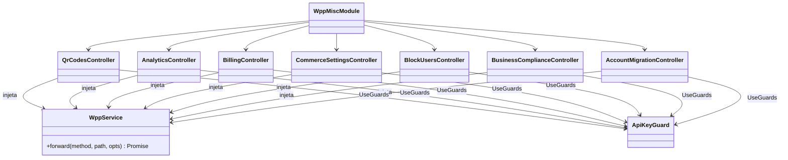
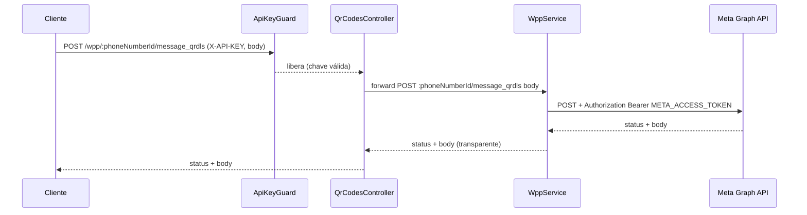
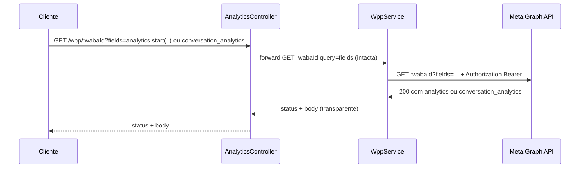
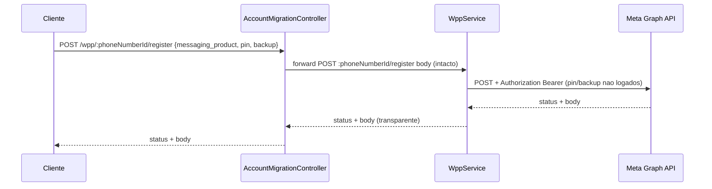
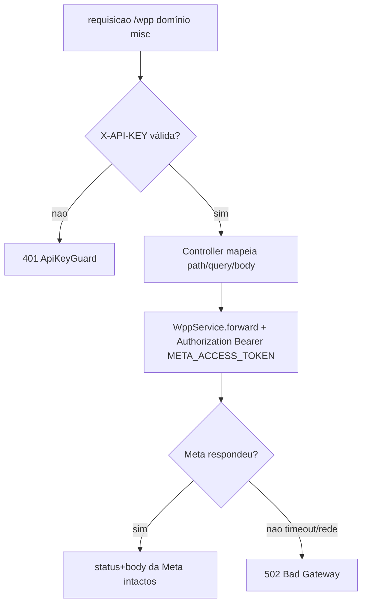
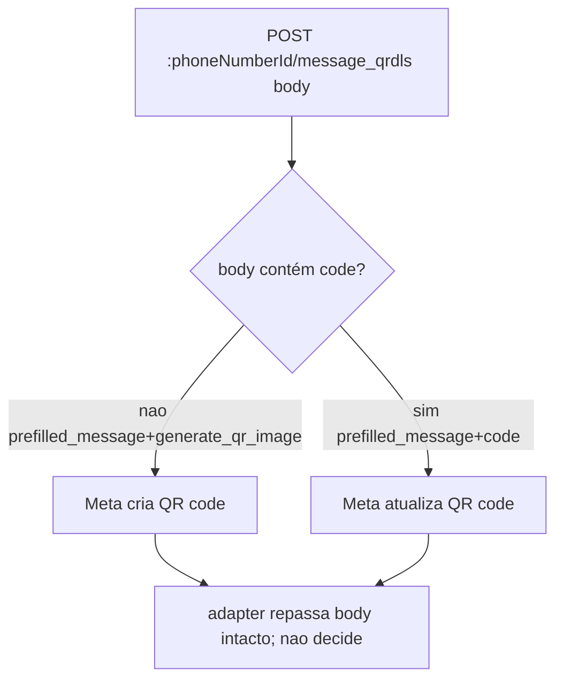

# WhatsApp Meta Adapter — Misc (QR Codes, Analytics, Billing, Commerce, Block Users, Compliance, Migração OnPrem)

> **Feature 8 de 8 do whiz-gateway** (batch WhatsApp Meta Adapter). Spec de domínio do adapter `/wpp/*`. Agrupa as rotas auxiliares da WhatsApp Cloud API que não têm um spec próprio: **QR codes** de mensagem, **Analytics** (mensagens e conversas), **Billing** (linhas de crédito), **Commerce Settings**, **Block Users**, **Business Compliance** (Índia) e **Migração de conta OnPrem** (`register`). **Depende** de `wpp-adapter-core` (reutiliza `WppService.forward`, injeção de `Authorization: Bearer META_ACCESS_TOKEN`, `META_GRAPH_URL` com versão embutida, transparência de status+body, `502` em falha de transporte) e de `api-keys-foundation` (`ApiKeyGuard`). Não redefine o contrato comum; apenas expõe os paths concretos deste domínio.

## 1. Context

A WhatsApp Cloud API expõe diversos recursos administrativos e operacionais além de mensagens/templates/mídia. Este spec consolida os recursos auxiliares ("misc") em um único módulo de domínio, evitando proliferar módulos minúsculos. Cada rota é um proxy transparente para a Meta Graph API:

- **QR codes** (`message_qrdls`): geração/edição/listagem/remoção de QR codes de mensagem (deep links) atrelados a um número.
- **Analytics**: consulta de métricas de mensagens (`analytics`) e de conversas (`conversation_analytics`) via field expansion no recurso da WABA.
- **Billing**: leitura das linhas de crédito estendido (`extendedcredits`) de um Business.
- **Commerce Settings**: leitura e atualização das configurações de comércio (carrinho/catálogo) de um número.
- **Block Users**: listar, bloquear e desbloquear usuários para um número.
- **Business Compliance** (Índia): leitura e adição das informações de conformidade (entity name/type, grievance officer).
- **Migração OnPrem** (`register`): migra uma conta da API OnPrem para a Cloud API usando `pin` + `backup`.

**Usuários**: sistemas clientes portando `X-API-KEY`, que administram QR codes, consultam métricas/billing, ajustam comércio, gerenciam bloqueios, registram conformidade e migram contas — sem conhecer o `META_ACCESS_TOKEN`.

## 2. Scope

**In:**
- `WppMiscModule` importando `WppModule` (`WppService`) e `ApiKeysModule` (`ApiKeyGuard`).
- Controllers de domínio, todos com `@UseGuards(ApiKeyGuard)`, que apenas mapeiam HTTP → `WppService.forward`:
  - **QR codes**: GET/POST/DELETE em `:phoneNumberId/message_qrdls`.
  - **Analytics**: GET `:wabaId` com field expansion (`analytics` e `conversation_analytics`).
  - **Billing**: GET `:businessId/extendedcredits`.
  - **Commerce Settings**: GET/POST `:phoneNumberId/whatsapp_commerce_settings`.
  - **Block Users**: GET/POST/DELETE `:phoneNumberId/block_users`.
  - **Business Compliance**: GET/POST `:phoneNumberId/business_compliance_info`.
  - **Migração OnPrem**: POST `:phoneNumberId/register`.
- DTOs (request/response) com `@ApiProperty`/`@ApiPropertyOptional` + `description` + `example` para Swagger PT-BR.
- Repasse de path vars como params nomeados (`:phoneNumberId`, `:wabaId`, `:businessId`, `:qrCodeId`) e de query/body íntegros à Meta.

**Out:**
- Persistência local de QR codes, métricas, créditos, bloqueios ou conformidade — N/A (proxy stateless; entidades vivem na Meta).
- Infra de forward, injeção de token, mapeamento de erro/transporte → `wpp-adapter-core`.
- Geração/validação de API key → `api-keys-foundation`.
- Rotas de messages/templates/phone-numbers/media/flows → specs próprios (ver §12 sobre colisão do `register`).
- Cache/retry/rate limiting.

## 3. Glossary

| Termo | Significado |
|---|---|
| QR code (`message_qrdls`) | "Message QR Code / Deep Link" — código que abre uma conversa com mensagem pré-preenchida. Identificado por `code`/`:qrCodeId`. |
| `prefilled_message` | Texto que vem pré-preenchido na conversa ao escanear o QR code. |
| `generate_qr_image` | Flag de criação que indica o formato da imagem do QR (`SVG`/`PNG`). |
| Analytics | Métricas de mensagens enviadas/entregues, agregadas por granularidade. Consultado via `fields=analytics.start(..).end(..).granularity(..)`. |
| Conversation analytics | Métricas de conversas (categorias/tipos), via `fields=conversation_analytics...`. |
| Field expansion | Sintaxe Meta `fields=campo.param(..).sub{..}` para selecionar/parametrizar campos aninhados. Repassada íntegra. |
| `extendedcredits` | Linhas de crédito estendido associadas a um Business. |
| Commerce settings | Configuração de carrinho (`is_cart_enabled`) e visibilidade de catálogo (`is_catalog_visible`) do número. |
| Block users | Lista de usuários (telefones) bloqueados de enviar mensagens ao número. |
| Business compliance | Informações de conformidade exigidas na Índia (entidade + grievance officer). |
| `register` (migração) | Migração de conta OnPrem → Cloud API via `pin` + `backup{data,password}`. |
| `messaging_product` | Discriminador Meta, sempre `"whatsapp"` nos bodies aplicáveis. |

## 4. Functional requirements

QR Codes:
- **FR-1**: `GET /wpp/:phoneNumberId/message_qrdls/:qrCodeId` → forward `GET ${META_GRAPH_URL}/:phoneNumberId/message_qrdls/:qrCodeId`. Retorna o QR code.
- **FR-2**: `GET /wpp/:phoneNumberId/message_qrdls` → forward `GET ${META_GRAPH_URL}/:phoneNumberId/message_qrdls` (lista todos). Query `fields` (opcional) e `code` (opcional, retorna URL da imagem SVG/PNG) repassados íntegros.
- **FR-3**: `POST /wpp/:phoneNumberId/message_qrdls` com body `{ prefilled_message, generate_qr_image }` → cria QR code (forward `POST`). Body repassado íntegro.
- **FR-4**: `POST /wpp/:phoneNumberId/message_qrdls` com body `{ prefilled_message, code }` → atualiza o QR code identificado por `code` (forward `POST`). Distinção criar/atualizar é feita pela Meta com base na presença de `code` no body — o adapter repassa íntegro sem decidir.
- **FR-5**: `DELETE /wpp/:phoneNumberId/message_qrdls/:qrCodeId` → forward `DELETE ${META_GRAPH_URL}/:phoneNumberId/message_qrdls/:qrCodeId`.

Analytics:
- **FR-6**: `GET /wpp/:wabaId?fields=analytics.start(..).end(..).granularity(..)...` → forward `GET ${META_GRAPH_URL}/:wabaId` com a query `fields` repassada íntegra (sem reprocessar a field expansion).
- **FR-7**: `GET /wpp/:wabaId?fields=conversation_analytics...` → mesma rota da FR-6, desambiguada pelo conteúdo de `fields`. O adapter não interpreta `fields`; repassa íntegro.

Billing:
- **FR-8**: `GET /wpp/:businessId/extendedcredits` → forward `GET ${META_GRAPH_URL}/:businessId/extendedcredits`. Query (ex.: `fields`) repassada íntegra.

Commerce Settings:
- **FR-9**: `GET /wpp/:phoneNumberId/whatsapp_commerce_settings` → forward `GET`. Retorna as configurações de comércio.
- **FR-10**: `POST /wpp/:phoneNumberId/whatsapp_commerce_settings?is_cart_enabled=&is_catalog_visible=` → forward `POST` com a query repassada íntegra. Define/atualiza as configurações.

Block Users:
- **FR-11**: `GET /wpp/:phoneNumberId/block_users` → forward `GET`. Lista usuários bloqueados. Query (paginação/`fields`) repassada íntegra.
- **FR-12**: `POST /wpp/:phoneNumberId/block_users` com body `{ messaging_product, block_users: [{ user }] }` → forward `POST` (bloqueia). Body repassado íntegro.
- **FR-13**: `DELETE /wpp/:phoneNumberId/block_users` com body `{ messaging_product, block_users: [{ user }] }` → forward `DELETE` com body (desbloqueia). Body repassado íntegro.

Business Compliance:
- **FR-14**: `GET /wpp/:phoneNumberId/business_compliance_info` → forward `GET`. Retorna informações de conformidade.
- **FR-15**: `POST /wpp/:phoneNumberId/business_compliance_info` com body `{ messaging_product, entity_name, entity_type, is_registered, grievance_officer_details{...} }` → forward `POST`. Body repassado íntegro.

Migração OnPrem:
- **FR-16**: `POST /wpp/:phoneNumberId/register` com body `{ messaging_product, pin, backup{ data, password } }` → forward `POST`. Body repassado íntegro. Esta rota é a dona canônica do registro **com** `backup` (ver §12 sobre colisão).

Transversal:
- **FR-17**: Todos os controllers deste domínio aplicam `@UseGuards(ApiKeyGuard)` (header `X-API-KEY`). Sem chave válida → `401` antes de qualquer forward (`api-keys-foundation` FR-9).
- **FR-18**: Status code e body retornados pela Meta são repassados íntegros ao caller (transparência, `wpp-adapter-core` FR-4/FR-5). Falha de transporte → `502` (`wpp-adapter-core` FR-6).
- **FR-19**: A versão da API não aparece nas rotas `/wpp/*`; vive em `META_GRAPH_URL` (`wpp-adapter-core` FR-9).

## 5. Non-functional

- **NFR-1** (segurança): nenhuma rota expõe ou loga `META_ACCESS_TOKEN`; `Authorization` é injetado pelo `WppService` (`wpp-adapter-core` NFR-1). `pin`/`backup.password`/`grievance_officer_details` não são logados.
- **NFR-2** (transparência): o adapter não reinterpreta o contrato Meta; `fields` (analytics/conversation_analytics) e query de commerce/block são repassados sem reprocessamento (`wpp-adapter-core` NFR-5).
- **NFR-3** (perf): módulo stateless e fino; overhead de proxy desprezível ante a latência da Meta.
- **NFR-4** (observabilidade): cada forward loga `method` + `path` + status via `Logger`, sem bodies sensíveis (`pin`, `password`, `Authorization`).
- **NFR-5** (config): herda `META_GRAPH_URL`/`META_ACCESS_TOKEN` de `wpp-adapter-core`; não introduz env novas.

## 6. Data model

N/A — proxy stateless, sem persistência local. As entidades (QR codes, métricas, créditos, bloqueios, conformidade, contas) vivem na Meta; este módulo não as armazena.

## 7. API contract

Todas as rotas: **Auth** = `ApiKeyGuard` (header `X-API-KEY`); **Forward** injeta `Authorization: Bearer META_ACCESS_TOKEN`; **Responses** = status+body da Meta (transparente) | `401` sem X-API-KEY válida | `502` falha de transporte. Abaixo só o específico de cada rota.

### GET /wpp/:phoneNumberId/message_qrdls/:qrCodeId
- **Forward**: `GET ${META_GRAPH_URL}/:phoneNumberId/message_qrdls/:qrCodeId`
- **Responses**: `200` (QR code) | `401` | `502`

### GET /wpp/:phoneNumberId/message_qrdls
- **Query**: `fields` (opcional), `code` (opcional — retorna URL da imagem SVG/PNG do QR). Repassados íntegros.
- **Forward**: `GET ${META_GRAPH_URL}/:phoneNumberId/message_qrdls?<query>`
- **Responses**: `200` (lista de QR codes ou item com URL de imagem) | `401` | `502`

### POST /wpp/:phoneNumberId/message_qrdls
- **Request**: `CreateOrUpdateQrCodeDto` — criar: `prefilled_message: string`, `generate_qr_image?: string` (ex.: `SVG`/`PNG`); atualizar: `prefilled_message: string`, `code: string`. Repassado íntegro (Meta decide criar/atualizar pela presença de `code`).
- **Forward**: `POST ${META_GRAPH_URL}/:phoneNumberId/message_qrdls`
- **Responses**: `200` (QR code criado/atualizado) | `400` (Meta) | `401` | `502`

### DELETE /wpp/:phoneNumberId/message_qrdls/:qrCodeId
- **Forward**: `DELETE ${META_GRAPH_URL}/:phoneNumberId/message_qrdls/:qrCodeId`
- **Responses**: `200` `{ success: true }` (Meta) | `401` | `502`

### GET /wpp/:wabaId
- **Query**: `fields` — field expansion `analytics.start(..).end(..).granularity(..)...` **ou** `conversation_analytics...`. Repassada íntegra (uma única rota serve ambas as variantes, desambiguadas pelo conteúdo de `fields`).
- **Forward**: `GET ${META_GRAPH_URL}/:wabaId?fields=<...>`
- **Responses**: `200` (objeto com `analytics`/`conversation_analytics`) | `400` (Meta) | `401` | `502`

### GET /wpp/:businessId/extendedcredits
- **Query**: `fields` (opcional). Repassada íntegra.
- **Forward**: `GET ${META_GRAPH_URL}/:businessId/extendedcredits`
- **Responses**: `200` (linhas de crédito) | `401` | `502`

### GET /wpp/:phoneNumberId/whatsapp_commerce_settings
- **Forward**: `GET ${META_GRAPH_URL}/:phoneNumberId/whatsapp_commerce_settings`
- **Responses**: `200` (configurações de comércio) | `401` | `502`

### POST /wpp/:phoneNumberId/whatsapp_commerce_settings
- **Query**: `is_cart_enabled?: boolean`, `is_catalog_visible?: boolean`. Repassada íntegra.
- **Forward**: `POST ${META_GRAPH_URL}/:phoneNumberId/whatsapp_commerce_settings?<query>`
- **Responses**: `200` `{ success: true }` (Meta) | `400` (Meta) | `401` | `502`

### GET /wpp/:phoneNumberId/block_users
- **Query**: paginação/`fields` (opcional). Repassada íntegra.
- **Forward**: `GET ${META_GRAPH_URL}/:phoneNumberId/block_users`
- **Responses**: `200` (usuários bloqueados) | `401` | `502`

### POST /wpp/:phoneNumberId/block_users
- **Request**: `BlockUsersDto` — `messaging_product: string` (`"whatsapp"`), `block_users: { user: string }[]`. Repassado íntegro.
- **Forward**: `POST ${META_GRAPH_URL}/:phoneNumberId/block_users`
- **Responses**: `200` (resultado de bloqueio) | `400` (Meta) | `401` | `502`

### DELETE /wpp/:phoneNumberId/block_users
- **Request**: `BlockUsersDto` (body no DELETE) — `messaging_product`, `block_users: { user }[]`. Repassado íntegro.
- **Forward**: `DELETE ${META_GRAPH_URL}/:phoneNumberId/block_users`
- **Responses**: `200` (resultado de desbloqueio) | `400` (Meta) | `401` | `502`

### GET /wpp/:phoneNumberId/business_compliance_info
- **Forward**: `GET ${META_GRAPH_URL}/:phoneNumberId/business_compliance_info`
- **Responses**: `200` (informações de conformidade) | `401` | `502`

### POST /wpp/:phoneNumberId/business_compliance_info
- **Request**: `BusinessComplianceDto` — `messaging_product`, `entity_name: string`, `entity_type: string`, `is_registered: boolean`, `grievance_officer_details: { name, email, landline_number?, mobile_number? }`. Repassado íntegro.
- **Forward**: `POST ${META_GRAPH_URL}/:phoneNumberId/business_compliance_info`
- **Responses**: `200` `{ success: true }` (Meta) | `400` (Meta) | `401` | `502`

### POST /wpp/:phoneNumberId/register
- **Request**: `MigrateAccountDto` — `messaging_product`, `pin: string`, `backup: { data: string, password: string }`. Repassado íntegro.
- **Forward**: `POST ${META_GRAPH_URL}/:phoneNumberId/register`
- **Responses**: `200` (migração aceita) | `400` (Meta) | `401` | `502`
- **Nota**: colide com o `register` de `wpp-phone-numbers`; dono canônico da variante **com `backup`** é este spec (ver §12).

## 8. Module boundaries

DI: `WppMiscModule` importa `WppModule` (provê `WppService`, de `wpp-adapter-core`) e `ApiKeysModule` (provê `ApiKeyGuard`, de `api-keys-foundation`). Não tem service de domínio próprio nem repositório (proxy puro); os controllers injetam `WppService` diretamente.

## 9. Flows

### QR code — criar/atualizar/deletar

### Analytics e conversation analytics — mesma rota, fields distinto

### Migração OnPrem (register com backup)

## 10. State machines

N/A — sem entidade local com ciclo de vida. O ciclo dos QR codes/contas é gerido pela Meta; o adapter é stateless.

## 11. Business rules

## 12. Edge cases & errors

- Requisição sem `X-API-KEY` válida → `401` (ApiKeyGuard), antes de qualquer forward — vale para todas as rotas.
- **`GET /wpp/:wabaId` serve duas variantes** (analytics e conversation analytics): desambiguação só pelo conteúdo de `fields`. Sem `fields`, a Meta retorna os campos default do nó WABA; o adapter não valida o conteúdo de `fields` (passthrough transparente).
- **Colisão `POST /wpp/:phoneNumberId/register`**: a mesma rota é especificada em `wpp-phone-numbers` (registrar número, body `{ messaging_product, pin }`) e aqui (migração, body `{ messaging_product, pin, backup }`). Disambiguação apenas pela **presença de `backup` no body**. Dono canônico da variante **com `backup`** é este spec; sem `backup`, é `wpp-phone-numbers`. Como ambos só repassam o body íntegro à Meta, a implementação deve evitar dois handlers para o mesmo `method+path` (registrar a rota uma vez; ver §14).
- QR code: `POST` sem `prefilled_message` → erro `400` originado da Meta (repassado íntegro, não `502`).
- QR image: `GET ...?code=<ID>&fields=...` retorna URL de imagem (SVG/PNG) conforme `fields`; ausência de `code` lista todos.
- Commerce settings: query `is_cart_enabled`/`is_catalog_visible` repassada como recebida (boolean string); Meta valida.
- Block/unblock: `block_users` vazio ou `user` inválido → erro `400` da Meta (repassado íntegro).
- Compliance (Índia): `entity_type`/`grievance_officer_details` inválidos → `400` da Meta repassado.
- Migração: `pin`/`backup.password` incorretos → erro da Meta repassado com mesmo status; nunca logados (NFR-1/NFR-4).
- Field expansion com caracteres especiais (`fields=analytics.start(1234)...`) → repassado já codificado, sem reprocessar (`wpp-adapter-core` FR-7).
- Qualquer 4xx/5xx da Meta (token expirado, recurso inexistente, permissão) → repassado com mesmo status+body, **não** vira `502`. `502` só em falha de transporte.

## 13. Acceptance criteria

- **AC-1** `[backend]`: Given `X-API-KEY` válida, when `GET /wpp/:phoneNumberId/message_qrdls/:qrCodeId`, then `WppService.forward` é chamado com `GET :phoneNumberId/message_qrdls/:qrCodeId` e o status+body da Meta são repassados (HttpService mockado).
- **AC-2** `[backend]`: Given `X-API-KEY` válida, when `POST /wpp/:phoneNumberId/message_qrdls` com `{ prefilled_message, generate_qr_image }`, then o forward `POST :phoneNumberId/message_qrdls` recebe o body íntegro e a resposta da Meta é repassada (criação).
- **AC-3** `[backend]`: Given `X-API-KEY` válida, when `POST /wpp/:phoneNumberId/message_qrdls` com `{ prefilled_message, code }`, then o forward repassa o body íntegro (com `code`) — atualização decidida pela Meta.
- **AC-4** `[backend]`: Given `X-API-KEY` válida, when `DELETE /wpp/:phoneNumberId/message_qrdls/:qrCodeId`, then forward `DELETE :phoneNumberId/message_qrdls/:qrCodeId` e status+body repassados.
- **AC-5** `[backend]`: Given `X-API-KEY` válida, when `GET /wpp/:phoneNumberId/message_qrdls?fields=code,prefilled_message&code=ABC`, then a query (`fields` + `code`) é repassada íntegra à Meta e a resposta (URL da imagem) é retornada.
- **AC-6** `[backend]`: Given `X-API-KEY` válida, when `GET /wpp/:wabaId?fields=analytics.start(1).end(2).granularity(DAY)`, then forward `GET :wabaId` com `fields` íntegro e body da Meta repassado.
- **AC-7** `[backend]`: Given `X-API-KEY` válida, when `GET /wpp/:wabaId?fields=conversation_analytics.start(1).end(2)`, then a mesma rota repassa `fields` íntegro (variante conversation analytics) — desambiguada só pelo conteúdo de `fields`.
- **AC-8** `[backend]`: Given `X-API-KEY` válida, when `GET /wpp/:businessId/extendedcredits`, then forward `GET :businessId/extendedcredits` e linhas de crédito repassadas.
- **AC-9** `[backend]`: Given `X-API-KEY` válida, when `GET /wpp/:phoneNumberId/whatsapp_commerce_settings`, then forward `GET` e configurações repassadas; when `POST .../whatsapp_commerce_settings?is_cart_enabled=true&is_catalog_visible=false`, then a query é repassada íntegra no forward `POST`.
- **AC-10** `[backend]`: Given `X-API-KEY` válida, when `GET /wpp/:phoneNumberId/block_users`, then lista repassada; when `POST /wpp/:phoneNumberId/block_users` com `{ messaging_product, block_users:[{user}] }`, then o body íntegro vai no forward `POST`; when `DELETE /wpp/:phoneNumberId/block_users` com o mesmo body, then o body íntegro vai no forward `DELETE`.
- **AC-11** `[backend]`: Given `X-API-KEY` válida, when `GET /wpp/:phoneNumberId/business_compliance_info`, then informações repassadas; when `POST .../business_compliance_info` com `{ messaging_product, entity_name, entity_type, is_registered, grievance_officer_details{...} }`, then o body íntegro vai no forward `POST`.
- **AC-12** `[backend]`: Given `X-API-KEY` válida, when `POST /wpp/:phoneNumberId/register` com `{ messaging_product, pin, backup{ data, password } }`, then o body íntegro vai no forward `POST :phoneNumberId/register` e `pin`/`password` não aparecem nos logs.
- **AC-13** `[backend]`: Given a Meta responde `400 { error: {...} }` (ex.: QR sem `prefilled_message`), when qualquer rota deste domínio, then o caller recebe `400` e o mesmo body de erro (não `502`); given falha de transporte, then `502`.
- **AC-14** `[backend]`: Given nenhuma ou inválida `X-API-KEY`, when qualquer rota deste domínio (QR/analytics/billing/commerce/block/compliance/register), then `401` e nenhum forward à Meta.
- **AC-15** `[e2e]`: Given app no ar com `X-API-KEY` válida e Meta stub, when `GET /wpp/:phoneNumberId/message_qrdls` e `POST /wpp/:phoneNumberId/register`, then `200` com o body do stub e o header `Authorization: Bearer META_ACCESS_TOKEN` foi injetado pelo adapter (não veio do caller).

## 14. Open questions

- Validação estrita dos DTOs (`whitelist`/`forbidNonWhitelisted`) vs proxy puro: como `block_users`/`register`/`compliance` têm shapes definidos, validar campos obrigatórios (gera `400` local) ou deixar a Meta validar? (assume: DTOs com `@ApiProperty` para Swagger, validação relaxada nas rotas proxy — alinhar com `wpp-adapter-core` §14.)
- Colisão `POST :phoneNumberId/register`: registrar a rota **uma única vez** (em qual módulo: `wpp-phone-numbers` ou `wpp-misc`?) e repassar o body íntegro independente de `backup`, ou ter handlers separados? (assume: handler único repassando body íntegro; canonicamente documentado aqui para a variante com `backup`. Decidir o módulo dono na fase de implementação para evitar rota duplicada no Nest.)
- `DELETE` com body (`block_users`): confirmar que o framework HTTP/cliente repassa body em `DELETE` à Meta (Meta aceita body em `DELETE /block_users`).
- Commerce settings via query boolean: confirmar serialização (`true`/`false` string) esperada pela Meta no passthrough.
