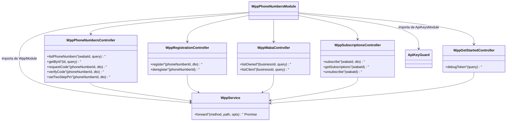
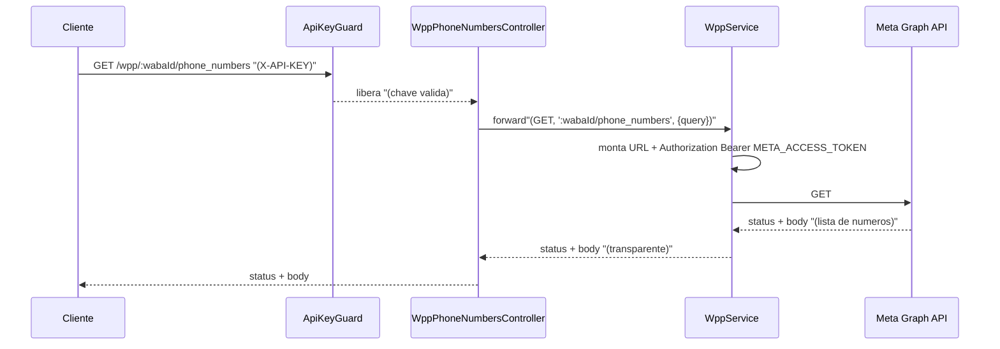
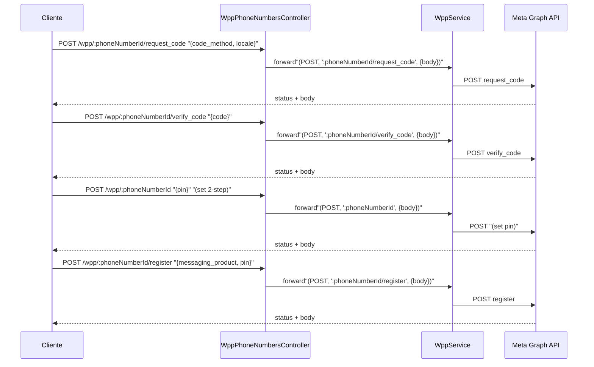
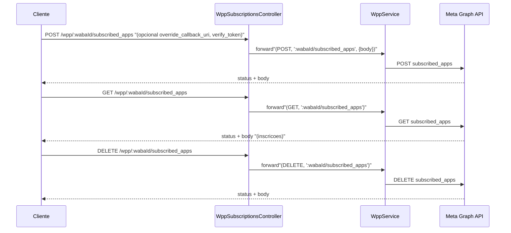
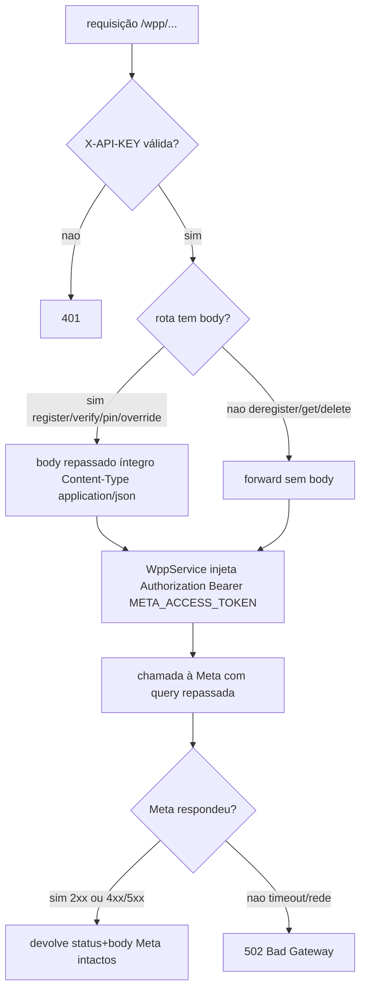

# WhatsApp Meta Adapter — Phone Numbers, Registration, WABA, Subscriptions, Get Started e Business Portfolio

> **Feature 5 de 8 do whiz-gateway** (batch WhatsApp Meta Adapter). Spec de domínio do adapter `/wpp/*`. Cobre o gerenciamento de números de telefone (listagem, consulta, status de display name, verificação por código), o registro/desregistro de números, as contas WhatsApp Business (WABA), as inscrições de webhook (`subscribed_apps`), o fluxo "Get Started" (debug do token de acesso) e o portfólio de negócios (Business Portfolio). **Reaproveita integralmente o contrato comum de `wpp-adapter-core`** (forwarding via `WppService`, injeção de `Authorization: Bearer META_ACCESS_TOKEN`, transparência de status/body, `502` em falha de transporte) e **depende de `api-keys-foundation`** (`ApiKeyGuard`, header `X-API-KEY`). Este spec **não redefine** o forwarding nem o guard — apenas os reusa.

## 1. Context

A WhatsApp Cloud API expõe um conjunto de rotas para administrar a infraestrutura de mensageria de um cliente: descobrir os números de telefone de uma WABA, consultar o status de verificação/aprovação de cada número, solicitar e verificar o código de ativação, registrar o número na Cloud API com PIN de verificação em duas etapas, e desregistrá-lo. Além disso, há rotas para enumerar as WABAs (próprias e compartilhadas) de um Business, gerenciar as inscrições de webhook de uma WABA (`subscribed_apps`), inspecionar um token de acesso (`debug_token`) durante o onboarding ("Get Started") e ler o portfólio de negócios (Business Portfolio).

Hoje o cliente teria de chamar `https://graph.facebook.com/<version>/...` diretamente, conhecendo o `access token` da Meta. Este domínio expõe essas rotas atrás de `/wpp/*`, autenticadas por `X-API-KEY`, sem que o cliente jamais veja o token Meta. O adapter é um proxy fino e transparente: não persiste nada, não reinterpreta o contrato Meta — apenas repassa método, sub-path, query e body, injetando o `Authorization`.

**Usuários**: sistemas clientes que precisam administrar números, contas e inscrições de webhook do WhatsApp Cloud, portando uma `X-API-KEY` válida emitida por `api-keys-foundation`.

## 2. Scope

**In:**
- `WppPhoneNumbersModule` (importa `WppModule` de `wpp-adapter-core` e injeta `WppService`; importa `ApiKeysModule` para `ApiKeyGuard`).
- **Phone Numbers**:
  - `GET /wpp/:wabaId/phone_numbers` — lista números da WABA (com suporte a `fields` e `filtering` por query, beta).
  - `GET /wpp/:id` — consulta número por ID (com suporte a `fields=name_status` para status do display name, beta).
  - `POST /wpp/:phoneNumberId/request_code` — solicita código de verificação (`{ code_method, locale }`).
  - `POST /wpp/:phoneNumberId/verify_code` — verifica código (`{ code }`).
  - `POST /wpp/:phoneNumberId` — configura verificação em duas etapas (`{ pin }`).
- **Registration**:
  - `POST /wpp/:phoneNumberId/register` — registra número na Cloud API (`{ messaging_product, pin }`).
  - `POST /wpp/:phoneNumberId/deregister` — desregistra número (sem body).
- **WABA accounts**:
  - `GET /wpp/:wabaId` — consulta WABA por ID (mesmo segmento `GET /wpp/:id`).
  - `GET /wpp/:businessId/owned_whatsapp_business_accounts` — lista WABAs próprias.
  - `GET /wpp/:businessId/client_whatsapp_business_accounts` — lista WABAs compartilhadas.
- **Webhook Subscriptions**:
  - `POST /wpp/:wabaId/subscribed_apps` — inscreve o app (e, com body `{ override_callback_uri, verify_token }`, sobrescreve a callback URL).
  - `GET /wpp/:wabaId/subscribed_apps` — lista inscrições.
  - `DELETE /wpp/:wabaId/subscribed_apps` — desinscreve o app.
- **Get Started**:
  - `GET /wpp/debug_token?input_token=...` — inspeciona um token de acesso.
  - Demais passos do "Get Started" (registrar número, inscrever app, listar números) **reusam** as rotas já listadas acima.
- **Business Portfolio**:
  - `GET /wpp/:businessId?fields=id,name,timezone_id` — consulta o portfólio de negócios (mesmo segmento `GET /wpp/:id`).
- DTOs com `@ApiProperty` apenas para documentação Swagger PT-BR dos bodies/queries (proxy não valida shape estritamente — ver §14).

**Out:**
- Envio de mensagem de teste ("Send a test message" do Get Started) → pertence a `wpp-messages`.
- Forwarding genérico, injeção de `Authorization`, mapeamento de erro, resolução de `META_GRAPH_URL` → definidos em `wpp-adapter-core` (reusados, não redefinidos).
- Geração/validação de `X-API-KEY` → `api-keys-foundation`.
- Recepção de eventos de webhook (callback receiver) → fora deste domínio; aqui só gerenciamos a **inscrição** via `subscribed_apps`.
- Persistência local de números/WABAs/inscrições — não há (recursos vivem na Meta).
- Cache, retry/backoff, rate limiting.

## 3. Glossary

| Termo | Significado |
|---|---|
| Phone Number ID | ID Meta de um número de telefone do WhatsApp Cloud (`:phoneNumberId`). Opaco ao proxy. |
| WABA | WhatsApp Business Account — conta que agrupa números (`:wabaId`). |
| Business / Business Portfolio | Portfólio de negócios Meta que possui/compartilha WABAs (`:businessId`). |
| `name_status` | Status de aprovação do display name de um número (beta), obtido via `fields=name_status`. |
| `request_code` | Pedido de código de verificação do número (SMS ou VOICE). |
| `verify_code` | Confirmação do código recebido para verificar o número. |
| Two-step verification (PIN) | PIN de 6 dígitos exigido pela Cloud API ao registrar o número. |
| `register` | Registro do número na Cloud API (`messaging_product: whatsapp` + `pin`). |
| `deregister` | Cancelamento do registro do número na Cloud API. |
| `subscribed_apps` | Inscrições de app de uma WABA para receber webhooks. |
| `override_callback_uri` | URL de callback sobrescrita por WABA (override do app), com `verify_token`. |
| `debug_token` | Endpoint Meta que inspeciona metadados/validade de um access token. |
| ID opaco | O proxy não interpreta o tipo do ID; a Meta resolve por ID (ver §12). |

## 4. Functional requirements

- **FR-1**: `GET /wpp/:wabaId/phone_numbers` repassa `GET ${META_GRAPH_URL}/:wabaId/phone_numbers`, encaminhando query (`fields`, `filtering`) sem alteração. Devolve status+body da Meta.
- **FR-2**: `GET /wpp/:id` repassa `GET ${META_GRAPH_URL}/:id`, encaminhando query sem alteração (inclui `fields=name_status` e `fields=id,name,timezone_id`). O segmento `:id` é opaco: serve para número, WABA e Business (ver §12).
- **FR-3**: `POST /wpp/:phoneNumberId/request_code` repassa `POST ${META_GRAPH_URL}/:phoneNumberId/request_code` com body `RequestCodeDto { code_method, locale }` íntegro, `Content-Type: application/json`.
- **FR-4**: `POST /wpp/:phoneNumberId/verify_code` repassa `POST ${META_GRAPH_URL}/:phoneNumberId/verify_code` com body `VerifyCodeDto { code }`.
- **FR-5**: `POST /wpp/:phoneNumberId` (sem sub-path) repassa `POST ${META_GRAPH_URL}/:phoneNumberId` com body `SetTwoStepPinDto { pin }` para configurar a verificação em duas etapas. Desambiguado de outros `POST /wpp/:id` apenas pelo body (ver §12).
- **FR-6**: `POST /wpp/:phoneNumberId/register` repassa `POST ${META_GRAPH_URL}/:phoneNumberId/register` com body `RegisterPhoneDto { messaging_product, pin }`.
- **FR-7**: `POST /wpp/:phoneNumberId/deregister` repassa `POST ${META_GRAPH_URL}/:phoneNumberId/deregister` sem body.
- **FR-8**: `GET /wpp/:businessId/owned_whatsapp_business_accounts` repassa o `GET` correspondente, encaminhando query, devolvendo status+body Meta.
- **FR-9**: `GET /wpp/:businessId/client_whatsapp_business_accounts` repassa o `GET` correspondente, encaminhando query, devolvendo status+body Meta.
- **FR-10**: `POST /wpp/:wabaId/subscribed_apps` repassa `POST ${META_GRAPH_URL}/:wabaId/subscribed_apps`. Quando enviado body `OverrideCallbackDto { override_callback_uri, verify_token }`, o body é repassado íntegro (override de callback); sem body, é a inscrição simples do app.
- **FR-11**: `GET /wpp/:wabaId/subscribed_apps` repassa o `GET` correspondente e devolve as inscrições da WABA.
- **FR-12**: `DELETE /wpp/:wabaId/subscribed_apps` repassa o `DELETE` correspondente para desinscrever o app.
- **FR-13**: `GET /wpp/debug_token` repassa `GET ${META_GRAPH_URL}/debug_token?input_token=...`, encaminhando a query `input_token` sem alteração.
- **FR-14**: Todos os controllers deste domínio aplicam `@UseGuards(ApiKeyGuard)`. Requisição sem `X-API-KEY` válida → `401` antes de qualquer forward (ver `wpp-adapter-core` FR-8 e `api-keys-foundation` FR-9).
- **FR-15**: Toda rota deste domínio reusa `WppService.forward`, que injeta `Authorization: Bearer ${META_ACCESS_TOKEN}` e devolve status+body Meta de forma transparente; falha de transporte → `502` (ver `wpp-adapter-core` FR-1..FR-7).

## 5. Non-functional

- **NFR-1** (segurança): o `META_ACCESS_TOKEN` é injetado pelo `WppService` e nunca exposto ao caller nem logado (herdado de `wpp-adapter-core` NFR-1).
- **NFR-2** (transparência): status code e body da Meta são repassados intactos; o adapter não reinterpreta payloads de números/WABAs/inscrições (herdado de `wpp-adapter-core` NFR-5).
- **NFR-3** (segurança): `verify_token` e `pin` recebidos nos bodies são repassados à Meta, mas **nunca logados** pelo `Logger`.
- **NFR-4** (perf): rotas são stateless e finas; overhead de proxy desprezível ante a latência da Meta (herdado de `wpp-adapter-core` NFR-3).
- **NFR-5** (observabilidade): cada forward loga `method`, `path` e status, sem logar `Authorization`, `pin` nem `verify_token` (herdado de `wpp-adapter-core` NFR-4).

## 6. Data model

N/A — domínio stateless, sem persistência própria. Números de telefone, WABAs, inscrições de webhook e portfólios de negócio são entidades da Meta; este serviço apenas as repassa e não as armazena.

## 7. API contract

Todas as rotas seguem o contrato genérico de `wpp-adapter-core` §7:
- **Auth**: `ApiKeyGuard` (header `X-API-KEY`).
- **Forward**: `<MÉTODO> ${META_GRAPH_URL}/<sub-path>` + `Authorization: Bearer META_ACCESS_TOKEN`.
- **Responses comuns**: status+body da Meta (transparente) | `401` sem `X-API-KEY` válida | `502` falha de transporte.

### PHONE NUMBERS

#### GET /wpp/:wabaId/phone_numbers
- **Auth**: `ApiKeyGuard`
- **Query**: `fields` (opcional), `filtering` (opcional, beta) — repassados
- **Forward**: `GET ${META_GRAPH_URL}/:wabaId/phone_numbers`
- **Responses**: `200` lista de números (body Meta) | `401` | `502`

#### GET /wpp/:id  (número por ID · display name status · Business Portfolio)
- **Auth**: `ApiKeyGuard`
- **Path**: `:id` — Phone Number ID **ou** WABA ID **ou** Business ID (opaco, ver §12)
- **Query**: `fields` (opcional; ex.: `name_status`, `id,name,timezone_id`) — repassada
- **Forward**: `GET ${META_GRAPH_URL}/:id`
- **Responses**: `200` (body Meta) | `401` | `502`

#### POST /wpp/:phoneNumberId/request_code
- **Auth**: `ApiKeyGuard`
- **Request**: `RequestCodeDto` — `code_method: string` (ex.: `"SMS"`, `"VOICE"`), `locale: string` (ex.: `"pt_BR"`)
- **Forward**: `POST ${META_GRAPH_URL}/:phoneNumberId/request_code`
- **Responses**: `200` (body Meta) | `401` | `502`

#### POST /wpp/:phoneNumberId/verify_code
- **Auth**: `ApiKeyGuard`
- **Request**: `VerifyCodeDto` — `code: string` (código recebido)
- **Forward**: `POST ${META_GRAPH_URL}/:phoneNumberId/verify_code`
- **Responses**: `200` (body Meta) | `401` | `502`

#### POST /wpp/:phoneNumberId  (verificação em duas etapas)
- **Auth**: `ApiKeyGuard`
- **Path**: `:phoneNumberId` — mesmo segmento `POST /wpp/:id`, desambiguado pelo body (ver §12)
- **Request**: `SetTwoStepPinDto` — `pin: string` (6 dígitos)
- **Forward**: `POST ${META_GRAPH_URL}/:phoneNumberId`
- **Responses**: `200` (body Meta) | `401` | `502`

### REGISTRATION

#### POST /wpp/:phoneNumberId/register
- **Auth**: `ApiKeyGuard`
- **Request**: `RegisterPhoneDto` — `messaging_product: string` (ex.: `"whatsapp"`), `pin: string` (6 dígitos)
- **Forward**: `POST ${META_GRAPH_URL}/:phoneNumberId/register`
- **Responses**: `200` (body Meta) | `401` | `502`

#### POST /wpp/:phoneNumberId/deregister
- **Auth**: `ApiKeyGuard`
- **Request**: sem body
- **Forward**: `POST ${META_GRAPH_URL}/:phoneNumberId/deregister`
- **Responses**: `200` (body Meta) | `401` | `502`

### WABA ACCOUNTS

#### GET /wpp/:wabaId  (consulta WABA)
- **Auth**: `ApiKeyGuard`
- **Path**: `:wabaId` — mesmo segmento `GET /wpp/:id` (ver §12)
- **Forward**: `GET ${META_GRAPH_URL}/:wabaId`
- **Responses**: `200` (body Meta) | `401` | `502`

#### GET /wpp/:businessId/owned_whatsapp_business_accounts
- **Auth**: `ApiKeyGuard`
- **Query**: repassada
- **Forward**: `GET ${META_GRAPH_URL}/:businessId/owned_whatsapp_business_accounts`
- **Responses**: `200` lista de WABAs próprias (body Meta) | `401` | `502`

#### GET /wpp/:businessId/client_whatsapp_business_accounts
- **Auth**: `ApiKeyGuard`
- **Query**: repassada
- **Forward**: `GET ${META_GRAPH_URL}/:businessId/client_whatsapp_business_accounts`
- **Responses**: `200` lista de WABAs compartilhadas (body Meta) | `401` | `502`

### WEBHOOK SUBSCRIPTIONS

#### POST /wpp/:wabaId/subscribed_apps  (inscrição · override de callback)
- **Auth**: `ApiKeyGuard`
- **Request**: opcional `OverrideCallbackDto` — `override_callback_uri: string` (URL), `verify_token: string`. Sem body → inscrição simples do app.
- **Forward**: `POST ${META_GRAPH_URL}/:wabaId/subscribed_apps`
- **Responses**: `200` (body Meta) | `401` | `502`

#### GET /wpp/:wabaId/subscribed_apps
- **Auth**: `ApiKeyGuard`
- **Forward**: `GET ${META_GRAPH_URL}/:wabaId/subscribed_apps`
- **Responses**: `200` lista de inscrições (body Meta) | `401` | `502`

#### DELETE /wpp/:wabaId/subscribed_apps
- **Auth**: `ApiKeyGuard`
- **Forward**: `DELETE ${META_GRAPH_URL}/:wabaId/subscribed_apps`
- **Responses**: `200` (body Meta) | `401` | `502`

### GET STARTED

#### GET /wpp/debug_token
- **Auth**: `ApiKeyGuard`
- **Query**: `input_token: string` (token a inspecionar) — repassado
- **Forward**: `GET ${META_GRAPH_URL}/debug_token?input_token=...`
- **Responses**: `200` (body Meta com metadados do token) | `401` | `502`

> Demais passos do "Get Started" — registrar número (`POST /wpp/:phoneNumberId/register`), inscrever app (`POST /wpp/:wabaId/subscribed_apps`), listar números (`GET /wpp/:wabaId/phone_numbers`) — **reusam** as rotas acima. "Send a test message" pertence a `wpp-messages`.

### BUSINESS PORTFOLIO

#### GET /wpp/:businessId  (portfólio de negócios)
- **Auth**: `ApiKeyGuard`
- **Path**: `:businessId` — mesmo segmento `GET /wpp/:id` (ver §12)
- **Query**: `fields` (ex.: `id,name,timezone_id`) — repassada
- **Forward**: `GET ${META_GRAPH_URL}/:businessId`
- **Responses**: `200` (body Meta) | `401` | `502`

## 8. Module boundaries

DI: `WppPhoneNumbersModule` importa `WppModule` (de `wpp-adapter-core`, provê/exporta `WppService`) e `ApiKeysModule` (provê `ApiKeyGuard`). Os controllers injetam `WppService` e aplicam `@UseGuards(ApiKeyGuard)`. Nenhum service novo de regra de negócio — o domínio é puro proxy. O agrupamento em múltiplos controllers é por sub-recurso; o número/escopo exato de classes é detalhe de implementação (ver §14).

## 9. Flows

### Listar números de uma WABA

### Verificação de número (request_code → verify_code → set PIN → register)

### Inscrição de webhook (subscribe / override / unsubscribe)

## 10. State machines

N/A — não há entidade local com ciclo de vida. O número de telefone tem estados na Meta (não verificado → verificado → registrado → desregistrado), mas esse ciclo é gerido e armazenado pela Meta; o adapter apenas repassa as transições disparadas pelas rotas (`request_code`/`verify_code`/`register`/`deregister`) sem rastrear estado localmente.

## 11. Business rules

## 12. Edge cases & errors

- **Colisão de path no framework**: `GET /wpp/:wabaId`, `GET /wpp/:phoneNumberId` e `GET /wpp/:businessId` são, no nível do framework, **o mesmo** `GET /wpp/:id` — há um único segmento de path. O tipo do ID é **opaco** para o proxy: ele não decide nem valida se o ID é de número, WABA ou Business; apenas repassa o segmento à Meta, que resolve a semântica pelo ID fornecido. A query (`fields=name_status`, `fields=id,name,timezone_id`) muda o que a Meta retorna, não a rota.
- **Colisão em POST**: `POST /wpp/:phoneNumberId` (set 2-step PIN) compartilha o segmento `POST /wpp/:id` com qualquer outro POST de raiz; é disambiguado **apenas pelo body** (`{ pin }`). O proxy não roteia por body — apenas repassa; a Meta interpreta.
- Requisição sem `X-API-KEY` válida → `401` (ApiKeyGuard), antes de qualquer forward.
- Meta retorna 4xx (ex.: número não verificado em `register`, código inválido em `verify_code`, PIN incorreto, WABA inexistente) → repassado com **mesmo** status/body, **não** vira `502`.
- Timeout/erro de rede ao falar com a Meta → `502 Bad Gateway`.
- `POST /wpp/:phoneNumberId/deregister` sem body → forward sem body; qualquer body enviado é ignorado/repassado conforme `WppService` (proxy não exige body).
- `POST /wpp/:wabaId/subscribed_apps` sem body → inscrição simples; com `{ override_callback_uri, verify_token }` → override de callback. Ambos vão à mesma rota Meta.
- `verify_token` e `pin` nos bodies → repassados à Meta mas nunca logados (NFR-3, NFR-5).
- Query de field expansion com parênteses (`fields=...`) → repassada já codificada, sem reprocessar (herdado de `wpp-adapter-core`).
- `GET /wpp/debug_token` sem `input_token` → repassado como está; a Meta responde o erro correspondente (transparente).

## 13. Acceptance criteria

- **AC-1** `[backend]`: Given `X-API-KEY` válida, when `GET /wpp/:wabaId/phone_numbers?fields=id,display_phone_number`, then `WppService` chama `GET ${META_GRAPH_URL}/:wabaId/phone_numbers?fields=id,display_phone_number` com `Authorization: Bearer ${META_ACCESS_TOKEN}` e o caller recebe o status+body da Meta (HttpService mockado).
- **AC-2** `[backend]`: Given `X-API-KEY` válida, when `GET /wpp/:id?fields=name_status`, then o forward é `GET ${META_GRAPH_URL}/:id?fields=name_status` e o body Meta é repassado intacto.
- **AC-3** `[backend]`: Given `X-API-KEY` válida, when `POST /wpp/:phoneNumberId/request_code` com `{ code_method: "SMS", locale: "pt_BR" }`, then o body é repassado íntegro com `Content-Type: application/json` ao `POST ${META_GRAPH_URL}/:phoneNumberId/request_code`.
- **AC-4** `[backend]`: Given `X-API-KEY` válida, when `POST /wpp/:phoneNumberId/verify_code` com `{ code: "123456" }`, then o forward é `POST ${META_GRAPH_URL}/:phoneNumberId/verify_code` com o body íntegro.
- **AC-5** `[backend]`: Given `X-API-KEY` válida, when `POST /wpp/:phoneNumberId` com `{ pin: "123456" }`, then o forward é `POST ${META_GRAPH_URL}/:phoneNumberId` com o body íntegro (set two-step) e o `pin` não é logado.
- **AC-6** `[backend]`: Given `X-API-KEY` válida, when `POST /wpp/:phoneNumberId/register` com `{ messaging_product: "whatsapp", pin: "123456" }`, then o forward é `POST ${META_GRAPH_URL}/:phoneNumberId/register` com o body íntegro.
- **AC-7** `[backend]`: Given `X-API-KEY` válida, when `POST /wpp/:phoneNumberId/deregister` sem body, then o forward é `POST ${META_GRAPH_URL}/:phoneNumberId/deregister` sem body e o caller recebe o status+body da Meta.
- **AC-8** `[backend]`: Given `X-API-KEY` válida, when `GET /wpp/:wabaId`, then o forward é `GET ${META_GRAPH_URL}/:wabaId` e o body Meta é repassado intacto.
- **AC-9** `[backend]`: Given `X-API-KEY` válida, when `GET /wpp/:businessId/owned_whatsapp_business_accounts` e `GET /wpp/:businessId/client_whatsapp_business_accounts`, then cada um faz o forward correspondente repassando query e devolve a lista da Meta.
- **AC-10** `[backend]`: Given `X-API-KEY` válida, when `POST /wpp/:wabaId/subscribed_apps` sem body, then forward de inscrição simples; when com `{ override_callback_uri, verify_token }`, then o body é repassado íntegro (override) e o `verify_token` não é logado.
- **AC-11** `[backend]`: Given `X-API-KEY` válida, when `GET /wpp/:wabaId/subscribed_apps` e `DELETE /wpp/:wabaId/subscribed_apps`, then cada um repassa o método correspondente a `${META_GRAPH_URL}/:wabaId/subscribed_apps` e devolve o status+body Meta.
- **AC-12** `[backend]`: Given `X-API-KEY` válida, when `GET /wpp/debug_token?input_token=abc`, then o forward é `GET ${META_GRAPH_URL}/debug_token?input_token=abc` com `Authorization` injetado.
- **AC-13** `[backend]`: Given `X-API-KEY` válida, when `GET /wpp/:businessId?fields=id,name,timezone_id`, then o forward é `GET ${META_GRAPH_URL}/:businessId?fields=id,name,timezone_id` (Business Portfolio) e o body Meta é repassado intacto.
- **AC-14** `[backend]`: Given nenhuma/ inválida `X-API-KEY`, when qualquer rota deste domínio, then `401` (ApiKeyGuard) e nenhuma chamada à Meta.
- **AC-15** `[backend]`: Given a Meta responde `4xx` (ex.: código inválido em `verify_code`), when forward, then o caller recebe o **mesmo** status/body (não `502`); Given o HttpService lança timeout, when forward, then `502`.
- **AC-16** `[e2e]`: Given app no ar com `X-API-KEY` válida e Meta stub, when fluxo HTTP `GET /wpp/:wabaId/phone_numbers` → `POST /wpp/:phoneNumberId/request_code` → `POST /wpp/:phoneNumberId/verify_code` → `POST /wpp/:phoneNumberId/register`, then cada resposta carrega o status+body do stub e o header `Authorization` foi injetado pelo adapter (não veio do caller).

## 14. Open questions

- Roteamento por body (`POST /wpp/:phoneNumberId` set-PIN vs outros POST de raiz): como o framework registra um único `POST /:id`, basta um handler que repassa qualquer body? (assume: sim — proxy puro; a Meta interpreta o body. Sem desambiguação local.)
- Os DTOs (`RequestCodeDto`, `VerifyCodeDto`, `SetTwoStepPinDto`, `RegisterPhoneDto`, `OverrideCallbackDto`) servem só para Swagger ou devem validar estritamente? (assume: Swagger + validação leve; `whitelist:false` nas rotas proxy para não barrar campos extras da Meta — alinhar com `wpp-adapter-core` §14.)
- Agrupar todos os controllers num só (`WppPhoneNumbersController`) ou separar por sub-recurso (números, registro, WABA, subscriptions, get-started)? (assume: separação por sub-recurso para Swagger PT-BR mais legível; decisão final na fase de código.)
- `code_method` e `locale` devem ser enum/validados? (assume: string livre repassada; a Meta valida.)
