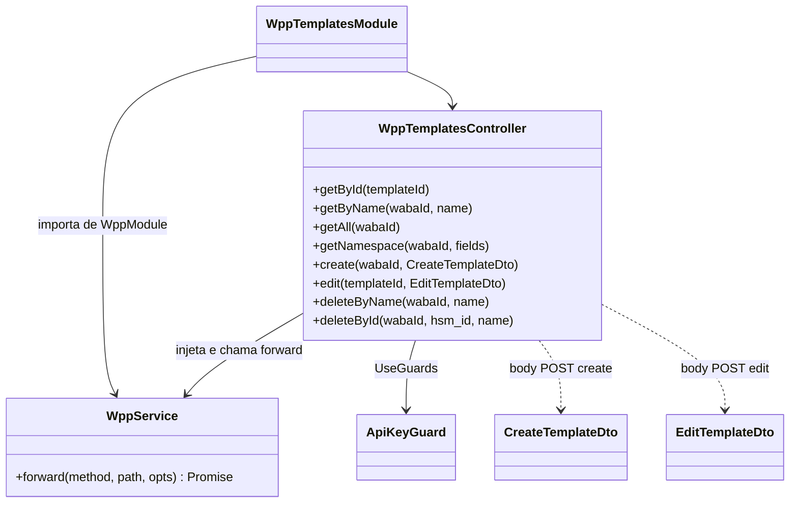
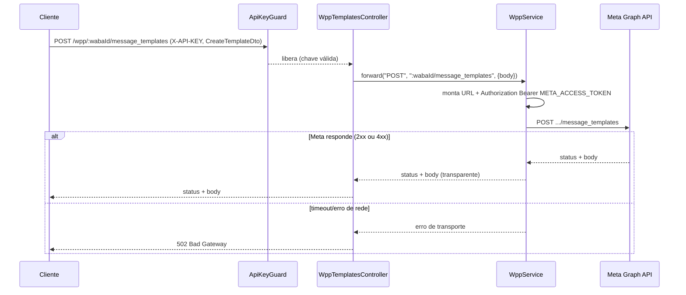
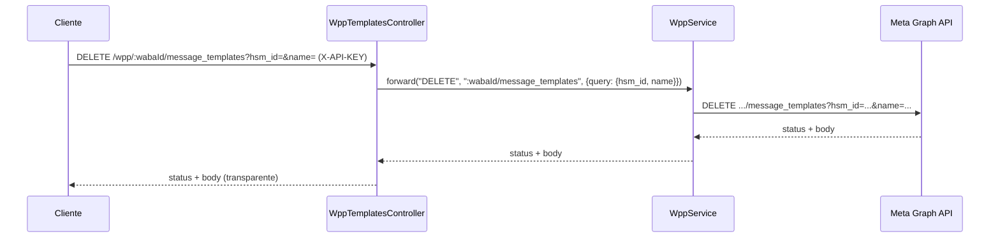
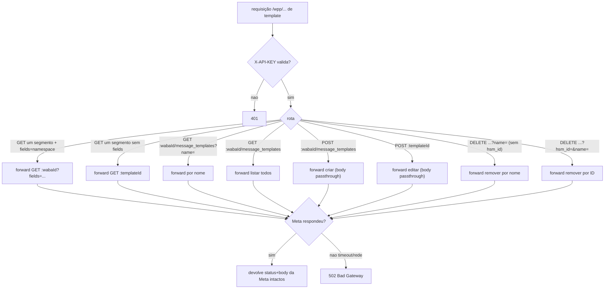

# WhatsApp Meta Adapter — Templates

> **Feature 4 de 8 do whiz-gateway** (batch WhatsApp Meta Adapter). Domínio de **message templates** (modelos de mensagem) do adapter `/wpp/*`. Especifica as rotas de leitura, criação, edição e remoção de templates na WhatsApp Cloud API, todas como **proxy transparente** sobre a Meta Graph API. Reutiliza integralmente o contrato compartilhado de `wpp-adapter-core` (`WppService.forward`, injeção de `Authorization: Bearer META_ACCESS_TOKEN`, `META_GRAPH_URL`, passthrough de status+body, `502` em falha de transporte) e o `ApiKeyGuard` de `api-keys-foundation`. **Não redefine** essas regras — depende delas.

## 1. Context

Clientes que precisam administrar modelos de mensagem do WhatsApp (criar, listar, buscar, editar e excluir templates de uma WABA) hoje teriam que falar direto com `graph.facebook.com` e conhecer o `access token` da Meta. Este domínio expõe essas operações sob `/wpp/*`, autenticadas por `X-API-KEY`, mantendo o token Meta oculto no servidor.

Os templates são entidades que **vivem inteiramente na Meta** — este serviço não os persiste nem mantém estado local. O adapter apenas:

- Traduz a rota Meta `/{{Version}}/<resto>` → `/wpp/<resto>` (a versão sai do path e vive em `META_GRAPH_URL`).
- Mapeia variáveis de path Meta para parâmetros nomeados (`{{WABA-ID}}` → `:wabaId`, `<TEMPLATE_ID>` → `:templateId`).
- Encaminha query params (`name`, `fields`, `hsm_id`) e body sem reinterpretar.
- Devolve status + body da Meta de forma transparente.

**Usuários**: sistemas clientes que gerenciam o catálogo de templates de uma ou mais WABAs via `/wpp/*`.

## 2. Scope

**In:**
- `WppTemplatesModule` (importa `WppModule` para o `WppService`; aplica `ApiKeyGuard` nos controllers).
- Rotas de leitura: template por ID, template por nome, todos os templates, namespace da WABA.
- Rota de criação (`POST .../message_templates`) cobrindo as variantes de `category` (`AUTHENTICATION`, `MARKETING`, `UTILITY`) e de `components[]` (OTP copy-code, OTP one-tap, catálogo, multi-product, texto com header+body+footer+quick-reply, imagem com CTA, localização, documento com phone+URL).
- Rota de edição (`POST /wpp/:templateId`).
- Rotas de remoção: por nome e por ID (`hsm_id` + `name`).
- DTOs `CreateTemplateDto`/`EditTemplateDto` apenas para documentação Swagger PT-BR; `components[]` é array JSON passthrough (validação frouxa — proxy).

**Out:**
- Infraestrutura de forward, injeção de token, mapeamento de erro, `502` → `wpp-adapter-core`.
- Geração/validação de `X-API-KEY` → `api-keys-foundation`.
- Persistência local de templates (não existe — vivem na Meta).
- Validação estrita do shape de `components[]` (Meta valida; aqui é passthrough).
- Envio de mensagens usando templates → `wpp-messages`.
- Cache, retry/backoff, rate limiting.

## 3. Glossary

| Termo | Significado |
|---|---|
| Template (message template) | Modelo de mensagem pré-aprovado pela Meta para envio fora da janela de 24h. |
| WABA | WhatsApp Business Account. Container dos templates. Identificada por `:wabaId`. |
| `:templateId` | ID único do template na Meta (`<TEMPLATE_ID>` no path original). |
| `category` | Categoria do template: `AUTHENTICATION`, `MARKETING` ou `UTILITY`. |
| `components[]` | Array que descreve as partes do template (header, body, footer, buttons). Passthrough. |
| `message_template_namespace` | Namespace da WABA usado para referenciar templates no envio. |
| `hsm_id` | Identificador do template (Highly Structured Message) usado na remoção por ID. |
| OTP copy-code | Botão de autenticação que copia o código (`AUTHENTICATION`). |
| OTP one-tap | Botão de autenticação com autofill em um toque (`AUTHENTICATION`). |
| Passthrough | Body/query encaminhados à Meta sem reinterpretação. |

## 4. Functional requirements

- **FR-1**: `GET /wpp/:templateId` → forward `GET ${META_GRAPH_URL}/:templateId` (campos default da Meta). Status+body transparentes.
- **FR-2**: `GET /wpp/:wabaId/message_templates?name=<NAME>` → forward `GET ${META_GRAPH_URL}/:wabaId/message_templates?name=<NAME>`. Query `name` repassada sem alteração.
- **FR-3**: `GET /wpp/:wabaId/message_templates` (sem `name`) → forward para listar todos os templates da WABA.
- **FR-4**: `GET /wpp/:wabaId?fields=message_template_namespace` → forward `GET ${META_GRAPH_URL}/:wabaId?fields=message_template_namespace`. Query `fields` repassada íntegra (inclusive sintaxe de field expansion).
- **FR-5**: `POST /wpp/:wabaId/message_templates` com `CreateTemplateDto { name, language, category, components[] }` → forward `POST ${META_GRAPH_URL}/:wabaId/message_templates` com `Content-Type: application/json` e body repassado íntegro.
- **FR-6**: `category` aceita os valores `AUTHENTICATION`, `MARKETING`, `UTILITY` (documentados no Swagger); o adapter **não** rejeita outros valores localmente — a Meta é a autoridade (passthrough).
- **FR-7**: `components[]` é encaminhado como array JSON arbitrário (passthrough). As variantes (OTP copy-code, OTP one-tap autofill, catálogo, multi-product, texto header+body+footer+2 quick-reply, imagem header+2 CTA, localização header+website, documento header+phone+URL) são apenas formas de preencher `components[]` — todas seguem o mesmo caminho de forward.
- **FR-8**: `POST /wpp/:templateId` com `EditTemplateDto { name, components, language, category }` → forward `POST ${META_GRAPH_URL}/:templateId` (edição do template). Body repassado íntegro.
- **FR-9**: `DELETE /wpp/:wabaId/message_templates?name=<NAME>` → forward `DELETE ${META_GRAPH_URL}/:wabaId/message_templates?name=<NAME>` (remoção por nome).
- **FR-10**: `DELETE /wpp/:wabaId/message_templates?hsm_id=<HSM_ID>&name=<NAME>` → forward `DELETE ${META_GRAPH_URL}/:wabaId/message_templates?hsm_id=<HSM_ID>&name=<NAME>` (remoção por ID). Ambas as queries repassadas.
- **FR-11**: Todos os controllers de templates aplicam `@UseGuards(ApiKeyGuard)`; sem `X-API-KEY` válida → `401` antes de qualquer forward (herdado de `wpp-adapter-core` FR-8).
- **FR-12**: Resposta da Meta (2xx ou 4xx/5xx) é devolvida com o mesmo status code e body; falha de transporte → `502` (herdado de `wpp-adapter-core` FR-4/5/6).

## 5. Non-functional

- **NFR-1** (transparência): nenhuma rota reinterpreta o contrato Meta de templates — status e body passam intactos (exceto `502` de transporte).
- **NFR-2** (segurança): `META_ACCESS_TOKEN` injetado pelo `WppService`, nunca exposto ao caller nem logado (herdado).
- **NFR-3** (validação frouxa): controllers de proxy usam validação não estrita para o body (`components[]` arbitrário); apenas os campos documentados no DTO têm `@ApiProperty`. `whitelist`/`forbidNonWhitelisted` não devem barrar campos extras nas rotas de template.
- **NFR-4** (observabilidade): cada forward loga `method`, `path` e status via `Logger`, sem logar body de template nem `Authorization` (herdado).
- **NFR-5** (sem estado): módulo stateless; nenhuma tabela, cache ou fila própria.

## 6. Data model

N/A — **sem persistência local**. Os templates são entidades da Meta (WhatsApp Cloud API) e não são armazenados por este serviço. O adapter é um proxy stateless; toda a fonte de verdade é a Meta.

## 7. API contract

Todas as rotas: **Auth** = `ApiKeyGuard` (header `X-API-KEY`); **Responses** comuns = status+body da Meta (transparente) | `401` sem `X-API-KEY` válida | `502` falha de transporte. Abaixo, apenas o específico de cada grupo.

### Grupo: Leitura

#### GET /wpp/:templateId
- **Descrição**: busca um template por ID (campos default da Meta).
- **Path**: `templateId` — ID do template (`<TEMPLATE_ID>`).
- **Forward**: `GET ${META_GRAPH_URL}/:templateId`
- **Responses**: `200` (objeto do template) | `404` (template inexistente, repassado da Meta) | `401` | `502`

#### GET /wpp/:wabaId/message_templates?name=&lt;NAME&gt;
- **Descrição**: busca template(s) por nome dentro da WABA.
- **Path**: `wabaId` — ID da WABA (`{{WABA-ID}}`).
- **Query**: `name` — nome do template (repassado).
- **Forward**: `GET ${META_GRAPH_URL}/:wabaId/message_templates?name=<NAME>`
- **Responses**: `200` `{ data: [...] }` | `401` | `502`

#### GET /wpp/:wabaId/message_templates
- **Descrição**: lista todos os templates da WABA.
- **Path**: `wabaId`.
- **Forward**: `GET ${META_GRAPH_URL}/:wabaId/message_templates`
- **Responses**: `200` `{ data: [...], paging: {...} }` | `401` | `502`

#### GET /wpp/:wabaId?fields=message_template_namespace
- **Descrição**: obtém o `message_template_namespace` da WABA.
- **Path**: `wabaId`.
- **Query**: `fields` — esperado `message_template_namespace` (repassado íntegro).
- **Forward**: `GET ${META_GRAPH_URL}/:wabaId?fields=message_template_namespace`
- **Responses**: `200` `{ message_template_namespace, id }` | `401` | `502`

### Grupo: Criação

#### POST /wpp/:wabaId/message_templates
- **Descrição**: cria um template na WABA.
- **Path**: `wabaId`.
- **Request**: `CreateTemplateDto` — `name: string`, `language: string`, `category: AUTHENTICATION|MARKETING|UTILITY`, `components: object[]` (passthrough). `Content-Type: application/json`.
- **Variantes de `components[]`** (todas pelo mesmo forward): OTP copy-code, OTP one-tap autofill, catálogo, multi-product, texto (header+body+footer+2 quick-reply buttons), imagem (header+2 CTA buttons), localização (header+website button), documento (header+phone+URL button).
- **Forward**: `POST ${META_GRAPH_URL}/:wabaId/message_templates`
- **Responses**: `200`/`201` `{ id, status, category }` (da Meta) | `400` (erro de validação repassado da Meta) | `401` | `502`

### Grupo: Edição

#### POST /wpp/:templateId
- **Descrição**: edita um template existente.
- **Path**: `templateId`.
- **Request**: `EditTemplateDto` — `name?: string`, `components?: object[]`, `language?: string`, `category?: AUTHENTICATION|MARKETING|UTILITY` (passthrough). `Content-Type: application/json`.
- **Forward**: `POST ${META_GRAPH_URL}/:templateId`
- **Responses**: `200` `{ success: true }` (da Meta) | `400` | `401` | `404` | `502`

### Grupo: Remoção

#### DELETE /wpp/:wabaId/message_templates?name=&lt;NAME&gt;
- **Descrição**: remove template(s) por nome (todas as línguas daquele nome).
- **Path**: `wabaId`. **Query**: `name`.
- **Forward**: `DELETE ${META_GRAPH_URL}/:wabaId/message_templates?name=<NAME>`
- **Responses**: `200` `{ success: true }` | `401` | `502`

#### DELETE /wpp/:wabaId/message_templates?hsm_id=&lt;HSM_ID&gt;&name=&lt;NAME&gt;
- **Descrição**: remove um template específico por ID.
- **Path**: `wabaId`. **Query**: `hsm_id` + `name` (ambos repassados).
- **Forward**: `DELETE ${META_GRAPH_URL}/:wabaId/message_templates?hsm_id=<HSM_ID>&name=<NAME>`
- **Responses**: `200` `{ success: true }` | `401` | `502`

> Nota de roteamento: `GET /wpp/:templateId` e `GET /wpp/:wabaId` colidem no mesmo padrão de um segmento. A distinção é feita pela query (`fields=message_template_namespace` indica leitura de namespace da WABA) e/ou pela ordem de registro das rotas — ver §14.

## 8. Module boundaries

DI: `WppTemplatesModule` importa `WppModule` (provê `WppService`) e usa o `ApiKeyGuard` exportado por `ApiKeysModule` (via `WppModule`/import direto, conforme `wpp-adapter-core`). O controller é HTTP-mapping puro: traduz path/query/body em chamadas `WppService.forward` e devolve a resposta intacta.

## 9. Flows

### Criação de template (passthrough)

### Remoção por ID

## 10. State machines

N/A — o ciclo de vida do template (`PENDING` → `APPROVED`/`REJECTED` etc.) é gerido pela Meta e não é modelado nem persistido por este serviço. O adapter apenas repassa o `status` retornado pela Meta.

## 11. Business rules

## 12. Edge cases & errors

- Requisição sem `X-API-KEY` válida → `401` (ApiKeyGuard), antes de qualquer forward.
- `CreateTemplateDto`/`EditTemplateDto` carregam `name`/`language`/`category`/`components`; `components[]` é **array JSON passthrough** (validação frouxa — proxy não inspeciona o shape interno; variantes OTP/catálogo/imagem/etc. fluem iguais).
- `category` com valor fora de `AUTHENTICATION|MARKETING|UTILITY` → **não** barrado localmente; a Meta decide (provável `400` repassado).
- `components[]` inválido para a Meta → `400` repassado da Meta, **não** `502`.
- Template/`:templateId` inexistente → `404` repassado da Meta.
- `name` ausente em `DELETE ...?name=` → comportamento definido pela Meta (provável `400` repassado); o adapter não exige `name` localmente além de repassar a query.
- Colisão de rota `GET /wpp/:templateId` vs `GET /wpp/:wabaId` (um segmento) → resolvida por ordem de rota/presença de `fields=message_template_namespace` (ver §14).
- `fields` com sintaxe de field expansion → repassado já codificado, sem reprocessar (herdado de `wpp-adapter-core`).
- Timeout/erro de rede da Meta → `502`.

## 13. Acceptance criteria

- **AC-1** `[backend]`: Given `X-API-KEY` válida, when `GET /wpp/:templateId`, then `WppService.forward("GET", ":templateId", ...)` é chamado e o caller recebe o status+body da Meta (HttpService mockado).
- **AC-2** `[backend]`: Given `X-API-KEY` válida, when `GET /wpp/:wabaId/message_templates?name=hello_world`, then o forward inclui a query `name=hello_world` íntegra e devolve o body da Meta.
- **AC-3** `[backend]`: Given `X-API-KEY` válida, when `GET /wpp/:wabaId/message_templates` (sem `name`), then forward lista todos os templates e o caller recebe `200` com `{ data: [...] }`.
- **AC-4** `[backend]`: Given `X-API-KEY` válida, when `GET /wpp/:wabaId?fields=message_template_namespace`, then o forward preserva a query `fields=message_template_namespace` e devolve `{ message_template_namespace }`.
- **AC-5** `[backend]`: Given `X-API-KEY` válida, when `POST /wpp/:wabaId/message_templates` com `CreateTemplateDto { name, language, category: "AUTHENTICATION", components: [<OTP copy-code button>] }`, then o body é repassado íntegro com `Content-Type: application/json` e o caller recebe o status+body da Meta.
- **AC-6** `[backend]`: Given `X-API-KEY` válida, when `POST /wpp/:wabaId/message_templates` com `category: "MARKETING"` e `components` de header de imagem + 2 botões CTA (ou variante de texto com 2 quick-reply), then o `components[]` arbitrário é repassado sem rejeição local e devolve a resposta da Meta.
- **AC-7** `[backend]`: Given `X-API-KEY` válida, when `POST /wpp/:templateId` com `EditTemplateDto { name, components, language, category }`, then forward `POST ${META_GRAPH_URL}/:templateId` com o body íntegro e devolve a resposta da Meta.
- **AC-8** `[backend]`: Given `X-API-KEY` válida, when `DELETE /wpp/:wabaId/message_templates?name=hello_world`, then forward `DELETE` com query `name=hello_world` e devolve a resposta da Meta.
- **AC-9** `[backend]`: Given `X-API-KEY` válida, when `DELETE /wpp/:wabaId/message_templates?hsm_id=123&name=hello_world`, then forward preserva ambas as queries `hsm_id` e `name`.
- **AC-10** `[backend]`: Given nenhum/`X-API-KEY` inválida, when qualquer rota `/wpp/...` de template, then `401` e nenhuma chamada à Meta (ApiKeyGuard).
- **AC-11** `[backend]`: Given a Meta responde `400 { error: {...} }` (ex.: `components` inválido), when `POST /wpp/:wabaId/message_templates`, then o caller recebe `400` com o mesmo body de erro (não `502`); e Given timeout da Meta, then `502`.
- **AC-12** `[e2e]`: Given app no ar com `X-API-KEY` válida e Meta stub, when fluxo HTTP cria um template (`POST`), lista (`GET ...message_templates`), busca por nome e remove por nome (`DELETE ...?name=`), then cada resposta carrega o status+body do stub e o `Authorization` foi injetado pelo adapter (não veio do caller).

## 14. Open questions

- Resolução da colisão `GET /wpp/:templateId` vs `GET /wpp/:wabaId?fields=...`: registrar a rota de namespace condicionada à presença de `fields=message_template_namespace`, ou usar um único handler que decide pelo query param? (assume: handler único de um segmento que ramifica por presença de `fields`; confirmar com a Meta se os IDs nunca colidem em formato)
- `category` deve virar `enum` validado localmente no DTO (apenas para Swagger, sem `forbidNonWhitelisted`) ou `string` livre? (assume: documentado como enum no `@ApiProperty`, mas não barrado — proxy)
- `components[]` precisa de algum `@ApiProperty` por variante (exemplos OTP/catálogo/imagem) no Swagger, ou um único exemplo genérico basta? (assume: um `@ApiProperty` array com exemplo representativo por categoria)
- Edição via `POST /wpp/:templateId` aceita `name`? A Meta restringe edição de `name` em alguns casos — repassar e deixar a Meta validar (assume passthrough).
