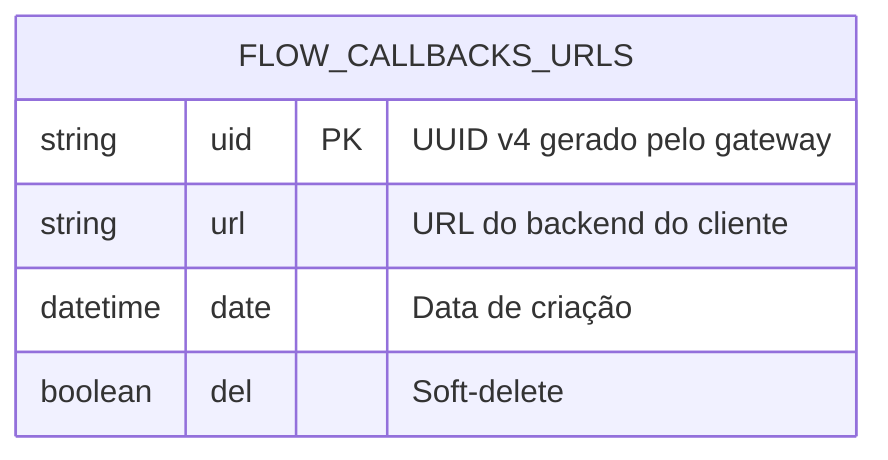
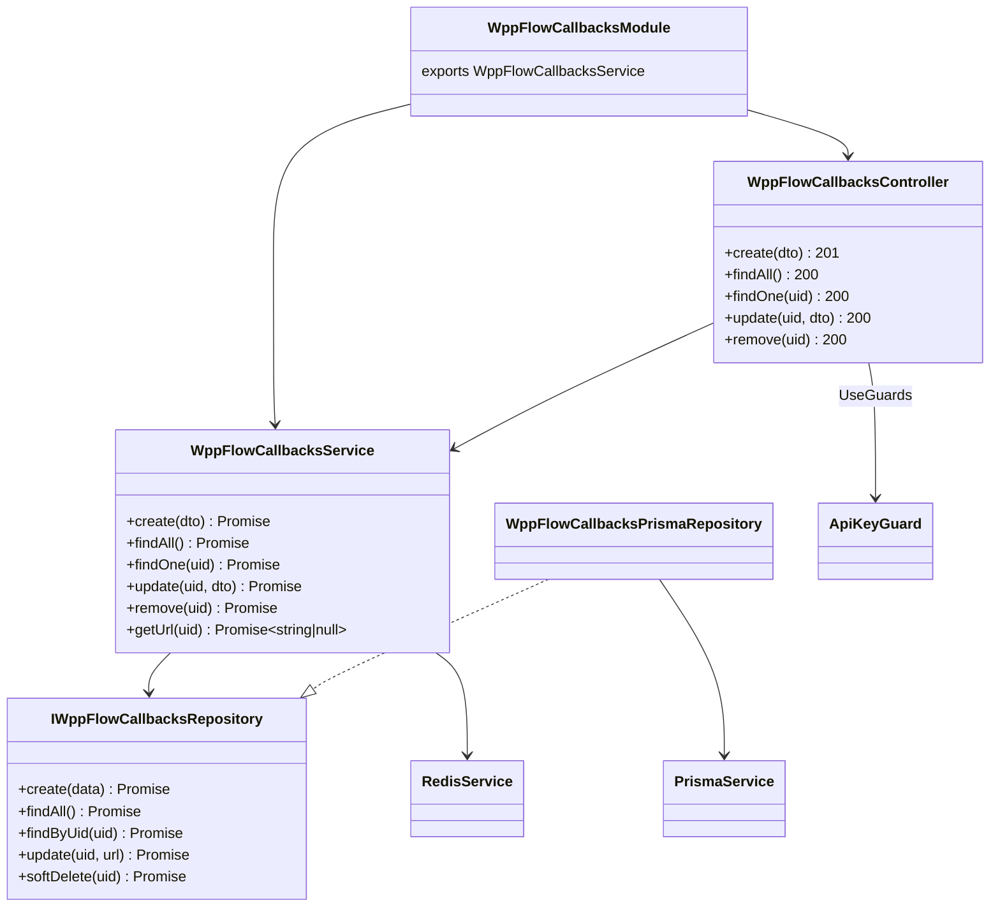
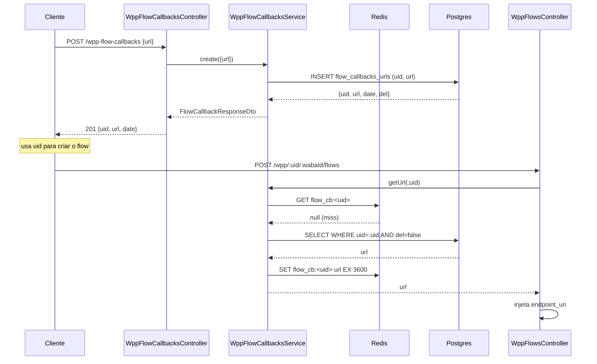
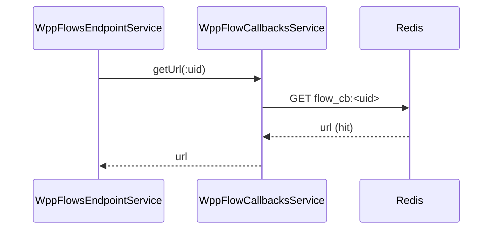
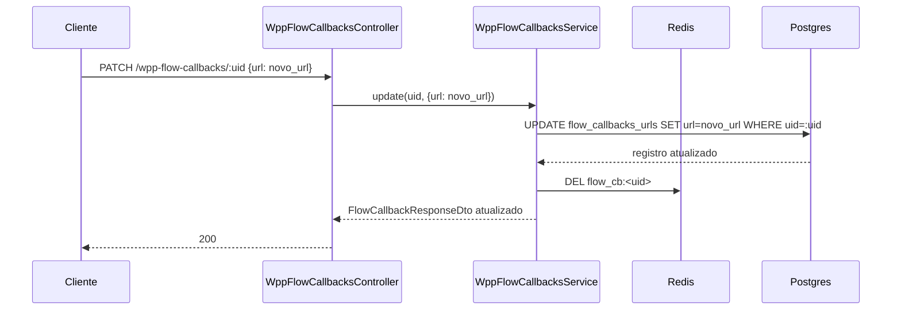
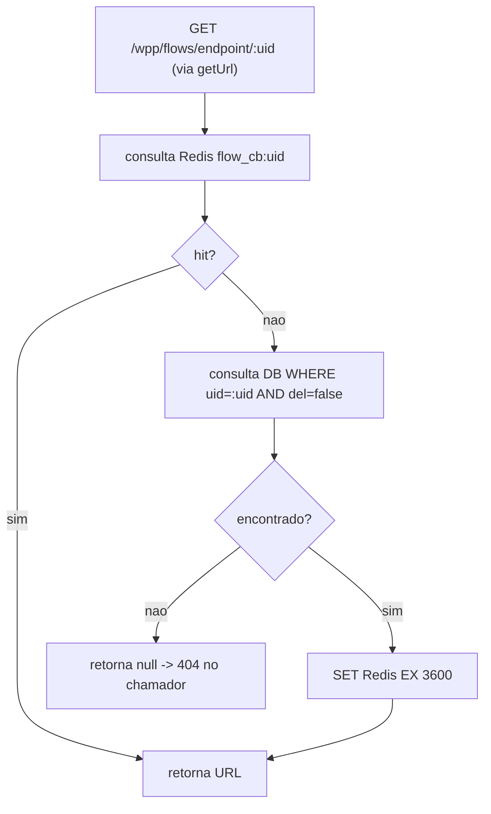

# WhatsApp Meta Adapter — Flow Callbacks

> **Feature 9 do whiz-gateway** (complemento ao batch WhatsApp Meta Adapter). Gerenciamento da tabela `flow_callbacks_urls`: CRUD de registros `uid → url`, cache Redis e serviço de lookup utilizado por `wpp-flows` para resolver UIDs em URLs de callback durante criação de flows dinâmicos e no endpoint criptografado. **Depende de** `gateway-foundation` (Prisma, Redis via `RedisService`) e `api-keys-foundation` (`ApiKeyGuard`).

## 1. Context

Flows dinâmicos do WhatsApp precisam de um `endpoint_uri` que a Meta chama durante a interação do usuário. O gateway expõe `POST /wpp/flows/endpoint/:uid` como esse endpoint; o UID é um identificador opaco que mapeia para a URL do backend do cliente onde o gateway encaminha o payload decriptado.

O cliente cria um registro (obtém um UID) antes de criar o flow. O mesmo UID pode ser reutilizado em múltiplos flows ou em um único flow. O registro é independente de WABA/flow — não há FK para entidades Meta.

O módulo exporta `WppFlowCallbacksService` com o método `getUrl(uid)` — consultado por `wpp-flows` em todas as rotas com `:uid`. O lookup usa Redis como cache (TTL 1 hora) com fallback ao DB.

## 2. Scope

**In:**
- Tabela `flow_callbacks_urls` no schema Prisma.
- `WppFlowCallbacksModule` exportado (importável por `WppFlowsModule`).
- `WppFlowCallbacksController` — CRUD de `flow_callbacks_urls`.
- `WppFlowCallbacksService` — lógica de negócio + `getUrl(uid)` com Redis cache.
- `IWppFlowCallbacksRepository` — interface + `WppFlowCallbacksPrismaRepository`.
- DTOs com `@ApiProperty` PT-BR.
- Redis cache: `flow_cb:<uid>` → url (TTL 1 hora). Invalidado no soft-delete.

**Out:**
- Geração/validação de `X-API-KEY` → `api-keys-foundation`.
- Lógica de decriptografia/re-criptografia → `wpp-flows`.
- Hard-delete de registros expirados (sem cron nesta feature — soft-delete é suficiente).

## 3. Glossary

| Termo | Significado |
|---|---|
| UID | Identificador opaco (`uuid`) gerado pelo gateway na criação. Incluso no `endpoint_uri` configurado na Meta. |
| URL | Endpoint do backend do cliente para receber payloads decriptados do gateway. |
| `getUrl(uid)` | Método do serviço: consulta Redis → se miss, consulta DB → se não encontrado ou `del=true` → retorna `null`. |
| Cache hit | UID encontrado no Redis; DB não consultado. |
| Cache miss | UID ausente no Redis; DB consultado; resultado gravado no Redis com TTL. |

## 4. Functional requirements

- **FR-1**: `POST /wpp-flow-callbacks` recebe `{ url }`, gera `uid` (UUID v4), persiste `{ uid, url, date: now(), del: false }`, retorna `201 FlowCallbackResponseDto`. `url` deve ser URL válida com protocolo http/https.
- **FR-2**: `GET /wpp-flow-callbacks` retorna lista de registros com `del=false`, ordenados por `date` DESC.
- **FR-3**: `GET /wpp-flow-callbacks/:uid` retorna registro por UID. Não encontrado ou `del=true` → `404`.
- **FR-4**: `PATCH /wpp-flow-callbacks/:uid` atualiza `url`. Não encontrado ou `del=true` → `404`. Após atualização, invalida cache Redis `flow_cb:<uid>` (delete).
- **FR-5**: `DELETE /wpp-flow-callbacks/:uid` aplica soft-delete (`del=true`). Não encontrado ou já deletado → `404`. Invalida cache Redis `flow_cb:<uid>` (delete).
- **FR-6**: `WppFlowCallbacksService.getUrl(uid)` — consulta Redis `flow_cb:<uid>`. Hit → retorna URL. Miss → consulta DB; se encontrado e `del=false` → grava no Redis (TTL 3600 s) e retorna URL; se não encontrado ou `del=true` → retorna `null`.
- **FR-7**: Todos os endpoints aplicam `@UseGuards(ApiKeyGuard)`. Sem `X-API-KEY` válida → `401`.

## 5. Non-functional

- **NFR-1** (segurança): URLs de callback não são logadas em nível INFO. `ApiKeyGuard` protege todos os endpoints.
- **NFR-2** (cache): TTL Redis de 3600 s. Invalidação explícita em PATCH e DELETE garante consistência sem lag.
- **NFR-3** (config): sem novas env vars — usa `REDIS_URL` e `DATABASE_URL` já existentes.
- **NFR-4** (Swagger): toda rota documentada em PT-BR; `@ApiTags('Flow Callbacks')`; `@ApiBearerAuth('bearer')`.

## 6. Data model



Adição ao `prisma/schema.prisma`:
```prisma
model FlowCallbackUrl {
  uid  String   @id @default(uuid())
  url  String
  date DateTime @default(now())
  del  Boolean  @default(false)

  @@map("flow_callbacks_urls")
}
```

## 7. API contract

**Auth global**: `ApiKeyGuard` (header `X-API-KEY`).

### POST /wpp-flow-callbacks
- **Request**: `CreateFlowCallbackDto` — `url: string (@IsUrl)`
- **Responses**: `201 FlowCallbackResponseDto` | `400` URL inválida | `401`

### GET /wpp-flow-callbacks
- **Responses**: `200 FlowCallbackResponseDto[]` | `401`

### GET /wpp-flow-callbacks/:uid
- **Responses**: `200 FlowCallbackResponseDto` | `401` | `404`

### PATCH /wpp-flow-callbacks/:uid
- **Request**: `UpdateFlowCallbackDto` — `url: string (@IsUrl)`
- **Comportamento**: atualiza URL + invalida cache Redis
- **Responses**: `200 FlowCallbackResponseDto` | `400` | `401` | `404`

### DELETE /wpp-flow-callbacks/:uid
- **Comportamento**: soft-delete + invalida cache Redis
- **Responses**: `200 FlowCallbackResponseDto` | `401` | `404`

### FlowCallbackResponseDto

| Campo | Tipo | Notas |
|-------|------|-------|
| `uid` | string | UUID do registro |
| `url` | string | URL do backend do cliente |
| `date` | string | ISO 8601 |
| `del` | boolean | Status de soft-delete |

## 8. Module boundaries



## 9. Flows

### Criar callback e criar Flow dinâmico


### Lookup no endpoint criptografado (cache hit)


### Atualizar URL + invalidar cache


## 10. State machines

N/A — ciclo de vida simples: ativo (`del=false`) → soft-deleted (`del=true`). Sem transições complexas.

## 11. Business rules



## 12. Edge cases & errors

- **UID duplicado**: improvável com UUID v4; sem upsert — sempre INSERT com novo UID.
- **URL com protocolo não-http(s)**: `@IsUrl` rejeita → `400`.
- **PATCH/DELETE em UID soft-deleted**: `findByUid` retorna registro com `del=true`; serviço trata como not found → `404`.
- **Cache stale após PATCH**: invalidação explícita via `DEL flow_cb:<uid>` garante que próximo `getUrl` busca do DB.
- **Registro deletado mas ainda em cache**: não ocorre — soft-delete invalida o cache imediatamente (FR-5).
- **Redis indisponível em `getUrl`**: erro de I/O → serviço loga warn e faz fallback direto ao DB. Não propaga erro ao chamador.
- **`getUrl` retorna `null`**: chamador (`WppFlowsController` ou `WppFlowsEndpointService`) retorna `404` ao cliente/Meta.

## 13. Acceptance criteria

- **AC-1** `[backend]`: Given `X-API-KEY` válida, when `POST /wpp-flow-callbacks { url: "https://example.com/hook" }`, then registro criado no DB com `uid` (UUID), `url`, `date`, `del=false`; `201` com `FlowCallbackResponseDto`.
- **AC-2** `[backend]`: Given `X-API-KEY` válida, when `GET /wpp-flow-callbacks`, then retorna apenas registros com `del=false`, ordenados por `date` DESC.
- **AC-3** `[backend]`: Given `X-API-KEY` válida e UID existente, when `GET /wpp-flow-callbacks/:uid`, then retorna registro; UID inexistente ou `del=true` → `404`.
- **AC-4** `[backend]`: Given `X-API-KEY` válida e UID existente, when `PATCH /wpp-flow-callbacks/:uid { url: "https://novo.com/hook" }`, then DB atualizado; cache Redis `flow_cb:<uid>` deletado; `200` com URL nova.
- **AC-5** `[backend]`: Given `X-API-KEY` válida e UID existente, when `DELETE /wpp-flow-callbacks/:uid`, then `del=true` no DB; cache Redis `flow_cb:<uid>` deletado; `200`.
- **AC-6** `[backend]`: Given UID com URL no DB e sem cache Redis, when `WppFlowCallbacksService.getUrl(uid)`, then consulta DB; grava no Redis com TTL 3600 s; retorna URL.
- **AC-7** `[backend]`: Given UID com URL no Redis, when `WppFlowCallbacksService.getUrl(uid)`, then retorna URL sem consultar DB.
- **AC-8** `[backend]`: Given UID com `del=true` no DB e sem cache Redis, when `WppFlowCallbacksService.getUrl(uid)`, then retorna `null`.
- **AC-9** `[backend]`: Given `X-API-KEY` inválida/ausente, when qualquer rota, then `401`.
- **AC-10** `[backend]`: Given URL inválida (sem protocolo), when `POST /wpp-flow-callbacks`, then `400`.

## 14. Open questions

- Hard-delete de registros deletados após N dias? (assume: sem cron nesta feature — soft-delete permanece indefinidamente; endereçar em feature futura se necessário)
- TTL Redis de 1 hora suficiente? (assume: sim — PATCH/DELETE invalidam explicitamente; TTL só serve para limpeza natural de entradas não-deletadas)
- Listar flows que usam um determinado UID? (assume: fora de escopo — flows vivem na Meta; gateway não persiste a associação uid→flowId)
