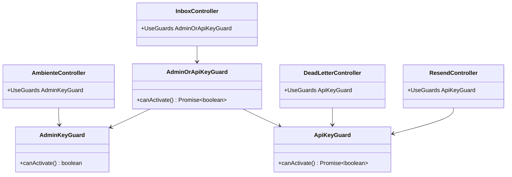
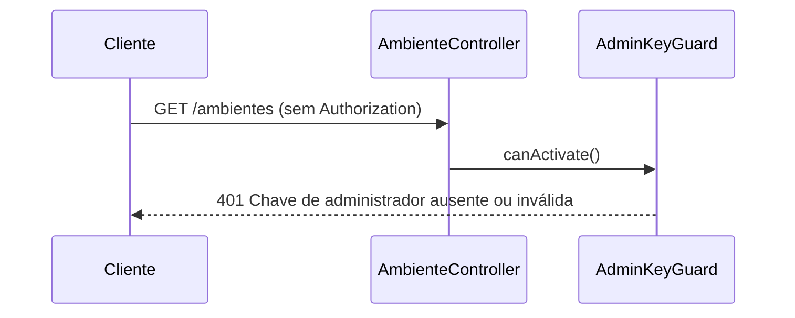
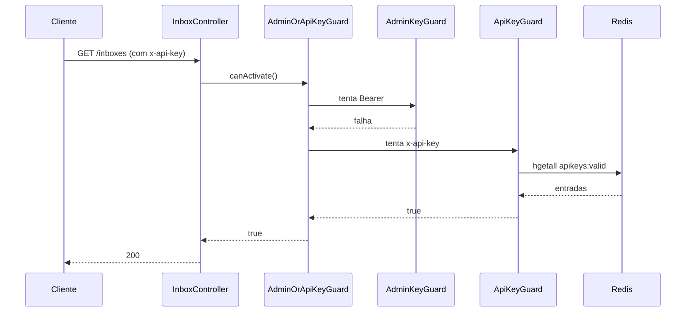
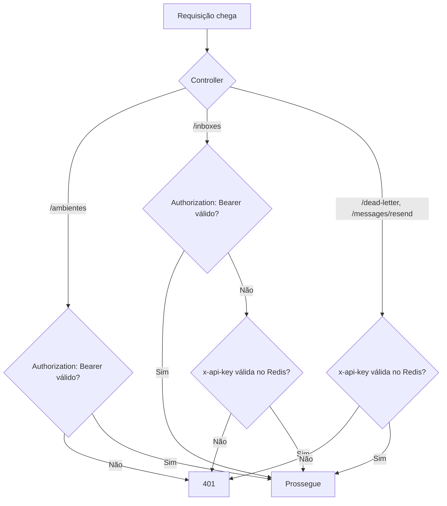

# Proteção de Rotas Administrativas com Guards + Correção Swagger

## 1. Context

Quatro controllers expostos publicamente sem autenticação: `AmbienteController`, `InboxController`, `DeadLetterController` e `ResendController`. Dois deles (`InboxController`, `ResendController`) já possuem `@ApiBearerAuth('bearer')` no Swagger — documentação inconsistente com o runtime.

Problema adicional: todos os controllers protegidos por `ApiKeyGuard` (wpp/*, wpp-flow-callbacks/*, redirecionamentos-webhooks/*, e os quatro a corrigir) usam `@ApiBearerAuth('bearer')` no Swagger, mas o guard valida o header `x-api-key` — não `Authorization: Bearer`. O Swagger exibe apenas um esquema de auth `bearer` para ambos os tipos de guard, tornando impossível distinguir qual header usar por rota.

`InboxController` aceita tanto `AdminKeyGuard` quanto `ApiKeyGuard` — qualquer um dos dois é suficiente para autenticar.

## 2. Scope

**In:**
- Criar `AdminOrApiKeyGuard` em `src/api-keys/guards/admin-or-api-key.guard.ts` — passa se `AdminKeyGuard` OU `ApiKeyGuard` for válido; ambos inválidos → 401
- Adicionar `@UseGuards(AdminKeyGuard)` + `@ApiBearerAuth('bearer')` ao `AmbienteController`
- Adicionar `@UseGuards(AdminOrApiKeyGuard)` + `@ApiBearerAuth('bearer')` + `@ApiSecurity('api-key')` ao `InboxController` (remover `@ApiBearerAuth` existente e substituir)
- Adicionar `@UseGuards(ApiKeyGuard)` + `@ApiSecurity('api-key')` ao `DeadLetterController`
- Adicionar `@UseGuards(ApiKeyGuard)` + `@ApiSecurity('api-key')` ao `ResendController` (remover `@ApiBearerAuth` incorreto)
- Adicionar `.addApiKey({ type: 'apiKey', in: 'header', name: 'x-api-key' }, 'api-key')` a `buildSwaggerConfig()` em `swagger.document.ts`
- Substituir `@ApiBearerAuth('bearer')` por `@ApiSecurity('api-key')` em **todos** os controllers que usam `ApiKeyGuard`: `WppController`, `WppFlowsController`, `WppFlowCallbacksController`, `RedirecionamentosWebhooksController`, e todos os controllers wpp-* com `@UseGuards(ApiKeyGuard)`
- Corrigir `@ApiResponse` 401 ausente nas rotas de `AmbienteController` e `DeadLetterController`

**Out:**
- Alteração de schema Prisma
- Alteração de `HealthController` ou `WebhookController`
- `WppAuthFilter` — não aplicável (guards lançam `UnauthorizedException` diretamente)
- Migração de `AdminKeyGuard` — continua usando `@ApiBearerAuth('bearer')` (correto: valida `Authorization: Bearer`)

## 3. Glossary

| Termo | Definição |
|---|---|
| `AdminKeyGuard` | Guard que valida `Authorization: Bearer <ADMIN_API_KEY>` via `ConfigService`. Uso: operações administrativas internas. |
| `ApiKeyGuard` | Guard que valida header `x-api-key` contra hashes Redis (`apikeys:valid`). Uso: integrações externas e operações de plataforma. |
| `AdminOrApiKeyGuard` | Guard composto: passa se `AdminKeyGuard` OU `ApiKeyGuard` for válido. Lança 401 apenas se ambos falharem. Usado por `InboxController`. |

## 4. Functional requirements

- **FR-1:** Todas as rotas de `AmbienteController` (`GET/POST/PATCH/DELETE /ambientes`) devem exigir `AdminKeyGuard`.
- **FR-2:** Todas as rotas de `InboxController` (`GET/POST/PATCH/DELETE /inboxes`) devem exigir `AdminOrApiKeyGuard` — aceita `Authorization: Bearer <ADMIN_API_KEY>` **ou** `x-api-key` válida no Redis.
- **FR-3:** Todas as rotas de `DeadLetterController` (`GET/DELETE /dead-letter`) devem exigir `ApiKeyGuard`.
- **FR-4:** `POST /messages/resend` deve exigir `ApiKeyGuard`.
- **FR-5:** Requisição sem credencial válida → `401 UnauthorizedException` em todas as rotas protegidas.
- **FR-6:** `buildSwaggerConfig()` em `swagger.document.ts` deve registrar o esquema `api-key` via `.addApiKey({ type: 'apiKey', in: 'header', name: 'x-api-key' }, 'api-key')`.
- **FR-7:** Controllers que usam `ApiKeyGuard` exclusivamente devem usar `@ApiSecurity('api-key')`. Controllers que usam `AdminKeyGuard` exclusivamente mantêm `@ApiBearerAuth('bearer')`. Controllers com `AdminOrApiKeyGuard` usam ambos.
- **FR-8:** O Swagger UI (`/docs`) deve exibir dois esquemas de autenticação distintos: `bearer` (admin) e `api-key` (integrações).

## 5. Non-functional

- **NFR-1:** Nenhuma nova dependência de pacote.
- **NFR-2:** `AdminOrApiKeyGuard` tenta `AdminKeyGuard` primeiro (sem I/O) antes de consultar Redis — falha rápida.
- **NFR-3:** Sem breaking change em `HealthController` (`GET /`) ou `WebhookController`.

## 6. Data model

N/A — sem alteração de schema.

## 7. API contract

### GET /ambientes, GET /ambientes/:id, POST /ambientes, PATCH /ambientes/:id, DELETE /ambientes/:id
- **Auth:** Bearer `ADMIN_API_KEY` (header `Authorization: Bearer <token>`)
- **Respostas novas:** `401` Chave de administrador ausente ou inválida

### GET /inboxes, GET /inboxes/:id, POST /inboxes, PATCH /inboxes/:id, DELETE /inboxes/:id
- **Auth:** `Authorization: Bearer <ADMIN_API_KEY>` **OU** `x-api-key` válida no Redis (qualquer um)
- **Respostas novas:** `401` Nenhuma credencial válida fornecida

### GET /dead-letter, GET /dead-letter/:id, DELETE /dead-letter/:id
- **Auth:** `x-api-key` (ApiKeyGuard, Redis)
- **Respostas novas:** `401` Chave de API ausente ou inválida

### POST /messages/resend
- **Auth:** `x-api-key` (ApiKeyGuard, Redis)
- **Respostas novas:** `401` Chave de API ausente ou inválida

## 8. Module boundaries

## 9. Flows

## 10. State machines

N/A — sem novos campos de status.

## 11. Business rules

## 12. Edge cases & errors

- `AmbienteController` / `AmbienteModule` — `AdminKeyGuard` depende apenas de `ConfigService` (global). Sem nova importação necessária.
- `InboxController` — `AdminOrApiKeyGuard` depende de `ConfigService` (global) e `RedisService`. `InboxModule` deve importar `ApiKeysModule` (que exporta `AdminOrApiKeyGuard`, `ApiKeyGuard` e provê `RedisService` via `RedisModule`).
- `DeadLetterController`, `ResendController` — `ApiKeyGuard` depende de `RedisService`. Os módulos correspondentes devem importar `ApiKeysModule`.
- `AdminOrApiKeyGuard`: AdminKey falha silenciosamente (catch interno) antes de tentar ApiKey. Se Redis offline durante fallback ApiKey → 401 (comportamento herdado de `ApiKeyGuard` — `hgetall` retorna `null`).
- `ResendController` e `InboxController` têm `@ApiBearerAuth('bearer')` existente — substituir conforme §2; não acumular incorretamente.
- Controllers wpp-* existentes com `@UseGuards(ApiKeyGuard)` precisam ter `@ApiBearerAuth('bearer')` substituído por `@ApiSecurity('api-key')` — escopo inclui todos (ver §2).

## 13. Acceptance criteria

- **AC-1** `[backend]`: Dado `GET /ambientes` sem header `Authorization`, quando processado, então retorna `401`.
- **AC-2** `[backend]`: Dado `GET /ambientes` com `Authorization: Bearer <ADMIN_API_KEY>` válido, quando processado, então retorna `200`.
- **AC-3** `[backend]`: Dado `GET /inboxes` sem nenhum header de autenticação, quando processado, então retorna `401`.
- **AC-4** `[backend]`: Dado `GET /inboxes` com `x-api-key` válida no Redis, quando processado, então retorna `200`.
- **AC-5** `[backend]`: Dado `GET /dead-letter` sem header `x-api-key`, quando processado, então retorna `401`.
- **AC-6** `[backend]`: Dado `GET /dead-letter` com `x-api-key` válida no Redis, quando processado, então retorna `200`.
- **AC-7** `[backend]`: Dado `POST /messages/resend` sem header `x-api-key`, quando processado, então retorna `401`.
- **AC-8** `[backend]`: Dado `POST /messages/resend` com `x-api-key` válida no Redis, quando processado, então retorna `200`.
- **AC-9** `[backend]`: Dado o documento OpenAPI gerado pelo `SwaggerModule`, quando inspecionado, então `components.securitySchemes` contém `api-key` com `type: apiKey`, `in: header`, `name: x-api-key`.
- **AC-10** `[backend]`: Dado o documento OpenAPI gerado, quando inspecionado, então nenhuma rota protegida exclusivamente por `ApiKeyGuard` referencia o esquema `bearer`; todas referenciam `api-key`.
- **AC-11** `[backend]`: Dado `GET /inboxes` com `Authorization: Bearer <ADMIN_API_KEY>` válido (sem `x-api-key`), quando processado, então retorna `200`.

## 14. Open questions

N/A
