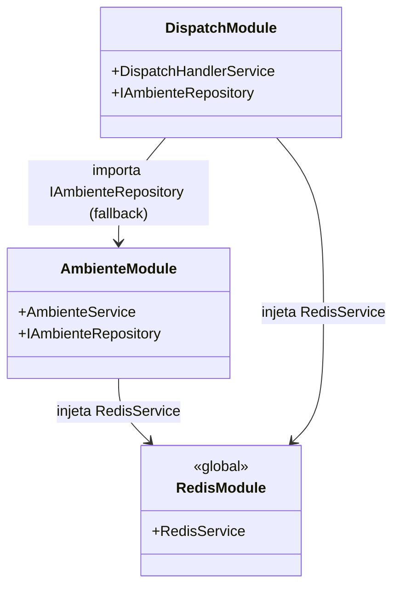
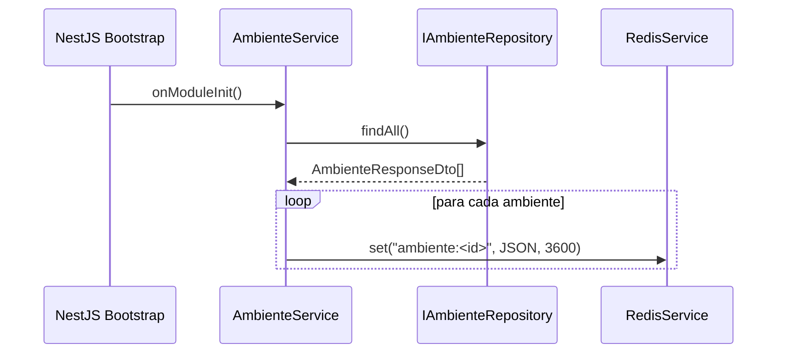
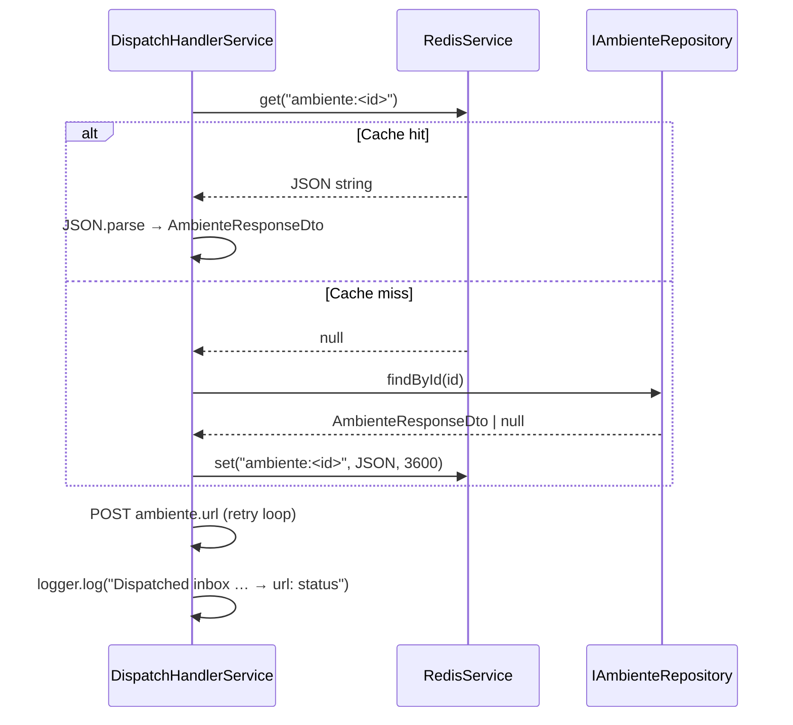
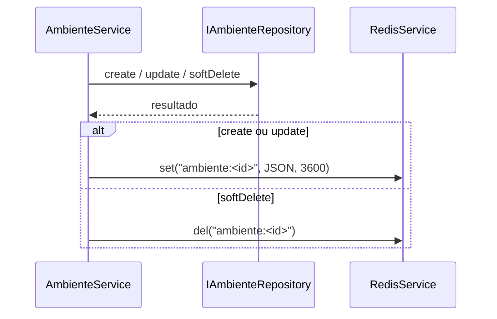
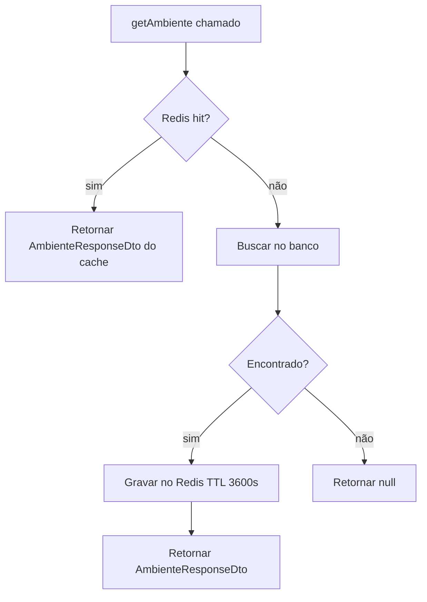

# Cache de Ambientes no Redis

## 1. Contexto

O fluxo de despacho de mensagens (`DispatchHandlerService`) consultava o banco de dados a cada mensagem recebida para resolver o `Ambiente` associado ao inbox. Com alto volume de mensagens para o mesmo ambiente, isso gerava round-trips desnecessários ao Postgres. A infraestrutura Redis já estava disponível via `RedisModule` global — sem custo de adição de dependência.

**Problema:** latência extra por round-trip ao Postgres em cada despacho.
**Usuários afetados:** internos (pipeline de despacho de webhooks).

---

## 2. Escopo

**In:**
- Cache de `Ambiente` no Redis com warm-up no bootstrap
- Sincronização do cache em `create`, `update` e `softDelete`
- Lookup cache-first no `DispatchHandlerService`
- Log de sucesso no dispatch com URL e status HTTP

**Out:**
- Cache de `Inbox` (fora de escopo)
- Invalidação por TTL configurável via env (TTL fixo 3600 s)
- Endpoint de administração de cache

---

## 3. Glossário

| Termo | Definição |
|---|---|
| **Cache warm-up** | Pré-carregamento de todos os ambientes no Redis no momento em que o módulo é inicializado (`OnModuleInit`). |
| **Cache key** | Chave Redis no formato `ambiente:<id>` (ex.: `ambiente:1`). |
| **TTL** | Time-to-live da entrada no Redis. Fixo em 3600 s (1 hora). Renovado a cada escrita. |
| **Cache miss** | Chave ausente no Redis — dispara fallback ao banco e re-hidrata o cache. |
| **Cache hit** | Chave presente no Redis — banco não é consultado. |

---

## 4. Requisitos Funcionais

- **FR-1:** `AmbienteService` implementa `OnModuleInit`; no hook, carrega todos os ambientes não-deletados e grava cada um no Redis (`ambiente:<id>`, TTL 3600 s).
- **FR-2:** `AmbienteService.create` grava a entrada no Redis imediatamente após inserção no banco.
- **FR-3:** `AmbienteService.update` atualiza a entrada no Redis após a atualização no banco.
- **FR-4:** `AmbienteService.softDelete` remove a chave Redis após o soft-delete no banco.
- **FR-5:** `DispatchHandlerService.getAmbiente(id)` verifica Redis antes de acessar o banco; em cache hit, retorna diretamente sem chamar `IAmbienteRepository`.
- **FR-6:** `DispatchHandlerService.getAmbiente(id)` em cache miss: busca no banco, grava no Redis (TTL 3600 s) e retorna.
- **FR-7:** Em despacho bem-sucedido, `DispatchHandlerService` emite log INFO: `Dispatched inbox <inboxId> → <url>: <httpStatus>`.

---

## 5. Requisitos Não-Funcionais

- **NFR-1:** O warm-up (`onModuleInit`) é não-bloqueante para o startup da aplicação — falha no Redis não deve impedir a inicialização.
- **NFR-2:** TTL de 3600 s; mutações (`create`/`update`/`softDelete`) sincronizam o cache imediatamente, independente do TTL.
- **NFR-3:** Nenhuma nova dependência de módulo — `RedisModule` é `@Global()` e já injetável em qualquer serviço.

---

## 6. Modelo de Dados

Sem alteração no schema Prisma. Estrutura Redis:

| Chave | Tipo | Valor | TTL |
|---|---|---|---|
| `ambiente:<id>` | `string` (JSON) | `AmbienteResponseDto` serializado | 3600 s |

```
AmbienteResponseDto {
  id: number
  nome: string
  url: string
  del: boolean
}
```

---

## 7. Contrato de API

N/A — sem novos endpoints HTTP. As mutações ocorrem via endpoints existentes de `cadastro-ambientes`.

---

## 8. Fronteiras de Módulo



---

## 9. Fluxos

### Warm-up no bootstrap



### Dispatch com cache-first



### Sincronização em mutações



---

## 10. Máquinas de Estado

N/A — sem novo campo de status.

---

## 11. Regras de Negócio



---

## 12. Edge Cases e Erros

- **Redis indisponível no warm-up:** `onModuleInit` pode lançar erro silencioso — app inicia mesmo assim; primeiros dispatches farão cache miss e irão ao banco.
- **Ambiente com `del: true` no cache:** o dispatch verifica `ambiente.del` após o fetch; se `del = true`, envia para DLQ com `AMBIENTE_INDISPONIVEL`. `softDelete` deleta a chave, portanto o cenário só ocorre se a chave TTL expirar antes da sincronização.
- **JSON corrompido no Redis:** `JSON.parse` lança `SyntaxError` — não tratado explicitamente; a exceção propaga e o dispatch falha, resultando em dead-letter.
- **Mutação concorrente:** duas instâncias gravando simultaneamente → última escrita vence (sem locking). Aceitável dado que ambientes são raros e mutações lentas.

---

## 13. Critérios de Aceitação

- **AC-1** `[backend]`: Dado que o módulo é inicializado com 3 ambientes no banco, quando `onModuleInit` executar, então `RedisService.set` é chamado 3 vezes com chaves `ambiente:1`, `ambiente:2`, `ambiente:3` e TTL 3600.

- **AC-2** `[backend]`: Dado um `CreateAmbienteDto` válido sem conflito, quando `AmbienteService.create` for chamado, então após a inserção no banco `RedisService.set("ambiente:<id>", …, 3600)` é chamado 1 vez.

- **AC-3** `[backend]`: Dado um ambiente existente, quando `AmbienteService.update` for chamado, então após a atualização no banco `RedisService.set("ambiente:<id>", …, 3600)` é chamado 1 vez com o valor atualizado.

- **AC-4** `[backend]`: Dado um ambiente existente, quando `AmbienteService.softDelete` for chamado, então após o soft-delete no banco `RedisService.del("ambiente:<id>")` é chamado 1 vez.

- **AC-5** `[backend]`: Dado que `RedisService.get("ambiente:<id>")` retorna JSON válido, quando `DispatchHandlerService.getAmbiente(id)` for chamado, então `IAmbienteRepository.findById` não é chamado e o valor desserializado é retornado.

- **AC-6** `[backend]`: Dado que `RedisService.get("ambiente:<id>")` retorna `null`, quando `DispatchHandlerService.getAmbiente(id)` for chamado, então `IAmbienteRepository.findById` é chamado e o resultado é gravado no Redis com TTL 3600.

- **AC-7** `[backend]`: Dado um despacho bem-sucedido (HTTP 2xx), quando `DispatchHandlerService.handle` completar, então o logger emite uma mensagem INFO contendo `Dispatched inbox <inboxId> → <url>: <status>`.

---

## 14. Questões em Aberto

N/A — implementação já concluída como hotfix em 2026-06-08.

---

## §17 Changelog

| Data | Tipo | Descrição |
|---|---|---|
| 2026-06-08 | hotfix | Implementação inicial: warm-up, sincronização de mutações, cache-first no dispatch, log de sucesso. |
