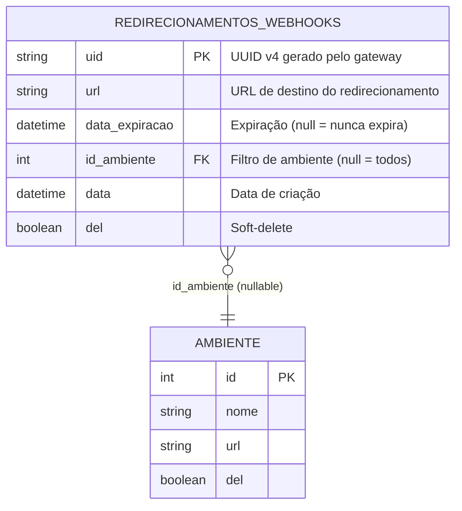
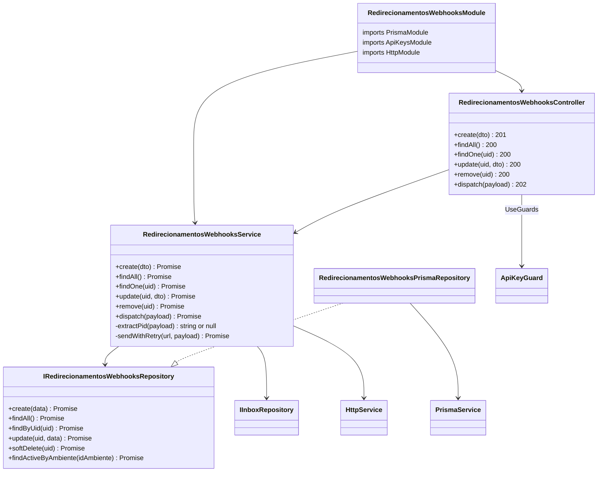
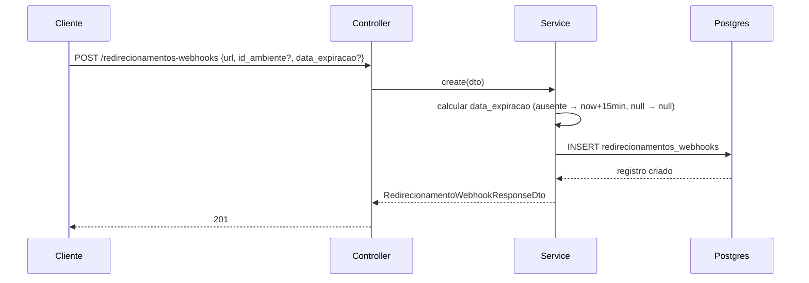
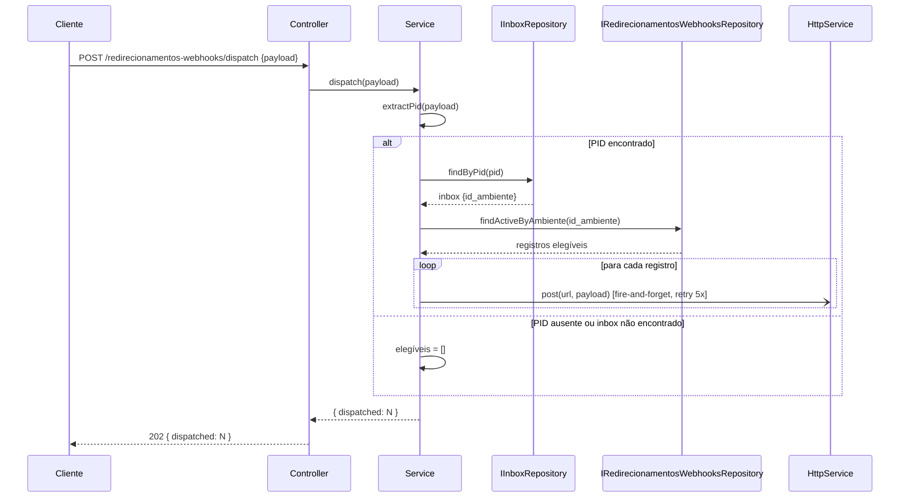
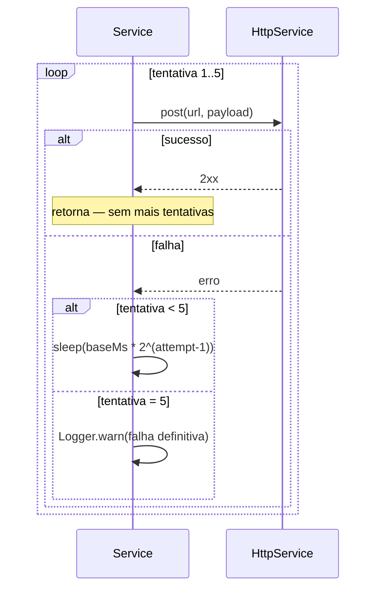
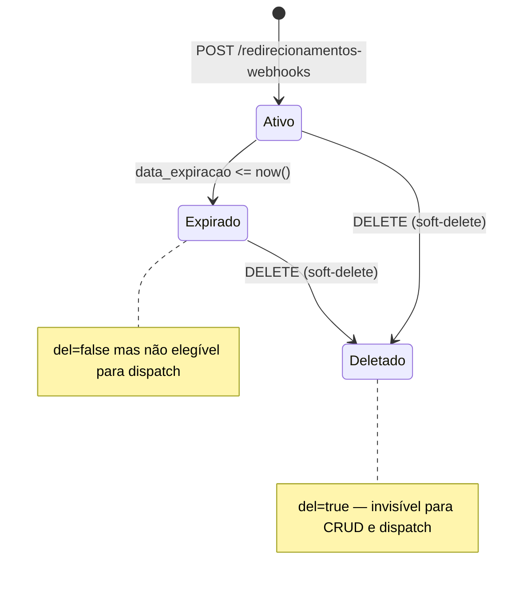
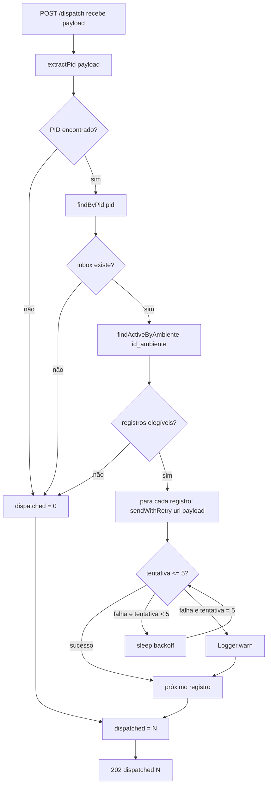

# Redirecionamentos de Webhooks

> **Feature 10 do whiz-gateway.** Tabela `redirecionamentos_webhooks`: registros de redirecionamento de webhooks para URLs externas com TTL configurável. CRUD protegido por `ApiKeyGuard`. Rota de dispatch recebe payload bruto do webhook, resolve o `id_ambiente` via PID → inbox (igual ao fluxo de ingestão existente) e repassa o payload a todas as URLs ativas elegíveis em modo fire-and-forget com retry exponencial.

## 1. Context

Clientes precisam que webhooks recebidos pelo gateway sejam reencaminhados para URLs adicionais (além do fluxo normal `Dispatch → ambiente.url`) de forma temporária — por exemplo, para testar integrações, rodar ambientes de staging ou fazer fan-out para sistemas de auditoria.

A solução é uma tabela de redirecionamentos com expiração automática (TTL 15 min por padrão, configurável, nulo = nunca expira). Cada registro aponta para uma URL e opcionalmente filtra por ambiente. A rota `POST /redirecionamentos-webhooks/dispatch` recebe o payload bruto, resolve o ambiente via PID → inbox (mesmo mecanismo de `WebhookService.extractPid`), e dispara para todos os redirecionamentos ativos elegíveis em fire-and-forget.

## 2. Scope

**In:**
- Tabela `redirecionamentos_webhooks` no schema Prisma.
- `RedirecionamentosWebhooksModule` com CRUD completo e rota de dispatch.
- `RedirecionamentosWebhooksController` — 5 rotas CRUD + 1 dispatch.
- `RedirecionamentosWebhooksService` — lógica CRUD + dispatch fire-and-forget.
- `IRedirecionamentosWebhooksRepository` + `RedirecionamentosWebhooksPrismaRepository`.
- DTOs com `@ApiProperty` PT-BR.
- Retry 5× com backoff exponencial por URL no dispatch.

**Out:**
- Alteração no fluxo principal de ingestão (`WebhookService`, `DispatchHandlerService`).
- DLQ / persistência de falhas de dispatch (fire-and-forget — falha é apenas logada).
- Hard-delete automático de registros expirados (sem cron — TTL é apenas lógico via `data_expiracao`).
- Cache Redis (sem necessidade — registros de curta duração, leitura só no dispatch).

## 3. Glossary

| Termo | Significado |
|---|---|
| **Redirecionamento** | Registro que mapeia uma URL externa para receber cópias de webhooks. Tem TTL. |
| **data_expiracao** | DateTime após o qual o redirecionamento não é mais elegível. `null` = nunca expira. |
| **Ativo** | Redirecionamento com `del=false` e (`data_expiracao IS NULL` OR `data_expiracao > now()`). |
| **Dispatch** | Ação de repassar o payload bruto do webhook a todos os redirecionamentos ativos elegíveis. |
| **Fire-and-forget** | Dispatch inicia o envio para cada URL e retorna imediatamente; erros são logados, não propagados. |
| **Elegível** | Redirecionamento ativo cujo `id_ambiente` bate com o do webhook (`id_ambiente = X OR id_ambiente IS NULL`). |

## 4. Functional requirements

- **FR-1**: `POST /redirecionamentos-webhooks` aceita `{ url, id_ambiente?, data_expiracao? }`. Gera `uid` (UUID v4). Persiste com `data = now()`, `del = false`. Se `data_expiracao` ausente → `now() + 15 min`. Se `data_expiracao = null` → nunca expira. Retorna `201 RedirecionamentoWebhookResponseDto`.
- **FR-2**: `GET /redirecionamentos-webhooks` retorna todos os registros com `del=false`, ordenados por `data` DESC.
- **FR-3**: `GET /redirecionamentos-webhooks/:uid` retorna registro por UID. Não encontrado ou `del=true` → `404`.
- **FR-4**: `PATCH /redirecionamentos-webhooks/:uid` atualiza `url`, `id_ambiente`, `data_expiracao` (todos opcionais, mesmas regras de valor do FR-1). Não encontrado ou `del=true` → `404`.
- **FR-5**: `DELETE /redirecionamentos-webhooks/:uid` aplica soft-delete (`del=true`). Não encontrado ou `del=true` → `404`.
- **FR-6**: `POST /redirecionamentos-webhooks/dispatch` recebe payload bruto do webhook. Extrai PID via `payload.entry[0].changes[0].value.metadata.phone_number_id`. Encontra inbox por PID → obtém `id_ambiente`. Consulta registros ativos elegíveis (`del=false`, `data_expiracao IS NULL OR data_expiracao > now()`, `id_ambiente = inbox.id_ambiente OR id_ambiente IS NULL`). Para cada registro: dispara `HttpService.post(url, payload)` em fire-and-forget com até 5 tentativas e backoff exponencial (`baseMs * 2^(attempt-1)`). Falha definitiva → `Logger.warn`. Retorna `202 { dispatched: N }` imediatamente.
- **FR-7**: Todos os endpoints (CRUD + dispatch) aplicam `@UseGuards(ApiKeyGuard)`. Sem `X-API-KEY` válida → `401`.
- **FR-8**: Se PID não encontrado no payload do dispatch → retorna `202 { dispatched: 0 }` (sem erro — payload não-Meta simplesmente não encontra inbox, nenhum redirecionamento elegível).

## 5. Non-functional

- **NFR-1** (segurança): `ApiKeyGuard` em todos os endpoints. URLs de redirecionamento não logadas em INFO.
- **NFR-2** (retry): máximo 5 tentativas por URL. Backoff: `1000ms * 2^(attempt-1)` → 1 s, 2 s, 4 s, 8 s, 16 s. Configurável via `DISPATCH_BACKOFF_BASE_MS` (já existe no env).
- **NFR-3** (fire-and-forget): dispatch retorna `202` antes de aguardar conclusão dos envios. Falha em uma URL não afeta outras.
- **NFR-4** (config): nenhuma nova env var — usa `DATABASE_URL`, `DISPATCH_BACKOFF_BASE_MS` existentes.
- **NFR-5** (Swagger): toda rota documentada em PT-BR; `@ApiTags('Redirecionamentos Webhooks')`; `@ApiBearerAuth('bearer')`.

## 6. Data model



Adição ao `prisma/schema.prisma`:
```prisma
model redirecionamentos_webhooks {
  uid            String    @id @default(uuid())
  url            String
  data_expiracao DateTime?
  id_ambiente    Int?
  data           DateTime  @default(now())
  del            Boolean   @default(false)

  ambiente ambiente? @relation(fields: [id_ambiente], references: [id])
}
```

> `data_expiracao` é `DateTime?` no schema (nullable). Default `now() + 15 min` calculado no service no momento do `create`.

## 7. API contract

**Auth global**: `ApiKeyGuard` (header `X-API-KEY`).

### POST /redirecionamentos-webhooks
- **Request**: `CreateRedirecionamentoWebhookDto` — `url: string (@IsUrl)`, `id_ambiente?: number (@IsInt @IsOptional)`, `data_expiracao?: Date | null (@IsDateString @IsOptional @Allow(null))`
- **Respostas**: `201 RedirecionamentoWebhookResponseDto` | `400` | `401`

### GET /redirecionamentos-webhooks
- **Respostas**: `200 RedirecionamentoWebhookResponseDto[]` | `401`

### GET /redirecionamentos-webhooks/:uid
- **Respostas**: `200 RedirecionamentoWebhookResponseDto` | `401` | `404`

### PATCH /redirecionamentos-webhooks/:uid
- **Request**: `UpdateRedirecionamentoWebhookDto` — `url?`, `id_ambiente?`, `data_expiracao?` (mesmas validações, todos opcionais)
- **Respostas**: `200 RedirecionamentoWebhookResponseDto` | `400` | `401` | `404`

### DELETE /redirecionamentos-webhooks/:uid
- **Respostas**: `200 RedirecionamentoWebhookResponseDto` | `401` | `404`

### POST /redirecionamentos-webhooks/dispatch
- **Request**: body = payload bruto do webhook (objeto JSON qualquer; `Record<string, unknown>`)
- **Respostas**: `202 DispatchResultDto { dispatched: number }` | `401`
- **Nota**: nunca retorna 4xx por PID ausente — retorna `202 { dispatched: 0 }`.

### RedirecionamentoWebhookResponseDto

| Campo | Tipo | Notas |
|---|---|---|
| `uid` | string | UUID do registro |
| `url` | string | URL de destino |
| `data_expiracao` | string \| null | ISO 8601 ou null |
| `id_ambiente` | number \| null | ID do ambiente filtrado |
| `data` | string | ISO 8601 — criação |
| `del` | boolean | Soft-delete |

### DispatchResultDto

| Campo | Tipo | Notas |
|---|---|---|
| `dispatched` | number | Nº de URLs para as quais o dispatch foi iniciado |

## 8. Module boundaries



## 9. Flows

### Criar redirecionamento


### Dispatch de webhook


### Retry com backoff exponencial


## 10. State machines



## 11. Business rules



**Regra de elegibilidade:**
```
del = false
AND (data_expiracao IS NULL OR data_expiracao > NOW())
AND (id_ambiente = inbox.id_ambiente OR id_ambiente IS NULL)
```

**data_expiracao no create:**
- Campo ausente no body → service calcula `now() + 15 min`
- Campo `null` explícito → `null` no DB (nunca expira)
- Valor DateTime → usado diretamente

## 12. Edge cases & errors

- **PID ausente no payload**: `extractPid` retorna `null` → `dispatched = 0` (sem erro).
- **Inbox não encontrado para PID**: `findByPid` retorna `null` → `dispatched = 0`.
- **Nenhum redirecionamento ativo para o ambiente**: `findActiveByAmbiente` retorna `[]` → `dispatched = 0`.
- **URL inválida no create**: `@IsUrl` rejeita → `400`.
- **PATCH/DELETE em UID soft-deleted**: service trata como not found → `404`.
- **data_expiracao já vencida no create**: aceito (registro criado mas imediatamente inelegível para dispatch).
- **Falha de HTTP em uma URL do dispatch**: não afeta as demais URLs do mesmo dispatch.
- **id_ambiente inválido (ambiente deletado)**: `findActiveByAmbiente` usa FK mas não valida `ambiente.del`; elegibilidade baseia-se apenas no `id_ambiente` do registro de redirecionamento.
- **Dispatch com body vazio / não-Meta**: PID ausente → `dispatched = 0` → `202`.

## 13. Acceptance criteria

- **AC-1** `[backend]`: Given `X-API-KEY` válida, when `POST /redirecionamentos-webhooks { url: "https://example.com/hook" }` sem `data_expiracao`, then registro criado com `uid`, `del=false`, `data_expiracao ≈ now()+15min`; `201 RedirecionamentoWebhookResponseDto`.
- **AC-2** `[backend]`: Given `X-API-KEY` válida, when `POST /redirecionamentos-webhooks { url: "...", data_expiracao: null }`, then `data_expiracao = null` no DB (nunca expira).
- **AC-3** `[backend]`: Given `X-API-KEY` válida, when `POST /redirecionamentos-webhooks { url: "...", data_expiracao: "2099-01-01T00:00:00Z" }`, then `data_expiracao = 2099-01-01` no DB.
- **AC-4** `[backend]`: Given `X-API-KEY` válida, when `GET /redirecionamentos-webhooks`, then retorna apenas registros com `del=false`, ordenados por `data` DESC.
- **AC-5** `[backend]`: Given `X-API-KEY` válida e UID existente, when `GET /redirecionamentos-webhooks/:uid`, then retorna registro; UID inexistente ou `del=true` → `404`.
- **AC-6** `[backend]`: Given `X-API-KEY` válida e UID existente, when `PATCH /redirecionamentos-webhooks/:uid { url: "https://novo.com" }`, then URL atualizada no DB; `200`.
- **AC-7** `[backend]`: Given `X-API-KEY` válida e UID existente, when `DELETE /redirecionamentos-webhooks/:uid`, then `del=true` no DB; `200`.
- **AC-8** `[backend]`: Given `X-API-KEY` válida e 2 redirecionamentos ativos para o mesmo ambiente, when `POST /redirecionamentos-webhooks/dispatch` com payload Meta válido (inbox.id_ambiente bate), then `202 { dispatched: 2 }`; HTTP POST disparado para cada URL.
- **AC-9** `[backend]`: Given redirecionamento com `id_ambiente = null` e dispatch com qualquer `id_ambiente`, then redirecionamento é incluído (elegível para todos os ambientes).
- **AC-10** `[backend]`: Given redirecionamento com `data_expiracao` no passado, when dispatch, then redirecionamento NÃO é incluído.
- **AC-11** `[backend]`: Given payload sem PID válido, when `POST /redirecionamentos-webhooks/dispatch`, then `202 { dispatched: 0 }`.
- **AC-12** `[backend]`: Given `X-API-KEY` inválida/ausente, when qualquer rota, then `401`.
- **AC-13** `[backend]`: Given URL de destino retornando erro nas 5 tentativas, when dispatch, then `Logger.warn` emitido; outras URLs do mesmo dispatch não são afetadas; `202` já retornado ao caller.

## 14. Open questions

N/A — todos os pontos resolvidos durante o grilling.
