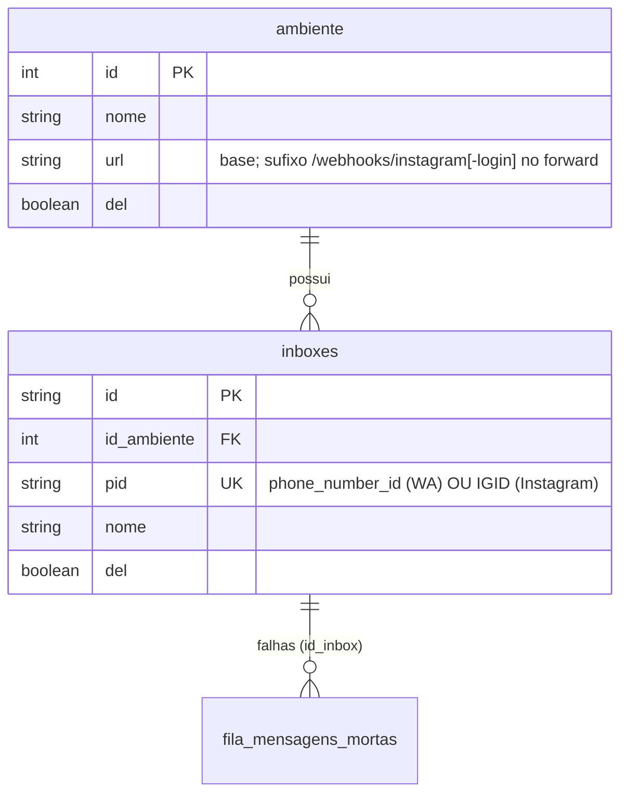
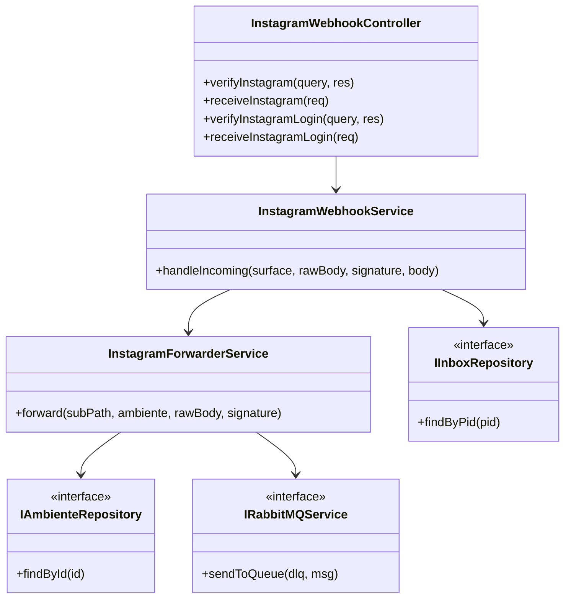
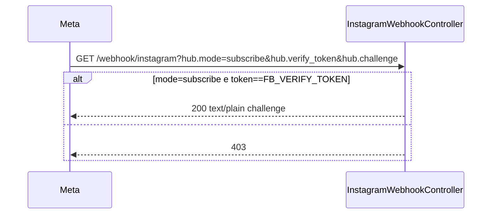
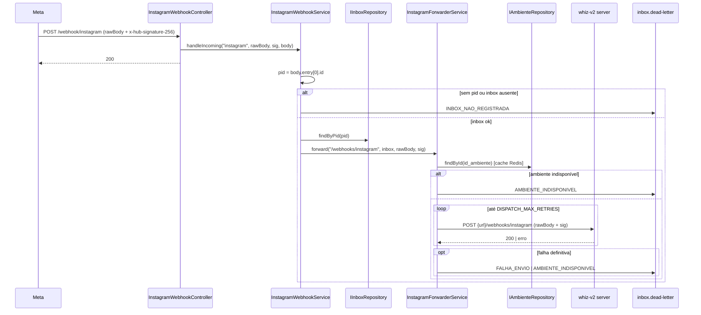
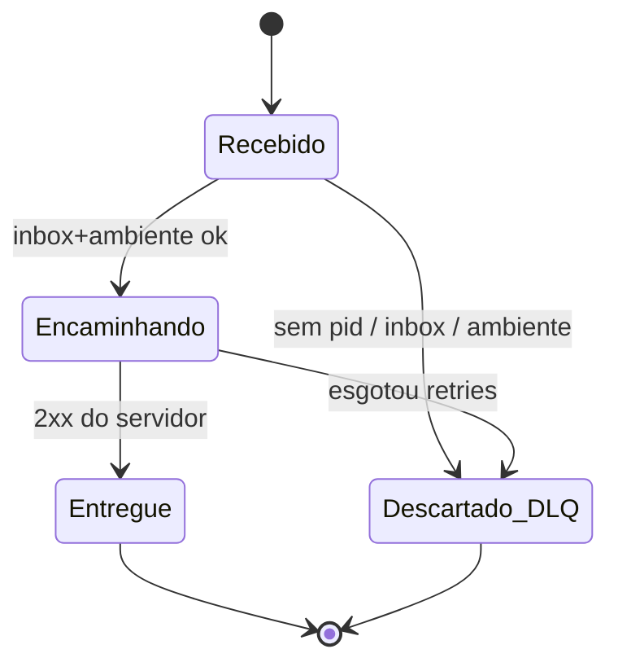
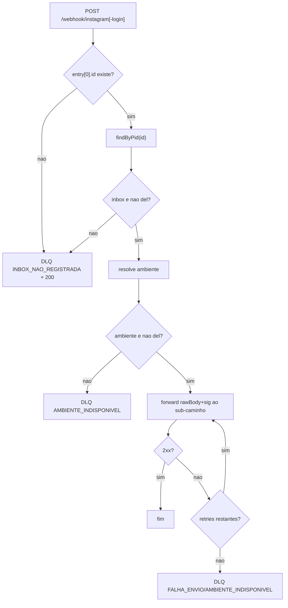

# Instagram Webhook Redirect

Feature que habilita o gateway a receber webhooks de Instagram da Meta e
redirecioná-los, íntegros, para o servidor whiz-v2 do ambiente correto.
Cobre os dois tipos de inbox de Instagram: `INSTAGRAM` (Facebook Login) e
`INSTAGRAM_LOGIN` (Instagram Login / OAuth direto).

## 1. Context

Hoje o gateway só ingere webhooks de WhatsApp (feature `webhook-ingestao`):
rota única `GET/POST /webhook`, handshake por `META_VERIFY_TOKEN`, assinatura
HMAC por `META_APP_SECRET`, extração de PID via
`entry[].changes[].value.metadata.phone_number_id` e despacho in-process para
`IDispatchHandler`, que faz `POST` na `ambiente.url` base.

O servidor whiz-v2 já expõe endpoints de Instagram próprios
(`/webhooks/instagram` e `/webhooks/instagram-login`), que **re-verificam** a
assinatura `x-hub-signature-256` sobre o corpo cru com `FB_APP_SECRET` /
`IG_APP_SECRET` e resolvem o inbox pelo `entry[].id` (IGID). Para que a Meta
possa apontar o callback dos apps de Instagram para o gateway (multi-tenant) e
o payload chegue íntegro ao servidor certo, o gateway precisa de rotas de
ingestão de Instagram que façam **passthrough** do corpo cru para o
`ambiente.url` correto, no sub-caminho correto.

**Usuários**: apps Meta de Instagram configurados para entregar webhooks ao
gateway; operadores que registram inboxes de Instagram no gateway.

## 2. Scope

**In**
- Duas rotas de ingestão dedicadas: `GET/POST /webhook/instagram` e
  `GET/POST /webhook/instagram-login`.
- Handshake `GET` (echo do `hub.challenge`) validado por `FB_VERIFY_TOKEN`
  (instagram) e `IG_VERIFY_TOKEN` (instagram-login).
- `POST`: extração do PID por `entry[0].id`, lookup de inbox por `pid`,
  forward do **corpo cru** + header `x-hub-signature-256` original para
  `{ambiente.url}/webhooks/instagram` ou `{ambiente.url}/webhooks/instagram-login`.
- Retry exponencial no forward (reusa `DISPATCH_MAX_RETRIES` /
  `DISPATCH_BACKOFF_BASE_MS`) e DLQ `inbox.dead-letter` em falha definitiva.
- Reuso do `POST /inbox` existente para cadastrar inboxes de Instagram
  (`pid` = IGID).

**Out**
- Verificação de HMAC no gateway (decisão passthrough-only — gateway **não**
  guarda `FB_APP_SECRET`/`IG_APP_SECRET`). O servidor é o único verificador.
- Coluna de tipo de canal em `inboxes` — o sub-caminho de destino é
  determinado pela rota de ingestão, não pelo registro.
- Alterações de schema Prisma (nenhuma necessária).
- Integração com `redirecionamentos_webhooks` (aquele serviço é baseado em PID
  de WhatsApp; fora do escopo v1).
- Reenvio (`reenvio-mensagens`) de webhooks de Instagram mortos (ver §14).
- Assinatura de campos na Meta (`/me/subscribed_apps`) — feito no servidor
  whiz-v2, não no gateway.
- Configuração do Callback URL / Verify Token no painel da Meta (ops).
- Eventos de Messenger/Facebook (`object: "page"`) — só Instagram.

## 3. Glossary

Sincronizar com `src/instagram-webhook/context.md`.

- **IGID**: id da conta profissional de Instagram; chega em `entry[].id` do
  payload. Para `INSTAGRAM` = `igBusinessAccountId`; para `INSTAGRAM_LOGIN` =
  `igUserId`. É o `pid` do inbox no gateway. _Avoid_: ig id, account id.
- **PID (estendido)**: identificador externo único do inbox. Já era o
  `phone_number_id` no WhatsApp; agora também o IGID no Instagram. A coluna
  `inboxes.pid` é agnóstica de provedor. _Avoid_: phone_number_id (é só um caso).
- **Passthrough cru**: encaminhar os **bytes** exatos que a Meta assinou, sem
  reserializar, preservando `x-hub-signature-256`, para que o HMAC do servidor
  valide. _Avoid_: proxy, reencaminhar JSON parseado.
- **Sub-caminho de destino**: sufixo anexado à `ambiente.url` no forward —
  `/webhooks/instagram` ou `/webhooks/instagram-login` — fixado pela rota de
  ingestão. _Avoid_: rota do servidor.

## 4. Functional requirements

- **FR-1**: `GET /webhook/instagram` com `hub.mode=subscribe` e
  `hub.verify_token === FB_VERIFY_TOKEN` retorna `200` `text/plain` com o valor
  de `hub.challenge`. Token inválido ou `mode !== subscribe` → `403`.
- **FR-2**: `GET /webhook/instagram-login` idem FR-1, validando contra
  `IG_VERIFY_TOKEN`.
- **FR-3**: `POST /webhook/instagram` extrai `pid = body.entry[0].id`. Sem
  `entry[0].id` (string não-vazia) → publica em `inbox.dead-letter` com
  `INBOX_NAO_REGISTRADA` e responde `200` (evita retry da Meta).
- **FR-4**: `POST /webhook/instagram` resolve inbox por `findByPid(pid)`. Inbox
  ausente ou `del=true` → DLQ `INBOX_NAO_REGISTRADA`, responde `200`.
- **FR-5**: Inbox encontrado → resolve `ambiente` por `inbox.id_ambiente`
  (cache Redis). Ambiente ausente/`del` → DLQ `AMBIENTE_INDISPONIVEL`,
  responde `200`.
- **FR-6**: Forward faz `POST {ambiente.url}/webhooks/instagram` com corpo =
  `req.rawBody` (Buffer, bytes íntegros), headers `Content-Type: application/json`
  e `x-hub-signature-256` = valor original recebido da Meta.
- **FR-7**: `POST /webhook/instagram-login` = FR-3..FR-6 com sub-caminho
  `/webhooks/instagram-login`.
- **FR-8**: Forward com falha reprova até `DISPATCH_MAX_RETRIES` com backoff
  exponencial (`DISPATCH_BACKOFF_BASE_MS`). Falha definitiva → DLQ com
  `FALHA_ENVIO` (resposta HTTP do servidor) ou `AMBIENTE_INDISPONIVEL`
  (erro de transporte).
- **FR-9**: O `POST` de ingestão responde `200` assim que o payload é aceito
  para forward (fire-and-forget), independente do resultado do forward — igual
  ao fluxo WhatsApp.
- **FR-10**: A rota WhatsApp `/webhook` e seu fluxo permanecem inalterados.

## 5. Non-functional

- **NFR-1** (segurança): gateway **não** armazena `FB_APP_SECRET`/`IG_APP_SECRET`.
  A autenticidade do payload é garantida pelo servidor whiz-v2 na re-verificação.
- **NFR-2** (integridade): o corpo encaminhado deve ser byte-idêntico ao
  recebido; nenhuma reserialização de JSON no caminho de forward.
- **NFR-3** (config): `FB_VERIFY_TOKEN` e `IG_VERIFY_TOKEN` obrigatórios em
  `production`, opcionais fora (padrão do `configValidationSchema`).
- **NFR-4** (resiliência): mesma política de retry/DLQ do despacho WhatsApp.
- **NFR-5** (observabilidade): logar (nível warn) PID ausente, inbox ausente,
  ambiente indisponível e cada tentativa de forward falha, sem vazar corpo cru.
- **NFR-6** (idempotência de resposta): sempre `200` no `POST` de ingestão para
  não disparar a fila de retry da Meta por falhas internas do gateway.

## 6. Data model

Nenhuma alteração de schema. Reusa `inboxes`, `ambiente` e
`fila_mensagens_mortas` existentes. IGID grava em `inboxes.pid`.

Campos relevantes (sem mudança):

| Modelo | Campo | Uso nesta feature |
|---|---|---|
| inboxes | pid | = `entry[0].id` (IGID) para lookup |
| inboxes | id_ambiente | resolve ambiente de destino |
| ambiente | url | base do forward + sub-caminho |
| fila_mensagens_mortas | message, id_inbox, status | DLQ em falha |

## 7. API contract

### GET /webhook/instagram
- **Auth**: nenhuma (handshake Meta).
- **Query**: `hub.mode`, `hub.verify_token`, `hub.challenge`.
- **Responses**: `200` `text/plain` (challenge) | `403` (token inválido).

### POST /webhook/instagram
- **Auth**: nenhuma no gateway (passthrough; servidor verifica HMAC).
- **Headers**: `x-hub-signature-256` (repassado ao destino).
- **Request**: corpo cru Meta Instagram — `{ object: "instagram", entry: [{ id, ... }] }`.
- **Forward**: `POST {ambiente.url}/webhooks/instagram` (rawBody + sig).
- **Responses**: `200` (aceito para forward) | `403` (só no GET).

### GET /webhook/instagram-login
Idem `GET /webhook/instagram`, validando `IG_VERIFY_TOKEN`.

### POST /webhook/instagram-login
Idem `POST /webhook/instagram`; forward para
`{ambiente.url}/webhooks/instagram-login`.

### QUEUE inbox.dead-letter (DLQ estática existente)
- **Direction**: produce (em falha).
- **Payload**: `{ message, id_inbox, status: StatusFalhaMensagem }`.
- **Reuso**: mesma DLQ do fluxo WhatsApp; consumida por `DeadLetterConsumerService`.

## 8. Module boundaries

Novo módulo `src/instagram-webhook/`. Reusa repositórios de inbox/ambiente,
config e DLQ. Não altera `webhook`/`dispatch` do WhatsApp.

DI por token/interface (nunca concretos): `INBOX_REPOSITORY`,
`AMBIENTE_REPOSITORY`, `RABBITMQ_SERVICE`, `RedisService`, `ConfigService`,
`HttpService`.

## 9. Flows

### Handshake (GET)

### Ingestão + forward (POST)

## 10. State machines

Sem novo campo de status persistido. Reusa `StatusFalhaMensagem`
(`INBOX_NAO_REGISTRADA`, `FALHA_ENVIO`, `AMBIENTE_INDISPONIVEL`) na DLQ.

## 11. Business rules

Regra de roteamento em lote: quando `entry[]` tem múltiplos itens, roteia pelo
`entry[0].id` e encaminha o corpo cru inteiro a um único ambiente (integridade
HMAC). Itens de outros ambientes são ignorados pelo servidor destino.

## 12. Edge cases & errors

- `entry` vazio/ausente ou `entry[0].id` não-string → DLQ `INBOX_NAO_REGISTRADA`,
  `200`.
- Corpo não-JSON: ainda assim `req.rawBody` é encaminhado se `entry[0].id` for
  extraível; se o parse falhar → DLQ `INBOX_NAO_REGISTRADA`.
- Entrega em lote com entries de ambientes distintos → roteada pelo primeiro
  entry; demais ignorados pelo servidor (limitação documentada).
- `x-hub-signature-256` ausente na entrada: gateway não valida (passthrough);
  encaminha assim mesmo; servidor rejeitará com `401` (não é falha do gateway).
- Reserialização acidental do corpo quebraria o HMAC do servidor → proibida
  (NFR-2); sempre usar `req.rawBody`.
- `ambiente.url` com barra final → normalizar antes de concatenar o sub-caminho.
- Timeout/5xx do servidor → retry; esgotado → DLQ.

## 13. Acceptance criteria

- **AC-1** `[backend]`: Given `hub.mode=subscribe` e `hub.verify_token`=FB_VERIFY_TOKEN,
  when `GET /webhook/instagram`, then `200` `text/plain` com o `hub.challenge`. (FR-1)
- **AC-2** `[backend]`: Given token inválido, when `GET /webhook/instagram`,
  then `403`. (FR-1)
- **AC-3** `[backend]`: Given `hub.verify_token`=IG_VERIFY_TOKEN, when
  `GET /webhook/instagram-login`, then `200` com challenge; token inválido → `403`. (FR-2)
- **AC-4** `[backend]`: Given payload sem `entry[0].id`, when `POST /webhook/instagram`,
  then `200` e mensagem publicada na DLQ com `INBOX_NAO_REGISTRADA`. (FR-3)
- **AC-5** `[backend]`: Given `entry[0].id` sem inbox correspondente, when
  `POST /webhook/instagram`, then DLQ `INBOX_NAO_REGISTRADA` e `200`. (FR-4)
- **AC-6** `[backend]`: Given inbox válido cujo ambiente está `del`, when
  `POST /webhook/instagram`, then DLQ `AMBIENTE_INDISPONIVEL`. (FR-5)
- **AC-7** `[backend]`: Given inbox+ambiente válidos, when `POST /webhook/instagram`
  com corpo cru e `x-hub-signature-256`, then o gateway faz `POST`
  `{ambiente.url}/webhooks/instagram` com corpo byte-idêntico e o mesmo header
  `x-hub-signature-256`. (FR-6, NFR-2)
- **AC-8** `[backend]`: Given a mesma requisição de AC-7 em `POST /webhook/instagram-login`,
  then forward para `{ambiente.url}/webhooks/instagram-login`. (FR-7)
- **AC-9** `[backend]`: Given o servidor destino responde 5xx em todas as
  tentativas, when forward, then após `DISPATCH_MAX_RETRIES` publica DLQ
  `FALHA_ENVIO`. (FR-8)
- **AC-10** `[backend]`: Given qualquer resultado de forward, when `POST` de
  ingestão, then resposta `200` imediata (fire-and-forget). (FR-9)
- **AC-11** `[backend]`: Given a rota WhatsApp `GET/POST /webhook`, when exercida,
  then comportamento inalterado (regressão). (FR-10)

## 14. Open questions

Decisões arquiteturais registradas em
[`docs/adr/0001-instagram-webhook-passthrough.md`](../adr/0001-instagram-webhook-passthrough.md).

- **OQ-1** (resend): **RESOLVIDO** — aceito que a DLQ persista apenas o JSON
  parseado, insuficiente para re-HMAC. Reenvio de webhooks de Instagram mortos
  é fora de escopo v1; não grava `rawBody`/`sig`.
- **OQ-2** (verify token / callback URL): **RESOLVIDO** — os apps de Instagram
  apontarão o Callback URL para o gateway; `FB_VERIFY_TOKEN`/`IG_VERIFY_TOKEN`
  no gateway = tokens cadastrados no painel Meta.
- **OQ-3** (múltiplos apps por surface): **RESOLVIDO** — existe um único app
  Facebook-Login e um único app Instagram-Login, cada um com seu verify token.
  Handshake por token único por rota é suficiente; sem lista de tokens.
