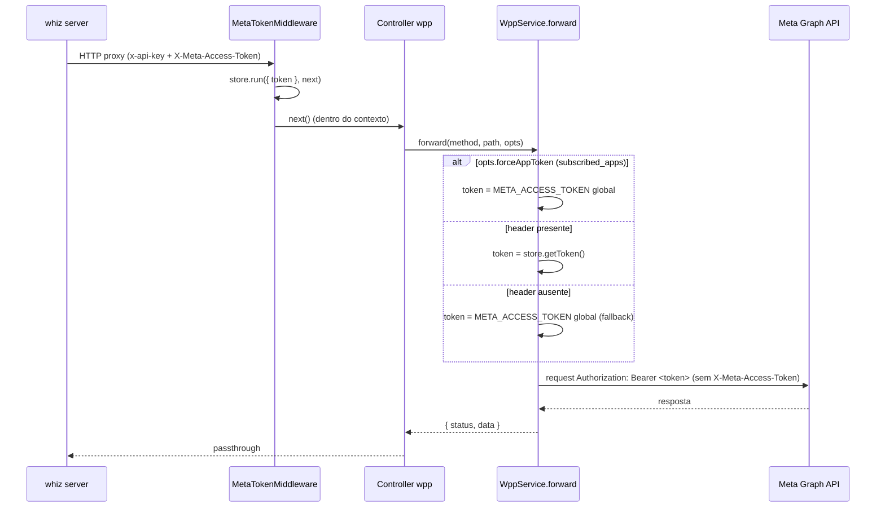

# Token Meta por-inbox (WhatsApp Embedded Signup)

> **Feature do whiz-gateway.** Permite que o whiz server, em modo gateway, passe um **token de negócio por-inbox** (`X-Meta-Access-Token`) em cada chamada de proxy para a Meta Graph API. O gateway usa esse token no `Bearer` ao contatar a Meta; na ausência do header, usa o `META_ACCESS_TOKEN` global (fallback legado). O caminho de inscrição de app (`subscribed_apps`) sempre usa o token global.

## 1. Context

Hoje o gateway autentica **todas** as chamadas à Graph API com um único `META_ACCESS_TOKEN` global (env). O fluxo de *Embedded Signup* da Meta gera **um token de negócio (Business Integration System User access token) por WABA/inbox** onboardado. Em modo gateway, o whiz server hoje só envia `x-api-key` e o gateway resolve o Bearer sozinho — o que usaria o token global errado para inboxes onboardados via Embedded Signup.

A solução: o whiz server passa o token descriptografado do inbox no header `X-Meta-Access-Token` em cada chamada que representa um inbox específico. O gateway resolve o token **por-requisição** — captura o header em um middleware global (`AsyncLocalStorage`), e `WppService.forward()` usa o token do contexto quando presente, senão o global. Nenhuma rota/URL muda; só a resolução de token.

O header interno **não** é repassado à Meta (a resolução acontece no serviço, o header nunca entra em `opts.headers` da chamada de saída).

## 2. Scope

**In:**
- `MetaTokenModule` (`@Global`) com `MetaTokenStore` (wrapper de `AsyncLocalStorage`) e `MetaTokenMiddleware`.
- Middleware global captura `X-Meta-Access-Token` da requisição para o contexto assíncrono.
- `WppService.forward()` / `forwardMultipart()` / `forwardBinary()` resolvem o token via contexto → fallback `META_ACCESS_TOKEN`.
- Flag `forceAppToken` em `WppForwardOptions` para caminhos que devem sempre usar o token de app/global.
- `WppSubscriptionsController` (`subscribed_apps` POST/GET/DELETE) usa `forceAppToken: true`.

**Out:**
- Onboarding UI / FB SDK → whiz front.
- Troca `code → business token` (`/oauth/access_token`) → permanece no whiz server (§3 do handoff). Sem endpoint no gateway.
- Persistência criptografada do token → whiz server (`WhatsappMeta.accessToken`, `CryptoService`).
- Registro de número + PIN → adiado.
- `WppFlowsEndpointService.forwardToClient` — usa `META_ACCESS_TOKEN` para autenticar ao endpoint do **cliente** (não é chamada à Graph API). Fora de escopo; permanece global.
- Path de mídia via consumer de fila (`WppMediaUploadConsumerService`) — roda fora do contexto HTTP; sem token por-inbox no `AsyncLocalStorage`, cai no global (inalterado).

## 3. Glossary

| Termo | Significado |
|---|---|
| **Token por-inbox** | Business Integration System User access token, escopado a uma WABA/inbox, gerado pelo Embedded Signup. |
| **Token global** | `META_ACCESS_TOKEN` (env). Fallback para inboxes legados e caminhos de app. |
| **X-Meta-Access-Token** | Header dedicado onde o whiz server passa o token por-inbox descriptografado. |
| **MetaTokenStore** | Wrapper de `AsyncLocalStorage` que carrega o token por-requisição no contexto assíncrono. |
| **forceAppToken** | Opção de `forward()` que ignora o contexto e força o token global (caminho de app). |
| **subscribed_apps** | Inscrição do **app** na WABA — identifica o app, não o cliente; sempre token global. |

## 4. Functional requirements

- **FR-1**: Middleware global lê o header `X-Meta-Access-Token` de cada requisição HTTP e o carrega no `MetaTokenStore` para a duração da requisição. Header ausente/vazio → contexto sem token.
- **FR-2**: `WppService.forward()` resolve o token na ordem: token do contexto (`MetaTokenStore`) → `META_ACCESS_TOKEN` global. Usa o resultado no header `Authorization: Bearer <token>`.
- **FR-3**: `WppService.forward()` **não** inclui `X-Meta-Access-Token` nos headers enviados à Meta (o header interno nunca é propagado à saída).
- **FR-4**: Quando `opts.forceAppToken === true`, `forward()` ignora o token do contexto e usa sempre o `META_ACCESS_TOKEN` global.
- **FR-5**: `WppSubscriptionsController` (POST/GET/DELETE `:wabaId/subscribed_apps`) chama `forward()` com `forceAppToken: true`.
- **FR-6**: `forwardMultipart()` e `forwardBinary()` aplicam a mesma resolução (contexto → global). Fora de contexto HTTP (consumer de fila), resolvem para global.

## 5. Non-functional

- **NFR-1** (compat): sem `X-Meta-Access-Token`, comportamento idêntico ao atual (usa global). `META_ACCESS_TOKEN` permanece env obrigatória (validação inalterada).
- **NFR-2** (isolamento): `AsyncLocalStorage` garante que o token de uma requisição não vaze para outra concorrente. `WppService` permanece singleton.
- **NFR-3** (segurança): token por-inbox nunca logado; header interno não repassado à Meta.
- **NFR-4** (config): nenhuma env var nova obrigatória. Troca de código permanece no whiz server.
- **NFR-5** (sem mudança de contrato HTTP): rotas, URLs e corpos inalterados; só a origem do Bearer muda.

## 6. Fluxo

## 7. HTTP endpoints

Nenhum endpoint novo. Nenhuma mudança de rota/URL. Apenas resolução de token interna em `WppService`.

## 8. Acceptance criteria

- **AC-1** (token por-inbox) — **Dado** uma requisição de proxy com `X-Meta-Access-Token: inbox-token`, **quando** `WppService.forward()` monta os headers, **então** usa `Authorization: Bearer inbox-token` (token do contexto), **e não** repassa `X-Meta-Access-Token` à Meta.
- **AC-2** (fallback legado) — **Dado** uma requisição de proxy **sem** `X-Meta-Access-Token`, **quando** `forward()` monta os headers, **então** usa `Authorization: Bearer <META_ACCESS_TOKEN global>`.
- **AC-3** (subscribed_apps sempre global) — **Dado** um request no path de subscription com `forceAppToken: true` **e** um token por-inbox presente no contexto, **quando** `forward()` monta os headers, **então** usa sempre o `META_ACCESS_TOKEN` global, ignorando o contexto.
- **AC-4** (middleware carrega contexto) — **Dado** uma requisição HTTP com header `X-Meta-Access-Token: t`, **quando** o `MetaTokenMiddleware` executa, **então** `MetaTokenStore.getToken()` retorna `t` durante `next()`; header ausente → retorna `undefined`.
