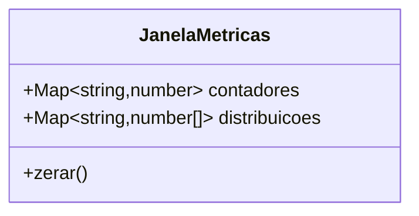
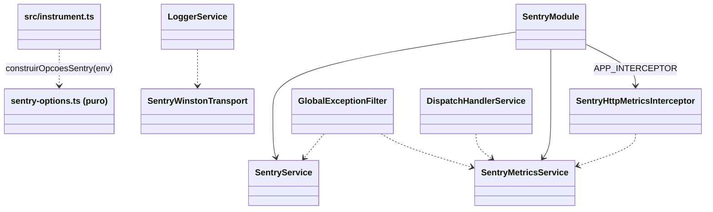
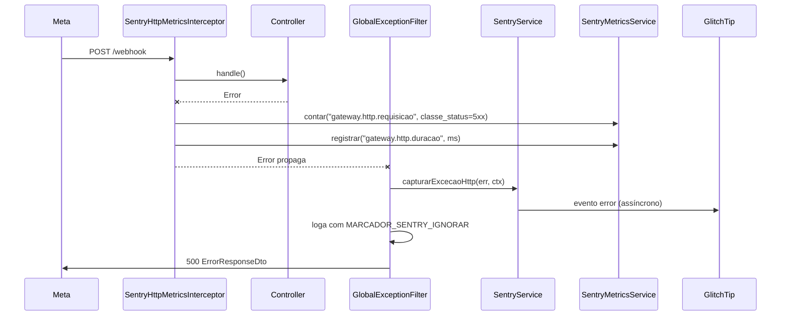
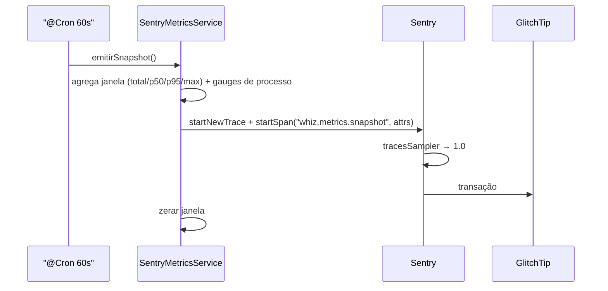
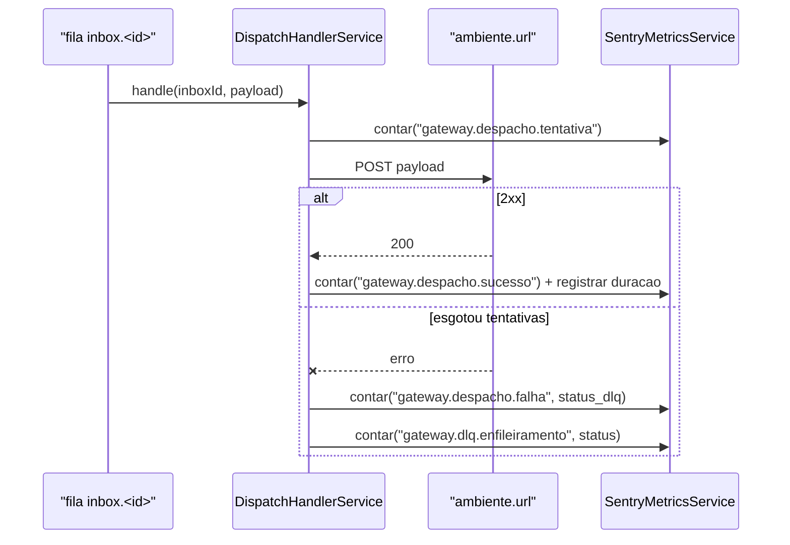
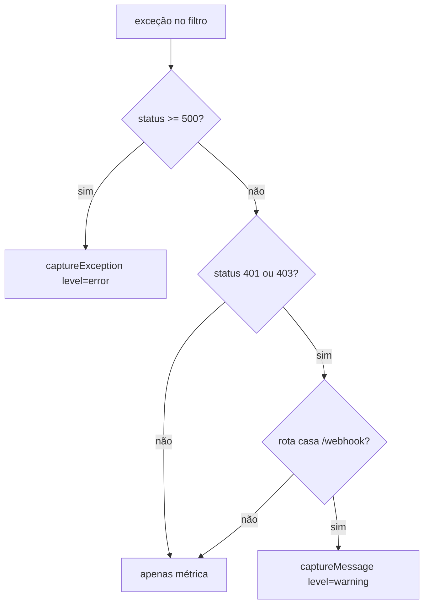
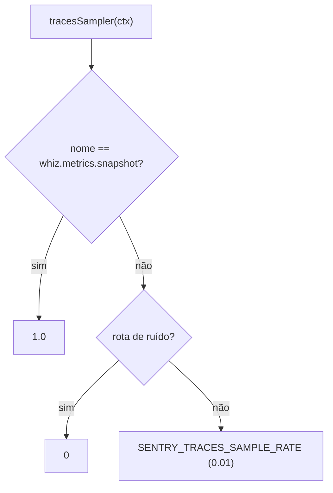

# Observabilidade Sentry (GlitchTip)

Instrumenta o gateway com o SDK Sentry (`@sentry/nestjs` v10) apontado para a
instância **GlitchTip** self-hosted, entregando três sinais: **erros**
(exceções e logs de nível `error`), **rastros/performance** (transações HTTP,
Postgres, Redis, RabbitMQ e chamadas de saída) e **métricas** de domínio
(contadores/distribuições agregados em janelas de 60s).

## 1. Context

Hoje a única observabilidade do gateway é o console: `LoggerService` (Winston,
transport de console apenas — OQ-3 de `gateway-foundation`) e o
`GlobalExceptionFilter`, que loga `HTTP <status> ON <método> | <rota> - <msg>`.
Consequências:

- Falha em produção só é vista por quem tem acesso a `kubectl logs`; sem
  agregação, alerta, deduplicação ou stack trace estruturado.
- Não há número algum sobre volume/latência: quantos webhooks entram por rota,
  quantos despachos falham, quanto tempo o ambiente destino leva para responder,
  quantas mensagens vão para a DLQ.
- Erros que **não** viram exceção HTTP (consumidor da DLQ, `DispatchHandlerService.handle`
  que engole tudo em `catch`, jobs de limpeza) desaparecem no log.

Existe uma instância GlitchTip (protocolo compatível com Sentry) em
`http://31.97.27.185:30808`, projeto `2`. GlitchTip **não** implementa
_release health/sessions_, _Sentry Logs_ nem a API nova de _trace metrics_; ele
ingere **eventos de erro** e **transações de performance**. O desenho abaixo
entrega métricas dentro dessa restrição.

**Usuários**: time de desenvolvimento e operação do whiz-v2, que precisa
diagnosticar falha de webhook/despacho sem acesso ao cluster.

## 2. Scope

**In**

- `Sentry.init` em módulo de bootstrap (`src/instrument.ts`) carregado **antes**
  do `AppModule`, condição para a auto-instrumentação OpenTelemetry funcionar.
- Configuração via env, com o DSN GlitchTip do projeto como padrão e
  `tracesSampleRate` base `0.01` (1%).
- Desligamento explícito dos sinais que o GlitchTip não suporta (sessões,
  logs, trace metrics) — habilitáveis por env quando/se o backend suportar.
- Captura de exceções: 5xx como evento `error`; 401/403 nas rotas de ingestão
  (`/webhook*`) como evento `warning`; demais 4xx só como métrica.
- Ponte Winston → Sentry: todo log vira _breadcrumb_; log de nível `error` vira
  evento, com marcador para não duplicar o evento já emitido pelo filtro.
- Métricas HTTP (contagem por rota/método/classe de status + distribuição de
  latência) via interceptor global.
- Métricas de despacho (`DispatchHandlerService`): tentativa, sucesso, falha,
  latência, enfileiramento na DLQ por status.
- Snapshot periódico (60s) das métricas agregadas como transação
  `whiz.metrics.snapshot` (amostragem forçada 100%) — caminho que **de fato**
  aparece no GlitchTip.
- Escrubbing de PII/segredos antes do envio (`beforeSend`).
- `Sentry.flush` no encerramento da aplicação.

**Out**

- Endpoint `GET /metrics` (Prometheus) — o sink é o GlitchTip.
- Provisionamento/configuração do GlitchTip, do projeto `2` ou de alertas.
- Alteração do formato de log já existente no console.
- Profiling (`@sentry/profiling-node`) e _cron monitors_ (GlitchTip usa uptime
  monitors próprios).
- Instrumentação manual de módulos além de `dispatch` (os demais ganham spans
  pela auto-instrumentação HTTP/Postgres/Redis/AMQP).
- Propagação de trace para o whiz-server (`sentry-trace`/`baggage` cross-repo).

## 3. Glossary

Sincronizar com `src/sentry/context.md`.

- **DSN**: credencial de ingestão do projeto (`http://<publicKey>@<host>/<projeto>`).
  É pública por design (identifica o projeto, não autoriza leitura). _Avoid_:
  "token do Sentry".
- **Evento**: item de erro/mensagem que vira _issue_ no GlitchTip. _Avoid_: log
  (log é a linha de console; só o nível `error` se torna evento).
- **Breadcrumb**: migalha de contexto anexada ao próximo evento do mesmo escopo;
  não gera issue sozinha.
- **Transação**: span raiz de um rastro (uma requisição HTTP, um snapshot de
  métricas). É o que alimenta a aba de performance.
- **Amostragem (`tracesSampleRate`)**: fração de transações enviadas. Base
  `0.01`; `tracesSampler` decide caso a caso.
- **Snapshot de métricas**: transação sintética emitida a cada 60s com os
  contadores/distribuições da janela como atributos. _Avoid_: trace metrics (API
  `Sentry.metrics.*`, não ingerida pelo GlitchTip).
- **Rota de ruído**: rota cuja transação não tem valor de observabilidade
  (`/health`, `/docs`, `/ui`) — amostrada em 0.
- **Marcador de log ignorado**: valor (`MARCADOR_SENTRY_IGNORAR`) passado nos
  `optionalParams` de um log `error` para a ponte Winston não duplicar um evento
  que o filtro já capturou.

## 4. Functional requirements

- **FR-1** — `src/instrument.ts` executa `Sentry.init(construirOpcoesSentry(process.env))`
  como efeito de import e é o **primeiro** import de `src/main.ts`.
- **FR-2** — `construirOpcoesSentry` é função pura (recebe o mapa de env,
  devolve `NodeOptions`), sem ler `process.env` internamente.
- **FR-3** — DSN: `SENTRY_DSN` quando definido; caso contrário o DSN padrão
  `http://ab8a70c17b22457791eede26716f4e7b@31.97.27.185:30808/2`.
- **FR-4** — `SENTRY_ENABLED=false` (ou DSN vazio explícito) desliga o SDK:
  `enabled: false` e nenhum envio.
- **FR-5** — `tracesSampleRate` base vem de `SENTRY_TRACES_SAMPLE_RATE`
  (padrão `0.01`), aplicado por um `tracesSampler` que devolve:
  `0` para rota de ruído · `1` para `whiz.metrics.snapshot` · base para o resto.
- **FR-6** — Sessões desligadas: integração `ProcessSession` removida das
  default integrations e `httpIntegration({ trackIncomingRequestsAsSessions: false })`.
- **FR-7** — `enableLogs` e `enableMetrics` seguem `SENTRY_ENABLE_LOGS` /
  `SENTRY_ENABLE_METRICS` (padrão `false`, pois o GlitchTip descarta ambos).
- **FR-8** — `environment` = `ENV`; `release` = `SENTRY_RELEASE` quando definido.
- **FR-9** — `beforeSend` remove os cabeçalhos `authorization`, `x-api-key`,
  `x-hub-signature-256`, `x-meta-access-token` e `x-callback-secret` (case
  insensitive) de `event.request.headers` e mantém `sendDefaultPii: false`.
- **FR-10** — `SentryService.capturarExcecaoHttp(exception, contexto)` captura
  evento `error` quando `statusCode >= 500`, evento `warning` quando
  `statusCode ∈ {401, 403}` e `rota` casa com `/webhook`, e nada nos demais
  casos; sempre com tags `rota`, `metodo`, `status`.
- **FR-11** — `GlobalExceptionFilter` delega ao `SentryService` antes de
  responder, e passa `MARCADOR_SENTRY_IGNORAR` no log de erro que emite.
- **FR-12** — `SentryWinstonTransport` adiciona breadcrumb para todo log
  (`level` mapeado para severidade Sentry) e chama `captureMessage(level=error)`
  para logs `error` sem o marcador.
- **FR-13** — `SentryHttpMetricsInterceptor` (global) conta
  `gateway.http.requisicao` por `rota`/`metodo`/`classe_status` e registra
  `gateway.http.duracao` (ms) por rota, tanto em sucesso quanto em erro.
- **FR-14** — `DispatchHandlerService` registra
  `gateway.despacho.tentativa`, `gateway.despacho.sucesso`,
  `gateway.despacho.falha` (com `status_dlq`), `gateway.despacho.duracao` (ms) e
  `gateway.dlq.enfileiramento` (por `status`).
- **FR-15** — `SentryMetricsService` acumula contadores/distribuições em memória
  e, a cada 60s, emite a transação `whiz.metrics.snapshot` com os agregados
  (`total`, `p50`, `p95`, `max` das distribuições) como atributos, zerando a
  janela; inclui sempre gauges de processo (`rss`, `heap_usado`, `uptime`).
- **FR-16** — Falha de envio ao Sentry nunca propaga: toda chamada ao SDK é
  protegida (`try/catch` + log `warn`).
- **FR-17** — No encerramento (`onApplicationShutdown`) o gateway chama
  `Sentry.flush(2000)`.
- **FR-18** — `SENTRY_*` validado no schema Joi de `src/config/config.validation.ts`
  (todos opcionais com default), preservando NFR-7.

## 5. Non-functional

- **NFR-1** — Overhead: amostragem base de 1% das transações; agregação de
  métricas em memória (sem I/O por requisição); snapshot único por minuto.
- **NFR-2** — Segurança: nenhum segredo, corpo de webhook ou header de
  autenticação enviado (FR-9). `sendDefaultPii: false`.
- **NFR-3** — Disponibilidade: GlitchTip indisponível ou DSN inválido não pode
  degradar nem derrubar o gateway (FR-4, FR-16).
- **NFR-4** — Ambiente de teste: sem DSN, o SDK fica desabilitado; nenhuma
  suíte `jest` faz rede.
- **NFR-5** — Memória: janela de métricas limitada — no máximo 500 amostras por
  distribuição (descarte do excedente com contagem preservada).
- **NFR-6** — `src/instrument.ts` é a única exceção autorizada à regra
  "`ConfigService` — nunca `process.env`", porque roda antes do `ConfigModule`;
  a exceção fica registrada aqui e em `src/sentry/context.md`.

## 6. Data model

N/A — nenhum modelo Prisma novo ou alterado. O estado das métricas é in-memory
por réplica (janela de 60s).

## 7. API contract

N/A — nenhum endpoint HTTP novo ou alterado. Contratos de resposta existentes
(inclusive `ErrorResponseDto`) permanecem idênticos: o Sentry é um efeito
colateral do filtro, nunca muda status ou corpo.

Egresso novo: `POST http://31.97.27.185:30808/api/2/envelope/` (SDK, assíncrono,
fire-and-forget).

## 8. Module boundaries

`SentryModule` é `@Global()` (como `LoggerModule`), importa
`SentryModule.forRoot()` do `@sentry/nestjs/setup` (nomeado `SentryNestModule`
no import) e exporta `SentryService` + `SentryMetricsService`.

## 9. Flows

Requisição com erro 5xx:

Snapshot de métricas:

Despacho:

## 10. State machines

N/A — nenhum campo de status novo.

## 11. Business rules

Decisão de captura por exceção:

Decisão de amostragem:

## 12. Edge cases & errors

- DSN ausente/`SENTRY_ENABLED=false` → SDK desabilitado; serviços viram no-op
  (nenhuma exceção, nenhuma rede) — cenário de `jest` e dev.
- GlitchTip fora do ar → SDK falha em background; `try/catch` local garante que
  requisição/despacho seguem normais.
- Log `error` emitido pelo próprio filtro → marcador evita evento duplicado.
- 4xx de validação em massa (varredura/probe) → só contador, sem issue.
- Distribuição com mais de 500 amostras na janela → mantém as 500 primeiras e
  soma o total real no atributo `total`.
- Snapshot sem nenhuma amostra → ainda emite gauges de processo (prova de vida).
- `Sentry.metrics.*` chamado com `enableMetrics=false` → no-op do SDK
  (chamadas mantidas para compatibilidade futura, sem custo).
- Múltiplas réplicas → cada uma emite seu snapshot; agregação é do GlitchTip
  (atributo `instancia` = `HOSTNAME`).

## 13. Acceptance criteria

- **AC-1** `[backend]`: Given env sem `SENTRY_DSN` e sem `SENTRY_ENABLED`, when
  `construirOpcoesSentry(env)`, then `dsn` é o DSN GlitchTip padrão e
  `enabled` é `true`.
- **AC-2** `[backend]`: Given `SENTRY_DSN=http://k@host/9`, when
  `construirOpcoesSentry(env)`, then `dsn` é o valor da env.
- **AC-3** `[backend]`: Given `SENTRY_ENABLED=false`, when
  `construirOpcoesSentry(env)`, then `enabled` é `false`.
- **AC-4** `[backend]`: Given env sem `SENTRY_TRACES_SAMPLE_RATE`, when
  `construirOpcoesSentry(env)`, then o `tracesSampler` devolve `0.01` para
  `{ name: 'POST /webhook' }`, `0` para rota de ruído (`GET /health`,
  `GET /docs`, `GET /ui`) e `1` para `{ name: 'whiz.metrics.snapshot' }`.
- **AC-5** `[backend]`: Given `SENTRY_TRACES_SAMPLE_RATE=0.5`, when o
  `tracesSampler` avalia `POST /webhook`, then devolve `0.5`.
- **AC-6** `[backend]`: Given as opções construídas, when as integrações são
  resolvidas a partir das default integrations, then `ProcessSession` não está
  presente e existe `httpIntegration` com
  `trackIncomingRequestsAsSessions: false`; `enableLogs` e `enableMetrics` são
  `false` e `sendDefaultPii` é `false`.
- **AC-7** `[backend]`: Given um evento com
  `request.headers['authorization']`, `['x-api-key']`,
  `['x-hub-signature-256']`, `['x-meta-access-token']` e `['x-callback-secret']`,
  when `beforeSend` roda, then os cinco valores são substituídos por `[Filtered]`
  e os demais headers permanecem.
- **AC-8** `[backend]`: Given `statusCode=500`, when
  `SentryService.capturarExcecaoHttp`, then chama `captureException` com tags
  `rota`, `metodo`, `status`.
- **AC-9** `[backend]`: Given `statusCode=401` e rota `/webhook`, when
  `capturarExcecaoHttp`, then chama `captureMessage` com `level='warning'`; e
  given `statusCode=400` em `/inboxes`, then não chama nem `captureException`
  nem `captureMessage`.
- **AC-10** `[backend]`: Given SDK desabilitado ou SDK lançando erro, when
  qualquer método de `SentryService`/`SentryMetricsService` é chamado, then não
  propaga exceção ao chamador.
- **AC-11** `[backend]`: Given o `GlobalExceptionFilter` tratando um erro 500,
  when responde, then (a) delegou ao `SentryService`, (b) o log de erro carrega
  `MARCADOR_SENTRY_IGNORAR` e (c) o corpo/status da resposta permanecem os do
  contrato atual.
- **AC-12** `[backend]`: Given um log de nível `error` sem marcador, when o
  `SentryWinstonTransport` processa, then adiciona breadcrumb e chama
  `captureMessage(level='error')`; given o mesmo log com marcador, then só
  adiciona breadcrumb.
- **AC-13** `[backend]`: Given uma requisição `POST /webhook` que responde 200 e
  outra que lança, when o `SentryHttpMetricsInterceptor` processa, then em ambos
  os casos conta `gateway.http.requisicao` (com `classe_status` `2xx` e `5xx`) e
  registra `gateway.http.duracao`.
- **AC-14** `[backend]`: Given despacho bem-sucedido na primeira tentativa, when
  `DispatchHandlerService.handle` roda, then conta `gateway.despacho.tentativa` e
  `gateway.despacho.sucesso` e registra `gateway.despacho.duracao`; given
  despacho que esgota as tentativas, then conta `gateway.despacho.falha` e
  `gateway.dlq.enfileiramento` com o `status` enviado à DLQ.
- **AC-15** `[backend]`: Given contadores e uma distribuição com amostras na
  janela, when `emitirSnapshot()` roda, then abre a transação
  `whiz.metrics.snapshot` com atributos dos contadores e `p50`/`p95`/`max`/`total`
  da distribuição mais gauges de processo, e a janela seguinte começa zerada.
- **AC-16** `[backend]`: Given mais de 500 amostras registradas na mesma
  distribuição, when o snapshot é emitido, then no máximo 500 amostras foram
  guardadas e o atributo `total` reflete a contagem real.
- **AC-17** `[backend]`: Given a aplicação encerrando, when
  `onApplicationShutdown` do `SentryModule` roda, then chama `Sentry.flush(2000)`.
- **AC-18** `[backend]`: Given o schema Joi de configuração, when as envs
  `SENTRY_DSN`, `SENTRY_ENABLED`, `SENTRY_TRACES_SAMPLE_RATE`,
  `SENTRY_ENABLE_LOGS`, `SENTRY_ENABLE_METRICS`, `SENTRY_RELEASE` estão
  ausentes, then a validação passa com os defaults; e
  `SENTRY_TRACES_SAMPLE_RATE=2` falha (fora de `0..1`).

Cobertura: testes unitários em `src/sentry/*.spec.ts` mais os specs já
existentes de `global-exception.filter`, `dispatch-handler.service` e
`config`. Sem AC `[e2e]`: nenhum contrato HTTP muda e o SDK fica desabilitado
sem DSN, então um e2e não observaria nada além do que os unitários cobrem.

## 14. Open questions

- **OQ-1** — O DSN fica com default no código (é credencial pública de
  ingestão). Se a política do time for "nada de default", basta remover o
  fallback e exigir `SENTRY_DSN` no k8s/argo. _Assumido_: default no código +
  override por env.
- **OQ-2** — GlitchTip em `http://` (sem TLS): o envelope, que inclui a chave
  pública do DSN e metadados de erro, viaja em claro. _Assumido_: aceitável por
  ser tráfego interno de cluster; migrar para `https` quando houver certificado.
- **OQ-3** — Quando o GlitchTip passar a suportar trace metrics/logs, basta
  ligar `SENTRY_ENABLE_METRICS`/`SENTRY_ENABLE_LOGS`; o snapshot de transações
  pode então ser desligado. Sem data definida.
- **OQ-4** — Propagação de trace gateway → whiz-server (`sentry-trace`) daria
  rastro ponta a ponta, mas exige Sentry no server. Fora de escopo.
